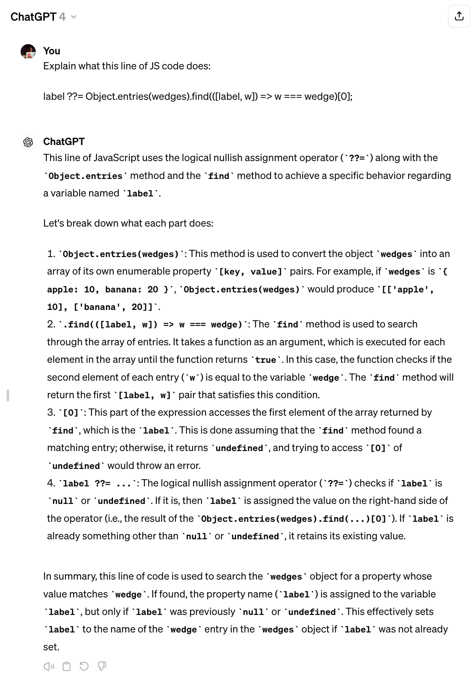
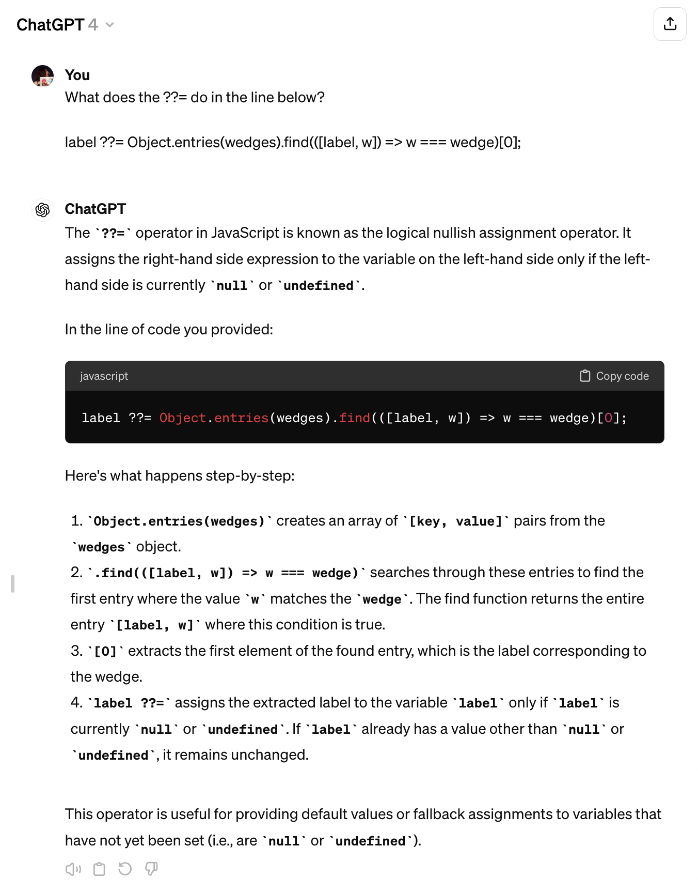
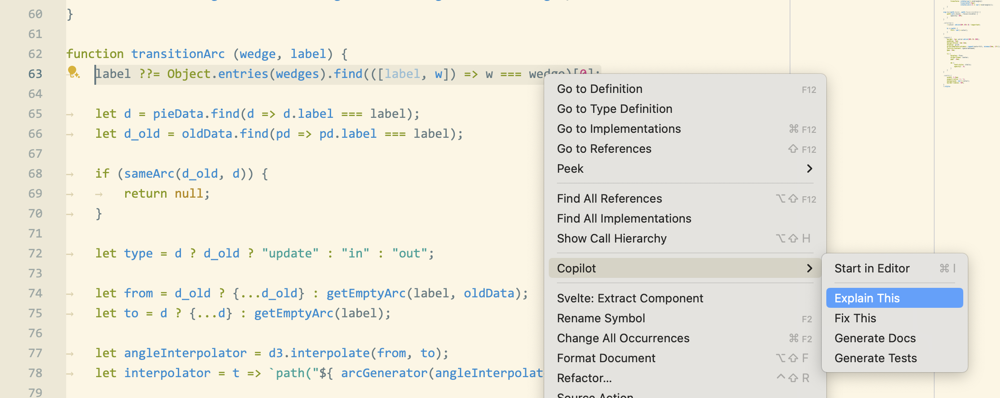
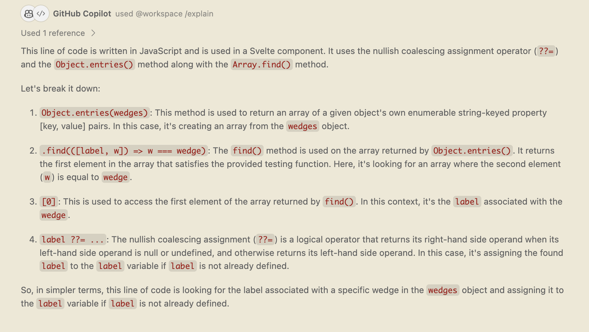
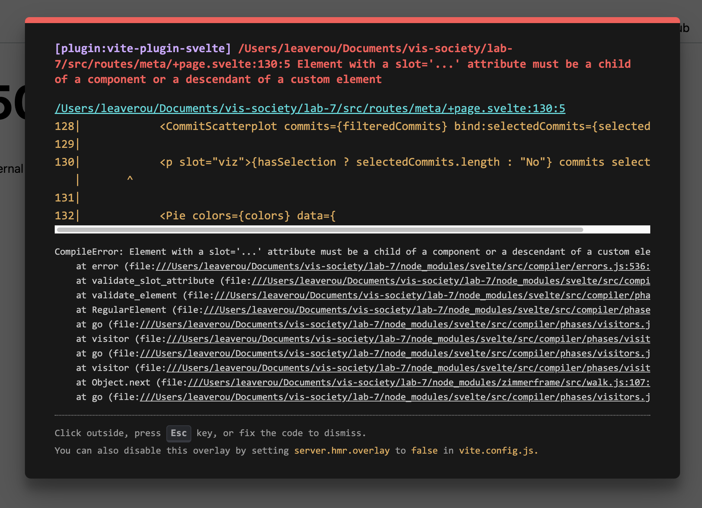
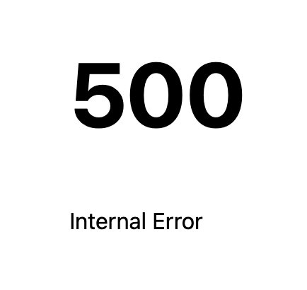
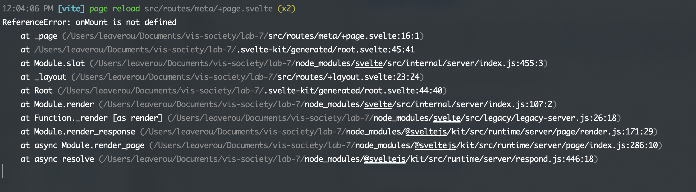
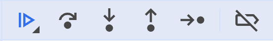
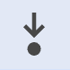
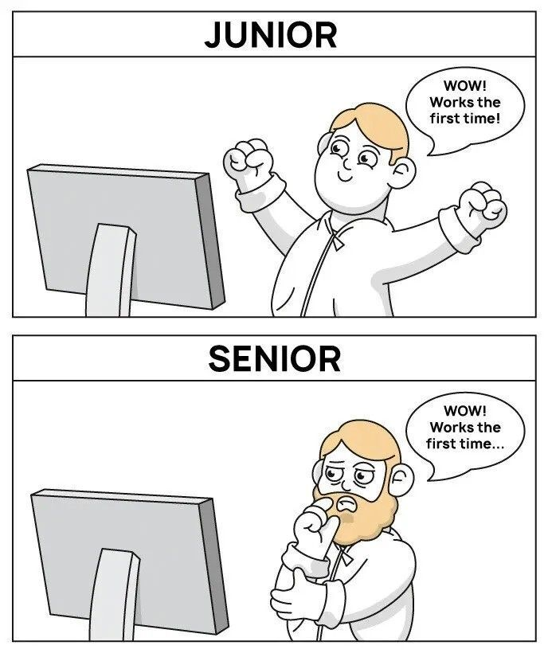

<!-- prettier-ignore-start -->

<!-- prettier-ignore-end -->

# Help Us Help You: Things to try before asking for help

<details open markdown="block">
  <summary>
    Table of contents
  </summary>
  {: .text-delta }
- TOC
{:toc}
</details>

Inevitably, you will run into cases where your code does not produce the expected result.
These are called _bugs_.
The process of investigating and fixing these bugs is called _debugging_.
**The vast majority of the time spent programming is actually spent debugging**, especially when you are just starting out.
But even seasoned programmers spend _far_ more time debugging than writing code.

Debugging consists of three steps: 0. **Prevention**: The things you do to minimize bugs and/or make debugging easier.

1. **Investigation**: What is the issue? What is the code supposed to do, and what is it actually doing?
2. **Resolution**: Fixing the problem

## Prevention

Prevention consists of adopting good development habits that will either minimize the number of bugs you introduce in the first place, or stop them in their tracks.

### Develop with the browser dev tools open!

I really cannot stress this enough.
If stuff is not working, the browser dev tools and especially [the console](#the-console) is the _first_ place you look for clues.
**In fact, most seasoned web developers have dev tools continuously open while working.**

If you see errors in the console, **do not ignore them**.
Even if they don’t seem to be related to the issue you’re investigating, they could be a symptom of a larger problem.

### Understand what code does

**Do _not_ copy and paste code without understanding what it does.**
If we don’t expect you to understand it, we’ll usually say so.
If we give you an entire file or function to copy, it's typically because it doesn't matter to understand it (but it's still beneficial to try).

But in all other cases, you _should_ understand what the code is doing and why.
We give you code because it's easier to understand existing code and tweak it than to write it from scratch,
not to save you the effort of understanding it.

If you don’t understand what you’re doing and why, you may still be able to guess where things go and move through the steps, but the mismatch between your mental model and what is actually happening will compound as you move through the lab making every step harder than the previous one.

If there are parts of syntax you don’t understand, it can be hard to google for things.
For example, suppose you get to [Step 3.3 of Lab 9](#step-33-fixing-the-shape-transition-using-d3transition) and don’t understand this line:

```js
label ??= Object.entries(wedges).find(([label, w]) => w === wedge)[0];
```

`Object.entries()` and `array.find()` is easy to google for, but how do you google for `??=` or the `([label, w])` syntax?!
**That’s what AI is excellent for!**

You could blanket ask it to explain this line of code:

<figure markdown="1">

<figcaption>Asking ChatGPT to explain a specific line of code (but other AI assistants are similar).</figcaption>
</figure>

Or, you could ask about specific things you don’t understand, which tends to give you the answer faster:

<figure markdown="1">

<figcaption>Asking ChatGPT to explain a specific part of syntax (but other AI assistants are similar)..</figcaption>
</figure>

[GitHub Copilot Chat](https://docs.github.com/en/copilot/github-copilot-chat/about-github-copilot-chat) even has a menu option for this:



This was the result:



{: .caveat }
Do note that **every time you use AI for anything, it’s _crucial_ to fact-check it**.
If you ask it to explain syntax you don’t understand, take the terms it gives you (in this case "logical nullish assignment operator") and google them to see if they are correct.

### Use correct formatting

It’s very hard to understand what your code is doing if it’s not formatted correctly.
Especially [indentation](https://en.wikipedia.org/wiki/Indentation_style) is very important as it shows the structure and hiearchy of your code.

- In HTML, if element contents span multiple lines, indent them (unless you have a reason not to).
- In JS, indent the contents of functions, loops, and conditionals.
- In CSS indent declarations (the property-value pairs inside the `{...}`) and nested rules.

Formatting is meant to help readability, not hinder it.
There are cases where _not_ indenting actually improves readability, e.g. in HTML, since everything is inside `<html>`.

If you find it hard to maintain good formatting manually, many developers use [Prettier](https://prettier.io/) to automatically format their code when they save.
It doesn’t give you much flexibility, but is way better than poorly formatted code.
VS Code also has a built-in formatter that you can enable in the settings, or call it on a case-by-case basis by opening the [Command Palette](https://code.visualstudio.com/docs/getstarted/userinterface#_command-palette) (Ctrl+Shift+P) and typing `Format Document`.

{: .caveat }

> While a lot of code formatting is a matter of personal preference, and the main rule is that it’s consistent, there is one exception: those of you who are familiar with other languages, may be used to code styles where the `{` is placed in a new line ([_Allman style_](https://en.wikipedia.org/wiki/Indentation_style#Allman_style)):
>
> ```js
> function foo() {
>   // code
> }
> ```
>
> **Don’t do this in JS**. Because of [semicolon insertion](https://developer.mozilla.org/en-US/docs/Web/JavaScript/Reference/Lexical_grammar#automatic_semicolon_insertion), this can lead to [subtle bugs](https://2ality.com/2013/01/brace-styles.html).

If you don’t like the loss of control that automated formatters require,
you should use a [linter](<https://en.wikipedia.org/wiki/Lint_(software)>) like [ESLint](https://eslint.org/) or [stylelint](https://stylelint.io/)
to ensure that the code style you prefer is followed consistently.

## Investigation

<figure markdown="1">

<figcaption markdown="1">
Quote by [Filipe Fortes](https://fortes.com/2017/one-good-tweet/)
</figcaption>
</figure>

**Investigation** can be broken down further:

- **Narrowing Down**: What part of the code is causing the problem?
- **Understanding**: _Why_ is the code not working as expected?

Both typically involve making a series of hypotheses, and testing them to see if they are true.
In this section, we will discuss strategies for both.

{: .important }
The very first step for most issues is to look at the [console](#the-console) and the terminal where you ran `npm run dev`,
both of which should already be open if you followed the [prevention](#prevention) steps
and check for errors.

### General advice: Reducing the issue

In the next few sections, we will discuss strategies for specific types of problems.
This is a strategy that works _regardless_ of the type of issue you are debugging.

Generally, **the less code you’re dealing with, the easier debugging becomes**.
In most cases, the issue is not in the entire codebase, but in a tiny part of it.
The _Narrowing Down_ phase is about figuring out what part of the code is causing the issue.

If you have a hypothesis about this, you can verify it by removing or commenting out that part of the code and seeing what happens — or removing _everything else_ and making sure that the bug still reproduces.
If not, there is always the "brute force approach", where you simply start removing parts of the code until the issue goes away.
This may involve:

- Commenting out entire sections of code
- Replacing API calls and computed values with hardcoded values
- Removing event listeners
- Replacing entire components
- Using the component with the issue in isolation on a new page

This is often called "Creating a reduced testcase" and is also a great process to follow when reporting a bug with one of the tools you’re using.
Here are some excellent guides on this exact process:

- [Test Case Reduction - WebKit](https://webkit.org/test-case-reduction/)
- [Reduced Test Cases - CSS Tricks](https://css-tricks.com/reduced-test-cases/)

Code playgrounds can be excellent for creating reduced testcases:

- [Svelte REPL](https://svelte.dev/repl) for Svelte
- [CodePen](https://codepen.io/) for HTML, CSS, and JS

### Problem 1: The page looks wrong

The first step if things don’t quite look right is to verify the HTML structure is what we expect.

In some cases, especially if you are just getting started with HTML, and before you start using Svelte, the [HTML validation](#html-validator) can uncover a lot of issues.

However, **HTML that is not quite what you expect is not necessarily invalid**, in which case neither Svelte, nor a validator would catch the issue.
In that case, the [Elements panel](#dev-tools-elements-panel) is the place to be.
It can help you _both_ understand the structure of the page, and see the CSS that is _actually_ applied to each element.

This will immediately resolve issues like:

- Declarations not being applied, either because the property or value is invalid, or because the property only applies to certain elements or when certain other properties have certain values
- CSS selectors not matching the elements you expect

### Problem 2: The code doesn’t work in the way I expect

It’s a common misconception that we develop a website by slowly getting it to converge to the final state.
Think of it instead like a building site:
there is scaffolding and tools everywhere while the building is still building built.
It’s ok for development to look messy while we are still building.

Assuming there are no errors, the first step is to _understand_ what the current state is.
What are the values of all intermediate variables? What is each function returning?

For HTML & CSS, we can use the [Elements panel](#dev-tools-elements-panel) to see the CSS that is currently applied to each element and the current structure of the DOM tree.

{: .tip }
For transitions & animations, it helps to set their duration to a very high value (e.g. 3s) as you’re developing them, so that it’s very clear what is actually happening.

But for JS, the process is a bit more involved.
We need to think like a computer:
start from the beginning of the code and follow it through,
keeping track of the values of all variables in your head.
Then we want to make sure that the values are what we expect them to be at each step.

If the code we are trying to inspect is not called very frequently,
we can use [`console.log()` statements](#console-api) with variables to see what their values are.

{: .caveat }
If the value we are logging is an object, it will be logged as a reference to the object, not its value.
This means we will be seeing the _current_ value of the object, not the value at the time of the `console.log()` statement.
To see current values, we need to log a copy of the object, e.g. `console.log({...myObject})`,
or specific values, e.g. `console.log(myObject.myProperty)`.

{: .tip }
VS Code allows us to just type `log` and then hit <kbd>Tab</kbd> to get a `console.log()` statement with the caret between the parentheses, which can be great for quickly logging things.

In some cases you may need to rewrite code a bit to make this possible.
For example, assume you have an arrow function that just returns a value:

```js
let interpolator = (t) => someFunction(t);
```

If you want to log the return value, you’d need to do something like this:

```js
let interpolator = (t) => {
  let result = someFunction(t);
  console.log(result);
  return result;
};
```

Or you can define a `log()` function that returns its first argument:

```js
function log(...args) {
  console.log(...args);
  return args[0];
}
```

And then you can just wrap values with it:

```js
let interpolator = (t) => log(someFunction(t));
```

However, if the code is called very frequently, it would be hard to wade through hundreds of log messages.
For example, assume we were working on [Step 3.4 of Lab 9](#step-34-transitioning-between-pies-with-different-technologies)
and trying to debug why our interpolator didn’t work as we expected by logging the CSS we are applying.
We’d get something like this:

<video src="videos/log-animation.mp4" loop autoplay muted class="browser"></video>

Good luck wading through all these logs!

In that case, when using Svelte, we can simply print values in the HTML, by using something like `{ myVariable }` if it’s a primitive, or something like { JSON.stringify(myVariable) } if it's an object.

The downside is that we don’t get historical values, but the upside is that we can see the value _right now_ as it changes.

{: .tip }
Don’t forget to clean up after you’ve found & fixed the bug, by removing these expressions and/or log statements!

Lastly, if none of these helps zero in on the issue completely,
it may be time for the big guns: the [`debugger` statement](#debugger-statement)
and the [Sources panel](#sources-panel).
These allow us to execute our code, see the values of all local variables at each point,
and even stop it at certain points and experiment.

### Problem 3: 500 error

If you’re lucky, when you make a mistake with Svelte, you will get a nice error display like this:



However, other times you will only get something like this:



In that case, the first step is to look at the terminal panel where you ran `npm run dev` to see _what_ the actual error is.

If the issue is in the JS, it could be easy to read:



However, if the issue is in your Svelte HTML, you may have to wade through your entire component code to get to the actual error:

<figure>
	<video src="videos/svelte-html-error.mp4" class="outline" loop autoplay muted></video>
	<figcaption>
	In this case the actual error is the red text at the top: <q>Element with a slot='...' attribute must be a child of a component or a descendant of a custom element</q>
	</figcaption>
</figure>

## Debugging tools

Here we describe the tools you can use to investigate and resolve issues.
There are links to these in the text above, but going through this section by itself may be useful for those with more experience, or as a quick reference after you have read the whole guide.

### The Console

The console is is the second tab in your browser dev tools. It looks like this:

<video src="https://vis-society.github.io/labs/3/slides/videos/console.mp4" onloadedmetadata="this.currentTime = 50"></video>

Among other things, the console will show you:

- JS errors
- Failed HTTP requests (e.g. file not found)
- Some HTML errors (e.g. invalid value for certain attributes)

{: .fyi }

> **Why doesn’t the browser just notify me when there are errors on the page?**
>
> The browser doesn’t know you’re the website developer, and most web users don’t want to know about JS errors on websites they visit. In fact, early browsers did report them to users, but that went away as browser UIs became more user-friendly, and started targeting less technical folk. In fact, most websites you visit on a daily basis have a cornucopia of JS errors and you’d never know about them unless you open the browser console.

### HTML validator

The [W3C HTML validator](https://validator.w3.org/) is a tool that checks your HTML for errors.
You can provide your HTML to it by uploading it, giving it a URL, or perhaps most usefully when developing, [pasting it in directly](https://validator.w3.org/#validate_by_input).

Svelte markup will throw the validator off, so this becomes less useful as we start using Svelte.
You can still validate Svelte’s output, but depending on how much of your code is rendered by the build process, this can be more or less useful.
The silver lining is that Svelte also catches some HTML issues itself and then they become [500 errors](#problem-500-error).

### Dev tools Elements panel

It looks like this:

<video src="videos/elements-panel.mp4" loop autoplay muted class="browser"></video>

It can help you catch issues in a number of ways.
First, it helps you explore the [DOM structure](../2/slides/#dom-tree) by expanding and collapsing element contents.
This can be very helpful when your elements are not nested in the way you expect,
which can be hard to see in source code alone.

But the elements panel is _especially_ useful to show you the CSS currently applied, which is done in several ways:

- As you hover over each element, it is highlighted and its [box model](../2/slides/#the-box-model) is shown (orange for margin, purple for padding).
- If the element is a grid or flex container, its layout is shown as well.
- The right panel shows you all the CSS rules that currently apply to the element, whether they come from your CSS or the browser’s, and which ones are overridden by others.

The CSS panel shows a bunch of things:

- The CSS rules that apply to the element, and where they come from (your CSS, browser defaults, etc.)
- The computed styles, which are the final styles that apply to the element after all the rules are applied
- The box model, which shows you the padding, border, and margin of the element
- Which CSS properties are being overridden by others?
- Which CSS properties are inherited from ancestors?
- Which CSS properties are invalid and thus ignored?
- Which CSS properties are being ignored because of the values of other properties? For example, Flexbox properties like `flex` and `flex-*` have no effect if `display` is not `flex` or `inline-flex`. Note that the dependencies between CSS properties are more complex than the dev tools can show, so this will not uncover all such issues.

If the issue you are investigating only happens during certain user actions (e.g. `:hover`), you can simulate those actions:

<video src="videos/emulating-hover.mp4" autoplay loop muted class="browser"></video>

It also allows you to **edit the CSS in real time** and see the page update.
This can be incredibly useful both in the [investigation](#investigation) and [resolution](#resolution) phases.
Keep in mind that the browser cannot possibly update your source code, so if you refresh you will lose your changes — you need to remember to copy them over!
However, you can see this as a feature, not a bug: you can try out changes in a non-destructive way.

In addition to editing properties and values, it allows you to quickly remove declarations to see what will happen (which is very useful in the [investigation](#investigation) phase)

### Console API

The [Console API](https://developer.mozilla.org/en-US/docs/Web/API/Console_API) is a set of functions you can use in your JS code to log messages to the console.
The one you would be using most often is [`console.log()`](https://developer.mozilla.org/en-US/docs/Web/API/console/log_static) which logs a message to the console.
However, [`console.trace()`](https://developer.mozilla.org/en-US/docs/Web/API/console/trace_static) can also be useful if you can’t understand why a certain function is being called.

### `debugger` statement

The `debugger;` statement allows you to stop execution of your code and inspect its current state,
as well as the _call stack_, i.e. how you got there.

E.g. suppose we’re working on [step 3.4 of Lab 9](#step-34-transitioning-between-pies-with-different-technologies) and
want to debug why our interpolator didn’t work as we expected.

We _could_ add `console.log()` statements with all the local variables or print them out using Svelte expressions,
but in some cases, especially when we have a lot of variables or simpler methods have failed to narrow down the issue,
there is a better way: the debugger.

You can add a `debugger;` statement to stop your code at any point and inspect its current state in the [Sources panel](#sources-panel).
You can hover over any variable and see its current value.
It looks like this:

<video src="videos/debugger.mp4" loop autoplay muted class="browser"></video>

The `debugger;` statement works like any other JS statement, meaning you can put it inside conditionals as well:

```js
if (someCondition) {
  debugger;
}
```

{: .fyi }
These statements create _breakpoints_ in your code, which are points where the code execution stops.
You can also set breakpoints manually in the Sources panel, without modifying the code.

### Sources panel

In the previous section we saw how to use `debugger;` statements to inspect the state of our code at any point in time.
However, the Sources panel does a lot more than that.

It also allows us to _step through_ our code, meaning we can execute it line by line and see the state of our variables at each point.

<video src="videos/step-through.mp4" loop autoplay muted class="browser"></video>

To step through our code, we use this toolbar at the top right: .
Here’s what the icons mean:

-  **Resume execution**: Continue executing the code until the next breakpoint or the end of the script.
- Buttons 2-5 are all about stepping through the code, i.e. executing the current line and moving to the next one. However, there are different ways you may want to do that, mainly around how low-level you want your inspection to be: do you actually want to see the state within each function called in your code, or only the one you are currently in?
  -  **Step over next function call**: This stays within the function you are currently inspecting, without moving into other functions being called. This is the most high level of them all, and the one I suggest you start with. It helps you to get a higher level overview of what is happening in your code, without having to suffer through every single line.
  -  **Step into next function call**: If the current line is a function call, move into the function and execute the first line.
  -  **Step out of current function**: Execute the rest of the current function and move to the next line _after_ the function call. This is very useful when you realize you don’t actually care about the function you’re in and you know the bug is not there, effectively helping you reverse the decision to step into.
  -  **Step**: Execute the current line and move to the next one, whether that is in another function or in the current one.
-  **Deactivate breakpoints**: This will deactivate all breakpoints in your code, so that it will run without stopping at any of them. This is useful when you have a lot of breakpoints and you want to run the code without stopping at any of them.

It also shows you the _call stack_, which is the list of functions that have been called to get to the current point.
For example, suppose we’re working on [step 3.4 of Lab 9](<#step-34-transitioning-between-pies-with-different-technjson.stringify(wedges)>) and we want to figure out if the `interpolator` function was called from a D3 Transition or a Svelte transition.
We can look at the call stack, and click on the function that called it (`css`): turns out it was a Svelte transition this time!

<video src="videos/call-stack.mp4" loop autoplay muted class="browser"></video>

{: .caveat }
Keep in mind that when async code is involved, the call stack may not be as useful as you’d like.

## Resolution

In most cases, >99% of debugging time is spent narrowing down the problem, and the resolution is typically pretty simple, and often takes seconds (e.g. changing a variable name).

There is one exception: when the bug is _not_ in our code, but in one of the tools we’re using (D3, Svelte, Mapbox, etc.) or even the browser itself (browsers have bugs too — [thousands of them](https://issues.chromium.org/issues?q=status:open)!)
In those cases, the right thing to do is to make sure that a bug report already exists, and if not to file one.
Make sure to include a reduced testcase in your bug report (see [Reducing the issue](#general-advice-reducing-the-issue) above on how to create one). Reduce _very_ aggressively, as a rule of thumb, most testcases are less than 10 lines of (non-boilerplate) code.

However, we usually cannot wait for a fix, so we need to find a _workaround_.
This means that we need to find a way to get the same functionality, but in a different way that doesn’t trigger the bug.

Finding a good workaround often involves exactly the same steps as investigating the bug in the first place: narrowing down the issue, understanding why it happens, and what exactly triggers it (make sure to include all your findings in the bug report to save the developers time and increase the odds it may be fixed soon).

For example, in [lab 9](../9/#step-27-animated-race) we had to work around a bug in Svelte’s `animate` directive.
A quick investigation revealed [many bug reports around similar issues](https://github.com/sveltejs/svelte/issues?q=is%3Aissue+is%3Aopen+sort%3Aupdated-desc+animate+flip), so we decided not to file another one.

To investigate the bug, we clicked on `flip` from replaced `import {flip} from 'svelte/animate';` to get the `flip` source code,
then pasted it as a plain function in our own code.
Then started adding `console.log()` statements.
We found that the problem was related to the part that is executed before each transition only getting executed once (instead of once per transition), so the positions it was capturing were getting progressively more and more out of sync.

A workaround was to try and _fool_ Svelte into thinking that every time we were transitioning, we were using a brand new function:

```js
import { flip as originalFlip } from 'svelte/animate';

function getFlip() {
  return originalFlip;
}

// This will get called every time files changes:
$: flip = getFlip(files);
```

Workarounds are fragile. They may break with future updates to the library, or they may not work in all cases.
E.g. in this case, if Svelte updates to be smarter abound dependencies and realize that `getFlip()` returns the same function every time, our workaround will break.
This is why it’s important to report these bugs, so they can be fixed in the long term.
Workarounds should be seen as a temporary bandaid, not a long-term solution.

{: .fyi }
In some cases, even the underlying technologies can be buggy!
For example, when I was working on Lab 9 I [reported](https://github.com/w3c/csswg-drafts/issues/10195) the default SVG arc interpolation as a bug.

## Conclusion

Debugging is the least fun part of programming, despite it also being the biggest chunk of it.
Especially in the beginning, it's absolutely normal to spend about 5% writing code and 95% debugging it.
But even as you gain experience, debugging will often occupy around 70% of your time developing anything.

<figure markdown="1">


<figcaption>
Even seasoned programmers are _surprised_ when their code works the first time.
Image source: [5 traits to go from Junior to Senior Software Engineer - DEV Community](https://dev.to/jenesh/5-traits-to-go-from-junior-to-senior-software-engineer-11ol)
</figcaption>
</figure>

**It’s important to remember that _everyone_ spends a fair bit time debugging,
even programmers with decades of experience.**
Programming is a completely different communication paradigm than anything else we do.
Natural (human) languages are full of ambiguity.
There is so much that is simply implied in every sentence, and the other humans can just infer it.

In programming, we have to tell the computer _exactly_ what to do,
with detailed steps that leave no room for ambiguity.
This can be very hard as it goes against everything we have ever learned about communication!

{: .note }
AI may change this in the future, there are a lot of efforts to make programming more like natural language, but we’re not there yet.

**Never feel like making mistakes and having to debug them is a personal failing of yours.**
It’s a crappy part of programming, but one that we all go though.
