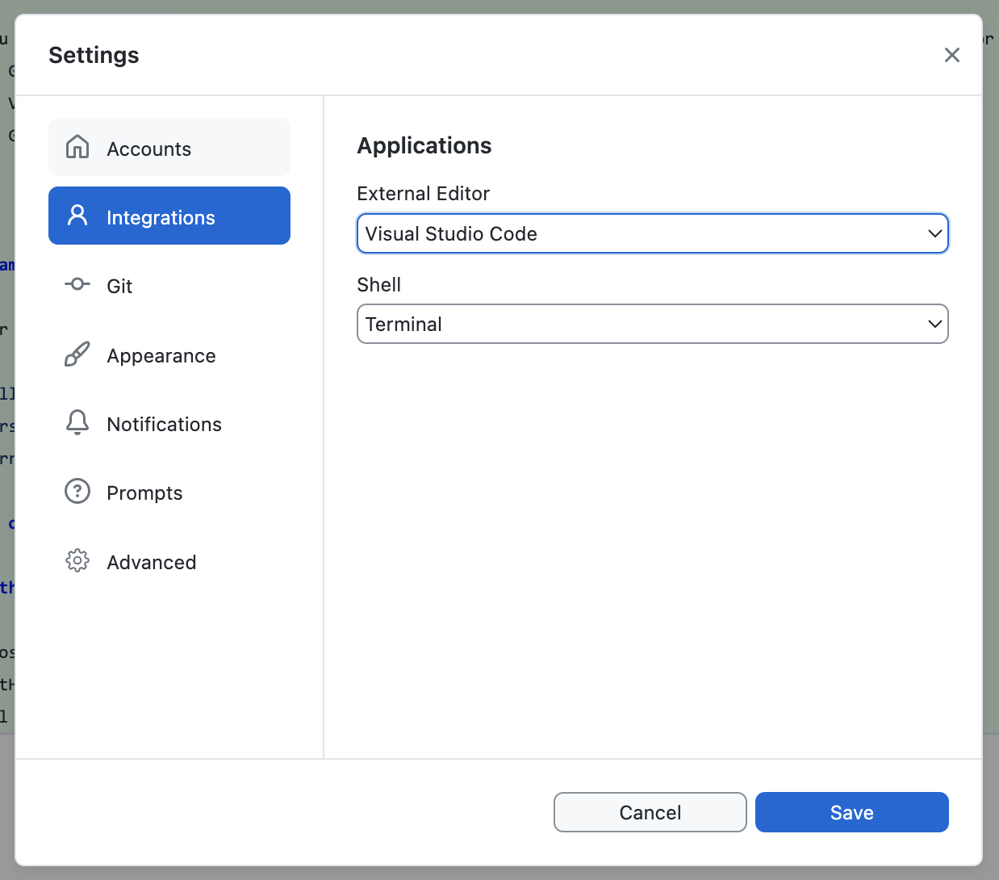

# Lab 0: Setup

{: .no_toc}

{: .summary}
In this lab, we will prepare our local environment for the course labs and assignments. We recommend you follow this guide step by step, but if you are already familiar with some of the tools, feel free to skip ahead.

<details open markdown="block">
  <summary>
    Table of contents
  </summary>
  {: .text-delta }
- TOC
{:toc}
</details>

---

## Browser: Latest Google Chrome

Ideally when making websites and web applications, we want to ensure they work correctly in all browsers, both new and (relatively) old.
However, for the purposes of this class, we will only be using the latest version of Google Chrome.
This is to streamline the process, and avoid spending time on issues that are out of scope for the learning objectives of the course.

If you don’t already have Google Chrome installed, please [install it now](https://www.google.com/chrome/).
If you have it installed, please make sure you have the latest version by restarting it (it downloads updates automatically).

## Code editor: Visual Studio Code (VS Code)

We will use [Visual Studio Code](https://code.visualstudio.com/) as our code editor.
A code editor is a program that allows us to write code in a text file and save it.
In contrast with plain text editors (like Notepad on Windows or TextEdit on macOS),
code editors provide features that make it easier to write code, such as syntax highlighting, code completion, and code formatting.

- [Installing VSCode](https://code.visualstudio.com/download)
- [VSCode Basics](https://code.visualstudio.com/docs/getstarted/userinterface)
- [VSCode Extensions](https://code.visualstudio.com/docs/editor/extension-gallery)

If you prefer another editor, feel free to use it, but we won't be able to provide support for it.

Visual studio code also provides its own integrated terminal, so if you’re not familiar with running terminal commands on your computer, you can use the one built into VSCode.
In the rest of this guide, if we say “open the terminal”, you can simply open the directory you want to start from (or any directory if that is not specified) with VS Code and press `` Ctrl + `  `` to [open the integrated terminal](https://code.visualstudio.com/docs/terminal/basics) (or via the menu: View → Terminal).

### Emmet

[Emmet](https://code.visualstudio.com/docs/editor/emmet) is a snippet syntax that allows us to write certain web languages much faster.
It is built into VSCode, so we don't need to install anything.
Just verify that it works by creating a new `index.html` file and typing `!` followed by pressing the `Tab` key.

If it works, the `!` should be replaced by something like:

```html
<!DOCTYPE html>
<html lang="en">
  <head>
    <meta charset="UTF-8" />
    <meta name="viewport" content="width=device-width, initial-scale=1.0" />
    <title>Document</title>
  </head>
  <body></body>
</html>
```

Don’t worry about what this means right now, that’s what Lab 1 is for!

## Git

[Git](https://git-scm.com/) is a [version control system](https://en.wikipedia.org/wiki/Version_control).
It allows us to keep track of changes to our code over time,
collaborate with others without having to worry about overwriting each other's work,
and revert back to previous versions of the code if needed.

<figure markdown="1">

[](<(images/finaldoc.gif)>)

<figcaption markdown="1">

Seems familiar? This is what version control frees you from! (Source: [PhD Comics](https://phdcomics.com/comics.php?f=1531))

</figcaption>
</figure>

### Setting up Git

The first step is to check if you already have git installed by opening the terminal and typing `git --version`.

- If you get an error about the command being unknown, you need to [install Git](https://git-scm.com/book/en/v2/Getting-Started-Installing-Git) on your computer.
- If you get a version number, you already have git installed.
  Make sure it's up to date by comparing the version number you got with the one [on the official website](https://git-scm.com/#front-downloads).
  If it’s significantly out of date, it’s a good practice to update it, covered at the end of the [installation guide](https://git-scm.com/book/en/v2/Getting-Started-Installing-Git).

If you’ve never used git before, first you need to set up your name and email.
Run the following commands to let git know your name and email address. Open a terminal and run:

```bash
git config --global user.name "Your Name"
git config --global user.email "your_email@mit.edu"
```

### Git concepts: repo(sitory), staging area, commit

In Git, code is grouped in _repositories_ (or _repos_ for short), which are the root directories of a project.
Repositories cannot be nested.

Git tracks changes via the concept of a _commit_, which is a set of changes to the code.
By combining the commits from the start (the _commit history_) together, it can give us a snapshot of the code at any point in time.

A commit is performed in two steps:

1. We tell Git which files we want to commit by adding them to the _staging area_ through `git add`.
   We can add multiple files at once, or one by one.
2. We tell Git to commit the files in the staging area through `git commit`.

Let’s try it out!

Create a new folder on your computer (e.g. `lab-0`) and open it in VSCode.
Then create a text file called `hello.txt` and write something in it.
Then, [open the built-in terminal in VS Code](https://code.visualstudio.com/docs/terminal/basics) and type:

```bash
git init
```

Then press Enter.
You should see something like:

```bash
Initialized empty Git repository in /Users/username/Documents/viz-society/lab-0/.git/
```

This means that Git has created a new repository in the current folder, but we have not yet committed anything.
To see what the current status of the repository is, type:

```bash
git status
```

Which should give you something like:

```bash
On branch main

No commits yet

Untracked files:
  (use "git add <file>..." to include in what will be committed)
        hello.txt

nothing added to commit but untracked files present (use "git add" to track)
```

To add all the files in the current folder to the staging area, type:

```bash
git add .
```

{: .fyi }
The `.` means "the current folder" and is used very widely (similarly, `..` means "the parent folder").

Now, if we check the status again, we should see:

```bash
On branch main

No commits yet

Changes to be committed:
  (use "git rm --cached <file>..." to unstage)
		new file:   hello.txt
```

This means that the file `hello.txt` is now in the staging area, and will be committed when we tell Git to do so.
Let’s commit it:

```bash
git commit -m "Add hello.txt"
```

The `-m` flag means that we are providing a message for the commit inline.
If we don’t provide it, Git will open a text editor for us to write the message in.

That’s it! We have now committed our first change to the repository.
You can see recent changes via `git log` and even go back to a previous commit by using `git checkout <commit hash>`
(the commit hash is the long string of letters and numbers that you see in the output of `git log`).

## GitHub

[GitHub](https://github.com) is a website that allows us to store our code online and collaborate with others.
Code is published in repositories, which are like folders that contain all the files of a project.
Repositories can be public, which means anyone can see them, or private, which means only people with access can see them.
In this class (and many others), we will be using GitHub repositories for your work during lab, as well as your assignments.

If you don’t already have a GitHub account, please [create one now](https://github.com/).

Please sign up for the [GitHub Student Developer Pack](https://education.github.com/pack) to get access to a GitHub Pro account and many other useful tools for free.
We will be using [GitHub Pages](https://pages.github.com/) to publish websites, which requires a paid account for private repos.

### New Git concepts: Remote, pushing, and pulling

When we work on a project with others, we need a way to share our changes with them.

GitHub introduces the concept of a _remote_: That is, a remote repository that is set up to be a copy of our local repository.
We can then _push_ our commits to the remote, and _pull_ commits from the remote to our local repository.

<figure markdown="1">


<figcaption markdown="1">

Diagram illustrating the Git & GitHub workflow.
(Source: [Git, GitHub, & Workflow Fundamentals on dev.to](https://dev.to/mollynem/git-github--workflow-fundamentals-5496))

</figcaption>
</figure>

### Helpful Git Resources

- [A grip on git](https://agripongit.vincenttunru.com/) is a beautiful visual explanation of how git works from the inside out.
- [Missing Semester Git Lecture](https://missing.csail.mit.edu/2020/version-control/) is a great text explanation of how git works from the IAP class on developer tools.
- [Learn Git Branching](https://learngitbranching.js.org/) is a great online interactive tutorial for learning the git command line.
- [GitHub Cheat Sheet](https://education.github.com/git-cheat-sheet-education.pdf) This cheat sheet features the most important and commonly used Git commands for easy reference.

## GitHub Desktop

Using Git via the command line is fine for the simplest case of committing and pushing all our changes at once and having no conflicts,
but when we need more control or something goes wrong, it can be quite challenging to use.

<figure markdown="1">

[](images/xkcd1597.png)

<figcaption markdown="1">

Why we need a visual client for Git (Source: [xkcd](https://xkcd.com/1597/))

</figcaption>
</figure>

[GitHub Desktop](https://desktop.github.com/) is a graphical user interface (GUI) for Git.
It does not do everything that Git can do, but it does make many commonly needed tasks much easier, including:

- Reviewing uncommitted changes and only committing a subset of them (down to specific lines)
- Reverting commits
- Viewing the commit history

We strongly encourage installing GitHub Desktop (or any other visual client), even if you are comfortable with the command line,
since it provides better visibility of status which can prevent many mistakes.

Once you install GitHub Desktop, you will need to [connect it to your GitHub account](https://docs.github.com/en/desktop/overview/getting-started-with-github-desktop).
You should then [go through the tutorial to create a repository](https://docs.github.com/en/desktop/overview/creating-your-first-repository-using-github-desktop).
This will also guide you on how to push and pull from a remote repository.

You should also go to Settings > Integrations and set Visual Studio Code as your default editor.



{:.note}
This is all the setup needed for Lab 1!
We will not need the rest of the tools until at least Lab 2 (and Svelte not until Lab 6),
but we recommend you install them now so you don't have to worry about it later.

## Node.js and npm

As we will learn, JS (short for JavaScript) is the web’s programming language.
Node.js is a program that allows us to use JS outside of the browser, in the same way as any other programming language, e.g. Python.
npm is a package manager for JS, which allows us to install and use libraries (also called packages) written in JS.
If you are familiar with Python, npm serves the same purpose as pip.

You may already have Node.js installed. To find out, open the terminal and type:

```bash
node --version
```

If you get an error, or if the version is way behind what you see on the [official website](https://nodejs.org/en),
you need to [install or update Node.js](https://nodejs.org/en/download/).

[npm](https://www.npmjs.com/) is included with every Node.js installation.
You can verify that you have it installed by typing:

```bash
npm --version
```

{:.note}
If you update Node and npm, you may need to restart your terminal for these commands to show the correct version.

## Installing a local server

While we can view web pages by simply opening them in a browser, that mode is heavily restricted for security reasons and many newer features will not work in it.
To get around this, we will use a local server to serve our web pages.

[Live Server](https://marketplace.visualstudio.com/items?itemName=ritwickdey.LiveServer) is a VS Code extension that not only gives us a local server, it even takes care of refreshing the page for us when we make changes to the code!

Installation steps:

1. Launch VS Code
2. Quick Open (Ctrl+P) or (Command + P - on mac)
3. Paste the following command, and press enter:

```bash
ext install ritwickdey.liveserver
```