# Lab 1: Introduction to the Web platform

{: .no_toc}

{: .summary}

> In this lab, we will learn:
>
> - How does the Web work? What happens when I enter a URL in my browser and hit Enter?
> - What languages are used to create webpages, what is each for, and what are their differences?
> - How to write _good_ HTML?
> - How do CSS and JS look like, and how do we include them in our HTML?
> - How can we create our own webpage and publish it on the Web?

<details open markdown="block">
  <summary>
    Table of contents
  </summary>
  {: .text-delta }
- TOC
{:toc}
</details>

---

## Prerequisites

This lab assumes you have already gone through the setup instructions in [Lab 0](../lab00/) (except those marked for Lab 2 or later),
i.e. that you have (latest versions of, where applicable):

- Google Chrome
- Visual Studio Code (and you have verified Emmet works)
- Git that is set up with your name and email
- A GitHub account (upgraded to Pro via the [GitHub Student Developer Pack](https://education.github.com/pack)
- GitHub Desktop, connected to GitHub and with VS Code set as the default editor

## Part 1: Web fundamentals

- [**Slides**](./slides/)

Links we’ll need for the hands-on activities:

- [`hello.html`](hello.html)
- [`first.html`](first.html)
- [`errors.html`](errors.html)

## Part 2: Creating our own website from scratch and publishing it on the Web

### Step 1: Setup

<figure markdown="1">

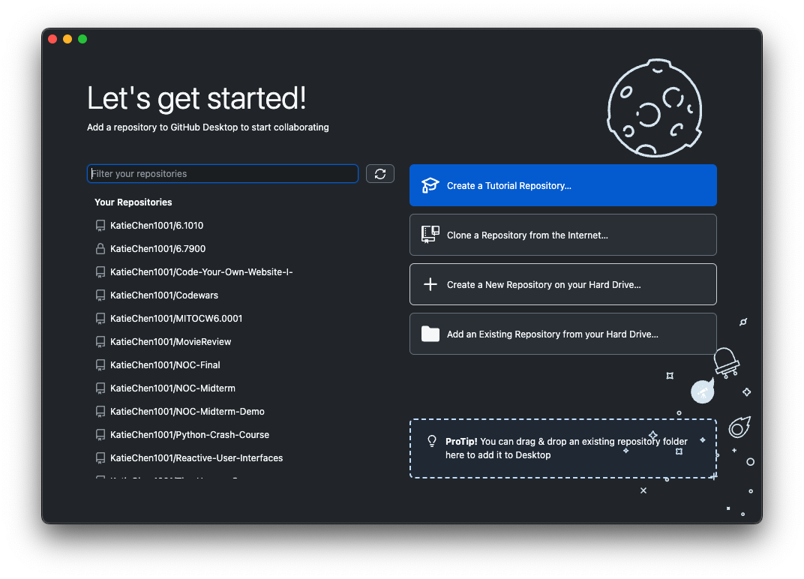
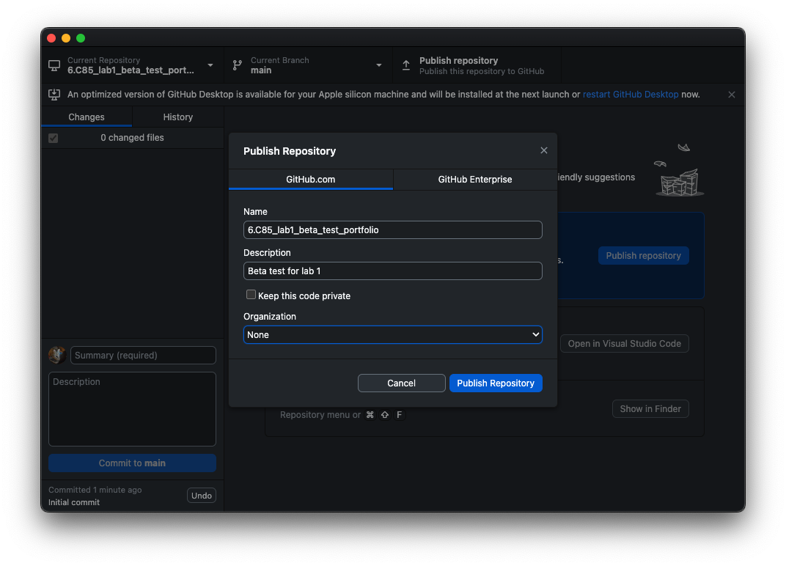
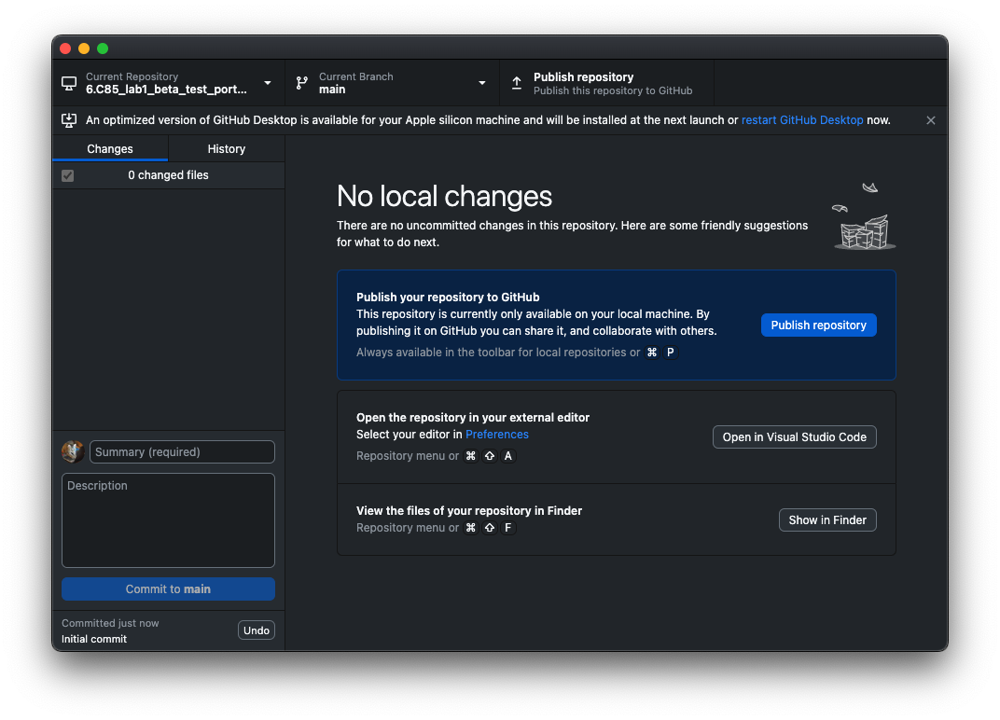
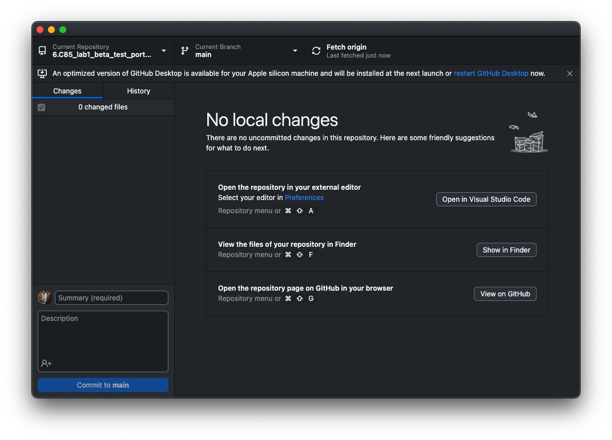

<figcaption>
Creating a new repostory with GitHub Desktop and publishing it to GitHub
</figcaption>

</figure>

1. [Create a new repository with GitHub Desktop](https://docs.github.com/en/desktop/overview/creating-your-first-repository-using-github-desktop) called `portfolio` (or anything else you want, but the rest will assume `portfolio`)
2. [Publish it on GitHub](https://docs.github.com/en/desktop/overview/creating-your-first-repository-using-github-desktop#part-4-publishing-your-repository-to-github) (verify that it worked by visiting `https://github.com/YOUR_USERNAME/portfolio` or clicking Repository > View on GitHub in GitHub Desktop’s menu)
3. [Open it on Visual Studio Code](https://docs.github.com/en/desktop/overview/creating-your-first-repository-using-github-desktop#part-5-making-committing-and-pushing-changes) (Menu: Repository > Open in Visual Studio Code)

### Step 2: Create a basic HTML page

<figure markdown="1">

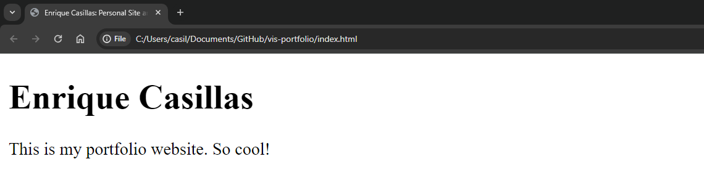

<figcaption>
Our initial HTML page is pretty simple.
</figcaption>

</figure>

1. Create a new file called `index.html` in the root of your repository
2. Type `!` and hit `Tab` to expand the Emmet snippet into a basic HTML page
3. Change the page title (`<title>`) to "`YOUR_NAME`: Personal site and portfolio"
4. Add a `<h1>` with your name
5. Add a `<p>` with a short description of yourself (if you can’t think of anything, just type `lorem` and hit Tab to generate placeholder text; just make sure to edit it later!)
6. Save the file. Open the file in Chrome and verify that it works.
7. Commit and push your changes to GitHub

{: .tip }
Remember that committing and pushing your changes to GitHub is a two-step process:
First, you commit your changes to your local repository:
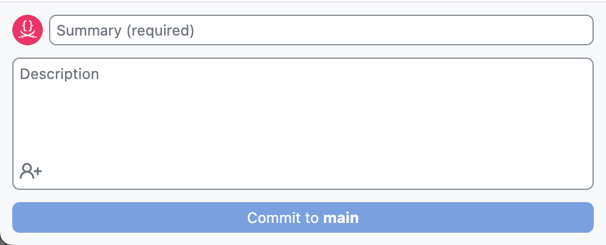
then you push your changes to your remote repository on GitHub.
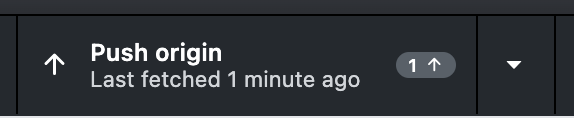

### Step 3: Publish your site on GitHub Pages

<figure markdown="1">

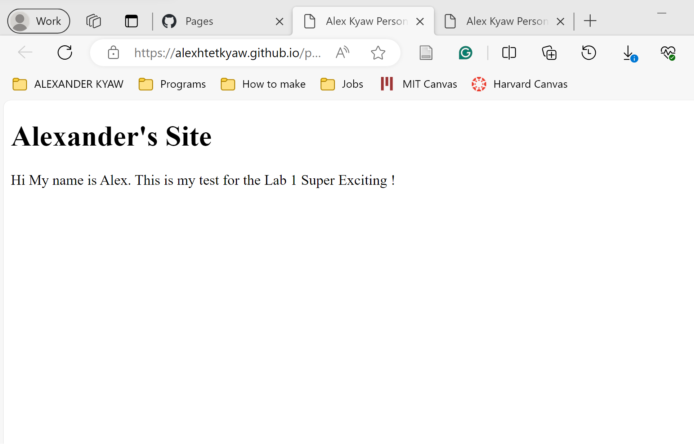

<figcaption>
Our simple page is now live!
</figcaption>

</figure>

<style>
img[src="images/pages.png"] {
	height: 1.5em;
	vertical-align: middle;
}
img[src="images/visit site.png"] {
	height: 2em;
	vertical-align: middle;
}
</style>

GitHub provides a free hosting service called GitHub Pages that is perfect for hosting static websites like the one we are creating.
It gives you a URL like `https://YOUR_USERNAME.github.io/YOUR_REPOSITORY_NAME` that you can share with anyone to show them your site,
but you can also use your own domain name if you have one.

1. Open your repository on GitHub (On GitHub Desktop: Repository > View on GitHub)
2. Click Settings
3. Scroll down and click the 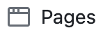 section
4. Select "main" as the branch and click Save
5. Check "Enforce HTTPS"
6. Wait a few seconds for GitHub to publish your site, then refresh.
   Then click  to open your site in a new tab.
   That’s it — your website is now live! 🎉

<figure markdown="1">

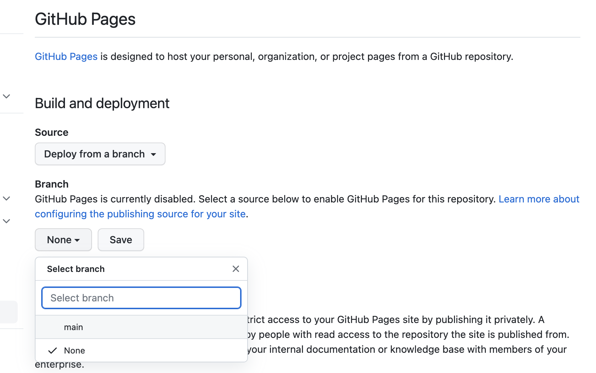

<figcaption markdown="1">

Selecting main as the branch

</figcaption>
</figure>

In the following steps, it is implied that you first test your changes locally in Chrome, then commit and push them to GitHub, and then refresh your site to verify that the changes are live (after waiting a few seconds).

### Step 4: Add a photo

1. Create an `images` folder in the root of your repository
2. Find a photo of yourself (or anything else you want) and save it in the `images` folder
3. Add an `` element to your HTML page, with the [`src`](https://developer.mozilla.org/en-US/docs/Web/HTML/Element/img#src) attribute set to the path to your image file (`images/your-image-file-name.jpg`)
4. Add an [`alt`](https://developer.mozilla.org/en-US/docs/Web/HTML/Element/img#attr-alt) attribute to the `` element with a short description of the image as you would describe it to someone who cannot see it.

<figure markdown="1">


<figcaption>
Our page now has a photo!
</figcaption>

</figure>

### Step 5: Add a CSS stylesheet

1. Create a new file called `style.css` in the root of your repository
2. Add the following CSS to the file:

```css
body {
  /* Set line height to 1.5 times the font size
	   and use the OS’s UI font as the website font
	 */
  font: 100%/1.5 system-ui;
}
```

3. Link the stylesheet to your HTML page via a `<link>` element in the `<head>`.

### Step 6: Add more pages and a navigation menu

1. Create two new files: `projects/index.html` and `contact/index.html`.
2. Set their title and add a `<h1>` with the page title in each.
3. Add a navigation menu in each page (using `<nav>`), with links (using `<a>`) to every page in your site, including the current one.
4. Add a link to your GitHub profile to the navigation menu with `target="_blank"` to make it always open in a new tab.

The directory structure at this point should look a bit like this:

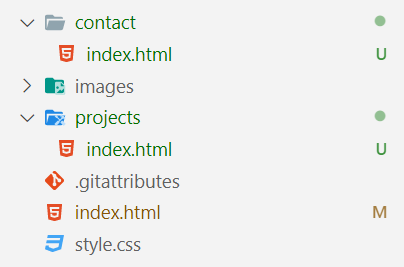

{: .tip }
When linking to other pages in the same site, you should use [relative URLs](./slides/#relative-urls).

{: .fyi }
Why do we use `index.html`?
In most web servers, `index.html` is a special name that is used as the default file to serve when the user visits a directory.
This means that users can type `https://YOUR_USERNAME.github.io/YOUR_REPOSITORY_NAME/contact/` instead of `https://YOUR_USERNAME.github.io/YOUR_REPOSITORY_NAME/contact/index.html`.

### Step 7: Basic contact form

In this step we will add a functional contact form to the `contact` page.
When the user submits the form, their email client will open with a new email to you, with the subject and body prefilled with the values they entered in the form.

Contact forms on the web are not made like this anymore, and for good reasons:

- This method exposes your email address to spammers. One of the primary reasons for a contact form is to not expose your email address publicly.
- The message formatting is awkward and not very user-friendly.

However, making a contact form properly would require server-side code and/or a third-party service, which is way beyond the scope of this first lab.

1. Create a `<form>` element in `contact/index.html` and set:
   - Its `action` attribute to `mailto:YOUR_EMAIL_ADDRESS` (e.g. `mailto:foo@example.com`)
   - Its `method` attribute to [`POST`](https://developer.mozilla.org/en-US/docs/Web/HTTP/Methods/POST)
   - Its `enctype` attribute to [`text/plain`](https://developer.mozilla.org/en-US/docs/Web/HTML/Element/form#attr-enctype)
   - Why do we need the last two? Experiment by using the form without them and see what happens!
2. Create our contact form fields. We need at least:
   - A single line text field (`<input>`) for the sender’s email address with `name="email"` and `type="email"`
   - A single line text field (`<input>`) for for the subject with `name="subject"` (you don’t need `type="text"` as that is the default)
   - A multiline text field (`<textarea>`) for the actual message with `name="body"`
3. Wrap each field in a `<label>` with the field name as its contents
4. Add a submit button with `<button>` (you don’t need `type="submit"` as that is the default)

The directory structure at this point should look a bit like this:


{: .tip }
While developing, you will likely need to try your form multiple times.
Add default values to all fields via the HTML (using the `value` attribute on `<input>`s and element contents in `<textarea>`) so you don’t have to type them every time.

Our contact form should now be functional albeit not very pretty (but don’t worry about that, that’s CSS’ job).

<figure markdown="1">

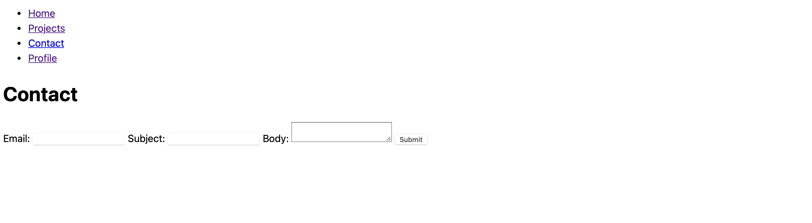

<figcaption>
An example contact form for Step 7.
</figcaption>

</figure>

Try submitting it and see what happens!

{: .note }
Don’t worry about the appearance of your contact form, we will fix that in Lab 2!
While it can be tempting, do _not_ use tables to lay your form out in a grid with the form labels next to the form fields.
Remember that HTML describes _content_, not presentation, and tables are for tabular data, not layout.
We will see how to use CSS to lay our form out in a grid in Lab 2.

### Step 8: Adding a CV/resume page

This is a more freeform step, with the goal of getting you to explore HTML on your own and experiment.
Add a new page to your website (and link to it from the navigation menu) that contains your CV or resume.

{: .note }
If you do not want to publish your CV on the Web for privacy reasons,
you can use fake data for all or part of it.
In that case, try to keep the structure as close as possible to your real CV and simply change the actual data (e.g. names, dates, places)
so that you are still solving a realistic use case.

Structure the different sections of content with `<section>` elements.
Think of `<section>` as the units of content that you would list in a table of contents for that page
(which is exactly how they are exposed to assistive technology users).

You may also find `<article>` useful for structuring independent, self-contained units of content _("article" as in "article of clothing" not "newspaper article" — yes, it is confusing!)_.

Elements you _will_ need (excluding those outside `<body>`):

- Headings, paragraphs, lists
- `<a>` for links
- `<section>` and `<article>` (see above)
- `<time>` for dates

Elements you _may_ need:

- `<header>` for `<section>` or `<article>` headers that are more than just a heading
- `` in case you want to include icons or logos of organizations

Don’t forget to preview your changes locally first, then when you’re happy with them commit and push to GitHub.

## HTML resources

Tools

- [HTML Validator](https://validator.w3.org/nu/): Catch many HTML mistakes early and short-circuit debugging
- [CodePen](https://codepen.io/): quickly experiment with HTML, CSS, JS and see the results live

Cheatsheets

- [HTML Cheatsheet from the slides](slides/#html-elements)
- [HTML Cheatsheet by MDN](https://developer.mozilla.org/en-US/docs/Learn/HTML/Cheatsheet)
- [HTML Cheatsheet by Code Academy](https://www.codecademy.com/learn/learn-html/modules/learn-html-elements/cheatsheet): All intro HTML concepts in one place for easy reference

Tutorials

- [Getting started with the Web](https://developer.mozilla.org/en-US/docs/Learn/Getting_started_with_the_web)
- [MDN: Structuring the web with HTML](https://developer.mozilla.org/en-US/learn/html)
- [Codeacademy: Learn HTML](https://www.codecademy.com/learn/learn-html)
