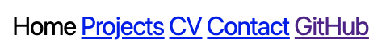
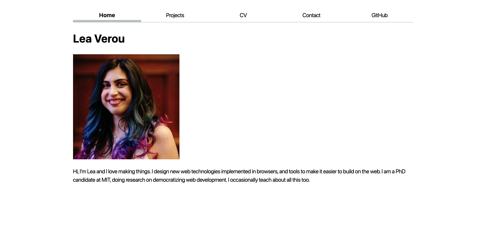
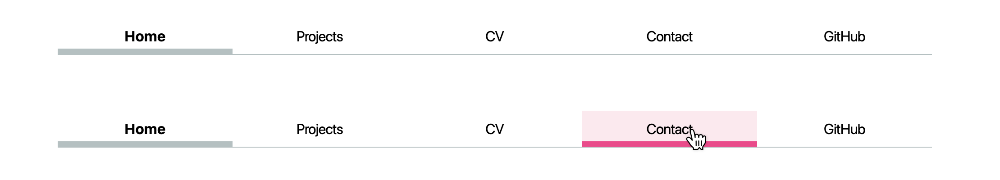
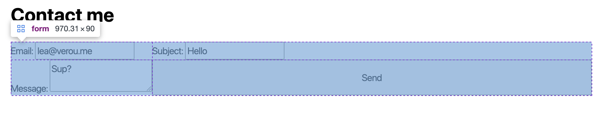
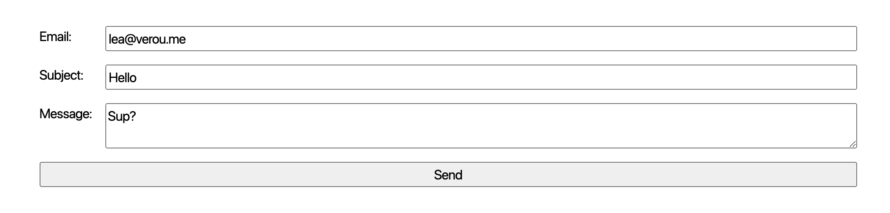

# Lab 2: Styling with CSS

{: .note }
**Page under construction!**



<main> <h1 class="no_toc" id="lab-2-styling-with-css"> <a href="https://vis-society.github.io/labs/2/#lab-2-styling-with-css" class="anchor-heading" aria-labelledby="lab-2-styling-with-css"><svg viewBox="0 0 16 16" aria-hidden="true"><use xlink:href="#svg-link"></use></svg></a> Lab 2: Styling with CSS </h1> 
<strong>Add questions to the <a href="https://docs.google.com/document/d/14ACfEiAyZiaZNhJ-0mINWs6txn6VRzRqHQ8bDRWCE4o/edit?usp=sharing" target="_blank" rel="noopener noreferrer">questions doc</a> throughout the lab!</strong>
 <blockquote class="summary"> 
In this lab, we will learn:
 <ul> <li>What are the core concepts of CSS?</li> <li>How can we use CSS selectors to target the elements we want to style?</li> <li>What is the difference between absolute and relative units?</li> <li>How to use CSS to customize deisgn aspects such as fonts, colors, or layout?</li> <li>What happens when there are conflicting CSS declarations about the same element?</li> </ul> </blockquote> 
 
 Table of contents 
 <ul id="markdown-toc"> <li><a href="https://vis-society.github.io/labs/2/#check-off" id="markdown-toc-check-off">Check-off</a></li> <li><a href="https://vis-society.github.io/labs/2/#prerequisites" id="markdown-toc-prerequisites">Prerequisites</a></li> <li><a href="https://vis-society.github.io/labs/2/#slides" id="markdown-toc-slides">Slides</a></li> <li><a href="https://vis-society.github.io/labs/2/#step-1-prevent-content-from-getting-too-wide" id="markdown-toc-step-1-prevent-content-from-getting-too-wide">Step 1: Prevent content from getting too wide</a></li> <li><a href="https://vis-society.github.io/labs/2/#step-2-styling-the-navigation-bar" id="markdown-toc-step-2-styling-the-navigation-bar">Step 2: Styling the navigation bar</a> <ul> <li><a href="https://vis-society.github.io/labs/2/#step-21-getting-ul-and-li-out-of-the-way" id="markdown-toc-step-21-getting-ul-and-li-out-of-the-way">Step 2.1: Getting <code class="language-plaintext highlighter-rouge">&lt;ul&gt;</code> and <code class="language-plaintext highlighter-rouge">&lt;li&gt;</code> out of the way</a></li> <li><a href="https://vis-society.github.io/labs/2/#step-22-using-flexbox-to-lay-out-the-navigation" id="markdown-toc-step-22-using-flexbox-to-lay-out-the-navigation">Step 2.2: Using Flexbox to lay out the navigation</a></li> <li><a href="https://vis-society.github.io/labs/2/#step-23-adding-some-style" id="markdown-toc-step-23-adding-some-style">Step 2.3: Adding some style</a></li> <li><a href="https://vis-society.github.io/labs/2/#step-24-accent-color-and-hover-styles" id="markdown-toc-step-24-accent-color-and-hover-styles">Step 2.4: Accent color and hover styles</a></li> </ul> </li> <li><a href="https://vis-society.github.io/labs/2/#step-3-contact-form-layout" id="markdown-toc-step-3-contact-form-layout">Step 3: Contact form layout</a> <ul> <li><a href="https://vis-society.github.io/labs/2/#step-31-integrate-typography" id="markdown-toc-step-31-integrate-typography">Step 3.1: Integrate typography</a></li> <li><a href="https://vis-society.github.io/labs/2/#step-32-top-down-layout" id="markdown-toc-step-32-top-down-layout">Step 3.2: Top-down layout</a></li> <li><a href="https://vis-society.github.io/labs/2/#step-33-grid-layout" id="markdown-toc-step-33-grid-layout">Step 3.3: Grid layout</a></li> </ul> </li> <li><a href="https://vis-society.github.io/labs/2/#step-4-style-your-projects-page" id="markdown-toc-step-4-style-your-projects-page">Step 4: Style your projects page</a> <ul> <li><a href="https://vis-society.github.io/labs/2/#step-41-add-some-dummy-content" id="markdown-toc-step-41-add-some-dummy-content">Step 4.1: Add some dummy content</a></li> <li><a href="https://vis-society.github.io/labs/2/#step-42-stop-images-from-getting-too-wide" id="markdown-toc-step-42-stop-images-from-getting-too-wide">Step 4.2: Stop images from getting too wide</a></li> <li><a href="https://vis-society.github.io/labs/2/#step-42-applying-a-responsive-grid" id="markdown-toc-step-42-applying-a-responsive-grid">Step 4.2: Applying a responsive grid</a></li> <li><a href="https://vis-society.github.io/labs/2/#step-43-horizontal-alignment-with-subgrid" id="markdown-toc-step-43-horizontal-alignment-with-subgrid">Step 4.3: Horizontal alignment with subgrid</a></li> <li><a href="https://vis-society.github.io/labs/2/#step-44-finishing-touches" id="markdown-toc-step-44-finishing-touches">Step 4.4: Finishing touches</a></li> </ul> </li> <li><a href="https://vis-society.github.io/labs/2/#step-5-style-your-cv" id="markdown-toc-step-5-style-your-cv">Step 5: Style your CV</a></li> <li><a href="https://vis-society.github.io/labs/2/#css-resources" id="markdown-toc-css-resources">CSS resources</a> <ul> <li><a href="https://vis-society.github.io/labs/2/#videos" id="markdown-toc-videos">Videos</a></li> </ul> </li> </ul> 

  <section id="check-off-section"><h2 id="check-off"> <a href="https://vis-society.github.io/labs/2/#check-off" class="anchor-heading" aria-labelledby="check-off"><svg viewBox="0 0 16 16" aria-hidden="true"><use xlink:href="#svg-link"></use></svg></a> Check-off </h2> 
<strong>You need to come to TA Office Hours to get checked off for this lab</strong> (any of them, no appointment needed). Please fill in <a href="https://vis-society.github.io/labs/2/checkoff">the check-off form at <code class="language-plaintext highlighter-rouge">labs/2/checkoff</code></a> <em>before</em> your check-off (right before is fine — even preferred).
 
Filling out the form is <em>not</em> enough to get checked off. <strong>You need to come to office hours.</strong>
 </section><section id="prerequisites-section"><h2 id="prerequisites"> <a href="https://vis-society.github.io/labs/2/#prerequisites" class="anchor-heading" aria-labelledby="prerequisites"><svg viewBox="0 0 16 16" aria-hidden="true"><use xlink:href="#svg-link"></use></svg></a> Prerequisites </h2> 
This lab assumes you have already completed <a href="https://vis-society.github.io/labs/1/">Lab 1</a>, as we will use this as a starting point.
 
You do not need to create a new repository for Lab 2, simply work on the same repository you created for Lab 1.
 </section><section id="slides-section"><h2 id="slides"> <a href="https://vis-society.github.io/labs/2/#slides" class="anchor-heading" aria-labelledby="slides"><svg viewBox="0 0 16 16" aria-hidden="true"><use xlink:href="#svg-link"></use></svg></a> <a href="https://vis-society.github.io/labs/2/slides/">Slides</a> </h2> 
Make sure to read the notes on each slide as well!
 
Playgrounds:
 <ul> <li><a href="https://css.land/box-model/">CSS box model</a></li> <li><a href="https://css.land/specificity/">Specificity Battle</a></li> </ul> </section><progress id="step-progress" value="0" max="14"></progress><section id="step-1-prevent-content-from-getting-too-wide-section" class="step" data-step_index="0"><h2 id="step-1-prevent-content-from-getting-too-wide"><input type="checkbox" data-for="step-1-prevent-content-from-getting-too-wide" class="step-checkbox"> <a href="https://vis-society.github.io/labs/2/#step-1-prevent-content-from-getting-too-wide" class="anchor-heading" aria-labelledby="step-1-prevent-content-from-getting-too-wide"><svg viewBox="0 0 16 16" aria-hidden="true"><use xlink:href="#svg-link"></use></svg></a> Step 1: Prevent content from getting too wide </h2> 
In lab 1, we created a simple homepage with minimal styling (only setting the font family, and line-height).
 
It looked a bit like this:
 

 
First, let’s stop the content from getting so wide, by applying a <a href="https://developer.mozilla.org/en-US/docs/Web/CSS/max-width" target="_blank"><code class="language-plaintext highlighter-rouge">max-width</code></a> to <a href="https://developer.mozilla.org/en-US/docs/Web/HTML/Element/body" target="_blank"><code class="language-plaintext highlighter-rouge">&lt;body&gt;</code></a>. Why not simply a <a href="https://developer.mozilla.org/en-US/docs/Web/CSS/width" target="_blank"><code class="language-plaintext highlighter-rouge">width</code></a>? So that the content continues to adapt to smaller viewport sizes. We will specify that <a href="https://developer.mozilla.org/en-US/docs/Web/CSS/max-width" target="_blank"><code class="language-plaintext highlighter-rouge">max-width</code></a> in <code class="language-plaintext highlighter-rouge">em</code>, <code class="language-plaintext highlighter-rouge">rem</code>, or <code class="language-plaintext highlighter-rouge">ch</code> units, so that it scales with the font size. Experiment with the browser dev tools to find a good value for <a href="https://developer.mozilla.org/en-US/docs/Web/CSS/max-width" target="_blank"><code class="language-plaintext highlighter-rouge">max-width</code></a>. I used <code class="language-plaintext highlighter-rouge">100ch</code>:
 

 
Now let’s center that content. We can do that by using the special value <code class="language-plaintext highlighter-rouge">auto</code> for the left and right margin. We can set both of these to the same value by using the <a href="https://developer.mozilla.org/en-US/docs/Web/CSS/margin-inline" target="_blank"><code class="language-plaintext highlighter-rouge">margin-inline</code></a> shorthand property.
 
This already looks better!
 

 
But try resizing your window to be smaller than that <a href="https://developer.mozilla.org/en-US/docs/Web/CSS/max-width" target="_blank"><code class="language-plaintext highlighter-rouge">max-width</code></a> we set.
 
Yikes! Our content is now touching the edges of the viewport, which makes it hard to read. One way to fix that is to add some <a href="https://developer.mozilla.org/en-US/docs/Web/CSS/padding" target="_blank"><code class="language-plaintext highlighter-rouge">padding</code></a> to the content.
 <figure class="multiple flex">   <figcaption>Before and after</figcaption> </figure> <blockquote class="tip"> 
What would be another way to solve it? We can specify a lower bound for our margin by using the <code class="language-plaintext highlighter-rouge">max()</code> function, but we need to specify the margin explicitly, not using the <code class="language-plaintext highlighter-rouge">auto</code> keyword:
 

<pre class="highlight"><code>margin-inline: max(1em, (100% - 100ch) / 2);
</code></pre>
 <button type="button" aria-label="Copy code to clipboard"><svg viewBox="0 0 24 24" class="copy-icon"><use xlink:href="#svg-copy"></use></svg></button>
 </blockquote> </section><section id="step-2-styling-the-navigation-bar-section" class="step-group" style="--steps: 4; --done: 0;"><h2 id="step-2-styling-the-navigation-bar"><input type="checkbox" data-for="step-2-styling-the-navigation-bar" readonly=""> <a href="https://vis-society.github.io/labs/2/#step-2-styling-the-navigation-bar" class="anchor-heading" aria-labelledby="step-2-styling-the-navigation-bar"><svg viewBox="0 0 16 16" aria-hidden="true"><use xlink:href="#svg-link"></use></svg></a> Step 2: Styling the navigation bar </h2> 
Our navigation bar looks more like a list than a navigation bar. Let’s fix that!
 <section id="step-21-getting-ul-and-li-out-of-the-way-section" class="step" data-step_index="1"><h3 id="step-21-getting-ul-and-li-out-of-the-way"><input type="checkbox" data-for="step-21-getting-ul-and-li-out-of-the-way" class="step-checkbox"> <a href="https://vis-society.github.io/labs/2/#step-21-getting-ul-and-li-out-of-the-way" class="anchor-heading" aria-labelledby="step-21-getting-ul-and-li-out-of-the-way"><svg viewBox="0 0 16 16" aria-hidden="true"><use xlink:href="#svg-link"></use></svg></a> Step 2.1: Getting <a href="https://developer.mozilla.org/en-US/docs/Web/HTML/Element/ul" target="_blank"><code class="language-plaintext highlighter-rouge">&lt;ul&gt;</code></a> and <a href="https://developer.mozilla.org/en-US/docs/Web/HTML/Element/li" target="_blank"><code class="language-plaintext highlighter-rouge">&lt;li&gt;</code></a> out of the way </h3> 
If you have used a <a href="https://developer.mozilla.org/en-US/docs/Web/HTML/Element/ul" target="_blank"><code class="language-plaintext highlighter-rouge">&lt;ul&gt;</code></a> element within your <a href="https://developer.mozilla.org/en-US/docs/Web/HTML/Element/nav" target="_blank"><code class="language-plaintext highlighter-rouge">&lt;nav&gt;</code></a>, you can tell the browser to ignore that <a href="https://developer.mozilla.org/en-US/docs/Web/HTML/Element/ul" target="_blank"><code class="language-plaintext highlighter-rouge">&lt;ul&gt;</code></a> and its <a href="https://developer.mozilla.org/en-US/docs/Web/HTML/Element/li" target="_blank"><code class="language-plaintext highlighter-rouge">&lt;li&gt;</code></a> children for stylng by <a href="https://vis-society.github.io/labs/2/slides/#descendant-styling">applying</a> <code class="language-plaintext highlighter-rouge"><a href="https://developer.mozilla.org/en-US/docs/Web//CSS/display" target="_blank">display</a>: contents</code> to them both, which prevents them from having any styling of their own.
 </section><section id="step-22-using-flexbox-to-lay-out-the-navigation-section" class="step" data-step_index="2"><h3 id="step-22-using-flexbox-to-lay-out-the-navigation"><input type="checkbox" data-for="step-22-using-flexbox-to-lay-out-the-navigation" class="step-checkbox"> <a href="https://vis-society.github.io/labs/2/#step-22-using-flexbox-to-lay-out-the-navigation" class="anchor-heading" aria-labelledby="step-22-using-flexbox-to-lay-out-the-navigation"><svg viewBox="0 0 16 16" aria-hidden="true"><use xlink:href="#svg-link"></use></svg></a> Step 2.2: Using Flexbox to lay out the navigation </h3> 
Now we don’t have weird list bullets, but our navigation is all scrunched up:
 

 
Flexbox to the rescue!
 
Before you proceed, wrap the menu item for the current page in a <a href="https://developer.mozilla.org/en-US/docs/Web/HTML/Element/a" target="_blank"><code class="language-plaintext highlighter-rouge">&lt;a&gt;</code></a> as well, as that will simplify things. Give it a <code class="language-plaintext highlighter-rouge">class="current"</code> attribute, which <a href="https://vis-society.github.io/labs/2/slides/#ids">will allow us to style it differently</a>.
 
Let’s apply <code class="language-plaintext highlighter-rouge"><a href="https://developer.mozilla.org/en-US/docs/Web//CSS/display" target="_blank">display</a>: flex</code> to the <a href="https://developer.mozilla.org/en-US/docs/Web/HTML/Element/nav" target="_blank"><code class="language-plaintext highlighter-rouge">&lt;nav&gt;</code></a> to enable <a href="https://developer.mozilla.org/en-US/docs/Web/CSS/CSS_flexible_box_layout/Basic_concepts_of_flexbox">Flexible box layout</a> (<a href="https://developer.mozilla.org/en-US/docs/Learn/CSS/CSS_layout/Flexbox">Flexbox</a>).
 
You will not notice any immediate difference, but we can now use Flexbox to control the layout of the children of <a href="https://developer.mozilla.org/en-US/docs/Web/HTML/Element/nav" target="_blank"><code class="language-plaintext highlighter-rouge">&lt;nav&gt;</code></a>.
 
Apply <code class="language-plaintext highlighter-rouge"><a href="https://developer.mozilla.org/en-US/docs/Web//CSS/flex" target="_blank">flex</a>: 1</code> to each of the <a href="https://developer.mozilla.org/en-US/docs/Web/HTML/Element/a" target="_blank"><code class="language-plaintext highlighter-rouge">&lt;a&gt;</code></a> elements (via a suitable CSS rule) to make them take up the same amount of space <a href="https://vis-society.github.io/labs/2/#fn:1" class="footnote" rel="footnote">1</a>.
 
Useful links for Flexbox:
 <ul> <li><a href="https://developer.mozilla.org/en-US/docs/Web/CSS/CSS_flexible_box_layout/Basic_concepts_of_flexbox">MDN: Basic concepts of flexbox</a></li> <li><a href="https://developer.mozilla.org/en-US/docs/Learn/CSS/CSS_layout/Flexbox">MDN: Flexbox tutorial</a></li> <li><a href="https://css-tricks.com/snippets/css/a-guide-to-flexbox/">CSS Tricks: A Complete Guide to Flexbox</a></li> <li><a href="https://flexboxfroggy.com/">Flexbox Froggy</a></li> <li><a href="http://www.flexboxdefense.com/">Flexbox Defense</a></li> <li><a href="https://flexboxzombies.com/">Flexbox Zombies</a></li> </ul> </section><section id="step-23-adding-some-style-section" class="step" data-step_index="3"><h3 id="step-23-adding-some-style"><input type="checkbox" data-for="step-23-adding-some-style" class="step-checkbox"> <a href="https://vis-society.github.io/labs/2/#step-23-adding-some-style" class="anchor-heading" aria-labelledby="step-23-adding-some-style"><svg viewBox="0 0 16 16" aria-hidden="true"><use xlink:href="#svg-link"></use></svg></a> Step 2.3: Adding some style </h3> 
This is starting to look like an actual navigation bar!
 
Now let’s give it some style.
 <ul> <li>Remove the underline from the links by setting <code class="language-plaintext highlighter-rouge"><a href="https://developer.mozilla.org/en-US/docs/Web//CSS/text-decoration" target="_blank">text-decoration</a>: none</code>.</li> <li>Remove the gory default link color by setting <code class="language-plaintext highlighter-rouge"><a href="https://developer.mozilla.org/en-US/docs/Web//CSS/color" target="_blank">color</a>: inherit</code> to make links use the same text color as their parent element.</li> <li>Center the text in its box by setting <code class="language-plaintext highlighter-rouge"><a href="https://developer.mozilla.org/en-US/docs/Web//CSS/text-align" target="_blank">text-align</a>: center</code></li> <li>Let’s give each link some spacing by adding some <a href="https://developer.mozilla.org/en-US/docs/Web/CSS/padding" target="_blank"><code class="language-plaintext highlighter-rouge">padding</code></a> (we recommend <code class="language-plaintext highlighter-rouge">0.5em</code>)</li> <li>Apply some <a href="https://developer.mozilla.org/en-US/docs/Web/CSS/margin-bottom" target="_blank"><code class="language-plaintext highlighter-rouge">margin-bottom</code></a> to the whole <a href="https://developer.mozilla.org/en-US/docs/Web/HTML/Element/nav" target="_blank"><code class="language-plaintext highlighter-rouge">&lt;nav&gt;</code></a> to separate it from the content below.</li> </ul> 
Apply a bottom border to the <a href="https://developer.mozilla.org/en-US/docs/Web/HTML/Element/nav" target="_blank"><code class="language-plaintext highlighter-rouge">&lt;nav&gt;</code></a> to visually separate it from the content. Give it a <a href="https://developer.mozilla.org/en-US/docs/Web/CSS/border-bottom-width" target="_blank"><code class="language-plaintext highlighter-rouge">border-bottom-width</code></a> of <code class="language-plaintext highlighter-rouge">1px</code>, a <a href="https://developer.mozilla.org/en-US/docs/Web/CSS/border-bottom-style" target="_blank"><code class="language-plaintext highlighter-rouge">border-bottom-style</code></a> of <code class="language-plaintext highlighter-rouge">solid</code>, and a <a href="https://developer.mozilla.org/en-US/docs/Web/CSS/border-bottom-color" target="_blank"><code class="language-plaintext highlighter-rouge">border-bottom-color</code></a> of <color-swatch style="--color: oklch(80% 3% 200);"><template shadowrootmode="open">
			
			<slot name="swatch">
				

					<slot name="swatch-content"></slot>
				

			</slot>
			

				<slot name="before"></slot>
				

					<slot></slot>
				

				<slot name="after"></slot>
			

		<gamut-badge id="gamut" part="gamut" gamuts="srgb: sRGB, p3: P3, rec2020: P3+, prophoto: PP, none: PP+" color="oklch(80% 3% 200)" style="--gamut-level: 0; --gamut-label: &quot;sRGB&quot;; --gamut-id: &quot;srgb&quot;; --gamut-count: 4;"><template shadowrootmode="open">
			
			<slot>
				
			</slot>
		</template></gamut-badge></template><code>oklch(80% 3% 200)</code></color-swatch> (a cool gray). You can also use the <a href="https://developer.mozilla.org/en-US/docs/Web/CSS/border-bottom" target="_blank"><code class="language-plaintext highlighter-rouge">border-bottom</code></a> shorthand property to specify all of these at once. Feel free to play with these values, but we recommend keeping it subtle.
 
Now let’s style the current page link. Give it a thick bottom border (we recomend a border width of <code class="language-plaintext highlighter-rouge">0.4em</code>), and either the same cool gray as the navigation bar border, or a lighter version. To counter the increase in height that the border adds, apply a reduced <a href="https://developer.mozilla.org/en-US/docs/Web/CSS/padding-bottom" target="_blank"><code class="language-plaintext highlighter-rouge">padding-bottom</code></a> to that link.
 

 </section><section id="step-24-accent-color-and-hover-styles-section" class="step" data-step_index="4"><h3 id="step-24-accent-color-and-hover-styles"><input type="checkbox" data-for="step-24-accent-color-and-hover-styles" class="step-checkbox"> <a href="https://vis-society.github.io/labs/2/#step-24-accent-color-and-hover-styles" class="anchor-heading" aria-labelledby="step-24-accent-color-and-hover-styles"><svg viewBox="0 0 16 16" aria-hidden="true"><use xlink:href="#svg-link"></use></svg></a> Step 2.4: Accent color and hover styles </h3> 
Define an accent color for your website, and store it in an <code class="language-plaintext highlighter-rouge">--color-accent</code> custom property. Make this custom property available to the entire document by setting it on the <a href="https://developer.mozilla.org/en-US/docs/Web/HTML/Element/html" target="_blank"><code class="language-plaintext highlighter-rouge">&lt;html&gt;</code></a> element (i.e. a selector of <code class="language-plaintext highlighter-rouge">html</code> or <code class="language-plaintext highlighter-rouge">:root</code>). I used <color-swatch style="--color: oklch(65% 50% 0);"><template shadowrootmode="open">
			
			<slot name="swatch">
				

					<slot name="swatch-content"></slot>
				

			</slot>
			

				<slot name="before"></slot>
				

					<slot></slot>
				

				<slot name="after"></slot>
			

		<gamut-badge id="gamut" part="gamut" gamuts="srgb: sRGB, p3: P3, rec2020: P3+, prophoto: PP, none: PP+" color="oklch(65% 50% 0)" style="--gamut-level: 0; --gamut-label: &quot;sRGB&quot;; --gamut-id: &quot;srgb&quot;; --gamut-count: 4;"><template shadowrootmode="open">
			
			<slot>
				
			</slot>
		</template></gamut-badge></template><code>oklch(65% 50% 0)</code></color-swatch>, but feel free to play with the values and pick something you like! Specify <code class="language-plaintext highlighter-rouge"><a href="https://developer.mozilla.org/en-US/docs/Web//CSS/accent-color" target="_blank">accent-color</a>: var(--color-accent)</code> on <a href="https://developer.mozilla.org/en-US/docs/Web/HTML/Element/html" target="_blank"><code class="language-plaintext highlighter-rouge">&lt;html&gt;</code></a> or <a href="https://developer.mozilla.org/en-US/docs/Web/HTML/Element/body" target="_blank"><code class="language-plaintext highlighter-rouge">&lt;body&gt;</code></a> so that all elements that use the accent color can inherit it.
 
Now let’s use this accent color to style hovered navigation links (<code class="language-plaintext highlighter-rouge">a:hover</code>). Apply the same <a href="https://developer.mozilla.org/en-US/docs/Web/CSS/border-bottom" target="_blank"><code class="language-plaintext highlighter-rouge">border-bottom</code></a> as you did for the current page link, but with <code class="language-plaintext highlighter-rouge">var(--color-accent)</code> as the color.
 
Wanna go further? Apply <code class="language-plaintext highlighter-rouge"><a href="https://developer.mozilla.org/en-US/docs/Web//CSS/background-color" target="_blank">background-color</a>: oklch(from var(--color-accent) 95% 5% h)</code> that is a light color with the same hue as our accent color!
 

 </section></section><section id="step-3-contact-form-layout-section" class="step-group" style="--steps: 3; --done: 0;"><h2 id="step-3-contact-form-layout"><input type="checkbox" data-for="step-3-contact-form-layout" readonly=""> <a href="https://vis-society.github.io/labs/2/#step-3-contact-form-layout" class="anchor-heading" aria-labelledby="step-3-contact-form-layout"><svg viewBox="0 0 16 16" aria-hidden="true"><use xlink:href="#svg-link"></use></svg></a> Step 3: Contact form layout </h2> 
In the previous lab, we created a simple contact form. It worked, but it was not very usable, since there is no <a href="https://designftw.mit.edu/lectures/gd/#alignment">alignment</a>, nor clear <a href="https://designftw.mit.edu/lectures/gd/#proximity">proximity</a> to distinguish what input fields the labels belong to:
 

 
Let’s use CSS to improve this.
 <section id="step-31-integrate-typography-section" class="step" data-step_index="5"><h3 id="step-31-integrate-typography"><input type="checkbox" data-for="step-31-integrate-typography" class="step-checkbox"> <a href="https://vis-society.github.io/labs/2/#step-31-integrate-typography" class="anchor-heading" aria-labelledby="step-31-integrate-typography"><svg viewBox="0 0 16 16" aria-hidden="true"><use xlink:href="#svg-link"></use></svg></a> Step 3.1: Integrate typography </h3> 
Inspect the form controls (<a href="https://developer.mozilla.org/en-US/docs/Web/HTML/Element/input" target="_blank"><code class="language-plaintext highlighter-rouge">&lt;input&gt;</code></a>, <a href="https://developer.mozilla.org/en-US/docs/Web/HTML/Element/textarea" target="_blank"><code class="language-plaintext highlighter-rouge">&lt;textarea&gt;</code></a>, <a href="https://developer.mozilla.org/en-US/docs/Web/HTML/Element/button" target="_blank"><code class="language-plaintext highlighter-rouge">&lt;button&gt;</code></a>) and search for <a href="https://developer.mozilla.org/en-US/docs/Web/CSS/font-family" target="_blank"><code class="language-plaintext highlighter-rouge">font-family</code></a> in both the <em>Styles</em> and <em>Computed</em> tabs. What do you observe?
 
All we need to make these use the same font as the rest of the page is <code class="language-plaintext highlighter-rouge"><a href="https://developer.mozilla.org/en-US/docs/Web//CSS/font" target="_blank">font</a>: inherit</code>:
 

 </section><section id="step-32-top-down-layout-section" class="step" data-step_index="6"><h3 id="step-32-top-down-layout"><input type="checkbox" data-for="step-32-top-down-layout" class="step-checkbox"> <a href="https://vis-society.github.io/labs/2/#step-32-top-down-layout" class="anchor-heading" aria-labelledby="step-32-top-down-layout"><svg viewBox="0 0 16 16" aria-hidden="true"><use xlink:href="#svg-link"></use></svg></a> Step 3.2: Top-down layout </h3> 
The easiest way for that is to lay it out top-to-bottom, with each text field occuping the whole width of the form, and its label is above it.
 
This is exactly what the optional <a href="https://vis-society.github.io/labs/1/#styling-contact-form">Contact form styling step</a> did in the previous lab. The gist was:
 <ol> <li>Apply <code class="language-plaintext highlighter-rouge"><a href="https://developer.mozilla.org/en-US/docs/Web//CSS/display" target="_blank">display</a>: block</code> to the form controls and labels to make them behave like block elements (such as <a href="https://developer.mozilla.org/en-US/docs/Web/HTML/Element/p" target="_blank"><code class="language-plaintext highlighter-rouge">&lt;p&gt;</code></a>), i.e. insert line breaks before and after</li> <li>Apply <code class="language-plaintext highlighter-rouge"><a href="https://developer.mozilla.org/en-US/docs/Web//CSS/width" target="_blank">width</a>: 100%</code> to the form controls to make them take up the whole width of their container (in other elements <code class="language-plaintext highlighter-rouge"><a href="https://developer.mozilla.org/en-US/docs/Web//CSS/display" target="_blank">display</a>: block</code> does this too, but form controls are special)</li> <li>Apply <code class="language-plaintext highlighter-rouge"><a href="https://developer.mozilla.org/en-US/docs/Web//CSS/box-sizing" target="_blank">box-sizing</a>: border-box</code> to the form controls to make their width of 100% include their padding and border</li> <li>Apply <a href="https://developer.mozilla.org/en-US/docs/Web/CSS/margin-block" target="_blank"><code class="language-plaintext highlighter-rouge">margin-block</code></a> to the labels to add spacing before and after them</li> </ol> 

 </section><section id="step-33-grid-layout-section" class="step" data-step_index="7"><h3 id="step-33-grid-layout"><input type="checkbox" data-for="step-33-grid-layout" class="step-checkbox"> <a href="https://vis-society.github.io/labs/2/#step-33-grid-layout" class="anchor-heading" aria-labelledby="step-33-grid-layout"><svg viewBox="0 0 16 16" aria-hidden="true"><use xlink:href="#svg-link"></use></svg></a> Step 3.3: Grid layout </h3> 
Our form now looks much better, and it’s crystal clear which label belongs to which input field. However, it is exceedingly wide and looks a bit weird. The primitive layout method we used works, but is not very flexible. How could we make it so that the labels are on the left, and the input fields are on the right, and they are all aligned? <em>No, you do *not* use a <a href="https://developer.mozilla.org/en-US/docs/Web/HTML/Element/table" target="_blank"><code class="language-plaintext highlighter-rouge">&lt;table&gt;</code></a> for that! Repeat after me: tables are for tabular data, not for layout!</em>
 
The answer is <a href="https://developer.mozilla.org/en-US/docs/Web/CSS/CSS_Grid_Layout/Basic_Concepts_of_Grid_Layout">CSS Grid</a>: the crème de la crème of CSS layout methods. It may take some time to fully grok, but it is <em>well worth it</em>.
 
The core idea of CSS Grid is that we define a grid container (the element with <code class="language-plaintext highlighter-rouge">display:grid</code>), and then place its children in the grid (or descendants, through <a href="https://developer.mozilla.org/en-US/docs/Web/CSS/CSS_grid_layout/Subgrid">subgrid</a> or <code class="language-plaintext highlighter-rouge"><a href="https://developer.mozilla.org/en-US/docs/Web//CSS/display" target="_blank">display</a>: contents</code>).
 
First, remove the CSS you applied in the previous step, since we will not need it. Everything starts by applying <code class="language-plaintext highlighter-rouge"><a href="https://developer.mozilla.org/en-US/docs/Web//CSS/display" target="_blank">display</a>: grid</code> to the form.
 
Note that you immediately see a change in the layout: Once you enable grid layout, the grid container’s children are automatically placed on a grid with one column and as many rows as needed to fit all of them. This is called the automatic grid placement algorithm, and it saves you a lot of time: you only need to define the actual constraints, and the browser will take care of the rest.
 
E.g. in this case, all we need to define is columns, via <code class="language-plaintext highlighter-rouge"><a href="https://developer.mozilla.org/en-US/docs/Web//CSS/grid-template-columns" target="_blank">grid-template-columns</a>: auto 1fr</code>. <code class="language-plaintext highlighter-rouge">auto</code> means that the column will be as wide as its content, and <code class="language-plaintext highlighter-rouge">1fr</code> means that the column will take up the remaining space (similar to <code class="language-plaintext highlighter-rouge"><a href="https://developer.mozilla.org/en-US/docs/Web//CSS/flex" target="_blank">flex</a>: 1</code>).
 
If we preview our changes at this point, the result can be quite surprising, but inspecting the <a href="https://developer.mozilla.org/en-US/docs/Web/HTML/Element/form" target="_blank"><code class="language-plaintext highlighter-rouge">&lt;form&gt;</code></a> element in the browser dev tools will reveal what is happening:
 

 
As often happens, the computer is doing exactly what we told it and not what we wanted 😀. It is placing the child elements of <a href="https://developer.mozilla.org/en-US/docs/Web/HTML/Element/form" target="_blank"><code class="language-plaintext highlighter-rouge">&lt;form&gt;</code></a> on the grid we defined, one by one, in the order they appear in the HTML.
 
But we wanted each <a href="https://developer.mozilla.org/en-US/docs/Web/HTML/Element/label" target="_blank"><code class="language-plaintext highlighter-rouge">&lt;label&gt;</code></a> to occupy <em>two</em> columns: one for its text, and one for the input field! Fear not, for we can do this.
 
The quick and dirty way would be to apply <code class="language-plaintext highlighter-rouge"><a href="https://developer.mozilla.org/en-US/docs/Web//CSS/display" target="_blank">display</a>: contents</code> to the <a href="https://developer.mozilla.org/en-US/docs/Web/HTML/Element/label" target="_blank"><code class="language-plaintext highlighter-rouge">&lt;label&gt;</code></a> elements, so that stop creating boxes of their own, and their children are placed directly in the grid. But the proper way to do it is to use <a href="https://developer.mozilla.org/en-US/docs/Web/CSS/CSS_grid_layout/Subgrid">subgrid</a>. The core idea is that we make the labels grid containers themselves (<code class="language-plaintext highlighter-rouge"><a href="https://developer.mozilla.org/en-US/docs/Web//CSS/display" target="_blank">display</a>: grid</code>), but their grid is a subset of the form grid (<code class="language-plaintext highlighter-rouge"><a href="https://developer.mozilla.org/en-US/docs/Web//CSS/grid-template-columns" target="_blank">grid-template-columns</a>: subgrid</code>). The last piece of the puzzle, is that we need to make the labels (and the submit button while we’re at it) to span a whole row. We can use that by <code class="language-plaintext highlighter-rouge"><a href="https://developer.mozilla.org/en-US/docs/Web//CSS/grid-column" target="_blank">grid-column</a>: 1 / -1;</code> which means that the element will start at the first column and end at the last (-1) column.
 
At this point, your form should look about right. The last remaining touch is to add <code class="language-plaintext highlighter-rouge"><a href="https://developer.mozilla.org/en-US/docs/Web//CSS/gap" target="_blank">gap</a>: 1em;</code> to the form to add some spacing between the form controls.
 

 
Useful links for Grid Layout:
 <ul> <li><a href="https://developer.mozilla.org/en-US/docs/Web/CSS/CSS_Grid_Layout/Basic_Concepts_of_Grid_Layout">MDN: Basic concepts of grid layout</a></li> <li><a href="https://developer.mozilla.org/en-US/docs/Web/CSS/CSS_grid_layout/Subgrid">MDN: Subgrid</a></li> <li><a href="https://css-tricks.com/snippets/css/complete-guide-grid/">CSS Tricks: A Complete Guide to Grid</a></li> <li><a href="https://cssgridgarden.com/">Grid Garden</a></li> </ul> </section></section><section id="step-4-style-your-projects-page-section" class="step-group" style="--steps: 5; --done: 0;"><h2 id="step-4-style-your-projects-page"><input type="checkbox" data-for="step-4-style-your-projects-page" readonly=""> <a href="https://vis-society.github.io/labs/2/#step-4-style-your-projects-page" class="anchor-heading" aria-labelledby="step-4-style-your-projects-page"><svg viewBox="0 0 16 16" aria-hidden="true"><use xlink:href="#svg-link"></use></svg></a> Step 4: Style your projects page </h2> 
Soon, you will be populating your projects page with your assignments from this class. You can start by adding some dummy content and styling it.
 <section id="step-41-add-some-dummy-content-section" class="step" data-step_index="8"><h3 id="step-41-add-some-dummy-content"><input type="checkbox" data-for="step-41-add-some-dummy-content" class="step-checkbox"> <a href="https://vis-society.github.io/labs/2/#step-41-add-some-dummy-content" class="anchor-heading" aria-labelledby="step-41-add-some-dummy-content"><svg viewBox="0 0 16 16" aria-hidden="true"><use xlink:href="#svg-link"></use></svg></a> Step 4.1: Add some dummy content </h3> 
We will use Emmet to generate some dummy content.
 
Copy the following abbreviation:
 

<pre class="highlight"><code>.projects&gt;article*12&gt;h2&gt;lorem4^img[src="https://vis-society.github.io/labs/2/images/empty.svg"]+p&gt;lorem
</code></pre>
<button type="button" aria-label="Copy code to clipboard"><svg viewBox="0 0 24 24" class="copy-icon"><use xlink:href="#svg-copy"></use></svg></button>
 
Paste it in your <code class="language-plaintext highlighter-rouge">projects/index.html</code> file under the <a href="https://developer.mozilla.org/en-US/docs/Web/HTML/Element/h1" target="_blank"><code class="language-plaintext highlighter-rouge">&lt;h1&gt;</code></a> element (i.e. <em>after</em> its closing tag <code class="language-plaintext highlighter-rouge">&lt;/h1&gt;</code>), and expand it with Emmet (delete and re-add the last character, then hit <kbd>Tab</kbd>). If it all worked well, you should have 12 articles, each with a heading, an image, and a paragraph of lorem ipsum text. <!-- TODO add screenshot --> &lt;!–
 </section><section id="step-42-stop-images-from-getting-too-wide-section" class="step" data-step_index="9"><h3 id="step-42-stop-images-from-getting-too-wide"><input type="checkbox" data-for="step-42-stop-images-from-getting-too-wide" class="step-checkbox"> <a href="https://vis-society.github.io/labs/2/#step-42-stop-images-from-getting-too-wide" class="anchor-heading" aria-labelledby="step-42-stop-images-from-getting-too-wide"><svg viewBox="0 0 16 16" aria-hidden="true"><use xlink:href="#svg-link"></use></svg></a> Step 4.2: Stop images from getting too wide </h3> 
Because the dummy image is an <a href="https://developer.mozilla.org/en-US/docs/Web/SVG">SVG file</a> with no <a href="https://developer.mozilla.org/en-US/docs/Glossary/Intrinsic_Size">intrinsic size</a>, it is stretching to fill the whole width of its container. It’s generally a good practice to restrict images from getting too wide by applying <code class="language-plaintext highlighter-rouge"><a href="https://developer.mozilla.org/en-US/docs/Web//CSS/max-width" target="_blank">max-width</a>: 100%</code> to them. You don’t need to only apply this on images within <code class="language-plaintext highlighter-rouge">.projects</code>, you can apply it to all images. –&gt;
 </section><section id="step-42-applying-a-responsive-grid-section" class="step" data-step_index="10">
<template shadowrootmode="open">

        

        

          1.00
          
            <button data-action="rewind" class="rw">«</button>
            <button data-action="slower">−</button>
            <button data-action="faster">+</button>
            <button data-action="advance" class="rw">»</button>
            <button data-action="display" class="hideButton">×</button>
          
        

      </template>
<h3 id="step-42-applying-a-responsive-grid"><input type="checkbox" data-for="step-42-applying-a-responsive-grid" class="step-checkbox"> <a href="https://vis-society.github.io/labs/2/#step-42-applying-a-responsive-grid" class="anchor-heading" aria-labelledby="step-42-applying-a-responsive-grid"><svg viewBox="0 0 16 16" aria-hidden="true"><use xlink:href="#svg-link"></use></svg></a> Step 4.2: Applying a responsive grid </h3> 
We will use Grid Layout to lay out the projects in a grid, but with a twist: rather than a fixed number of columns, we will use a flexible number of columns that adapt to the width of the page.
 <ol> <li>First, apply <code class="language-plaintext highlighter-rouge"><a href="https://developer.mozilla.org/en-US/docs/Web//CSS/display" target="_blank">display</a>: grid</code> to <code class="language-plaintext highlighter-rouge">.projects</code> to make it a grid container.</li> <li>Then, use <code class="language-plaintext highlighter-rouge">repeat(auto-fill, minmax(15em, 1fr))</code> for <a href="https://developer.mozilla.org/en-US/docs/Web/CSS/grid-template-columns" target="_blank"><code class="language-plaintext highlighter-rouge">grid-template-columns</code></a> to make the grid have as many columns as can fit in the container, each with a minimum width of <code class="language-plaintext highlighter-rouge">15em</code> and a maximum width of <code class="language-plaintext highlighter-rouge">1fr</code> (i.e. the remaining space).</li> </ol> 
When you try it, resize your window to see the grid adapt to the width of the page!
 <video src="videos/responsive-grid.mp4" autoplay="" loop="" muted=""></video> </section><section id="step-43-horizontal-alignment-with-subgrid-section" class="step" data-step_index="11"><h3 id="step-43-horizontal-alignment-with-subgrid"><input type="checkbox" data-for="step-43-horizontal-alignment-with-subgrid" class="step-checkbox"> <a href="https://vis-society.github.io/labs/2/#step-43-horizontal-alignment-with-subgrid" class="anchor-heading" aria-labelledby="step-43-horizontal-alignment-with-subgrid"><svg viewBox="0 0 16 16" aria-hidden="true"><use xlink:href="#svg-link"></use></svg></a> Step 4.3: Horizontal alignment with subgrid </h3> 
The grid layout is looking good, but the content is not aligned. Some headings take up two lines, and the images are not aligned across columns.
 
Use subgrid on the <a href="https://developer.mozilla.org/en-US/docs/Web/HTML/Element/article" target="_blank"><code class="language-plaintext highlighter-rouge">&lt;article&gt;</code></a> elements to make their contents align across columns. Tips:
 <ul> <li>In this case, we will set <a href="https://developer.mozilla.org/en-US/docs/Web/CSS/grid-template-rows" target="_blank"><code class="language-plaintext highlighter-rouge">grid-template-rows</code></a> to <code class="language-plaintext highlighter-rouge">subgrid</code>, not <a href="https://developer.mozilla.org/en-US/docs/Web/CSS/grid-template-columns" target="_blank"><code class="language-plaintext highlighter-rouge">grid-template-columns</code></a>.</li> <li>We want to declare that each <a href="https://developer.mozilla.org/en-US/docs/Web/HTML/Element/article" target="_blank"><code class="language-plaintext highlighter-rouge">&lt;article&gt;</code></a> should span 3 rows without having to specify the starting row. We can do that by using <code class="language-plaintext highlighter-rouge"><a href="https://developer.mozilla.org/en-US/docs/Web//CSS/grid-row" target="_blank">grid-row</a>: span 3;</code>.</li> <li>You will likely want to set <code class="language-plaintext highlighter-rouge"><a href="https://developer.mozilla.org/en-US/docs/Web//CSS/margin" target="_blank">margin</a>: 0</code> on the <a href="https://developer.mozilla.org/en-US/docs/Web/HTML/Element/h2" target="_blank"><code class="language-plaintext highlighter-rouge">&lt;h2&gt;</code></a> to avoid excessive spacing.</li> </ul> </section><section id="step-44-finishing-touches-section" class="step" data-step_index="12"><h3 id="step-44-finishing-touches"><input type="checkbox" data-for="step-44-finishing-touches" class="step-checkbox"> <a href="https://vis-society.github.io/labs/2/#step-44-finishing-touches" class="anchor-heading" aria-labelledby="step-44-finishing-touches"><svg viewBox="0 0 16 16" aria-hidden="true"><use xlink:href="#svg-link"></use></svg></a> Step 4.4: Finishing touches </h3> 
Note that we don’t have a clear information hierarchy. The default <a href="https://developer.mozilla.org/en-US/docs/Web/HTML/Element/h1" target="_blank"><code class="language-plaintext highlighter-rouge">&lt;h1&gt;</code></a> size is very close to the default <a href="https://developer.mozilla.org/en-US/docs/Web/HTML/Element/h2" target="_blank"><code class="language-plaintext highlighter-rouge">&lt;h2&gt;</code></a> size, violating the design principle of <a href="https://designftw.mit.edu/lectures/gd/#contrast">contrast</a>. Make it significantly larger (e.g. <code class="language-plaintext highlighter-rouge">400%</code> the body text). This is not specific to the projects page, but it’s the only one that currently has <a href="https://developer.mozilla.org/en-US/docs/Web/HTML/Element/h2" target="_blank"><code class="language-plaintext highlighter-rouge">&lt;h2&gt;</code></a> elements.
 
While we’re at it we can also add some good defaults for all headings (<code class="language-plaintext highlighter-rouge">h1, h2, h3, h4, h5, h6</code>), by applying <code class="language-plaintext highlighter-rouge"><a href="https://developer.mozilla.org/en-US/docs/Web//CSS/line-height" target="_blank">line-height</a>: 1.1</code> (we typically want their leading to be smaller than body text) and <code class="language-plaintext highlighter-rouge"><a href="https://developer.mozilla.org/en-US/docs/Web//CSS/text-wrap" target="_blank">text-wrap</a>: balance</code> to prevent uneven lines.
 </section></section><section id="step-5-style-your-cv-section" class="step" data-step_index="13"><h2 id="step-5-style-your-cv"><input type="checkbox" data-for="step-5-style-your-cv" class="step-checkbox"> <a href="https://vis-society.github.io/labs/2/#step-5-style-your-cv" class="anchor-heading" aria-labelledby="step-5-style-your-cv"><svg viewBox="0 0 16 16" aria-hidden="true"><use xlink:href="#svg-link"></use></svg></a> Step 5: Style your CV </h2> 
Now that you got your feet wet with CSS, experiment with it in a more freeform way by styling your CV/resume page!
 
Always remember to commit and push your changes to GitHub after you make them and preview the published website as well!
 </section><section id="css-resources-section"><h2 id="css-resources"> <a href="https://vis-society.github.io/labs/2/#css-resources" class="anchor-heading" aria-labelledby="css-resources"><svg viewBox="0 0 16 16" aria-hidden="true"><use xlink:href="#svg-link"></use></svg></a> CSS resources </h2> <ul> <li><a href="https://developer.mozilla.org/en-US/docs/Learn/CSS">MDN: Learn to style HTML using CSS</a></li> <li><a href="https://www.khanacademy.org/computing/computer-programming/html-css">Khan Academy: Intro to HTML/CSS</a></li> <li><a href="https://www.codecademy.com/learn/learn-css">Code Academy: Learn CSS</a></li> </ul> <section id="videos-section"><h3 id="videos"> <a href="https://vis-society.github.io/labs/2/#videos" class="anchor-heading" aria-labelledby="videos"><svg viewBox="0 0 16 16" aria-hidden="true"><use xlink:href="#svg-link"></use></svg></a> Videos </h3> <ul> <li><a href="https://www.youtube.com/watch?v=1PnVor36_40">CSS in 20 Minutes</a></li> <li><a href="https://www.youtube.com/watch?v=vQWlgd7hV4A">4-hour HTML &amp; CSS crash course</a></li> </ul>
 
 <ol> <li id="fn:1" role="doc-endnote"> 
That is not <em>exactly</em> what <a href="https://developer.mozilla.org/en-US/docs/Web/CSS/flex" target="_blank"><code class="language-plaintext highlighter-rouge">flex</code></a> does. It specifies how any <em>remaining</em> space is distributed, after elements have taken up their normal width. This means that you <em>could</em> end up with elements of uneven width if there is little remaining space or one is much wider than the others.&nbsp;<a href="https://vis-society.github.io/labs/2/#fnref:1" class="reversefootnote" role="doc-backlink">↩</a>
 </li> </ol> 
 </section></section> </main>


