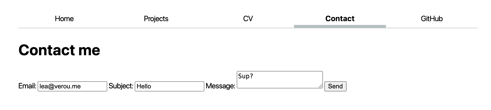
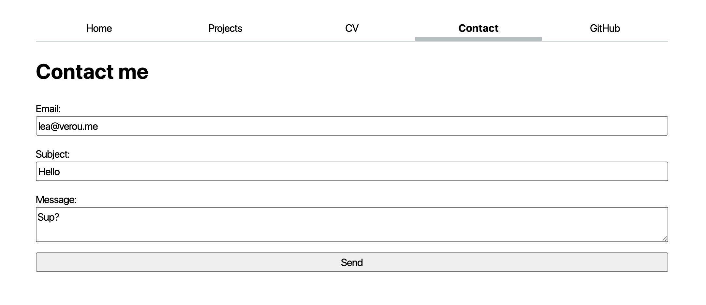

# Lab 2: Styling with CSS

{: .no_toc}

{: .summary}

> In this lab, we will learn:
>
> - What are the core concepts of CSS?
> - How can we use CSS selectors to target the elements we want to style?
> - What is the difference between absolute and relative units?
> - How to use CSS to customize deisgn aspects such as fonts, colors, or layout?
> - What happens when there are conflicting CSS declarations about the same element?

<details open markdown="block">
  <summary>
    Table of contents
  </summary>
  {: .text-delta }
- TOC
{:toc}
</details>

---

<script src="https://elements.colorjs.io/src/color-swatch/color-swatch.js" type="module"></script>

## Submission

{: .note }

Below is your lab submission checklist, please read carefully.

1. Submit a link to your github repo.
2. Submit maximum 2-minute video to Gradescope in `mp4` format. The video should include:
   1. Present your final webpage and show how it is customized to display information from your personal resume / CV.
   2. Show how your webpage resizes gracefully.
   3. Share the most interesting thing you learned from this lab.

**Videos longer than 2 minutes will be trimmed to 2 minutes before we grade, so
make sure your video is 2 minutes or less.**

## Prerequisites

This lab assumes you have already completed [Lab 1](../1/), as we will use this as a starting point.

{: .note }
You do not need to create a new repository for Lab 2, simply work on the same repository you created for Lab 1.

## [Slides](./slides/){:target="\_blank"}

Make sure to read the notes on each slide as well!

Playgrounds:

- [CSS box model](https://css.land/box-model/)
- [Specificity Battle](https://css.land/specificity/)

## Step 1: Prevent content from getting too wide

In lab 1, we created a simple homepage with minimal styling (only setting the font family, and line-height).

It looked a bit like this:


First, let’s stop the content from getting so wide, by applying a `max-width` to `<body>`.
Why not simply a `width`? So that the content continues to adapt to smaller viewport sizes.
We will specify that `max-width` in `em`, `rem`, or `ch` units, so that it scales with the font size.
Experiment with the browser dev tools (see below) to find a good value for `max-width`. I used `100ch`:

<figure class="multiple flex">


<figcaption>Invoking Developer Tools</figcaption>
</figure>


Now let’s center that content.
We can do that by using the special value `auto` for the left and right margin.
We can set both of these to the same value by using the `margin-inline` shorthand property.

This already looks better!


But try resizing your window to be smaller than that `max-width` we set.

Yikes! Our content is now touching the edges of the viewport, which makes it hard to read.
One way to fix that is to add some `padding` to the content.

<figure class="multiple flex">


<figcaption>Before and after</figcaption>
</figure>

{: .tip }

> What would be another way to solve it? We can specify a lower bound for our margin by using the `max()` function,
> but we need to specify the margin explicitly, not using the `auto` keyword:
>
> ```css
> margin-inline: max(1em, (100% - 100ch) / 2);
> ```

## Step 2: Styling the navigation bar

Our navigation bar looks more like a list than a navigation bar.
Let’s fix that!

### Step 2.1: Getting `<ul>` and `<li>` out of the way

If you have used a `<ul>` element within your `<nav>`, you can tell the browser to ignore that `<ul>` and its `<li>` children for stylng
by [applying](slides/#descendant-styling) `display: contents` to them both, which prevents them from having any styling of their own.

### Step 2.2: Using Flexbox to lay out the navigation

Now we don’t have weird list bullets, but our navigation is all scrunched up:


Flexbox to the rescue!

Before you proceed, wrap the menu item for the current page in a `<a>` as well, as that will simplify things.
Give it a `class="current"` attribute, which [will allow us to style it differently](slides/#ids).

Let’s apply `display: flex` to the `<nav>` to enable [Flexible box layout](https://developer.mozilla.org/en-US/docs/Web/CSS/CSS_flexible_box_layout/Basic_concepts_of_flexbox) ([Flexbox](https://developer.mozilla.org/en-US/docs/Learn/CSS/CSS_layout/Flexbox)).

You will not notice any immediate difference, but we can now use Flexbox to control the layout of the children of `<nav>`.

Apply `flex: 1` to each of the `<a>` elements (via a suitable CSS rule) to make them take up the same amount of space [^1].

[^1]: That is not _exactly_ what `flex` does. It specifies how any _remaining_ space is distributed, after elements have taken up their normal width. This means that you _could_ end up with elements of uneven width if there is little remaining space or one is much wider than the others.

Useful links for Flexbox:

- [MDN: Basic concepts of flexbox](https://developer.mozilla.org/en-US/docs/Web/CSS/CSS_flexible_box_layout/Basic_concepts_of_flexbox)
- [MDN: Flexbox tutorial](https://developer.mozilla.org/en-US/docs/Learn/CSS/CSS_layout/Flexbox)
- [CSS Tricks: A Complete Guide to Flexbox](https://css-tricks.com/snippets/css/a-guide-to-flexbox/)
- [Flexbox Froggy](https://flexboxfroggy.com/)
- [Flexbox Defense](http://www.flexboxdefense.com/)
- [Flexbox Zombies](https://flexboxzombies.com/)

### Step 2.3: Adding some style

This is starting to look like an actual navigation bar!

Now let’s give it some style.

- Remove the underline from the links by setting `text-decoration: none`.
- Remove the gory default link color by setting `color: inherit` to make links use the same text color as their parent element.
- Center the text in its box by setting `text-align: center`
- Let’s give each link some spacing by adding some `padding` (we recommend `0.5em`)
- Apply some `margin-bottom` to the whole `<nav>` to separate it from the content below.

Apply a bottom border to the `<nav>` to visually separate it from the content.
Give it a `border-bottom-width` of `1px`, a `border-bottom-style` of `solid`, and a `border-bottom-color` of <color-swatch><code>oklch(80% 3% 200)</code></color-swatch> (a cool gray).
You can also use the `border-bottom` shorthand property to specify all of these at once.
Feel free to play with these values, but we recommend keeping it subtle.

Now let’s style the current page link.
Give it a thick bottom border (we recomend a border width of `0.4em`), and either the same cool gray as the navigation bar border, or a lighter version.
To counter the increase in height that the border adds, apply a reduced `padding-bottom` to that link.


### Step 2.4: Accent color and hover styles

Define an accent color for your website, and store it in an `--color-accent` custom property.
Make this custom property available to the entire document by setting it on the `<html>` element (i.e. a selector of `html` or `:root`).
I used <color-swatch><code>oklch(65% 50% 0)</code></color-swatch>, but feel free to play with the values and pick something you like!
Specify `accent-color: var(--color-accent)` on `<html>` or `<body>` so that all elements that use the accent color can inherit it.

Now let’s use this accent color to style hovered navigation links (`a:hover`).
Apply the same `border-bottom` as you did for the current page link, but with `var(--color-accent)` as the color.

{: .tip }
Wanna go further? Apply `background-color: oklch(from var(--color-accent) 95% 5% h)` that is a light color with the same hue as our accent color!


## Step 3: Contact form layout

In the previous lab, we created a simple contact form.
It worked, but it was not very usable, since there is no [alignment](https://designftw.mit.edu/lectures/gd/#alignment),
nor clear [proximity](https://designftw.mit.edu/lectures/gd/#proximity) to distinguish what input fields the labels belong to:



Let’s use CSS to improve this.

### Step 3.1: Integrate typography

Inspect the form controls (`<input>`, `<textarea>`, `<button>`) and search for `font-family` in both the _Styles_ and _Computed_ tabs.
What do you observe?

All we need to make these use the same font as the rest of the page is `font: inherit`:


### Step 3.2: Top-down layout

The easiest way for that is to lay it out top-to-bottom, with each text field occuping the whole width of the form,
and its label is above it.

This is exactly what the optional [Contact form styling step](../1/#styling-contact-form) did in the previous lab.
The gist was:

1. Apply `display: block` to the form controls and labels to make them behave like block elements (such as `<p>`), i.e. insert line breaks before and after
2. Apply `width: 100%` to the form controls to make them take up the whole width of their container (in other elements `display: block` does this too, but form controls are special)
3. Apply `box-sizing: border-box` to the form controls to make their width of 100% include their padding and border
4. Apply `margin-block` to the labels to add spacing before and after them



### Step 3.3: Grid layout

Our form now looks much better, and it’s crystal clear which label belongs to which input field.
However, it is exceedingly wide and looks a bit weird.
The primitive layout method we used works, but is not very flexible.
How could we make it so that the labels are on the left, and the input fields are on the right, and they are all aligned?
_No, you do *not* use a `<table>` for that! Repeat after me: tables are for tabular data, not for layout!_

The answer is [CSS Grid](https://developer.mozilla.org/en-US/docs/Web/CSS/CSS_Grid_Layout/Basic_Concepts_of_Grid_Layout):
the crème de la crème of CSS layout methods.
It may take some time to fully grok, but it is _well worth it_.

The core idea of CSS Grid is that we define a grid container (the element with `display:grid`),
and then place its children in the grid (or descendants, through [subgrid](https://developer.mozilla.org/en-US/docs/Web/CSS/CSS_grid_layout/Subgrid) or `display: contents`).

First, remove the CSS you applied in the previous step, since we will not need it.
Everything starts by applying `display: grid` to the form.

Note that you immediately see a change in the layout: Once you enable grid layout, the grid container’s children are automatically placed on a grid with one column and as many rows as needed to fit all of them.
This is called the automatic grid placement algorithm, and it saves you a lot of time:
you only need to define the actual constraints, and the browser will take care of the rest.

E.g. in this case, all we need to define is columns, via `grid-template-columns: auto 1fr`.
`auto` means that the column will be as wide as its content, and `1fr` means that the column will take up the remaining space (similar to `flex: 1`).

If we preview our changes at this point, the result can be quite surprising, but inspecting the `<form>` element in the browser dev tools will reveal what is happening:


As often happens, the computer is doing exactly what we told it and not what we wanted 😀.
It is placing the child elements of `<form>` on the grid we defined, one by one, in the order they appear in the HTML.

But we wanted each `<label>` to occupy _two_ columns: one for its text, and one for the input field!
Fear not, for we can do this.

The quick and dirty way would be to apply `display: contents` to the `<label>` elements, so that stop creating boxes of their own, and their children are placed directly in the grid.
But the proper way to do it is to use [subgrid](https://developer.mozilla.org/en-US/docs/Web/CSS/CSS_grid_layout/Subgrid).
The core idea is that we make the labels grid containers themselves (`display: grid`), but their grid is a subset of the form grid (`grid-template-columns: subgrid`).
The last piece of the puzzle, is that we need to make the labels (and the submit button while we’re at it) to span a whole row.
We can use that by `grid-column: 1 / -1;` which means that the element will start at the first column and end at the last (-1) column.

At this point, your form should look about right.
The last remaining touch is to add `gap: 1em;` to the form to add some spacing between the form controls.


Useful links for Grid Layout:

- [MDN: Basic concepts of grid layout](https://developer.mozilla.org/en-US/docs/Web/CSS/CSS_Grid_Layout/Basic_Concepts_of_Grid_Layout)
- [MDN: Subgrid](https://developer.mozilla.org/en-US/docs/Web/CSS/CSS_grid_layout/Subgrid)
- [CSS Tricks: A Complete Guide to Grid](https://css-tricks.com/snippets/css/complete-guide-grid/)
- [Grid Garden](https://cssgridgarden.com/)

## Step 4: Style your projects page

Soon, you will be populating your projects page with your assignments from this class.
You can start by adding some dummy content and styling it.

### Step 4.1: Add some dummy content

We will use Emmet to generate some dummy content.

Copy the following abbreviation:

```
.projects>article*12>h2>lorem4^img[src="https://vis-society.github.io/labs/2/images/empty.svg"]+p>lorem
```

Paste it in your `projects/index.html` file under the `<h1>` element (i.e. _after_ its closing tag `</h1>`), and expand it with Emmet (delete and re-add the last character, then hit <kbd>Tab</kbd>).
If it all worked well, you should have 12 articles, each with a heading, an image, and a paragraph of lorem ipsum text.

<!-- TODO add screenshot -->
<!--
### Step 4.2: Stop images from getting too wide

Because the dummy image is an [SVG file](https://developer.mozilla.org/en-US/docs/Web/SVG) with no [intrinsic size](https://developer.mozilla.org/en-US/docs/Glossary/Intrinsic_Size),
it is stretching to fill the whole width of its container.
It’s generally a good practice to restrict images from getting too wide by applying `max-width: 100%` to them.
You don’t need to only apply this on images within `.projects`, you can apply it to all images. -->

### Step 4.2: Applying a responsive grid

We will use Grid Layout to lay out the projects in a grid, but with a twist: rather than a fixed number of columns, we will use a flexible number of columns that adapt to the width of the page.

1. First, apply `display: grid` to `.projects` to make it a grid container.
2. Then, use `repeat(auto-fill, minmax(15em, 1fr))` for `grid-template-columns` to make the grid have as many columns as can fit in the container, each with a minimum width of `15em` and a maximum width of `1fr` (i.e. the remaining space).

When you try it, resize your window to see the grid adapt to the width of the page!

<video src="videos/responsive-grid.mp4" autoplay loop muted></video>

### Step 4.3: Horizontal alignment with subgrid

The grid layout is looking good, but the content is not aligned.
Some headings take up two lines, and the images are not aligned across columns.

Use subgrid on the `<article>` elements to make their contents align across columns.
Tips:

- In this case, we will set `grid-template-rows` to `subgrid`, not `grid-template-columns`.
- We want to declare that each `<article>` should span 3 rows without having to specify the starting row.
  We can do that by using `grid-row: span 3;`.
- You will likely want to set `margin: 0` on the `<h2>` to avoid excessive spacing.
- You may want to set `gap: 1em` to space out the `<article>` elements nicely. You are free to play with this parameter a little more, see its effects [here](https://developer.mozilla.org/en-US/docs/Web/CSS/gap).

### Step 4.4: Finishing touches

Note that we don’t have a clear information hierarchy.
The default `<h1>` size is very close to the default `<h2>` size, violating the design principle of [contrast](https://designftw.mit.edu/lectures/gd/#contrast).
Make it significantly larger (e.g. `400%` the body text).
This is not specific to the projects page, but it’s the only one that currently has `<h2>` elements.

While we’re at it we can also add some good defaults for all headings (`h1, h2, h3, h4, h5, h6`), by applying `line-height: 1.1` (we typically want their leading to be smaller than body text) and `text-wrap: balance` to prevent uneven lines.

Tips:

- You may want to nest certain `CSS` style rules to apply separate effects on the same element tag. See examples [here](https://ishadeed.com/article/css-nesting/).

## Step 5: Style your CV

Now that you got your feet wet with CSS, experiment with it in a more freeform way by styling your CV/resume page!

{: .tip }
Always remember to commit and push your changes to GitHub after you make them and preview the published website as well!

## CSS resources

- [MDN: Learn to style HTML using CSS](https://developer.mozilla.org/en-US/docs/Learn/CSS)
- [Khan Academy: Intro to HTML/CSS](https://www.khanacademy.org/computing/computer-programming/html-css)
- [Code Academy: Learn CSS](https://www.codecademy.com/learn/learn-css)

### Videos

- [CSS in 20 Minutes](https://www.youtube.com/watch?v=1PnVor36_40)
- [4-hour HTML & CSS crash course](https://www.youtube.com/watch?v=vQWlgd7hV4A)

---
