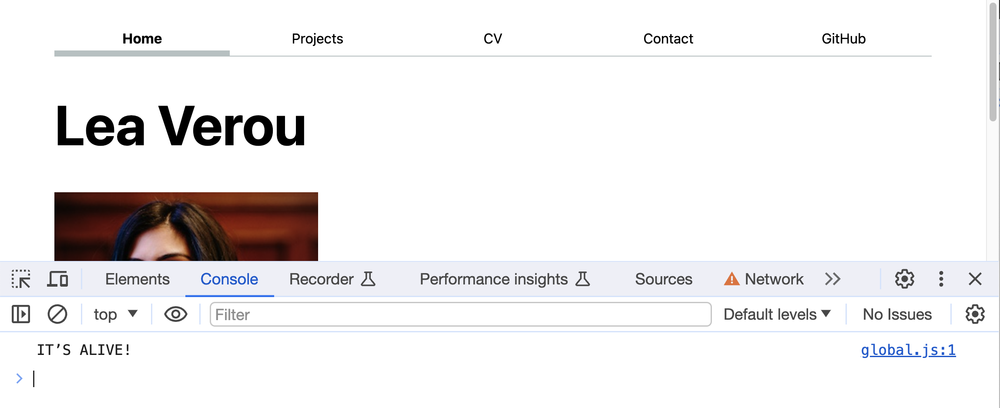

# Lab 3: Introduction to JS

{: .no_toc}

{: .summary}

> In this lab, we will learn:
>
> - What is JS and what is it good for?
> - Basic programming concepts and how they relate to JS
> - JS and JSON data values: primitives (numbers, strings, booleans, `null`, `undefined`), objects, arrays
> - How to use JS to get references to elements in the DOM and manipulate them on the fly
> - How to use JS to create new elements on the fly and add them to the DOM
> - How to run JS code as a response to user actions (Events)

<details open markdown="block">
  <summary>
    Table of contents
  </summary>
  {: .text-delta }
- TOC
{:toc}
</details>

---

## Submission

{: .note }

Below is your lab submission checklist, please read carefully.

1. Submit a link to your github repo (not the page).
2. Please record a 2 minute `mp4` format video with the following components:
   1. Present your final webpage.
   2. Show you interacting with your webpage from your javascript updates.
   3. Show you switching between dark mode, light mode, and automatic (light dark) mode, along with a page refresh.
   4. Share the most interesting thing you learned from this lab.

Please note that the video has to be in **mp4 format only.** There may be point deductions for other video formats.

**Videos longer than 2 minutes will be trimmed to 2 minutes before we grade, so
make sure your video is 2 minutes or less.**

## Prerequisites

This lab assumes you have already completed [Lab 1](../lab01/) and [Lab 2](../lab02/), as we will use the same website as a starting point.

<!-- * You should have completed the [additional steps in Lab 0 to set up a local server](../0/#installing-a-local-server). -->

{: .warning }
You will need to use a local server for this lab, as some features will not work
under the `file:` protocol (i.e. when opening the files directly in the browser).
If you are using Live Preview, we recommend you switch to [Live Server](../0/#installing-a-local-server)
as Live Preview seems to have issues with newer CSS features.

## [Slides](./slides/)

Make sure to read the notes on each slide as well!

Specific slides that may be useful while working on this lab:

- [Operator cheatsheet](./slides/#operators)
- [Element reference cheatsheet](./slides/#elements)
- [Element manipulation cheatsheet](./slides/#dom-manipulation)

## Step 1: Adding a JS file to all pages _(In class)_

For this lab, we will add a new file to our website: `global.js`.
It will go in your website root, next to `index.html` and `style.css`,
and should be linked from all pages (make sure to use `type="module"`).

Put the following code in `global.js`:

```javascript
console.log('IT’S ALIVE!');

function $$(selector, context = document) {
  return Array.from(context.querySelectorAll(selector));
}
```

Visit all your pages, open the dev tools console, and make sure you see the message printed there.



## Step 2: Automatic current page link

Remember how in [Lab 2](../2/) we added a class to the current page link?
Wasn’t it tedious to do that manually?
We will now use JS to automate this!

First, remove the manual `current` class from all your links.

### Step 2.1: Get an array of all nav links into a variable

We will use the `$$` function we defined earlier to get an array of all our nav links.
Remember that the CSS selector `nav a` will get all `<a>` elements inside a `<nav>` element, which is what we want.

Putting it together, `$$("nav a")` will get us an array of all our nav links, which we can assign to a variable, e.g. `navLinks`

### Step 2.2: Find the link to the current page

To find the link to the current page, we need three pieces of information:

- The [`array.find()`](https://developer.mozilla.org/en-US/docs/Web/JavaScript/Reference/Global_Objects/Array/find) method
  gives us the first array element that passes a test.
  For example, `[1, 2, 3, 4].find(n => n > 2)` will return `3` (try it in the console!).
- The [`location`](https://developer.mozilla.org/en-US/docs/Web/API/Location) object,
  which has information about the current page, such as `location.host` and `location.pathname`.
- When we get references to `<a>` elements, they also include these URL properties (`host`, `pathname`, etc.).
  Even if the link is relative, the values of these properties will be after it has been resolved to an absolute URL,
  using the URL of the current page as a base.
  The browser needs to resolve it to an absolute URL anyway to make it work, so exposing these properties is a convenience for us.

A link to the current page will have the same `host` and `pathname` as the current page.

Putting it together, we can get the link to the current page via:

```js
let currentLink = navLinks.find(
  (a) => a.host === location.host && a.pathname === location.pathname
);
```

### Step 2.3: Add the `current` class to the current page link

Now that we have a reference ot the current page link, we can add the `current` class to it
using [`element.classList.add(class1, class2, ...)`](https://developer.mozilla.org/en-US/docs/Web/API/Element/classList):

```javascript
currentLink.classList.add('current');
```

But what if no link to the current page was found?
In that case, `navLinks.find()` will return [`undefined`](https://developer.mozilla.org/en-US/docs/Web/JavaScript/Reference/Global_Objects/undefined)
and trying to access any property on `currentLink` will throw an error.

There are two ways to fix this problem:

The first way is to use a **conditional** to only add the class if `currentLink` is [truthy](https://developer.mozilla.org/en-US/docs/Glossary/Truthy):

```javascript
if (currentLink) {
  // or if (currentLink !== undefined)
  currentLink.classList.add('current');
}
```

This is more flexible, as we can run any amount of code inside the `if` block, and we could even add an `else` block to run code when no link is found, if needed.

However, if all we need is to prevent errors, we can use the [optional chaining operator](https://developer.mozilla.org/en-US/docs/Web/JavaScript/Reference/Operators/Optional_chaining),
i.e. `?.` instead of `.`:

```javascript
currentLink?.classList.add('current');
```

## Step 3: Automatic navigation menu

But why stop here? Wasn't it tedious to need to copy-pasta the navigation to all pages?
And imagine the horror of adding a new page to our site: we’d have to update every single page!

We can automate this too!

{: .warning }
Client-side JS is not the best way to handle site-wide templating,
but it’s good as a temporary fix, and as a learning exercise.

First, remove the navigation menu from all pages, since we’re going to be adding it with JS.
Also remove your code from Step 2 (or comment it out by selecting it and pressing Cmd/Ctrl + /),
since we’ll now be adding the `current` class at the same time as we add the links.

### Step 3.1: Adding the navigation menu

As we saw in the slides, there are many ways to design a data structure to hold the association of URLs (relative or absolute) and page titles.
Let’s go with an [array](#arrays) of [objects](slides/#objects) for now, but if you want to use a different one (and handle the code differences) you’re welcome to!

```javascript
let pages = [
  { url: '', title: 'Home' },
  { url: 'projects/', title: 'Projects' },
  // add the rest of your pages here
];
```

Then, create a new `<nav>` element (via [`document.createElement()`](https://developer.mozilla.org/en-US/docs/Web/API/Document/createElement))
and add it inside `<body>` at the beginning (via [`element.prepend()`](https://developer.mozilla.org/en-US/docs/Web/API/Element/prepend)).:

```javascript
let nav = document.createElement('nav');
document.body.prepend(nav);
```

Then we will use a [`for .. of`](https://developer.mozilla.org/en-US/docs/Web/JavaScript/Reference/Statements/for...of) loop
to iterate over the pages on our site and add `<a>` elements in the `<nav>` for each of them.
It will look like this:

```javascript
for (let p of pages) {
  let url = p.url;
  let title = p.title;
  // TODO create link and add it to nav
}
```

Then, to create each link and add it to the nav, you can use [`element.insertAdjacentHTML()`](https://developer.mozilla.org/en-US/docs/Web/API/Element/insertAdjacentHTML):

```js
// Create link and add it to nav
nav.insertAdjacentHTML('beforeend', `<a href="${url}">${title}</a>`);
```

Save and preview: you should now have a navigation menu on every page that is added automatically!

However, there is a bit of a wart. Try your menu on different pages.
Oh noes, the links only work properly on the home page!
That is because we had previously used different relative URls for different pages,
but now we are trying to use the same one across the entire website.

Let’s try to do with JS what we previously did manually (sensing a theme here?).
What we previously did was that for any page that was not the home page, we added `../` to the URL, right?
So what if we could detect if we’re not on the home page and add that `../` to the URL conditionally?

But how could we possibly detect if we’re on the home page in a way that works both locally and on our `github.io` site?
Sadly, there is no way (that will not bite us in the future) to tell entirely by looking at the URL.
We can however help the JS along by adding a class of `home` to the root element of our home page,
and then using JS to check if that class is present and storing it in a variable (well, actually a constant, since that is not likely to change):

```js
const ARE_WE_HOME = document.documentElement.classList.contains('home');
```

{: .tip }
The [`const`](https://developer.mozilla.org/en-US/docs/Web/JavaScript/Reference/Statements/const) keyword is similar to `let`,
but it makes the variable immutable, i.e. it cannot be reassigned.
Variables that should never change are called constants, and their names are UPPERCASE by convention.

Then, when creating the links, use a conditional to add a `../` to the URL if we’re not on the home page and the URL is not absolute.
We can use an [if statement](https://developer.mozilla.org/en-US/docs/Web/JavaScript/Reference/Statements/if...else) for that:

```js
if (!ARE_WE_HOME && !url.startsWith('http')) {
  url = '../' + url;
}
```

Alternatively, we can do it more concisely with a [ternary operator](https://developer.mozilla.org/en-US/docs/Web/JavaScript/Reference/Operators/Conditional_operator):

```js
url = !ARE_WE_HOME && !url.startsWith('http') ? '../' + url : url;
```

### Step 3.2: Highlighting the current page and opening external links in a new tab

Our automatically added navigation menu works, but is missing all the bells and whistles of our original one:

- The current page is not highlighted anymore
- The link to your GitHub profile does not have `target="_blank"` to make it open in a new tab.

How can we add those back?

Let’s switch to a different method of creating these links, that is more verbose, but gives us more flexibility.
Instead of appending HTML strings, we will create element objects in JS and set their attributes in JS, via properties (or [`setAttribute()`](https://developer.mozilla.org/en-US/docs/Web/API/Element/setAttribute) calls.

So, this line of JS:

```javascript
nav.insertAdjacentHTML('beforeend', `<a href="${url}">${title}</a>`);
```

now becomes four lines:

```javascript
let a = document.createElement('a');
a.href = url;
a.textContent = title;
nav.append(a);
```

Save and preview, and make sure nothing changed and that there are no errors.

We can now use a conditional to add the `current` class, in a similar way to how we added it in step 2.
We don’t need `array.find()` this time, because we are already iterating over the links to create them.
We can just add a conditional to check if the link is to the current page
using exactly the same check as [Step 2.2](#step-22-find-the-link-to-the-current-page) and add the class if so.

All we need is to compare `a.host` and `a.pathname` to `location.host` and `location.pathname`
and then use [`a.classList.add()`](https://developer.mozilla.org/en-US/docs/Web/API/Element/classList) to add the class.

```javascript
if (a.host === location.host && a.pathname === location.pathname) {
  a.classList.add('current');
}
```

{: .tip }
You can even use `a.className.toggle()` to do the checking and the class adding in one (very long) line!

```javascript
a.classList.toggle(
  'current',
  a.host === location.host && a.pathname === location.pathname
);
```

Similarly, we can add `target="_blank"` to external links (such as the GitHub link)
by setting `a.target = "_blank"` to those links for which `a.host` is not the same as `location.host`.

{: .tip }
Just like class names, you can either use conditionals or do the checking and the attribute setting in one step,
by using [`element.toggleAttribute()`](https://developer.mozilla.org/en-US/docs/Web/API/Element/toggleAttribute).

## Step 4: Dark mode!

Let’s add a dark mode switch to our site!

### Step 4.1 Automatic dark mode.

In this step we will write CSS that will automatically adapt to the OS color scheme and tweak our style so that everything looks good on dark mode.

CSS provides a [`color-scheme`](https://developer.mozilla.org/en-US/docs/Web/CSS/color-scheme) property
that can be used to switch between light and dark mode.

- `color-scheme: light dark` tells the browser that the site can be rendered on either light or dark mode,
  depending on what the OS color scheme is.
- `color-scheme: light` or `color-scheme: dark` forces a specific color scheme.

When `color-scheme` is `dark` (or `light dark` and the OS is in dark mode), you will notice several changes:
The default background color will be a very dark gray instead of white, and the default text color will be white instead of black.
We can actually access these special colors and use them in our CSS by using the `canvas` and `canvastext` _system colors_.

When applied to the root element (`<html>`) this property will already get your site very close to a proper dark mode.
Try it now! Add it to your stylesheet so that it’s applied on every page.


#### Adjusting the border color

<script type="module" src="https://colorjs.io/elements/color-swatch/color-swatch.js"></script>

While it doesn’t look too bad, in light mode we picked a border color that looked very subtle (<color-swatch><code>oklch(80% 3% 200)</code></color-swatch>)
but in contrast to the almost-black background, it looks very harsh.

This is because its lightness is fixed to 80%, which means it does not adapt to the color scheme.
One way to fix that would be to make it a semi-transparent version of a darker, slightly more vibrant color (e.g. <color-swatch><code>oklch(50% 10% 200)</code></color-swatch>)
with 40% opacity:

```css
border-bottom-color: oklch(50% 10% 200 / 40%);
```

Since we're using it in two places, you may want to define a CSS variable for it on `<nav>`:

```css
nav {
  --border-color: oklch(50% 10% 200 / 40%);
  /* ... other styles and nested rules ... */
}
```

and then use that instead:

```css
border-bottom-color: var(--border-color);
```

That should look about the same in light mode, and much better in dark mode.

<figure markdown="1">


<figcaption>
The menu border color before and after the change (animated gif).
</figcaption>
</figure>

#### Fixing the hover background color _(optional)_

If you did the optional hover background color in Lab 2, you may have noticed that it looks very bad in dark mode now.


That is because we defined that color with a fixed lightness (95%):

```css
background-color: oklch(from var(--color-accent) 95% 5% h);
```

Just like our border color, it was very subtle in light mode, but sticks out like a sore thumb in dark mode.
Worse, since the text color has changed, it is now illegible. Yikes!

We _could_ fix that too by setting its lightness to 50% and increasing its chroma, then adding transparency.
But here is another method.

We can make it a mix of the background color and the special `canvas` color:

```css
background-color: color-mix(in oklch, var(--color-accent), canvas 85%);
```

This should now look a lot better:

.

### Step 4.2: Adding HTML for the dark mode switch

We want our switch to have three states: Automatic (the default, adapts to the OS color scheme), Light, and Dark.
The heavy lifting is already done in the CSS, so all the switch needs to do is set the `color-scheme` property appropriately on the root element.

First we need to add the form controls for selecting the color scheme.
A good option is a `<select>` element (plus `<option>` elements inside it), which creates a dropdown menu.

<video src="videos/switcher.mp4"  style="object-fit: none;object-position: calc(100% - -50px) -50px;height: 180px;width: 100%;" loop autoplay muted></video>

Make sure to use a `<label>` around it. You can give the `<label>` a class (I used `color-scheme`) so you can style it in your CSS.

<details class="tip" markdown="1">
<summary>Why not radio buttons?</summary>

[Radio buttons](https://developer.mozilla.org/en-US/docs/Web/HTML/Element/input/radio) (in a `<fieldset>` element) would have also been perfectly acceptable, but are more work to handle with JS, so we went with a dropdown to simplify the code.
Also, from a usability perspective, while radio buttons can provide better efficiency for short lists of options, they also occupy a lot more screen real estate,
which is not really warranted for something used as infrequently as a theme switcher.

</details>

{: .note }
While [I think](https://vis-society-forum.csail.mit.edu/t/wrap-input-in-form/251/3?u=leaverou) nesting form controls inside the `<label>` produces cleaner code,
feel free to use the `for` attribute with an id if you prefer.
In that case, you’d need to wrap both of them with a `<div>` and give _that_ the `color-scheme` class.

Since this control doesn’t do anything without JS, you should create it with JS as well, similarly to what we did with the `<nav>` menu in step 3.
That way, you also don't have to add it manually on every single page.
You can use something like this to add it to the start of the `<body>` element:

```js
document.body.insertAdjacentHTML(
  'afterbegin',
  `
	<label class="color-scheme">
		Theme:
		<select>
			<!-- TODO add <option> elements here -->
		</select>
	</label>`
);
```

{: tip }
For the `value` attribute of your `<option>` elements, use the actual values each option should set the `color-scheme` property to (`light dark`, `light`, `dark`),
so that you don’t need to do any conversion in JS.

{: .tip }
You might wonder if it's possible to detect the OS color scheme and somehow use that in the dropdown (e.g. instead of showing "Automatic" we could show "Automatic (Dark)").
It is! You can do this via `matchMedia("(prefers-color-scheme: dark)").matches`.
In fact, this is a [media query](https://developer.mozilla.org/en-US/docs/Web/CSS/CSS_media_queries/Using_media_queries)
and specifically the [`prefers-color-scheme` media feature](https://developer.mozilla.org/en-US/docs/Web/CSS/@media/prefers-color-scheme).
You can use media queries in your CSS too!

### Step 4.3: Placing the switcher at the top right corner

Rather than laying out with the rest of the content, we want the switcher to always be at the top right corner.
We will do that via CSS [absolute positioning](https://developer.mozilla.org/en-US/docs/Learn/CSS/CSS_layout/Positioning).

1. First, we apply `position: absolute` to our switcher (the `<label>` element with the `color-scheme` class)
   Notice that this took the element out of the normal document flow, and it’s now on top of the content.
2. We specify offsets from the top and right edges of the document with `top` and `right` properties.
   I used `1rem` for both but you may want to use a different value (experiment with the dev tools and see what looks good to you).

You’d probably also want to make the font a little smaller (I used `80%`) to make it less prominent
and inherit the `font-family` from the parent,
otherwise the browser applies a different font to form controls
(you can just add `select` to your existing `input, textarea, button` rule about that from [Lab 2](../2/#step-31-integrate-typography))

<video src="videos/switcher.mp4" style="object-fit: none; object-position: top right;"></video>

### Step 4.4: Actually making it work

We now have all the UI in place, but nothing happens when we change the theme.
Here comes the fun part: making it work!

The first step is to attach an `input` event listener to our `<select>` element so we can run JS code when the user changes it.
To do that, we first need to get a reference to the `<select>` element via [`document.querySelector(selector)`](https://developer.mozilla.org/en-US/docs/Web/API/Document/querySelector)
and assign it to a variable (I called it `select`).

Then, we’d use the `addEventListener()` function to add a listener for the `input` event:

```javascript
select.addEventListener('input', function (event) {
  console.log('color scheme changed to', event.target.value);
});
```

Try it now: do you get the logged message in the console when you change the select element?

Okay, now we need to actually change the color scheme.
As we’ve seen earlier, we can get a reference to the root element with `document.documentElement`
and we can set arbitrary CSS properties on any element via `element.style.setProperty(property, value)`.
Putting these together, we can set the `color-scheme` property on the root element via:

```javascript
document.documentElement.style.setProperty('color-scheme', event.target.value);
```

{: .fyi }
[`element.style`](https://developer.mozilla.org/en-US/docs/Web/API/HTMLElement/style) is an object
that allows us to read and modify the inline style (i.e. the `style` attribute) of an element.

<video src="videos/switcher.mp4" loop autoplay muted></video>

### Step 4.5: Saving the user’s preference

Notice that if you refresh the page, the color scheme goes back to automatic.
How can we persist this across page loads?

We will use the [`localStorage`](https://developer.mozilla.org/en-US/docs/Web/API/Window/localStorage) object for this.
It’s a simple object (its keys can only contain strings), but anything you put in it will persist across page loads or even browser sessions.

There are two components to persisting the user’s preference:

1. Adding the user’s preference to `localStorage` when they change it.
   This is as simple as `localStorage.colorScheme = event.target.value` in our event listener.
2. Reading the user’s preference from `localStorage` when the page loads.
   For that, we need a conditional that would check if `localStorage` includes a `colorScheme` key (`"colorScheme" in localStorage`),
   and if it does, we’d set the color scheme to that value (just like any object, we can read that value via `localStorage.colorScheme`).
   Don’t forget to update the `<select>` element to match (by setting `select.value`), otherwise the user experience will be very confusing!

That should work! Try it now: change the color scheme, refresh the page, and see if it sticks.

<figure markdown="1">


<figcaption markdown="1">
Beyond trying out the functionality, there are two ways to verify that your data has been successfully saved in the browser’s local storage:
1. In the Application tab of the dev tools, under the Storage section, you can see the `localStorage` object and its contents.
2. In the Console tab, you can type `localStorage` and see its contents.
</figcaption>
</figure>

{: .tip }
To avoid repeating the code that sets the color scheme twice (once for the event listener and once on page load if the preference is saved),
you could define a `setColorScheme(colorScheme)` function that does that and call it in both places.

## Step 5: Better contact form _(Optional)_

You may have noticed that our contact form from Lab 1 did not have the best usability.
While it does open an email client and prefills our email address in the To field,
everything else is encoded with this weird format in the body of the email:


We _could_ actually make it work better, but it will need a little JS.

First, we'd start by _removing_ `enctype="text/plain"` and `method="POST"` (or changing it to [`method="GET"`](https://developer.mozilla.org/en-US/docs/Web/HTTP/Methods)).
An HTTP GET request [encodes all submitted information in the URL](https://developer.mozilla.org/en-US/docs/Learn/Common_questions/Web_mechanics/What_is_a_URL#parameters),
so our form basically helps us build (and visits) a URL like
`mailto:leaverou@mit.edu?subject=Hello&body=Sup?`.
Try pasting that URL in your browser, and notice how it opens _exactly_ the same window, you’d get by submitting your form!


Let’s also remove the "From:" field. Since this form opens a window in our mail client, and the email is sent from us anyway, it's redundant.

So far it looks like this is quite an improvement already.
Why didn’t we do it this way in Lab 1 then?
Because without JS, this has a fatal flaw.
Try writing a longer subject and/or message that includes spaces and submit the form again:


All our spaces have been replaced by `+` signs!

Why did this happen? When it comes to URLs, spaces are considered special characters and are not technically allowed.
There are two ways to encode them: as `+` or as `%20`.
The former is older and non-standard, but still widely used.
However, not all clients recognize it (e.g. our mail client doesn’t!)
whereas percent encoding (`%` plus a two-digit hexadecimal number, `20` for a space character) is [the standard way](https://www.rfc-editor.org/rfc/rfc3986#section-2.1) and is always recognized.

{: .note }
Don’t see any `+` signs? Some mail clients (e.g. Gmail) automatically decode the `+` signs to spaces.
However, you cannot have a form that only works in some mail clients and not others, so we need to fix this.

There is no way to fix this with HTML alone, which is why we did not use this method in Lab 1.
But now that we know JS, we have superpowers!
We will _intercept_ the form submission, and build the URL ourselves.

To recap, our goal is to build the same URL, but with proper escaping this time.
We don’t need to handle the escaping ourselves, that’s what the [`encodeURIComponent()`](https://developer.mozilla.org/en-US/docs/Web/JavaScript/Reference/Global_Objects/encodeURIComponent) function is for.

First, get a reference to the `<form>` element, and add a listener to it for the `submit` event.
Since this is code that runs on every page, and not every page has a form, to avoid errors
either use a conditional to check that the reference is non-empty, or use [optional chaining](https://developer.mozilla.org/en-US/docs/Web/JavaScript/Reference/Operators/Optional_chaining), i.e. `form?.addEventListener()` instead of `form.addEventListener()`.

In the event handler, call `preventDefault` on the event object to prevent the default form submission from happening.
Save and preview your work. Make sure that the form does not open your email client anymore.

Then, in the event handler, we create a new `FormData` object from the form (let’s call it `data`).

We can then iterate over submitted fields using a `for .. of` loop like this:

```javascript
for (let [name, value] of data) {
  // TODO build URL parameters here
  console.log(name, value);
}
```

Save your work and submit the form. What do you see in the console?
Now replace `value` with `encodeURIComponent(value)` and submit the form again. What changed?

We progressively build the URL by [concatenating](https://developer.mozilla.org/en-US/docs/Learn/JavaScript/First_steps/Strings#concatenation_using) `form.action`, `"?"` and names and encoded values (separated by `=`) for each field.

Once we have our final URL, we can open it via:

```javascript
location.href = url;
```

{: .fyi }
For any other URL, this would navigate to another page, but because this is a `mailto:` URL,
it will open our email client with the prefilled fields.


## JS resources

- [MDN: JavaScript Basics](https://developer.mozilla.org/en-US/docs/Learn/Getting_started_with_the_web/JavaScript_basics)
- [MDN: JavaScript First Steps](https://developer.mozilla.org/en-US/docs/Learn/JavaScript/First_steps)
- [MDN Tutorials on JS](https://developer.mozilla.org/en-US/docs/Web/JavaScript)
- [JS Garden](https://shamansir.github.io/JavaScript-Garden/) for JS quirks and gotchas
- [Learn JS Data](https://observablehq.com/@dakoop/learn-js-data), a series of Observable notebooks about the basics of manipulating data using JavaScript in the browser.

### Videos

- [JavaScript in 12 Minutes](https://www.youtube.com/watch?v=Ukg_U3CnJWI)
- [JS 1-Hour tutorial](https://www.youtube.com/watch?v=W6NZfCO5SIk)
- [A series of interactive JavaScript Tutorials](https://www.w3resource.com/course/javascript-course.html#/slide-instructions)
- [Udemy course](https://www.udemy.com/course/javascript-basics-for-beginners/)

### Books

- [Eloquent Javascript](http://eloquentjavascript.net/) by Marijn Haverbeke – free online book for programming beginners
- [JavaScript: The Good Parts](http://www.amazon.com/dp/0596517742) by Douglas Crockford (See also his YUI videos)
- [Learning JavaScript Design Patterns](http://addyosmani.com/resources/essentialjsdesignpatterns/book/) by Addy Osmani
