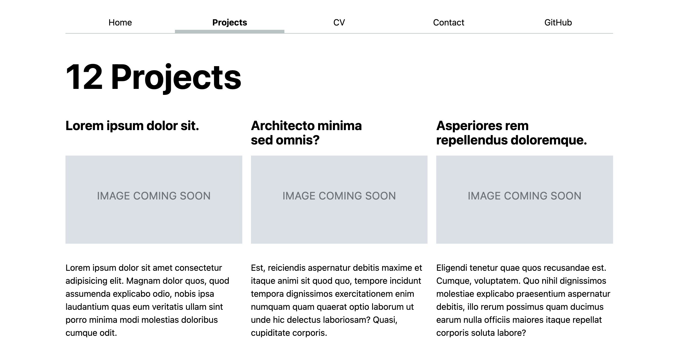

# Lab 4: JavaScript II

{: .no_toc}

{: .summary}

> In this lab, we will learn:
>
> - Modular JavaScript for organizing and maintaining complex projects.
> - Manipulating the DOM dynamically and using template literals for dynamic content
> - Fetching and displaying API data dynamically to improve user experience

<details open markdown="block">
  <summary>
    Table of contents
  </summary>
  {: .text-delta }
- TOC
{:toc}
</details>

---

## Submission

In your submission for the lab, along with the link to your github repo and website, please record a 2 minute video *as an mp4 file* with the following components:

1. Present your webpage.
2. Show you interacting with your webpage with ALL of your new javascript modifications.
3. Share the most interesting thing you learned from this lab.

**Videos longer than 2 minutes will cause point deduction, so
make sure your video is 2 minutes or less.**

## Prerequisites

- You should have completed all the steps in [Lab 0](../lab00/), i.e. that you have Node.js and npm installed. You will not need the local server from Lab 0, as SvelteKit will provide its own.
- This lab assumes you have already completed [Lab 1](../lab01/), [Lab 2](../lab02/), [Lab 3](../lab03/) as we will use the same website as a starting point.

## [Slides](./slides/)

## Step 1: Templating projects from a data file

In the previous labs, we were using a hardcoded blob of HTML to display our projects.
This is not ideal: if we want to change the HTML for our projects, we have to do it N times, where N is the number of projects we have.
Now, it is true that if we design our HTML well, we should be able to change its style without changing its structure, but there are many changes we may want to make that would require changing the structure of the HTML.
And even the most well written HTML is no help when we want to display the same data in multiple ways.
For example, what if we wanted to display our projects on the homepage as well?
Or provide a data file for others to use?
Or draw a visualization of them?
Maintaining our data together with its presentation tends to become painful, fast.

### Step 1.1: Creating a JSON file with our project data

We will use the browser console to _extract_ the data from our HTML to JSON so that if you have edited your HTML to contain your actual projects, you don’t lose your data.
The following code assumes you have used the same structure for your projects as what was given in the previous labs, where the list of projects was within a `<div class="projects>` and each project looked like this:

```html
<article>
  <h2>Project title</h2>
  
  <p>Project description</p>
</article>
```

Load your Projects page and open the dev tools console.
Paste the following code into it and hit Enter:

```js
$$('.projects > article').map((a) => ({
  title: $('h2', a).textContent,
  image: $('img', a).getAttribute('src'),
  description: $('p', a).textContent,
}));
```

Inspect the array returned by the code and make sure it looks like what you expect.


If you’re happy with it, right click on it and select "Copy object".


Create a new file in a new folder `lib/` called `projects.json` and paste the JSON there.

<details>
<summary>Having trouble?</summary>

If you’re having trouble with the above steps, you can use this <a href="download/projects.json" download><code>projects.json</code></a> file as a starting point.

</details>

### Step 1.2: Importing Project Data into the Projects Page

In this step, you’ll create a function in your `global.js` file to load project data from a JSON file and dynamically display it on the Projects page.

#### 1. Setting Up the Function
Start by defining an **asynchronous function** that will fetch your project data. Use the following snippet to get started:

```js
export async function fetchJSON(url) {
    try {
        // Fetch the JSON file from the given URL
        const response = await fetch(url);


    } catch (error) {
        console.error('Error fetching or parsing JSON data:', error);
    }
}

```

**What to Do:**
1. Copy this snippet into your `global.js` file.

#### 2. Handling Errors
Add a check to ensure the `fetch` request was successful. If it wasn’t, throw an error to handle invalid responses. Here’s the next piece:

```js
if (!response.ok) {
    throw new Error(`Failed to fetch projects: ${response.statusText}`);
}
```

**What to Do:**
1. Place this snippet inside the `try` block, **immediately after** the `fetch` function call.
2. Use `console.log(response)` to inspect the response object in your browser’s developer tools and confirm that it’s working correctly.

#### 3. Parsing the Data
Once you’ve verified the response is valid, parse it into a format you can work with. Here’s how to parse the response:

```js
const data = await response.json();
return data; 
```

**What to Do:**
1. Add this snippet after the `if (!response.ok)` check.

### Step 1.3: Setting Up the `projects.js` File

In this step, you'll create a `projects.js` file to dynamically fetch and render project data on your projects page. This file will utilize the `fetchJSON` and `renderProjects` functions you will create in Step 1.4 in `global.js`. 

#### 1. Creating the `projects.js` File

Navigate to your `projects` folder and create a new file named `projects.js`. Inside this file, you'll import the required functions and use them to fetch and display the projects on your projects page.

#### 2. Importing Functions

Add the following imports at the top of `projects.js`:

```js
import { fetchJSON, renderProjects } from '../global.js';
```

These functions are essential for fetching the project data and rendering it dynamically.

#### 3. Fetching Project Data

Use the `fetchJSON` function to load the project data from a JSON file. Add the following code:

```js
const projects = await fetchJSON('../lib/projects.json');
```

This code assumes your `projects.json` file is located in a `lib` folder relative to the current file.

#### 4. Selecting the Projects Container

Select the container where you want to render the project articles. Use the following snippet:

```js
const projectsContainer = document.querySelector('.projects');
```

Ensure your HTML includes a container with the class `projects`.

#### 5. Rendering the Projects

Call the `renderProjects` function to dynamically display the fetched projects:

```js
renderProjects(projects, projectsContainer, 'h2');
```

This code will render each project with an `<h2>` heading level.


**Check Your Understanding:**

- Identify a URL pointing to your `projects.json` file (ie: `../lib/projects.json`) and make sure the file exists in your project structure.
- What happens if the `projects.json` file is missing or incorrectly formatted?
- How does the `renderProjects` function handle an empty array of projects? Can you enhance it to display a placeholder message in this case?


### Step 1.4: Creating a `renderProjects` Function

You’ll build a `renderProjects` function to dynamically generate and display project content. This function will allow you to reuse project rendering logic anywhere on your site.

#### 1. Defining the Basic Function

Start by creating a function that accepts two parameters: the `project` object and the `containerElement` where the project will be displayed.

```js
export function renderProjects(project, containerElement) {
    // Your code will go here
}
```

**What to Do:**
1. Add this snippet to your `global.js` file.
2. Think about why you need these two parameters.

**Challenge:**
- What type of data should the `project` parameter contain?
- How would you test if the `containerElement` is valid?

#### 2. Clearing Existing Content

To dynamically render project details, you'll create and populate an `<article>` element for each project. Before adding new project articles, ensure the container is empty to avoid duplication.

```js
containerElement.innerHTML = '';
```

**What to Do:**
1. Add this line at the start of your function to clear the existing content of the container element.

**Think About It:**
- Why is it important to clear the container before adding new elements?
- What would happen if you skipped this step?

#### 3. Creating an `<article>` Element

For each project, create a new `<article>` element to hold its details.

```js
const article = document.createElement('article');
```

**What to Do:**
1. Add this line inside the loop to create a new `<article>` for each project.
2. Ensure you use `createElement` to generate the element dynamically.

**Think About It:**
- Why do we use `createElement` instead of directly appending HTML?
- How does using `createElement` make your code more secure or modular?

#### 4. Defining the Content Dynamically

Use the `innerHTML` property to populate the `<article>` element with dynamic content.

```js
article.innerHTML = `
    <h3>${project.title}</h3>
    
    <p>${project.description}</p>
`;
```

**What to Do:**
1. Add this block after creating the `<article>` element.

**Think About It:**
- What happens if one of the properties, like `project.image`, is missing?
- How can you handle missing or invalid data gracefully?

#### 5. Appending the Article

Finally, append the `<article>` element to the provided `containerElement`.

```js
containerElement.appendChild(article);
```

**What to Do:**
1. Add this line after defining the `<article>` content.
2. Ensure `containerElement` is a valid DOM element in your tests.

**Check Your Understanding:**
- What happens if `containerElement` is null?
- How can you make the function robust against missing or incorrect parameters?

#### 6. Adding Functionality

Now that the basic function is ready, let’s enhance it to allow dynamic heading levels. This makes the function reusable for different contexts.

```js
export function renderProjects(project, containerElement, headingLevel = 'h2') {
    // write javascript that will allow dynamic heading levels based on previous function
}
```

**What to Do:**
1. Replace your existing function with this new parameter.
2. Open the browser console to ensure `data` contains the data from your JSON file.
3. Test it by calling the function with different `headingLevel` values.


**Challenge:**
- What happens if you pass an invalid `headingLevel` (e.g., a non-heading tag)?
- How can you validate the `headingLevel` parameter?


### Step 1.5: Templating our project data

First, delete or comment out all your `<article>` elements inside the `<div class="projects">`.
Then, you must **import** your new javascript functions from your `script` element like so:

```html
    <script src="../global.js" type="module"></script>
    <script src="projects.js" type="module"></script>
```

If you view your website at this point, you should see your projects displayed in the same way as before but imported from your json file.
Try making an edit to your JSON file and see if it reflects on your website.

### Step 1.6: Counting projects

A big bonus of this approach is that we can use code to compute things from the data,
and have it update automatically when the data changes.
Try it yourself: add a count of projects at the top of the page by using a JavaScript method to select the element with the class `projects-title` from the DOM and integrate the `projects-title` class in the `<h1>` tag of your html file. 



## Step 2: Displaying the First 3 Projects on the Home Page Using JavaScript

We will now display the first 3 projects on the home page. We could do this by copying the project template from the Projects page and pasting it into the home page. However, this means that if we want to change it (e.g., add a date), we’d need to update it in two places.

That’s precisely what reusable functions in JavaScript are for!

Reusable JavaScript functions encapsulate logic for an independent piece of UI and can be reused across your app. 

### Step 2.1: Creating `index.js` to Render Latest Projects

In this step, you’ll create a new `index.js` file to dynamically fetch and display the latest projects on the home page. This file will utilize our reusable `fetchJSON` and `renderProjects` functions you’ve already created.

#### 1. Setting Up the `index.js` File

Navigate to the root folder of your project and create a new file named `index.js`. This file will handle fetching project data and rendering the latest projects on the home page.

#### 2. Import Required Functions

At the top of the file, import the `fetchJSON` and `renderProjects` functions from your `global.js` file:

```js
import { fetchJSON, renderProjects, fetchGithubData } from './global.js';
```

#### 3. Fetch and Filter Projects

Use the `fetchJSON` function to load all project data, then filter the first three projects for display:

```js
const projects = await fetchJSON('./lib/projects.json');
const latestProjects = projects.slice(0, 3);
```

This code assumes your `projects.json` file is located in a `lib` folder relative to the `index.js` file.

#### 4. Select the Projects Container

Identify the container where the latest projects will be displayed. Use the following code:

```js
const projectsContainer = document.querySelector('.projects');
```

Ensure your HTML includes a container with the class `projects`:

```html
<div class="projects"></div>
```

#### 5. Render the Latest Projects

Use the `renderProjects` function to dynamically display the filtered projects:

```js
renderProjects(latestProjects, projectsContainer, 'h2');
```

### Step 2.2: Add the Script to Your HTML

To load and execute this script, add a `<script>` tag to your `index.html` file. This tag will load a JavaScript module when the page is loaded.:

```html
<script src="index.js" type="module" defer></script>
```

**Think About It:**
- Why do we need the `type="module"` attribute?

#### 6. Adding the HTML Container for Projects

Before your script can dynamically display the projects, you need to provide a placeholder container in your `index.html` file. This container will hold the dynamically added project content.

```html
<h2>Latest Projects</h2>
<div class="projects">
    <!-- Dynamically added content will appear here -->
</div>
```

**What to Do:**
1. Add this snippet to your `index.html` file
2. Ensure the `div` element has the class `projects`, as this matches the container selected in your script.

**Think About It:**
- Why do we include `projects` as classes?
- What happens if this container is missing or the classes don’t match?

Check out the home page of your website to see if everything looks right!

## Step 3: Loading data from an API

So far we have been loading data from a static JSON file in our own repository.
But what fun is that?

Let’s load data from another website and display it in our app!
We will use GitHub’s [API](https://en.wikipedia.org/wiki/Web_API) to read stats about our GitHub profile and display them in our homepage.

### Step 3.0: Follow some of your classmates!

If you’re new to GitHub, you may not have followers yet.
Since we will be printing out your number of followers from the GitHub API in this step, it will be more rewarding the more followers you have.
Plus, you get to explore how quickly the API updates with new data!

Ask the people next to you, behind you, and in front of you for their GitHub usernames,
and follow them.
Then ask them to follow you back.
When you leave the lab, you should all have at least three followers and three following.

### Step 3.1: Viewing the data in our browser

GitHub is one of the few APIs left that provides public data without requiring us to authenticate.
We can use the [`/users/username`](https://docs.github.com/en/rest/users/users?apiVersion=2022-11-28#get-a-user) [_API endpoint_](https://blog.hubspot.com/website/api-endpoint) to get public data about a user.
Visit `https://api.github.com/users/your-username` in your browser, replacing `your-username` with your GitHub username.
For example, here is mine: [`https://api.github.com/users/giorgianicolaou`](https://api.github.com/users/giorgianicolaou).

You should see something like this in your browser:


### Step 3.2: Fetching the data with Javascript

To make an arbitrary HTTP request in JS, we can use the [`fetch()`](https://developer.mozilla.org/en-US/docs/Web/API/fetch) function. In this step, you’ll use JavaScript to fetch data from GitHub’s API and display it dynamically on the page.

#### 1. Writing an Asynchronous Function

You’ll need an asynchronous function to fetch data from the GitHub API. Start by defining a function that takes a username as an argument.

```js
export async function fetchGitHubData(username) {
  // return statement here
}
```

**What to Do:**
1. Create this function in your `global.js` file.

#### 2. Fetching the Data

Inside the function, use the `fetchJSON` method to request data from the GitHub API. The API URL should include the `username` parameter.

```js
return fetchJSON(`https://api.github.com/users/${username}`);
```

**What to Do:**
1. Place this line inside your function.

**Check Your Understanding:** 
- What does `fetchJSON` do?

### Step 3: Parsing the Response in `index.js`

Once you’ve fetched the data, parse the response as JSON to make it usable in JavaScript.

```js
const githubData = await fetchGitHubData('giorgianicolaou');
```

**What to Do:**
1. Add this line to your `index.js` file to call the `fetchGitHubData` function and retrieve the GitHub data for the specified user.

**Test Your Knowledge:**
- What type of object does `fetchGitHubData` return?
- Why do you use `await` with the function call?

### Step 4: Targeting the HTML Element in `index.js`

Identify the container in your HTML where the fetched data will be displayed. Use `document.querySelector` to select it.

```js
const profileStats = document.querySelector('#profile-stats');
```

**What to Do:**
1. Add this line to your `index.js` file to select the container element where the GitHub profile stats will be displayed.

### Step 5: Updating the HTML in `index.js`

If the container exists, dynamically update its content using the fetched data. Use template literals to populate the data fields in your HTML.

```js
if (profileStats) {
  profileStats.innerHTML = `
        <dl>
          <dt>Public Repos:</dt><dd>${githubData.public_repos}</dd>
          <dt>Public Gists:</dt><dd>${githubData.public_gists}</dd>
          <dt>Followers:</dt><dd>${githubData.followers}</dd>
          <dt>Following:</dt><dd>${githubData.following}</dd>
        </dl>
    `;
}
```

**What to Do:**
1. Add this block inside `index.js`, after selecting the `profileStats` container and fetching the data.
2. Modify the placeholders (e.g., `${githubData.public_repos}`) to include any other fields you want to display from the `githubData` object.

**Test Your Knowledge:**
- Why do we check if `profileStats` exists before updating its `innerHTML`?
- What are the advantages of using template literals to build HTML content?
- What does the `<dl>` element represent in this context, and why is it used here?


{: .important }

> `fetch()` is an example of an [asynchronous function](https://developer.mozilla.org/en-US/docs/Learn/JavaScript/Asynchronous/Concepts).
> This means that it does not return the data directly, but rather a [Promise](https://developer.mozilla.org/en-US/docs/Web/JavaScript/Reference/Global_Objects/Promise) that will eventually resolve to the data.
> In fact, `fetch()` returns a `Promise` that resolves to a [`Response`](https://developer.mozilla.org/en-US/docs/Web/API/Response) object, which is a representation of the response to the request.
> To get meaningful data from a `Response` object, we need to call one of its methods, such as `json()`, which returns a `Promise` that resolves to the JSON representation of the response body.
> You do not need to understand promises deeply for the purposes of this lab,
> but if you want to learn more, you can read [MDN’s guide to promises](https://developer.mozilla.org/en-US/docs/Learn/JavaScript/Asynchronous/Promises).

 Add a `<div>` dropdown with an `id="profile-stats"` in your homepage HTML to display the fetched data with a header.

You can style it however you want! 


In case you want a similar style, the gist of it is:

- I applied a grid on the `<dl>` with four equal-sized columns (1fr each)
- I used grid-row to override the automatic grid placement and specify that every `<dt>` should be placed on the first row of the grid, and every `<dd>` on the second row

## Step 4: Update your project data

This is in preparation for the next lab.
Please update your project data (`/lib/projects.json`) with your assignments from the class and any other projects you can think of.
Make sure you have at least 12 projects, even if you need to leave some placeholder data in.
Also add a `"year"` field to each project with a number for the year you worked on it.
Example:

```js
{
  "title": "Lorem ipsum dolor sit.",
  "year": "2024",
  "image": "https://dsc106.com/labs/lab02/images/empty.svg",
  "description": "Lorem ipsum dolor sit amet consectetur adipisicing elit. Magnam dolor quos, quod assumenda explicabo odio, nobis ipsa laudantium quas eum veritatis ullam sint porro minima modi molestias doloribus cumque odit."
},
```

Make sure not all your projects have the same year, since in the next lab we’ll be drawing visualizations based on it, and it would be a pretty boring visualization if they all had the same one!

