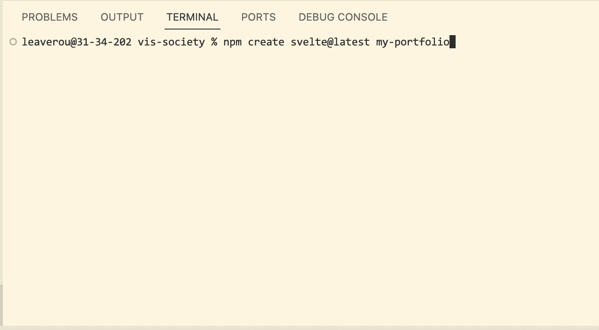
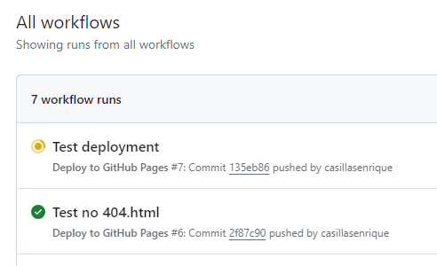
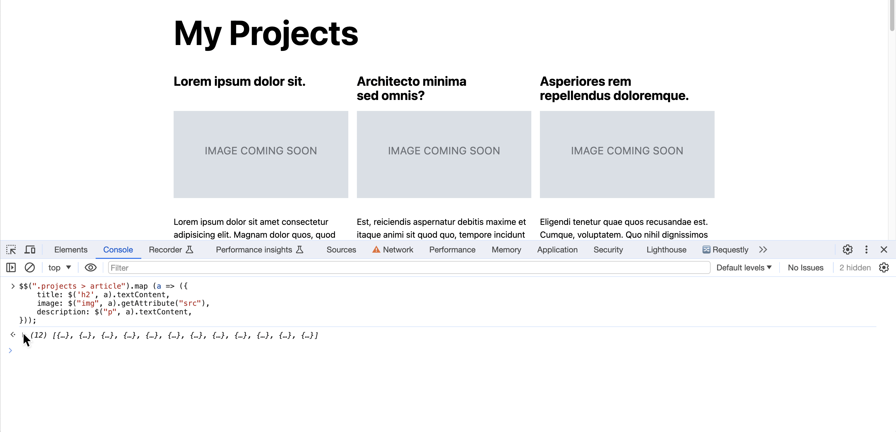
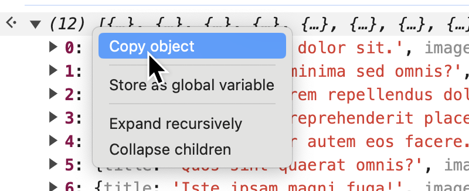

# Lab 4: Svelte (Templating & Control Flow)

{: .no_toc}

{: .summary}

> In this lab, we will learn:
>
> - What is npm?
> - What are JS frameworks and why are they useful?
> - What is Svelte and how does it compare to other frameworks?
> - First steps with Svelte: templating and control flow

<details open markdown="block">
  <summary>
    Table of contents
  </summary>
  {: .text-delta }
- TOC
{:toc}
</details>

---

## Check-off

To get checked off for the lab, please record a 2 minute video with the following components:

1. Present your webpage.
2. Show you interacting with your webpage from your svelte modifications.
3. Share the most interesting thing you learned from this lab.

**Videos longer than 2 minutes will be trimmed to 2 minutes before we grade, so
make sure your video is 2 minutes or less.**

## Prerequisites

- You should have completed all the steps in [Lab 0](../0/), i.e. that you have Node.js and npm installed. You will not need the local server from Lab 0, as SvelteKit will provide its own.
- This lab assumes you have already completed [Lab 1](../1/), [Lab 2](../2/), [Lab 3](../3/) as we will use the same website as a starting point.

## [Slides](./slides/)

Make sure to read the notes on each slide as well!

## What to Expect When You’re Svelting

Unlike the previous labs, this lab will not involve dramatic changes to the end-user experience of our website.
In terms of user-facing changes, we will only be adding a section of the 3 selected projects to the home page, and displaying a count of projects.

However, we will be completely re-architecting its internals to make it much easier to make changes and evolve it over time.

## Step 1: Setting up

### Step 1.1: Creating a new blank Svelte/SvelteKit project

In this lab, we will be creating a **new repository** for our website, and then gradually importing our existing website into it.
Decide on a name for your new repository (I called it `my-portfolio` below).

Open your website folder with VS Code.
Open the integrated terminal, and type `cd ..` to go to its parent folder.

Then run the following:

```bash
npm create svelte@latest my-portfolio
```

The `npm create` command creates a new project using a template.
Note that `my-portfolio` is the name of the new folder that will be created, so you may want to tweak it accordingly (just make sure to pick a different name than that of the folder containing your existing website!).
Use the keyboard arrow keys and Enter to answer the questions shown.
**Make sure you tick the "Svelte 5 preview" box**.



You should now have a new folder called `my-portfolio` that is right next to the folder containing your old website.

### Step 1.2: Creating a new repository for our new project

Using GitHub Desktop, select File → Add Local Repository… create a new repository for this folder.


GitHub Desktop will warn you that there is no repository in the folder and ask if you want to create one.
You should say yes.


Then, press "Publish repository" and publish it to GitHub.

### Step 1.3: Installing dependencies

Then open your new project in VS Code (Repository → Open in Visual Studio Code).

Open the VS Code terminal and run:

```bash
npm install && npm install -D svelte@next && npm install -D @sveltejs/adapter-static
```

This will install all the dependencies for your new Svelte project.
Be patient, it can take a while!

{: .fyi }

> What does this command do? Let’s break it down:
> `&&` separates different terminal commands, so this is actually three separate commands, each of which will be run in sequence:
>
> - `npm install` reads dependencies from `package.json` and installs the packages listed there.
> - `npm install -D svelte@next` will replace the Svelte version already installed with the latest pre-release version (which we need for modern CSS support).
> - `npm install -D @sveltejs/adapter-static` will install the static adapter for SvelteKit, which we will use to deploy our website to GitHub Pages.

Once `npm install` finishes, run:

```bash
npm run dev -- --open
```

This will start a local server on port `5173` and open `http://localhost:5173/` in your default browser.

You should see something like this:


{: .tip }
As a bonus, we don’t need to refresh the page to see changes anymore!
Vite (used by SvelteKit under the hood) implements _hot reloading_, i.e.
it will **automatically reload** the page when we save a file.
You could even arrange VS Code and the browser side by side and see your changes in real time!

## Step 2: Porting your previous website to Svelte

Now we will start porting the website we creted in Labs 1-3 to Svelte, piece by piece.

### Step 2.0: Moving your assets

First, copy your `images/` folder as well as `style.css` and `global.js` to `static/`.

### Step 2.1: Skeleton HTML

Open `src/app.html`. This contains skeleton HTML for every page on your website.
Notice some expressions in `%...%`. These are special variables that Svelte will replace with the actual content of your pages at build time. Do not remove them!

Edit the `<head>` in `src/app.html` to add:

- A default `<title>`
- Your existing CSS via `<link rel="stylesheet" href="%sveltekit.assets%/style.css" />`
- Your existing JS via `<script src="%sveltekit.assets%/global.js" type="module"></script>`

### Step 2.2: Porting your pages to routes

[_"Routing"_](https://kit.svelte.dev/docs/routing) is the process of determining what content to display based on the URL.
To do that, SvelteKit uses a `routes` directory, with `+page.svelte` files for each page.
These are actually components, so everything you know about component syntax applies to them.
However their special name tells SvelteKit that they are meant to be used as pages.

Open the `routes` directory.
You will see a single file called `+page.svelte`.
This is your home page.
Replace its contents with the contents of your homepage from your old site, i.e. the contents of the `<body>` element in your root `index.html`.

View your website and verify this worked, then do the same for your other pages:

- `projects/index.html` → `routes/projects/+page.svelte`
- `cv/index.html` → `routes/cv/+page.svelte`
- `contact/index.html` → `routes/contact/+page.svelte`

Again, for each of them _only copy the HTML between `<body>`...`</body>`_.

View your website. It should largely look the same as before, but it is now a SvelteKit app!

### Step 2.3: Adding titles

Notice that while our website looks largely the same, the title displayed on the browser tab is the default for every page.

Svelte allows us to provide elements in a [`<svelte:head>`](https://svelte.dev/docs/special-elements#svelte-head) element that will be used to insert elements into the `<head>` of the page at build time.

For example in the Contact page it could look like this:

```html
<svelte:head>
  <title>Contact me</title>
</svelte:head>
```

Add titles to your all your pages this way.

### Step 2.4: Adjusting navigation bar URLs

Note that our links Just Work™ without us having to handle the home page in any special way.
Why is that? This has to do with how Svelte’s server works: it does not let us add `/` at the end of URLs (note that if you try to go to e.g. `http://localhost:5173/projects/` you will be redirected to `http://localhost:5173/projects`) so every relative URL is interpreted as relative to the same folder.

{: .fyi }
The browser doesn’t know anything about your directory structure,
so it doesn’t know that `projects/` is a directory.
It figures out what is a file and what is a directory entirely from the URL.
So when you visit something like `https://username.github.io/portfolio/projects`, it will just treat `projects` as a file in the same directory — a file with no extension.
This means that if we did want to add subpages (e.g. `projects/viz/`), we would have to do some work to handle this,
but let’s cross that bridge when we get to it.

To ensure the correct link is marked as `.current`, you should delete the trailing slash at the end of your relative URLs in `global.js`.

You should also change the URL of the homepage to `.` or `./`, as it should not be empty:
an empty URL is interpreted as equal to the current page URL.

While you’re at it, you may as well delete the code that checks whether we are in the home page and adjusts URLs.

{: .caveat }
**Why does my `current` page class not update when I navigate to another page?**
Check out [Step 6: Creating a layout for UI shared across pages (Optional, but recommended)](#step-6-creating-a-layout-for-ui-shared-across-pages-optional-but-recommended) for an explanation.

## Step 3: Publishing our new website to GitHub Pages

Now that we have a website that functions like our old one, it’s a good time to publish it to the Web.

Deploying to GitHub Pages is a little more complicated than in the previous labs,
because we now have a build process.
As we edit our website, SvelteKit _generates_ a bunch of files from our source code and stores them in a `.svelte-kit` folder.
It is generally considered a bad practice to commit automatically generated files (_"build artifacts"_) to a repository,
as makes every edit correspond to several other edits we didn’t make, complicating and bloating the commit history.

Instead, we want to _ignore_ these files when committing to our repo (that’s why `.svelte-kit` is already in our [`.gitignore`](https://docs.github.com/en/get-started/getting-started-with-git/ignoring-files) file) and tell GitHub to _generate_ those files again on its side.

To run custom logic before our site is deployed, GitHub provides a feature called [GitHub Actions](https://docs.github.com/en/actions/deployment/about-deployments/deploying-with-github-actions), which we will use.

Before you proceed, commit and push your changes, then on github.com, enable GitHub Pages on your repo selecting "Github Actions" as the source (Repo settings → Pages → Source: GitHub Actions).


[SvelteKit has a detailed guide on how to deploy to GitHub Pages](https://kit.svelte.dev/docs/adapter-static#github-pages) which we will use.
Visit that page, and copy the code shown for the following files:

- [`.github/workflows/deploy.yml`](download/deploy.yml) (you will need to create a `.github` folder — note the dot — and a `workflows` folder inside it)
- [`svelte.config.js`](download/svelte.config.js) (this will replace the Svelte config file already in your project).

{: .tip }
You can also click on the file paths above to download the files, if that’s more convenient for you.

Commit and push these changes to your repo.

If all goes well, your app should be deployed to `YOUR_USERNAME.github.io/REPO_NAME`.
To see our GitHub Action in action (no pun intended 🙃), navigate to the "Actions" tab on your GitHub repo.
You'll be able to see both actions that are currently running, as well as past ones.



## Step 4: Templating projects from a data file

In the previous labs, we were using a hardcoded blob of HTML to display our projects.
This is not ideal: if we want to change the HTML for our projects, we have to do it N times, where N is the number of projects we have.
Now, it is true that if we design our HTML well, we should be able to change its style without changing its structure, but there are many changes we may want to make that would require changing the structure of the HTML.
And even the most well written HTML is no help when we want to display the same data in multiple ways.
For example, what if we wanted to display our projects on the homepage as well?
Or provide a data file for others to use?
Or draw a visualization of them?
Maintaining our data together with its presentation tends to become painful, fast.

### Step 4.1: Creating a JSON file with our project data

We will use the browser console to _extract_ the data from our HTML to JSON so that if you have edited your HTML to contain your actual projects, you don’t lose your data.
The following code assumes you have used the same structure for your projects as what was given in the previous labs, where the list of projects was within a `<div class="projects>` and each project looked like this:

```html
<article>
  <h2>Project title</h2>
  
  <p>Project description</p>
</article>
```

Load your Projects page and open the dev tools console.
Paste the following code into it and hit Enter:

```js
$$('.projects > article').map((a) => ({
  title: $('h2', a).textContent,
  image: $('img', a).getAttribute('src'),
  description: $('p', a).textContent,
}));
```

Inspect the array returned by the code and make sure it looks like what you expect.



If you’re happy with it, right click on it and select "Copy object".



Create a new file in `src/lib/` called `projects.json` and paste the JSON there.

<details>
<summary>Having trouble?</summary>

If you’re having trouble with the above steps, you can use this <a href="download/projects.json" download><code>projects.json</code></a> file as a starting point.

</details>

### Step 4.2: Importing our project data into our Projects page

Create a `<script>` element at the top of `src/routes/projects/+page.svelte` and import the JSON file:

```js
import projects from '$lib/projects.json';
```

{: .fyi }
No need for `type="module"`, Svelte processes these `<script>` elements in a special way anyway.

Print it out on the page to make sure everything worked by adding `<pre>{ JSON.stringify(projects, null, "\t") }</pre>` anywhere outside the `<script>` element, e.g. under our heading.
If it worked, you should see something like this:


Delete this debug code, and let’s use the data to display our projects in a more …presentable way.

### Step 4.3: Templating our project data

First, delete or comment out all your `<article>` elements inside the `<div class="projects">` element **except one**.

Then, add an [`{#each}` block](https://svelte.dev/docs/logic-blocks#each) block around it to iterate over the projects.

```html
{#each projects as p}
<article>
  <h2>Lorem ipsum dolor sit.</h2>
  
  <p>
    Lorem ipsum dolor sit amet consectetur adipisicing elit. Magnam dolor quos,
    quod assumenda explicabo odio, nobis ipsa laudantium quas eum veritatis
    ullam sint porro minima modi molestias doloribus cumque odit.
  </p>
</article>
{/each}
```

If you view your website at this point, you should see the same project repeated as many times as there are projects in your JSON file.


Now replace its title with `{p.title}`, its image’s `src` with `{p.image}`, and its description with `{p.description}` and view your website.

{: .note }
Note that we don’t need quotes to use an expression as an attribute value in Svelte,
i.e. we can do `src={p.image}`, we don’t need to do `src="{p.image}"`,
though the latter can be helpful for combining expressions with static text, e.g. `href="/{ p.url }"`.
Read [Svelte’s full docs on attributes and props](https://svelte.dev/docs/basic-markup#attributes-and-props) to learn more.

<!--
```html
{#each projects as p}
	<article>
		<h2>{ p.title }</h2>
		
		<p>{ p.description }</p>
	</article>
{/each}
```
-->

It should look the same as before, but now your projects are templated from a JSON file!
Try making an edit to your JSON file and see if it reflects on your website.

### Step 4.4: Counting projects

A big bonus of this approach is that we can use code to compute things from the data,
and have it update automatically when the data changes.
Try it: add a count of projects at the top of the page by adding `{ projects.length }` in the `<h1>` element.


<!--
### Step 5.4: Cleaning up the data

Notice that every project that doesn’t have its own image contains `"image": "https://vis-society.github.io/labs/2/images/empty.svg"`.
But that’s not really a project image, it’s a placeholder.
Conceptually, it should be part of the template.
Let’s do that.

First, remove all these `"image": "https://vis-society.github.io/labs/2/images/empty.svg"` from your JSON file.
You can do that by selecting one of them, pressing Cmd + Alt + F and doing a replace all with the replacement field blank.
To delete the whole line, you’d want to start the selection after the comma before it.

{: .warning }
Make sure this did not create any traiing commas, as that’s not valid in JSON.

Now in our template replace `{ p.image }` with `{p.image ?? "https://vis-society.github.io/labs/2/images/empty.svg"}`.
Or, to keep the template simple, you could define a constant in your `<script>` element:

```js
const PLACEHOLDER_IMAGE = "https://vis-society.github.io/labs/2/images/empty.svg";
```

And then use it in the template: `{p.image ?? PLACEHOLDER_IMAGE}`.
-->

## Step 5: Displaying the first 3 projects on the home page

We will now display the first 3 projects on the home page.
We _could_ do this by copying the project template from the Projects page and pasting it into the home page.
However, this means that if we want to change it (e.g. add a date), we’d need to change it in two places.

That’s _precisely_ what components are for!

Components encapsulate an independent piece of UI, and can be reused across your app.
Each component lives in a single `.svelte` file and consists of three parts:

1. Its HTML (placed directly inside the file).
   As we have seen, this is not plain HTML, but it has superpowers:
   it can contain expressions and logic.
2. Its JavaScript (placed inside a `<script>` element)
3. Its CSS (placed inside a `<style>` element).
   Any CSS you write here is transformed to _only_ apply to that component, even if you use very generic selectors.

{: .fyi }
The `+page.svelte` files you created in Step 2 are also components!

### Step 5.1: Creating a `<Project>` component

We will create a `<Project>` component that will take the project data as input
so that we can use it anywhere we want like this:

```jsx
<Project data={project} />
```

Start by copying the `<article>` element and its contents into a `Project.svelte` file in `src/lib`.

{: .fyi }
In larger projects, components are placed in a `lib/components` directory to distinguish them from other files in `lib`.
However, we’ll stick to a shallow directory structure for now to keep things simple.

Then add a `<script>` element with:

```js
export let data = {};
```

This defines what prop name other files use to pass data to our component and what the default value is (in this case an empty object).

We should now change all expressions in our template to use `data` instead of `p` (e.g. `{ p.title }` becomes `{ data.title }`).

{: .tip }

> If you want to make sure things work as quickly as possible, you could temporarily alias `data` to `p` via:
>
> ```js
> let p = data;
> ```
>
> This aliases `data` to an internal variable `p` so we don’t have to change anything in our template.
> However, you should eventually edit the expressions in your template, otherwise you’ll have trouble in the following labs.

### Step 5.2: Using the `<Project>` component

Now that we’ve created our component, let’s use it!

First, we’ll use it on the Projects page.
To make it available to the page, we need to import it in the `<script>` element at the top of the file:

```js
import Project from '$lib/Project.svelte';
```

Then, we can replace the `<article>` element and its contents with:

```jsx
<Project data={p} />
```

### Step 5.3: Using the `<Project>` component on the home page

Now that we’ve used the `Project` component on the Projects page, we can use it on the home page as well.

Copy the `<script>` element and its contents from the Projects page and paste it at the top of the home page, since we’ll need exactly the same imports: the project data and the `Project` component.

Then to display the first 3 items we can use an `{#each}...{/each}` block very similar to that of the Projects page, just using `projects.slice(0, 3)` instead of `projects`.

You should also add a heading of a suitable level (e.g. "Latest projects") and wrap the three projects in a `<div class="projects">` element so that they get the same styling (you may want to add another class too, e.g. `<div class="projects highlights">` to style them a little differently there).

{: .tip }
Want to display _selected projects_ rather than the first three?
You can use a new array like `[projects[0], projects[3], projects[7]]` instead.


### Step 5.4: Customizing heading levels

Notice that we used an `<h2>` element for the heading of our projects on the home page,
but we are also using `<h2>` for the title of each project.
This works well for the projects page, but not on the home page, where it completely breaks the information hierarchy.
What could we do?

One way to fix this is to add another _prop_ to the `Project` component that allows us to specify the heading level.
You can call it anything you want (I called it `hLevel`) but it’s important to give it a default value so that it only needs to be specified when it differs from the default.

Just like `data`, we specify a prop by using `export` in the `<script>` element, and setting its value to our desired default value:

```js
export let hLevel = 2;
```

Then, in the template, we can use an `{#if}...{:else}` block to conditionally render the heading level:

```html
{#if hLevel === 1}
<h1>{ data.title }</h1>
{:else if hLevel === 2}
<h2>{ data.title }</h2>
<!-- (and so on until 6) -->
{/if}
```

But wait! We can do better than that.

There is a special element, [`<svelte:element>`](https://svelte.dev/docs/special-elements#svelte-element) that is used _exactly_ when we want to specify the type of the element conditionally.

```jsx
<svelte:element this={'h' + hLevel}>{data.title}</svelte:element>
```

Lastly, we need to use the `hLevel` prop when we use the `Project` component on the home page:

```jsx
<Project data={p} hLevel=3 />
```

{: .note }
Note that we also need to adjust our CSS to account for `<h3>` elements there.


### Step 5.5: Moving Project-specific CSS to the Project component

The idea of _component-driven design_ is that any code that is specific to a component should live in that component.
There is code in our global CSS file that is specific to a project listing, so let’s move it there, inside a `<style>` element.

Svelte automatically rewrites this CSS to ensure it never applies to anything that is not part of the component,
so you can use simple selectors like `article` and not have to worry that you’ll be styling more elements than you intend.

## Step 6: Creating a layout for UI shared across pages _(Optional but recommended)_

Note that we are still using our code from Lab 3 to display the navigation bar.
Not only would it be easier to manage this code in Svelte,
it would also fix a pretty annoying bug: **when you navigate to a different page, the navigation bar does not update to reflect the current page**.
This is because behind the scenes, Svelte is actually using JS to update the content when you navigate to another page, so the code that updates the current page link is not being run.

{: .fyi }
If for some reason we wanted to keep the code that adds the navigation menu in `global.js`,
there _are_ ways to fix this bug that don’t involve porting it to Svelte.
You can use the [`navigatesuccess`](https://developer.mozilla.org/en-US/docs/Web/API/Navigation/navigatesuccess_event) event in your `global.js` to respond to navigation events and re-run the code that marks a certain link as `current`.

There are two ways to do this
We _could_ create a `Navbar` component and import it and use it in every page.
However, that would be quite tedious.

There is actually a concept we have not yet covered called a [_layout component_](https://kit.svelte.dev/docs/routing#layout) or "layout" for short.
**A layout is a component that wraps every page with the same content**,
so it’s very useful for things like headers, navigation bars, and footers.
Svelte distinguishes layouts from other components by their file name, which is `+layout.svelte`.

{: .fyi }
In fact, a larger website typically has multiple different layouts,
many of which build on others.
E.g. you could have a main layout for the whole website, and then a layout for blog posts.

{: .note }
But don’t we already have `app.html` for that? Note that `app.html` is not a component,
so it does not provide any of the conveniences of components (expressions, scoping, etc.).

### Step 6.1: Creating a layout component

Create a new file called `+layout.svelte` in the `src/routes` directory.
Put `YOLO <slot />` as its only content and save.

{: .fyi }
`<slot />` is a special element that is replaced with the contents of a component.
In the case of a layout component, the contents are the page contents.

Visit your website. Do you see the text "YOLO" at the top of every page? If so, great, the layout works!
Now let’s do something more useful with it.

### Step 6.2: Adding a navigation bar to the layout

Now that we’ve made sure we hooked everything up correctly. let’s start porting our navigation menu.
In your `+layout.svelte` file, add a `<script>` element and define a variable with your pages.
We’ll use the same array of objects:

```js
let pages = [
  { url: './', title: 'Home' },
  { url: './projects', title: 'Projects' },
  // add the rest of your pages here
];
```

Then add a `<nav>` element with an [`{#each}` block](https://svelte.dev/docs/logic-blocks#each) inside it to iterate over the pages and create links for each:

```html
<nav>
  {#each pages as p }
  <!-- Link here, using {p.url} for the URL and {p.title} for the title -->
  {/each}
</nav>
```

<!--
If it works you should see something like this:

 -->

Save and preview. You should now see your navigation bar in all its past glory.

### Step 6.3: Adding a class to the current page link

While our navigation menu looks the same at first, there is no different styling for the current page (déjà vu?).

Let’s add that!

First, we need to import the [`$page` Svelte data store](https://learn.svelte.dev/tutorial/page-store), which contains information about the current page.
To access it, add this to the top of `+layout.svelte`:

```js
import { page } from '$app/stores';
```

{: .note }
Note that even though we use `$page` in expressions, we import it as `page` (without the `$`).
`$` usually indicates reactivity in Svelte, i.e. a value that when it changes, everything that references it updates to reflect the change.

Try it now: Add an expression anywhere in your `+layout.svelte` component to print out info about the current page as a [JSON](../3/slides/#json) object:

```jsx
{
  JSON.stringify($page);
}
```

It should look like this (make sure to remove it after you’re done):


Notice that we can compare `$page.route.id` with the `url` of each page to see if it’s the current page.
Because our `url` starts from `./` and `$page.route.id` starts from `/`, we need to add a `.` to the beginning of the `url` to compare them (`"." + $page.route.id === p.url`).

But where do we put that expression?
In our template, we can use the `class:class-name` syntax to add a class to an element if a condition is true:

```jsx
<a href={p.url} class:current={'.' + $page.route.id === p.url}>
  {p.title}
</a>
```

This will add the class `current` to the link iff the condition is true.

{: .fyi }

> We _could_ have simply used the `class` attribute, but the code would have been a little awkward:
>
> ```jsx
> <a href={p.url} class={'.' + $page.route.id === p.url ? 'current' : ''}>
>   {p.title}
> </a>
> ```

### Step 6.4: Adding `target="_blank"` to external links

Another thing that is missing in our new navigation is that external links don’t open in a new tab.
We can fix that by adding a `target="_blank"` attribute to links that start with `http` or `https`.

To remove the attribute if the link is _not_ external, we simply assign `null` to it:

```jsx
target={ p.url.startsWith("http") ? "_blank" : null }
```

### Step 6.5: Moving CSS specific to the Navigation bar to the layout component

Just like with the `<Project>` component, let’s move the CSS that only applies to the navigation menu to be within our layout component (by copying it in a `<style>` element).

### Step 6.6: Importing global CSS via the layout component _(Optional)_

Another benefit that the layout gives us is that we now import our global CSS via the layout, which means that you benefit from Svelteit’s _hot reloading_, i.e. the feature that updates your website when you save changes without you having to refresh anything.

To make use of that, we need to move our `style.css` from `static` to `src`.
Then, we remove the `<link>` element that points to it from `src/app.html`, since we’ll be importing it a different way.

Now, in the `<script>` element of your `routes/+layout.svelte` component, add:

```js
import '../style.css';
```

View your website and make sure everything works!

## Step 7: Creating a project list component _(Optional)_

Notice that there is some repetition in the way we display our projects on the home page and the Projects page.
We can create a `<Projects>` component for that and encapsulate the CSS that relates to project lists within the component.
Then we can use that component in both the home page and the Projects page.

This component would accept the list of projects as its own `data` prop,
and would need its own `hLevel` prop to pass down to `<Project>`.

## To be continued…

In the next lab, we will learn about Svelte’s reactivity and how to use it to create interactive components.
Among other things we will…

- Port the color scheme switcher code to Svelte and greatly simplify it in the process
- Load data from an API and display it on our website

## Resources

- [Svelte](https://svelte.dev/)
- [SvelteKit](https://kit.svelte.dev/)
