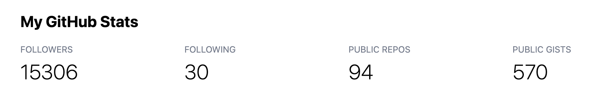

# Lab 5: Svelte II (Loading Data & Reactivity)

{: .no_toc}

{: .summary}

> In this lab, we will learn:
>
> - How to leverage Svelte’s reactivity to build interactive UIs
> - How to load data from an API and display it in a Svelte app

<details open markdown="block">
  <summary>
	Table of contents
  </summary>
  {: .text-delta }
- TOC
{:toc}
</details>

---

## Check-off

**You need to come to TA Office Hours to get checked off for this lab** (any of them, no appointment needed).
Please fill in [the check-off form at `labs/{{ page.lab }}/checkoff`](checkoff) _before_ your check-off.
Ideally you should fill in the form _right before_ your check-off, but it’s ok if you fill it out in advance.

{: .warning }
Filling out the form is a necessary but not sufficient condition to get checked-off.
**You still need to come to office hours in person for your check-off to be processed.**

You could even fill it out before you finish the lab, since we won’t look at it until your check-off,
but the closer to the end of the lab you fill it out, the more meaningful your feedback will be.

## <a href="https://docs.google.com/document/d/1zlYHtVmEarZktAGzYeBLtpWZy1r5Z2zBlFjaDNELEcc/edit?usp=sharing" target="_blank" rel="noopener noreferrer">Questions Doc</a>

Add questions to the questions doc throughout the lecture and lab! After lab,
come to [office hours](../../logistics/staff.html#office-hours) or ask on
[Discourse](https://vis-society-forum.csail.mit.edu/) for futher questions!

## [Slides](./slides/)

Make sure to read the notes on each slide as well!

## Step 0: Creating a layout for UI shared across pages

This was [optional in Lab 4](../4/#step-6-creating-a-layout-for-ui-shared-across-pages-optional-but-recommended), but we will need it for this lab. If you haven't done it yet, create a layout component that will be shared across all pages.

You can ignore steps 6.2 to 6.4 or do them at home, all we need for this lab is the layout component, i.e. up to step 6.1.

## Step 1: Port the theme switcher to Svelte

### Step 1.1: Porting the theme switcher HTML and CSS to our layout

Copy [the HTML that your JS was generating](../3/#step-42-adding-html-for-the-dark-mode-switch) for the theme switcher and paste it in your `+layout.svelte` component.
Delete or comment out (<kbd>Cmd</kbd> + <kbd>/</kbd>) the JS code that was generating that HTML.

Add a `<style>` element to your layout component if it doesn't already have one.
Then remove the CSS that styles the theme switcher from your `style.css` file and paste it there.

Refresh and make sure everything still works.

### Step 1.2: Bind color scheme to a variable

Add a `<script>` element to your layout component if it doesn't already have one, since we'll be writing some JS in this step.
Namely, we’ll add a variable to hold the color scheme.
Let’s call it `colorScheme`:

```js
let colorScheme = 'light dark';
```

The next step is to _bind_ the `colorScheme` variable to the value of the `<select>` element.

{: .note }
"Bind" in this context means that the value of the variable will be automatically updated when the value of the `<select>` changes, and vice versa.

To do this, we use a `bind:value` directive on the `<select>` element and set it to `{colorScheme}`.
The syntax for directives is very similar to attributes:

```jsx
<select bind:value={ colorScheme }>
```

This _binds_ the `value` property of the `<select>` element to our `colorScheme` variable.
In fact, it does what is called _double binding_: the value of the variable will be updated when the value of the `<select>` changes, and the value of the `<select>` will be updated when the value of the variable changes.

Ensure that it works by adding a `{colorScheme}` expression above the `<select>` (and remove it after).


### Step 1.3: Apply the color scheme to the `<html>` element

Now delete or comment out _all_ of the theme switcher code in your `global.js`.
It's time to move all of that logic to Svelte!

We have already seen how to use expressions in `{ ... }` to set attributes or element contents based on variables or expressions.
But here, we need to set a CSS property on the root element (`<html>`), which is not part of the Svelte component tree.
If you recall, the `<html>` element is part of the skeleton in `src/app.html`, which is not a Svelte component and thus, cannot take expressions.
What to do? Is it even possible?!

Fear not, of course it is!
In fact, there are multiple ways to do this.
You will find the one that seemed most straightforward and closest to our original code below,
but feel free to ask about the others!

If you recall, in our original code we were doing this:

```js
document.documentElement.style.setProperty('color-scheme', colorScheme);
```

Can't we just copy this line of code wholesale?
Unfortunately not.
There is a bit of a wart here: Our Svelte code is first ran in Node.js to generate the static parts of our HTML,
and the more dynamic parts make it to the browser.
However, `Node.js` has no `document` object, let alone a `document.documentElement` object.
Try it for yourself: add this to your `<script>` element:

```js
console.log(document);
```

You will likely see something like this in your terminal:


And an error in your browser:


Does this mean we cannot access all the objects we normally have access to in the browser?
Of course not; it just means we need to be a bit more careful about _how_ we access them.

All of these predefined objects are actually properties of the [_global object_](https://developer.mozilla.org/en-US/docs/Glossary/Global_object).
There are many ways to access this object explicitly:

- In the browser: `window`, `self`, `globalThis`
- In Node.js: `global`, `globalThis`

Note that the only name that works in every context is `globalThis`, so let’s use that.

{: .important }

> In JS, accessing undefined variables produces an error, as we just saw.
> However, accessing undefined _object properties_ on an object that exists does not produce an error; it just returns > `undefined`.
> Accessing properties on `undefined` or `null` will also produce an error.
> To sum up, if `obj` is an empty object (`{}`), and we have defined nothing else:
>
> - `foo` produces an error (`ReferenceError: foo is not defined`)
> - `obj.foo` does not produce an error, it just returns `undefined`
> - `obj.foo.bar` produces an error (`TypeError: Cannot read property 'bar' of undefined`)
>   When accessing properties of objects of …questionable existence,
>   we can use the [optional chaining operator](https://developer.mozilla.org/en-US/docs/Web/JavaScript/Reference/> Operators/Optional_chaining) `?.` instead of the dot operator to avoid errors.
>   To continue the example above, `obj.foo?.bar` will not produce an error, it will just return `undefined`.

Therefore, we can have a variable to hold the `<html>` element, by doing this:

```js
let root = globalThis?.document?.documentElement;
```

Now `root` will be `undefined` when Svelte runs in Node.js,
but it will contain the object that corresponds to the `<html>` element when it runs in the browser.
This means that we need to use the [optional chaining operator](https://developer.mozilla.org/en-US/docs/Web/JavaScript/Reference/Operators/Optional_chaining) `?` when accessing properties of `root` to avoid errors.

Therefore, to set the `color-scheme` CSS property, we need something like this:

```js
root?.style.setProperty('color-scheme', colorScheme);
```

Try it out: does it work?
You’ll notice that now changing the theme in the dropdown no longer changes the color scheme of the page.
Why is that?

There is one last bit to make this work.
The way we’ve written this, it will only be executed once, just like regular JS.
To tell Svelte to re-run this every time any of its dependencies change, we need to use a [reactive statement](https://svelte.dev/docs/svelte-components#script-3-$-marks-a-statement-as-reactive),
i.e. we need to prefix that line of code with `$:`.

```js
$: root?.style.setProperty('color-scheme', colorScheme);
```

If you try it again, the theme switcher should work!

### Step 1.4: Reading the color scheme from local storage

Notice that when you reload the page, the theme is reset to the default.
This is because we have not yet added any code to save the color scheme to local storage.

First, we’d need to _read_ from `localStorage` to get the saved color scheme, if any.

In a browser, any of the following would work, with decreasing levels of verbosity.

`if` statement:

```js
let colorScheme = 'light dark';

if (localStorage.colorScheme) {
  colorScheme = localStorage.colorScheme;
}
```

[Conditional operator](https://developer.mozilla.org/en-US/docs/Web/JavaScript/Reference/Operators/Conditional_operator):

```js
let colorScheme = localStorage.colorScheme
  ? localStorage.colorScheme
  : 'light dark';
```

[Nullish coalescing operator](https://developer.mozilla.org/en-US/docs/Web/JavaScript/Reference/Operators/Nullish_coalescing_operator):

```js
let colorScheme = localStorage.colorScheme ?? 'light dark';
```

However, if you try them in Svelte, you will get an error.
This is because, just like `document`, `localStorage` is a browser-specific variable
that is not defined in Node.js.

We _could_ use the same method as above, and access `localStorage` through the global object.
However, that would get quite messy, so we’ll use a different method.
We’ll specify a _local_ variable that is set to `localStorage` if it exists, and to an empty object if it doesn’t.
We can even call that local variable `localStorage`!

```js
let localStorage = globalThis.localStorage ?? {};
```

As long as we place this _before_ any attempt to access `localStorage`, we can now use `localStorage` as normal.

### Step 1.5: Saving the color scheme to local storage

Reading from `localStorage` is only half the battle.
We also need to save the color scheme to `localStorage` every time it changes.

Thankfully, that is pretty simple too.
Our first attempt may look something like this:

```js
localStorage.colorScheme = colorScheme;
```

However, just like Step 1.3, this will only be executed once.
To tell Svelte to make this a [reactive statement](https://svelte.dev/docs/svelte-components#script-3-$-marks-a-statement-as-reactive), we need to prefix that line of code with `$:`,
just like we did in Step 1.3.

### Step 1.6: Preventing FOUC _(Optional)_

You may have noticed that when you refresh the page, the theme changes after the page has loaded.
This is because the theme switcher is only rendered after the page has loaded, and the theme is only set after the theme switcher has been rendered.
This is called a [Flash of Unstyled Content (FOUC)](https://en.wikipedia.org/wiki/Flash_of_unstyled_content).

To prevent this, we can set the theme before the page has loaded.
We can do this by adding a `<script>` element to the `<head>` of `src/app.html` and setting the theme there.
This script will be executed before the rest of the page is loaded.

```html
<script>
  let root = document.documentElement;
  let colorScheme = localStorage.colorScheme ?? 'light dark';
  root.style.setProperty('color-scheme', colorScheme);
</script>
```

We could also add this code to your `global.js` — it will be executed a little later,
but still before the rest of the page is loaded.

## Step 2: Loading data from an API

So far we have been loading data from a static JSON file in our own repository.
But what fun is that?

Let’s load data from another website and display it in our app!
We will use GitHub’s [API](https://en.wikipedia.org/wiki/Web_API) to read stats about our GitHub profile and display them in our homepage.

### Step 2.0: Follow some of your classmates!

If you’re new to GitHub, you may not have followers yet.
Since we will be printing out your number of followers from the GitHub API in this step, it will be more rewarding the more followers you have.
Plus, you get to explore how quickly the API updates with new data!

Ask the people next to you, behind you, and in front of you for their GitHub usernames,
and follow them.
Then ask them to follow you back.
When you leave the lab, you should all have at least three followers and three following.

### Step 2.1: Viewing the data in our browser

GitHub is one of the few APIs left that provides public data without requiring us to authenticate.
We can use the [`/users/username`](https://docs.github.com/en/rest/users/users?apiVersion=2022-11-28#get-a-user) [_API endpoint_](https://blog.hubspot.com/website/api-endpoint) to get public data about a user.
Visit `https://api.github.com/users/your-username` in your browser, replacing `your-username` with your GitHub username.
For example, here is mine: [`https://api.github.com/users/leaverou`](https://api.github.com/users/leaverou).

You should see something like this in your browser:


### Step 2.2: Fetching the data in Svelte

To make an arbitrary HTTP request in JS, we can use the [`fetch()`](https://developer.mozilla.org/en-US/docs/Web/API/fetch) function.

```js
let profileData = fetch('https://api.github.com/users/your-username');
```

{: .important }

> `fetch()` is an example of an [asynchronous function](https://developer.mozilla.org/en-US/docs/Learn/JavaScript/Asynchronous/Concepts).
> This means that it does not return the data directly, but rather a [Promise](https://developer.mozilla.org/en-US/docs/Web/JavaScript/Reference/Global_Objects/Promise) that will eventually resolve to the data.
> In fact, `fetch()` returns a `Promise` that resolves to a [`Response`](https://developer.mozilla.org/en-US/docs/Web/API/Response) object, which is a representation of the response to the request.
> To get meaningful data from a `Response` object, we need to call one of its methods, such as `json()`, which returns a `Promise` that resolves to the JSON representation of the response body.
>
> You do not need to understand promises deeply for the purposes of this lab,
> but if you want to learn more, you can read [MDN’s guide to promises](https://developer.mozilla.org/en-US/docs/Learn/JavaScript/Asynchronous/Promises).

Svelte has a special syntax for working with [promises](https://developer.mozilla.org/en-US/docs/Learn/JavaScript/Asynchronous/Promises) in the template: the [`{#await}`](https://svelte.dev/docs#await) block.
It allows us to show different content based on the state of the promise.

The syntax is as follows:

```html
{#await promise} Loading... {:then data} The data is {data} {:catch error}
Something went wrong: {error.message} {/await}
```

To read data from `fetch()` we actually need _two_ nested `{#await}` blocks: one for the response, and one for the data.
It looks like this:

```html
{#await fetch("https://api.github.com/users/leaverou") }
<p>Loading...</p>
{:then response} {#await response.json()}
<p>Decoding...</p>
{:then data}
<p>The data is { JSON.stringify(data) }</p>
{:catch error}
<p class="error">Something went wrong: {error.message}</p>
{/await} {:catch error}
<p class="error">Something went wrong: {error.message}</p>
{/await}
```

Try pasting this in your `src/routes/+page.svelte` component (replacing `leaverou` with your username) and see what happens.

It would look something like this:


{: .tip }
You may get a warning about not calling `fetch()` eagerly during server-side rendering.
The “proper way” to load data for your pages is via a [`+page.js` file](https://kit.svelte.dev/docs/load).
You may want to experiment with this if you have time, but for now, you can ignore the warning.

### Step 2.3: Displaying the data in a more useful way

Ok, now that we’ve made sure we can fetch the data, let’s display it in a more meaningful way.
Create a `<section>` with an `<h2>` for that part of your page.

Decide which stats you want to display, e.g. number of public repos (`public_repos` key), number of followers (`followers` key), etc. and display them in a [`<dl>` list](https://developer.mozilla.org/en-US/docs/Web/HTML/Element/dl).

It should look like this before any styling is applied:


Feel free to style it as you see fit!

{: .tip }

> Because Svelte’s local server will re-run the `fetch()` call every time you save (yes, even if you [loaded it via a `+page.js` file](https://kit.svelte.dev/docs/load)),
> it’s easy to hit the rate limit as you iterate on CSS.
> To avoid that, you can comment out the `fetch()` call and use this instead while you’re experimenting with CSS:
>
> ```js
> let profileData = {
>   ok: true,
>   json: async () => ({
>     followers: 100,
>     following: 100,
>     public_repos: 100,
>     public_gists: 100,
>   }),
> };
> ```

This is what I did:



In case you want a similar style, the gist of it is:

- I applied a grid on the `<dl>` with four equal-sized columns (`1fr` each)
- I used [`grid-row`](https://developer.mozilla.org/en-US/docs/Web/CSS/grid-row) to override the [automatic grid placement](https://developer.mozilla.org/en-US/docs/Web/CSS/CSS_grid_layout/Auto-placement_in_grid_layout) and specify that every `<dt>` should be placed on the first row of the grid, and every `<dd>` on the second row

## Step 3: Update your project data

This is in preparation for the next lab.
Please update your project data (`src/lib/projects.json`) with your assignments from the class and any other projects you can think of.
Make sure you have at least 12 projects, even if you need to leave some placeholder data in.
Also add a `"year"` field to each project with a number for the year you worked on it.
Example:

```js
{
	"title": "Lorem ipsum dolor sit.",
	"year": "2024",
	"image": "https://vis-society.github.io/labs/2/images/empty.svg",
	"description": "Lorem ipsum dolor sit amet consectetur adipisicing elit. Magnam dolor quos, quod assumenda explicabo odio, nobis ipsa laudantium quas eum veritatis ullam sint porro minima modi molestias doloribus cumque odit."
},
```

Make sure not all your projects have the same year, since in the next lab we’ll be drawing visualizations based on it, and it would be a pretty boring visualization if they all had the same one!

## Resources

- [Svelte `{#await}` block](https://svelte.dev/docs#await)
- [MDN: `fetch()`](https://developer.mozilla.org/en-US/docs/Web/API/fetch)
- [MDN: Promises](https://developer.mozilla.org/en-US/docs/Learn/JavaScript/Asynchronous/Promises)
