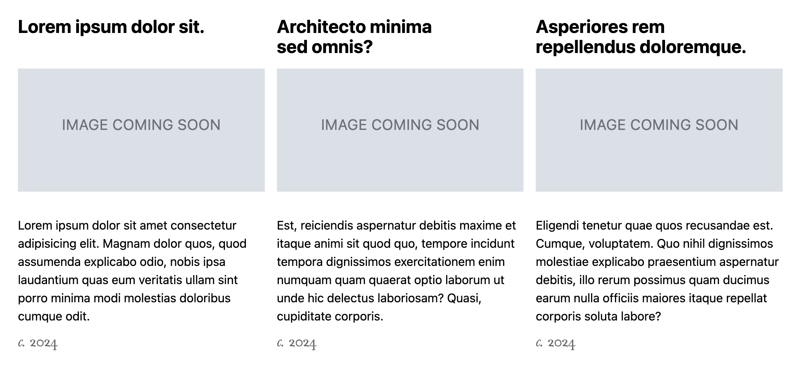
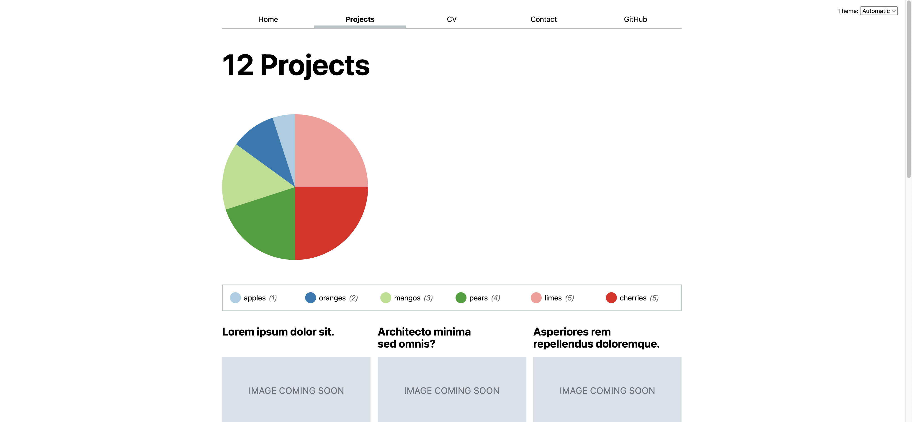

# Lab 5: Visualizing categorical data with D3

{: .no_toc}

{: .summary}

> In this lab, we will learn:
>
> - What is SVG and what does it look like?
> - What does D3 do?
> - How can we use D3 to draw a pie chart?
> - How can we create reactive visualizations of data that is changing?
> - How can we make interactive visualizations that change the data displayed on the page?
> - How can we make interactive visualizations accessible?

<details open markdown="block">
  <summary>
    Table of contents
  </summary>
  {: .text-delta }
- TOC
{:toc}
</details>

---

## Submission

In your submission for the lab, along with the link to your github repo and website, please record a 2 minute video with the following components:

1. Present your visualizations.
2. Show you interacting with your visualizations.
3. Explain why you can't search in the bar and then click a pie slice at the same time, and which lines of code you would need to change to solve this.
  - If you fix the bug and show the fixed interaction in your video, you will get 10% extra credit on this lab.
4. Share the most interesting thing you learned from this lab.

**Videos longer than 2 minutes will be trimmed to 2 minutes before we grade, so
make sure your video is 2 minutes or less.**

## Prerequisites

- You should have completed all the steps in [Lab 0](../lab00/), i.e. that you have Node.js and npm installed.
- This lab assumes you have already completed [Lab 1](../lab01/), [Lab 2](../lab02/), [Lab 3](../lab03/), and [Lab 4](../lab04/), as we will use the same website as a starting point.

## [Slides](https://docs.google.com/presentation/d/1ryNhbqyr4DcmQhrm4hIZkkc63jXdgvbiX5ucri1ciGc/edit?usp=sharing)

{: .note }
This lab is a little more involved than some of the previous labs,
because it’s introducing the core technical material around data visualization.
A robust understanding of these concepts will be invaluable
as you work on your final projects, so spending time practicing them for the lab
will be time will spent.

## Step 0: Update project data and add years

If you have not yet done [Step 4 of Lab 4](../lab04/#step-4-update-your-project-data), you should do it now.

### Step 0.1: Show year in each project

Since we have the year data, we should show it in the project list.
That way we can also more easily verify whether our code in the rest of the lab works correctly.

Edit the projects' display using JS (your `renderProject()` method in `global.js`) to show the year of the project.
You can use any HTML you deem suitable and style it however you want.
I placed it under the project description (you’ll need to wrap both in the ame `<div>` otherwise they will occupy the same grid cell and overlap), and styled it like this:



{: .tip }
In case you like the above, the font-family is `Baskerville` (a system font) and I’m using `font-variant-numeric: oldstyle-nums` to make the numbers look a bit more like they belong in the text.

{: .note }

> From this point onwards, there are only three files that we will be editing in this lab:
>
> 1. `<root repo>/projects/index.html`
> 2. `<root repo>/projects/projects.js` (created in [Step 1.4](../lab04/#step-14-setting-up-the-projectsjs-file) from Lab 4).
> 3. `style.css`.

## Step 1: Creating a pie chart with D3

### Step 1.1: Create a circle with SVG

The first step to create a pie chart with D3 is to create an `<svg>` element in your `projects` repo's `index.html`.

{: .fyi }
D3 is a library that translates high level visualization concepts into low level drawing commands.
The technology currently used for these drawing commands is called [SVG](https://developer.mozilla.org/en-US/docs/Web/SVG) and is a language for drawing [vector graphics](https://en.wikipedia.org/wiki/Vector_graphics).
This means that instead of drawing pixels on a screen, SVG draws shapes and lines using descriptions of their geometry (e.g. centerpoints, radius, start and end coordinates, etc.).
It looks very much like HTML, with elements delineated by tags, tags delineated by angle brackets, and attributes within those tags.
However, instead of content-focused elements like `<h1>` and `<p>`, we have drawing-focused elements like `<circle>` and `<path>`.
SVG code can live either in separate files (with an `.svg` extension) or be embedded in HTML via the `<svg>` elements.

We will give it a [`viewBox`](https://developer.mozilla.org/en-US/docs/Web/SVG/Attribute/viewBox) of `-50 -50 100 100` which defines the coordinate system it will use internally.
In this case, it will have a width and height of 100, and the (0, 0) point will be in the center (which is quite convenient for a pie chart!).

We can use these coordinates to e.g. draw a red circle within it with a center at (0, 0) and a radius of 50 via the SVG [`<circle>`](https://developer.mozilla.org/en-US/docs/Web/SVG/Element/circle) element:

```html
<svg id="projects-plot" viewBox="-50 -50 100 100">
  <circle cx="0" cy="0" r="50" fill="red" />
</svg>
```

Since we have not given the graphic any explicit dimensions, by default it will occupy the entire width of its parent container and will have an aspect ratio of 1:1 (as defined by its coordinate system). It will look a bit like this:


We can add some CSS in the `<svg>` tag element to limit its size a bit and also add some spacing around it. However, to better scope the CSS rule, we recommend you give your `<svg>` tag an id, say `projects-pie-plot`, and apply the CSS rules by the id selector:

```css
#projects-pie-plot {
  max-width: 20em;
  margin-block: 2em;

  overflow: visible;
}
```

This will make it look like this:


### Step 1.2: Using a `<path>` instead of a `<circle>`

A [`<circle>`](https://developer.mozilla.org/en-US/docs/Web/SVG/Element/circle) element is an easy way to draw a circle, but we can’t really go anywhere from there: it can _only_ draw circles.
If we were drawing pie charts directly in SVG, we’d need to switch to another element, that is more complicated, but also more powerful: the [`<path>`](https://developer.mozilla.org/en-US/docs/Web/SVG/Element/path) element.

The [`<path>`](https://developer.mozilla.org/en-US/docs/Web/SVG/Element/path) element can draw any shape, but its syntax is a little unwieldy.
It uses a string of commands to describe the shape, where each command is a single letter followed by a series of numbers that specify command parameters.
All of this is stuffed into a single [`d`](https://developer.mozilla.org/en-US/docs/Web/SVG/Attribute/d) attribute.

Here is our circle as a `<path>` element:

```html
<svg id="projects-plot" viewBox="-50 -50 100 100">
  <path d="M -50 0 A 50 50 0 0 1 50 0 A 50 50 0 0 1 -50 0" fill="red" />
</svg>
```

This draws the circle as two arcs, each of which is defined by its start and end points, its radius, and a few flags that control its shape.
Before you run away screaming, worry not, because D3 saves us from this chaos by _generating_ the path strings for us.
Let’s use it then!

### Step 1.3: Drawing our circle path with D3

Now let's use D3 to create the same path, as a first step towards our pie chart.

You can import D3 directly in your `projects.js` like follows:

```javascript
import * as d3 from "https://cdn.jsdelivr.net/npm/d3@7.9.0/+esm";
```

Now let’s use the [`d3.arc()`](https://d3js.org/d3-shape/arc#arc) function from the [D3 Shape](https://d3js.org/d3-shape) module to create the path for our circle.
This works with two parts: first, we create an _arc generator_ which is a function that takes data and returns a path string.
We’ll configure it to produce arcs based on a radius of `50`
by adding `.innerRadius(0).outerRadius(50)`.
If you instead want to create a donut chart, it’s as easy as changing the inner radius to something other than `0`!

```javascript
let arcGenerator = d3.arc().innerRadius(0).outerRadius(50);
```

We then generate an arc by providing a starting angle (`0`) and an ending angle in radians (`2 * Math.PI`) to create a full circle:

```javascript
let arc = arcGenerator({
  startAngle: 0,
  endAngle: 2 * Math.PI,
});
```

{: .fyi }

> Did we need two statements? Not really, we only did so for readability.
> This would have been perfectly valid JS:
>
> ```javascript
> let arc = d3.arc().innerRadius(0).outerRadius(50)({
>   startAngle: 0,
>   endAngle: 2 * Math.PI,
> });
> ```

Now that we have our path, we can add it to our SVG (you are now free to remove the `<path>` tag that we placed down initially):

```javascript
d3.select('svg').append('path').attr('d', arc).attr('fill', 'red');
```

### Step 1.4: Drawing a static pie chart with D3

’Nuff dilly-dallying with circles, let’s cut to the chase and draw a pie chart!
Let’s draw a pie chart with two slices, one for each of the numbers `1` and `2`, i.e. a 33% and 66% slice.

```js
let data = [1, 2];
```

We’ll draw our pie chart as two `<path>` elements, one for each slice.
First, we need to calculate the total, so we can then figure out what proportion of the total each slice represents:

```js
let total = 0;

for (let d of data) {
  total += d;
}
```

Then, we calculate the start and end angles for each slice:

```js
let angle = 0;
let arcData = [];

for (let d of data) {
  let endAngle = angle + (d / total) * 2 * Math.PI;
  arcData.push({ startAngle: angle, endAngle });
  angle = endAngle;
}
```

And now we can finally calculate the actual paths for each of these slices:

```js
let arcs = arcData.map((d) => arcGenerator(d));
```

Now let’s translate the arcs array into `<path>` element since we are now generating multiple paths:

```javascript
arcs.forEach(arc => {
  // TODO, fill in step for appending path to svg using D3
})
```

If we reload at this point, all we see is …the same red circle.
A bit anticlimactic, isn’t it?

However, if you inspect the circle, you will see it actually consists of two `<path>` elements.
We just don’t see it, because they’re both the same color!


Let’s assign different colors to our slices, by adding a `colors` array and using it to set the `fill` attribute of our paths:

```js
let colors = ['gold', 'purple'];
```

Then we just modify our code from the previous step slightly to use it:

```javascript
arcs.forEach((arc, idx) => {
    d3.select('svg')
      .append('path')
      .attr('d', arc)
      .attr(...) // Fill in the attribute for fill color via indexing the colors variable
})
```

The result should look like this (you may also see the two color fills inverted):


Phew! 😮‍💨 Finally an actual pie chart!

{: .tip }
While it does no harm, make sure to clean up your code by removing the `arc` variable we defined early on in this step, since we’re no longer using it.

Now let’s clean up the code a bit.
D3 actually provides a higher level primitive for what we just did: the [`d3.pie()`](https://d3js.org/d3-shape/pie) function.
Just like `d3.arc()`, `d3.pie()` is a function that returns another function, which we can use to generate the start and end angles for each slice in our pie chart instead of having to do it ourselves.

This `sliceGenerator()` function takes an array of data values and returns an array of objects, each of whom represents a slice of the pie and contains the start and end angles for it.
We still feed these objects to our `arcGenerator()` to create the paths for the slices,
but we don’t have to create them manually.
It looks like this:

```js
let data = [1, 2];
let sliceGenerator = d3.pie();
let arcData = sliceGenerator(data);
let arcs = arcData.map((d) => arcGenerator(d));
```

### Step 1.5: Adding more data

Let’s tweak the `data` array to add some more numbers:

```js
let data = [1, 2, 3, 4, 5, 5];
```

Our pie chart did adapt, but all the new slices are black!
They don’t even look like four new slices, but rather a huge black one. 😭


This is because we’ve only specified colors for the first two slices.
We _could_ specify more colors, but this doesn’t scale.
Thankfully, D3 comes with both ordinal and sequential color scales that can generate colors for us based on our data.

For example to use the [`schemePaired` color scale](https://d3js.org/d3-scale-chromatic/categorical#schemePaired) we use the [`d3.scaleOrdinal()`](https://d3js.org/d3-scale/ordinal#scaleOrdinal) function with that as an argument:

```js
let colors = d3.scaleOrdinal(d3.schemeTableau10);
```

We also need to change `colors[index]` to `colors(index)` in our template, since `colors` is now a function that takes an index and returns a color.

This is the result:


Success! 🎉

## Step 2: Adding a legend

Our pie chart looks good, but there is no way to tell what each slice represents.
Let’s fix that!

### Step 2.1: Adding labels to our data

First, even our data does not know what it is — it does not include any labels, but only random quantities.

D3 allows us to specify more complex data, such as an array of objects:

```js
let data = [
  { value: 1, label: 'apples' },
  { value: 2, label: 'oranges' },
  { value: 3, label: 'mangos' },
  { value: 4, label: 'pears' },
  { value: 5, label: 'limes' },
  { value: 5, label: 'cherries' },
];
```

However, to use this data, we need to change our `sliceGenerator` to tell it how to access the values in our data:

```js
let sliceGenerator = d3.pie().value((d) => d.value);
```

If everything is set up correctly, you should now see the same pie chart as before.

### Step 2.2: Adding a legend

The colors D3 scales return are just regular CSS colors.
We can do even more. We can actually create a legend with plain HTML, CSS, and D3.

We first create a `<ul>` element, but a `<dl>` would have been fine too, and place it under need our `<svg>` tag. We want it to look like the following:

```html
<ul class="legend">
  <li style="--color: { colors(index) }">
    <span class="swatch"></span>
    {data[i].label} <em>({data[i].value})</em>
  </li>
  <li>
    ...
  </li>
  ...
</ul>
```

{: .note}
DO NOT copy and paste the above code snippet into your `index.html`. It only serves as a blueprint. You will learn how to accomplish this same structure using `D3.js`.

Instead, only create the `<ul>` tag with class name `legend` in your project's `index.html`, directly underneath the `<svg>` tag you created from [step 1.2](#step-12-using-a-path-instead-of-a-circle).

```html
<svg viewBox="-50 -50 100 100"></svg>
<ul class="legend"></ul>
```

Next, we use D3 to help us create all the `<li></li>` tags (this happens in your `projects.js`):

```javascript
let legend = d3.select('.legend');
data.forEach((d, idx) => {
    legend.append('li')
          .attr('style', `--color:${colors(idx)}`) // set the style attribute while passing in parameters
          .html(`<span class="swatch"></span> ${d.label} <em>(${d.value})</em>`); // set the inner html of <li>
})
```

At this point, it doesn’t look like a legend very much:


We need to add some CSS to make it look like an actual legend.
You can experiment with the styles to make it look the way you want, but we’re including some tips below. Also note that the trick here is we added a `<span>` with a “swatch” class to each `<li>` so we can style them.

#### Making the swatch look like a swatch

You could probably want to make the swatch look like a swatch by:

1. Making it a square by e.g. giving it the same width and height, or declaring one of the two properties (e.g. width or height) plus `aspect-ratio: 1 / 1`.
2. Giving it a background color of `var(--color)`
3. You may find [`border-radius`](https://developer.mozilla.org/en-US/docs/Web/CSS/border-radius) useful to add slight rounding to the corners or even make it into a full circle by setting it to `50%`.

{: .tip }
Note that because `<span>` is an inline element by default, to get widths and heights to work, you need to set it to `display: inline-block` or `inline-flex` (or apply `display: flex` or `display: grid` on its parent).

#### Applying layout on the list to make it look like a legend

I applied `display: grid` to the `<ul>` (**avoid using the `<ul>` tag selector**, use selector by class instead). To make the grid make best use of available space, I used an `auto-fill` grid template, and set the `min-width` of the list items to a reasonable value.

```css
grid-template-columns: repeat(auto-fill, minmax(9em, 1fr));
```

This lays them all out on one line if there’s space, or multiple columns if not.

I also applied `display: flex` on each `<li>` (also give it a class name and apply CSS rule on the class) to vertically center align the text and the swatch (`align-items: center`) and give it spacing via `gap`.

```js
// how you add class name as attributes using D3
let legend = d3.select('.legend');
data.forEach((d, idx) => {
    legend.append('li')
          .attr('style', `--color:${colors(idx)}`)
          .attr('class', ...)
          ...
})
```

{: .tip }
Make sure the `gap` you specify for the `<li>`s is smaller than the `gap` you specify for the whole legend’s grid, to honor the [design principle of _Proximity_](https://www.nngroup.com/articles/gestalt-proximity/).

---

You probably also want to specify a border around the legend, as well as spacing inside it (`padding`) and around it (`margin`). The final result will vary depending on your exact CSS, but this was mine:



### Step 2.3: Laying out our pie chart and legend side by side

Right now, our pie chart and legend are occupying _a ton_ of space on our page. It’s more common to place the legend to the right of the pie chart, so let’s do that.

We can do that by wrapping both the pie chart and the legend with a shared container, and using a flex layout (`display: flex`) on it.

```html
<div class="container">
  <svg viewBox="-50 -50 100 100">
    <!-- ... -->
  </svg>
  <ul class="legend">
    <!-- ... -->
  </ul>
</div>
```

You can experiment with the container's horizontal alignment (`align-items`) and the spacing (`gap`) of the pie chart and legend, but I would recommend applying `flex: 1` to the legend, so that it occupies all available width.

If everything worked well, you should now see the pie chart and legend side by side and it should be _responsive_, i.e. adapt well to changes in the viewport width.

<video src="videos/responsive-legend.mp4" autoplay loop muted></video>

## Step 3: Plotting our actual data

So far, we’ve been using meaningcless hardcoded data for our pie chart.
Let’s change that and plot our actual project data, and namely projects per year.

### Step 3.1: Passing project data via the `data` prop

Now that we’re passing the data from the Projects page, let’s calculate the labels and values we’ll pass to the pie chart from our project data.
We will be displaying a chart of projects per year, so the labels would be the years, and the values the count of projects for that year.
But how to get from [our project data](../lab04/#step-12-importing-project-data-into-the-projects-page) to that array?

D3 does not only provide functions to generate visual output, but includes powerful helpers for manipulating data.
In this case, we’ll use the `d3.rollups()` function to group our projects by year and count the number of projects in each bucket:

```js
let projects = ...; // fetch your project data
let rolledData = d3.rollups(
  projects,
  (v) => v.length,
  (d) => d.year,
);
```

This will give us an array of arrays that looks like this:

```js
[
  ['2024', 3],
  ['2023', 4],
  ['2022', 3],
  ['2021', 2],
];
```

We will then convert this array to the type of array we need by using [`array.map()`](https://developer.mozilla.org/en-US/docs/Web/JavaScript/Reference/Global_Objects/Array/map).
Replace your previous `data` declaration with:

```js
let data = rolledData.map(([year, count]) => {
  return { value: count, label: year };
});
```

That’s it! The result should look like this (it's okay if your color scheme looks different based on your project-specific data):


## Step 4: Adding a search for our projects and only visualizing visible projects

At first glance, this step appears a little unrelated to the rest of this lab.
However, it demonstrates how these visualizations don’t have to be static, but can _reactively update with the data_, a point we will develop further in the next lab.

### Step 4.1: Adding a search field

First, declare a variable that will hold the search query:

```js
let query = '';
```

Then, add an `<input type="search">` to the HTML (you may add other element properties as you see fit) underneath the `<div>` container from [step 2](#step-23-laying-out-our-pie-chart-and-legend-side-by-side):

```html
<input
  class="searchBar"
  type="search"
  aria-label="Search projects"
  placeholder="🔍 Search projects…"
/>
```

### Step 4.2: Basic search functionality

To make the search bar react to user input, we should use `Events` or `EventListeners`.
The basic logic should resemble the following:

```js
let query = '';

let searchInput = document.querySelector('.searchBar');

searchInput.addEventListener('change', (event) => {
  // update query value
  query = event.target.value;
  // TODO: filter the projects

  // TODO: render updated projects!

});
```

{: .fyi }
`change` is only one viable `Event` option here that we can monitor; you may also look into `input` if you want real-time query searches and updates.

To filter the project data, we will use the [`array.filter()`](https://developer.mozilla.org/en-US/docs/Web/JavaScript/Reference/Global_Objects/Array/filter) function,
which returns a new array containing only the elements that pass the test implemented by the provided function.

For example, this is how we’d search in project titles:

```js
let filteredProjects = projects.filter((project) => project.title.includes(query));
```

<!-- {: .fyi }
`return project.title.includes(query);` by itself would have actually worked fine,
since if the query is `""`, then every project title contains it anyway.
However, there is no reason to do extra work if we don’t have to. -->

<!-- TODO: Mention debounce -->

### Step 4.3: Improving the search

Finding projects by title is a good first step,
but it could make it hard to find a project.
Also, it’s case-sensitive, so e.g. searching for “JavaScript” won’t find “Javascript”.

<video src="videos/search-titles.mp4" autoplay muted loop></video>

Let’s fix both of these!

#### Make the search case-insensitive

To do this, we can simply convert _both_ the query and the title to lowercase before comparing them by using the [`string.toLowerCase()`](https://developer.mozilla.org/en-US/docs/Web/JavaScript/Reference/Global_Objects/String/toLowerCase) function:

```js
let filteredProjects = projects.filter((project) => project.title.toLowerCase().includes(query));
```

#### Search across all project metadata, not just titles

For the second, we can use the [`Object.values()`](https://developer.mozilla.org/en-US/docs/Web/JavaScript/Reference/Global_objects/Object/values) function to get an array of all the values of a project, and then join them into a single string, which we can then search in the same way:

```js
let filteredProjects = projects.filter((project) => {
  let values = Object.values(project).join('\n').toLowerCase();
  return values.includes(query.toLowerCase());
});
```

Putting it together, here is how we make the search bar react to user input:

```js
let query = '';
let searchInput = document.querySelector('.searchBar');
searchInput.addEventListener('change', (event) => {
  // update query value
  query = event.target.value;
  // filter projects
  let filteredProjects = projects.filter((project) => {
    let values = Object.values(project).join('\n').toLowerCase();
    return values.includes(query.toLowerCase());
  });
  // render filtered projects
  renderProjects(filteredProjects, projectsContainer, 'h2');
});
```

Note that we **need** a call to `renderProjects()` in order for the filtered changes to apply!

Try it again. Both issues should be fixed at this point.

### Step 4.4: Visualizing only visible projects

As it currently stands, our pie chart and legend are not aware of the filtering we are doing.
Wouldn’t it be cool if we could see stats _only_ about the projects we are currently seeing?

Here is how we can clean this up:

1. Move all the d3 code into the event listener for the search bar, change `projects` to `filteredProjects`
   1. You should notice that the pie chart doesn’t render when the page loads, but a pie chart appears when the user types something into the search box, think about why that is.
   2. Also, typing multiple queries in the search box renders the pie chart and legend multiple times since we aren’t clearing the svg and legend before re-rendering
2. Fix the legend issue by clearing the svg and legend
3. Fix the first render issue by refactoring plot code into a separate function, then calling the function on page load AND within the event handler.

<!-- However, if you try the search out at this point, you will see that the legend is updating, but the pie chart is not. -->

<!-- <video src="videos/legend-reactive.mp4" autoplay muted loop></video> -->

Below is this workflow implemented in skeleton code:

```js
// Refactor all plotting into one function
function renderPieChart(projectsGiven) {
  // re-calculate rolled data
  let newRolledData = d3.rollups(
    projectsGiven,
    (v) => v.length,
    (d) => d.year,
  );
  // re-calculate data
  let newData = newRolledData.map(([year, count]) => {
    return { ... }; // TODO
  });
  // re-calculate slice generator, arc data, arc, etc.
  let newSliceGenerator = ...;
  let newArcData = newSliceGenerator(...);
  let newArcs = newArcData.map(...);
  // TODO: clear up paths and legends
  ...
  // update paths and legends, refer to steps 1.4 and 2.2
  ...
}

// Call this function on page load
renderPieChart(projects);

searchInput.addEventListener('change', (event) => {
  let filteredProjects = setQuery(event.target.value);
  // re-render legends and pie chart when event triggers
  renderProjects(filteredProjects, projectsContainer, 'h2');
  renderPieChart(filteredProjects);
});
```

{: .tip }

> Remember to reset/clean-up your `<svg>` and legend as you filter your projects and render new pie chart and legends. Here's one way you can do this:
>
> ```js
> let newSVG = d3.select('svg'); 
> newSVG.selectAll('path').remove();
> ```
>
> Then you are free to reactively attach new paths to `newSVG`!

Once we do that, our pie chart becomes beautifully reactive as well:

<video src="videos/pie-reactive.mp4" autoplay muted loop></video>

## Step 5: Turning the pie into filtering UI for our projects

**Visualizations are not just output.**
Interactive visualizations allow you to _interact_ with the data as well and explore it in more effective ways.

In this step, we will turn our pie chart into a filtering UI for our projects,
so we can click on the wedge or legend entry for a given year and only see projects from that year.

It will work a bit like this:

<video src="videos/year-filter-final.mp4" autoplay loop muted></video>

Ready? Let’s go!

### Step 5.1: Highlighting hovered wedge

While there are some differences, SVG elements are still DOM elements.
This means they can be styled with regular CSS, although the available properties are not all the same.

Let’s start by adding a hover effect to the wedges.
What about fading out all _other_ wedges when a wedge is hovered?
We can target the `<svg>` element when it contains a hovered `<path>`
by using the `:has()` pseudo-class:

```css
&:has(path:hover) {
   path:not(:hover) {
     opacity: 0.5;
   }
 }
```

This gives us something like this:


{: .fyi }
Why not just use `:hover` instead of `:has(path:hover)`?
Because the `<svg>` can be covered _without_ any of the wedges being hovered, and then _all_ wedges would be faded out.

We can even make it smooth by adding a `transition` property to the `<path>` elements:

```css
path {
  transition: 300ms;
}
```

Which would look like this:

<figure class="multiple stretch">


<figcaption>Before (left) and after (right) adding the transition</figcaption>
</figure>

{: .tbd}

### Step 5.2: Highlighting selected wedge

In this step, we will be able to click on a wedge and have it stay highlighted.
Its color will change to indicate that it’s highlighted, and its legend item will also be highlighted.
Pages using the component should be able to read what the selected wedge is, if any.
Clicking on a selected wedge should deselect it.

<video src="videos/wedge-select.mp4" loop autoplay muted></video>

First, create a `selectedIndex` variable and initialize it to `-1` (a convention to mean "no index"):

```js
let selectedIndex = -1;
```

Then, add a click event to your `<path>` which will set `selectedIndex` to the index of the wedge that was clicked. 
The skeleton logic should look like the following:

```js
let svg = d3.select('svg');
  svg.selectAll('path').remove();
  arcs.forEach((arc, i) => {
    svg
      .append('path')
      .attr('d', arc)
      .attr('fill', colors(i))
      .on('click', () => {
        // What should we do? (Keep scrolling to find out!)
      });
  });
```

As shown above, we would like to highlight the selected wedge using a different color than its own and every other wedge. 
Let’s apply CSS to change the color of the selected wedge and legend item:

```css
.selected {
  --color: oklch(60% 45% 0) !important;

  &:is(path) {
    fill: var(--color);
  }
}
```

Feel free to use any color you want, as long as it’s disctinct from the actual wedge colors.

{: .fyi }
Why the `!important`? Because we are trying to override the `--color` variable set via the `style` attribute, which has higher precedence than any selector.

Then, we also want to be able to deselect a wedge (removing the highlight) by clicking on it again, or select some other wedge while carrying the highlight over.
We can do so via the following ternary operation:

```js
selectedIndex = selectedIndex === i ? -1 : i;
```

Essentially, it does the following purpose:

- If selectedIndex is the same as an given index when the event is triggered, that means we are deselecting, so reset it to -1.
- Else, we’ve selected a new wedge, reassign the selectedIndex accordingly.

Putting it together, we should now be able to expand our event monitoring logic to something like this:

```js
.on('click', () => {
  selectedIndex = selectedIndex === i ? -1 : i;
  
  svg
    .selectAll('path')
    .attr('class', (_, idx) => (
      // TODO: filter idx to find correct pie slice and apply CSS from above
    ));
});
```

 We have not implemented how we would like to handle the legend as we select and deselect wedges. For consistency and clarity, lets implement the same feature and logic used for the wedges to the legend! One important point to keep in mind though. We shouldn’t set the color attribute on the `<li>` elements directly, we just need to add the `.selected` class to apply the appropriate style to the right pie slice.

```js
legend
    .selectAll('li')
    .attr('class', (_, idx) => (
      // TODO: filter idx to find correct legend and apply CSS from above
    ));
```

{: .tip }

> You can improve UX by indicating that a wedge is clickable through the cursor:
>
> ```css
> path {
>   cursor: pointer;
> }
> ```

### Step 5.3: Filtering the projects by the selected year

Selecting a wedge doesn’t really do that much right now and our job is far from finished! Most notably, we have not implemented how we would filter the projects as we select and deselect the wedges. This may seem complex at first but we can break it down into two smaller, more manageable cases! 

1. When selectedIndex is not -1, we’ve selected a wedge that represents a given year, and we should filter out projects data based on the year value, recalculating projects, arc, legend, etc.
2. When selectedIndex is -1, we simply go ahead and render projects, arc, legend, etc. with the existing projects data.

As you may already sense from the description, one particular function from earlier might come in handy to render the filtered projects onto the webpage.

```js
if (selectedIndex === -1) {
  renderProjects(projects, projectsContainer, 'h2');
} else {
  // TODO: filter projects and project them onto webpage
  // Hint: `.label` might be useful
}
```

{: .fyi }
The `--color` variable we set in the if-branch is exactly the HTML hex code for `oklch(60% 45% 0)`. You may also do your own conversion of Oklab color space colors. You may find this [website](https://oklch.com/) helpful. 

Once you finish your projects page should achieve the following, finally!

<video src="videos/year-filter-final.mp4" autoplay loop muted class="browser"></video>

### Step 5.4: One Final Pitfall

However, we face **one final pitfall**. While everything looks clean when we interact with the pie chart directly, you may notice that there is still a semi-subtle bug: you can filter projects by pie clicks and by the search bar, but not by both at the same time (if you search in the bar and then click a pie slice, the projects will only be filtered by year, not by the search query). It should not be like this!

You are **not required** to fix this bug. However, we want you to understand why this is happening. So in your video, please **explain why the issue is happening** and **which lines of code you would need to change** to solve this issue.

**With that being said, if you do fix this issue, we would be happy to give you 10% extra credit on this lab!** 🙂
