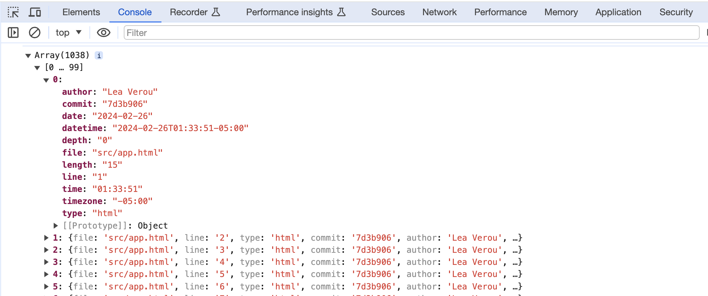
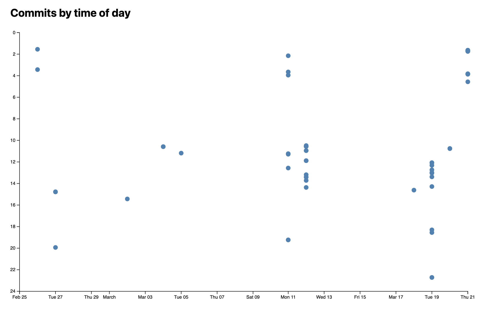
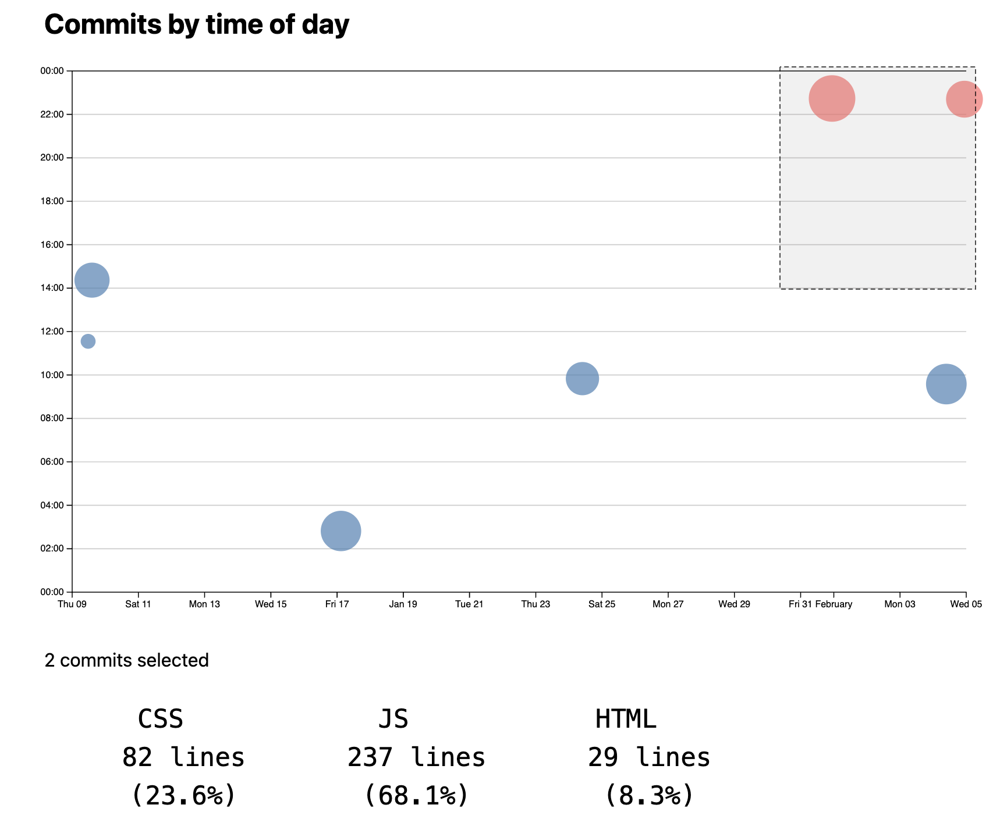

# Lab 6: Visualizing quantitative data with D3

{: .no_toc}

{: .summary}

> In this lab, we will learn:
>
> - How do we draw visualizations for quantitative data, such as bar charts and scatter plots, using D3
> - How to show tooltips on hover as a way to provide more information about the data
> - How to compute summary statistics about our data in a structured a way

<details open markdown="block">
  <summary>
    Table of contents
  </summary>
  {: .text-delta }
- TOC
{:toc}
</details>

---

## Check-off

To get checked off for the lab, please record a 2 minute mp4 video with the following components:

1. Present your quantitative D3 visualizations
2. Show you interacting with your D3 visualizations.
3. Share the most interesting thing you learned from this lab.

**Videos longer than 2 minutes will be trimmed to 2 minutes before we grade, so
make sure your video is 2 minutes or less.**

## Slides (or lack thereof)

Just like the previous lab, there are no slides for this lab!

{: .note }
This lab is a little more involved than most of the previous labs,
because it’s introducing the core technical material around data visualization.
A robust understanding of these concepts will be invaluable
as you work on your final projects, so spending time practicing them for the lab
will be time well spent.

## Step 0: Setting up

This step takes you through several prepratory steps before we can work on the main part of the lab.

### Step 0.1: Adding a new page with meta-analysis of the code in our project

In this lab, we will be computing and visualizing different stats about our codebase.
We will display these in a new page on our website.
Create a folder named `meta`. Create an `index.html` file here and add some content in it (e.g. a heading, a description).

Add it to your navigation menu.


### Step 0.2: Adding code analysis script

In this step you will install [our code analysis script](https://www.npmjs.com/package/elocuent) which will analyze the code of our app and display some statistics about it.

{: .fyi }
If you’re interested in the details of how this script works, you can [examine its code in its repo](https://github.com/LeaVerou/elocuent/tree/main/src).
It’s just some JS code that runs in Node.js :) (and it’s not that long either!)

First, open the terminal and run this, to install [the package](https://www.npmjs.com/package/elocuent) that will do the analysis:

```bash
npm install elocuent -D
```

Now in your terminal, run this command:

```bash
npx elocuent -d . -o meta/loc.csv
```

Or this, if you’ve used spaces for indentation (replace `2` with the number of spaces):

```bash
npx elocuent -d . -o meta/loc.csv --spaces 2
```

Make sure your indentation is consistent across your code!

{: .tip }
Two very popular tools to ensure a consistent code style are [ESLint](https://eslint.org/) (JS only)
and [Prettier](https://prettier.io/) (JS, CSS, HTML)
They have different philosophies: ESLint is a _linting tool_: you define what rules you want to follow, and it warns you when you don’t follow them (often it can fix them too, but you need to explicitly ask it to).
Prettier is a _code formatter_: when you hit Save it auto-formats your code based on its predefined rules.
Linters give you more control, whereas code formatters are more hands-off but also less flexible.

If everything went well, you should now have a file called `loc.csv` in the `meta` directory.
Its content should look something like this (showing first 30 lines):

<details markdown="1">
<summary>First 30 lines of <code>loc.csv</code></summary>

```csv
file,line,type,commit,author,date,time,timezone,datetime,depth,length
style.css,1,css,9fc5cea1,Smruthi Gowtham,2025-01-09,14:22:45,-08:00,2025-01-09T14:22:45-08:00,0,25
style.css,2,css,9fc5cea1,Smruthi Gowtham,2025-01-09,14:22:45,-08:00,2025-01-09T14:22:45-08:00,0,44
style.css,3,css,9fc5cea1,Smruthi Gowtham,2025-01-09,14:22:45,-08:00,2025-01-09T14:22:45-08:00,0,43
style.css,4,css,9fc5cea1,Smruthi Gowtham,2025-01-09,14:22:45,-08:00,2025-01-09T14:22:45-08:00,0,1
style.css,5,css,9fc5cea1,Smruthi Gowtham,2025-01-09,14:22:45,-08:00,2025-01-09T14:22:45-08:00,0,24
style.css,6,css,c1ed637b,Smruthi Gowtham,2025-01-24,09:50:11,-08:00,2025-01-24T09:50:11-08:00,0,65
style.css,7,css,c1ed637b,Smruthi Gowtham,2025-01-24,09:50:11,-08:00,2025-01-24T09:50:11-08:00,0,86
style.css,8,css,c1ed637b,Smruthi Gowtham,2025-01-24,09:50:11,-08:00,2025-01-24T09:50:11-08:00,0,66
style.css,9,css,9fc5cea1,Smruthi Gowtham,2025-01-09,14:22:45,-08:00,2025-01-09T14:22:45-08:00,0,0
style.css,10,css,9fc5cea1,Smruthi Gowtham,2025-01-09,14:22:45,-08:00,2025-01-09T14:22:45-08:00,0,0
style.css,11,css,9fc5cea1,Smruthi Gowtham,2025-01-09,14:22:45,-08:00,2025-01-09T14:22:45-08:00,0,18
style.css,12,css,801584bb,Smruthi Gowtham,2025-01-17,02:49:07,-08:00,2025-01-17T02:49:07-08:00,0,15
style.css,13,css,9fc5cea1,Smruthi Gowtham,2025-01-09,14:22:45,-08:00,2025-01-09T14:22:45-08:00,0,12
style.css,14,css,9fc5cea1,Smruthi Gowtham,2025-01-09,14:22:45,-08:00,2025-01-09T14:22:45-08:00,0,0
index.js,1,js,67b6c1bd,Smruthi Gowtham,2025-01-31,22:44:08,-08:00,2025-01-31T22:44:08-08:00,0,71
index.js,2,js,67b6c1bd,Smruthi Gowtham,2025-01-31,22:44:08,-08:00,2025-01-31T22:44:08-08:00,0,0
index.js,3,js,67b6c1bd,Smruthi Gowtham,2025-01-31,22:44:08,-08:00,2025-01-31T22:44:08-08:00,0,126
index.js,4,js,67b6c1bd,Smruthi Gowtham,2025-01-31,22:44:08,-08:00,2025-01-31T22:44:08-08:00,0,43
index.js,5,js,67b6c1bd,Smruthi Gowtham,2025-01-31,22:44:08,-08:00,2025-01-31T22:44:08-08:00,0,0
index.js,6,js,67b6c1bd,Smruthi Gowtham,2025-01-31,22:44:08,-08:00,2025-01-31T22:44:08-08:00,0,61
index.js,7,js,67b6c1bd,Smruthi Gowtham,2025-01-31,22:44:08,-08:00,2025-01-31T22:44:08-08:00,0,166
index.js,8,js,67b6c1bd,Smruthi Gowtham,2025-01-31,22:44:08,-08:00,2025-01-31T22:44:08-08:00,0,0
global.js,3,js,c1ed637b,Smruthi Gowtham,2025-01-24,09:50:11,-08:00,2025-01-24T09:50:11-08:00,0,0
global.js,4,js,c1ed637b,Smruthi Gowtham,2025-01-24,09:50:11,-08:00,2025-01-24T09:50:11-08:00,0,0
global.js,5,js,c1ed637b,Smruthi Gowtham,2025-01-24,09:50:11,-08:00,2025-01-24T09:50:11-08:00,0,28
global.js,6,js,c1ed637b,Smruthi Gowtham,2025-01-24,09:50:11,-08:00,2025-01-24T09:50:11-08:00,0,0
global.js,7,js,c1ed637b,Smruthi Gowtham,2025-01-24,09:50:11,-08:00,2025-01-24T09:50:11-08:00,0,34
global.js,8,js,c1ed637b,Smruthi Gowtham,2025-01-24,09:50:11,-08:00,2025-01-24T09:50:11-08:00,0,73
global.js,9,js,c1ed637b,Smruthi Gowtham,2025-01-24,09:50:11,-08:00,2025-01-24T09:50:11-08:00,0,4
global.js,10,js,c1ed637b,Smruthi Gowtham,2025-01-24,09:50:11,-08:00,2025-01-24T09:50:11-08:00,0,0
```

</details>

You can find a description of the metadata stored [here](https://www.npmjs.com/package/elocuent).

{: .fyi }
Why are we using CSV instead of e.g. JSON?
CSV is more efficient for data that has many rows, since we don’t need to repeat the names of the properties for every row.

Do periodically re-run the script as you work through the lab to see the data update!

### Step 0.3: Setting it up so that the CSV file is generated on every build

We want the CSV file to be generated every time we build our app, so that it’s always up-to-date.

We need make sure that our build environment (which we specify in `deploy.yml`) has access to all of our Git history.
To do this, open `.github/workflows/deploy.yml` and modify the `Checkout` step so that it looks like this:

```yaml
- name: Checkout
  uses: actions/checkout@v4
  with:
    fetch-depth: '0'

- name: Run Elocuent
  run: |
    npx elocuent -d . -o meta/loc.csv

- name: Commit and Push
  run: |
    git config --local user.email "action@github.com"
    git config --local user.name "GitHub Action"
    mkdir -p meta
    git pull
    git add -f meta/loc.csv
    git commit -m "Update code statistics" || echo "No changes to commit"
    git push
```

Ensure that GITHUB_TOKEN has write permissions:

```yaml
permissions:
  contents: write
  pages: write
  id-token: write
```

{: .fyi}
`fetch-depth: '0'` tells GitHub actions to [fetch _all_ history for all branches and tags](https://github.com/actions/checkout?tab=readme-ov-file#fetch-all-history-for-all-tags-and-branches).
By default, the action will only fetch the latest commit, so your deployed scatterplot will only have one dot!

Now, on each deployment, `elocuent` will be run first.

### Step 0.4: Exclude CSV from committed files.

You may have noticed that a lot of new files got generated when you installed elocuent using npm install. We do not need to commit all these files to our repository! Since we are now generating the script on the server as well, there is no reason to include meta/loc.csv in our commits as well.

There's a really neat way to ensure that these files are not committed to your repository. It's called a .gitignore. Create a file named `.gitignore` in the root folder. Add `meta/loc.csv` and `node_modules/` to your `.gitignore` file.

Check out [this resource](https://docs.github.com/en/get-started/getting-started-with-git/ignoring-files) to get an in-depth understanding of a `.gitignore` file.

If you have already committed it, you will need to first delete the file,
commit & push the deletion and the addition to `.gitignore`,
and only after that re-run the script to re-generate it.

## Step 1: Displaying summary stats

### Step 1.1: Reading the CSV file in D3

In your `meta/index.html` file, we will now read the CSV file. Thankfully, we don't have to reinvent the wheel and parse CSV files ourselves, D3 has a built-in function for that.

First, create a javascript file named `main.js` in your meta folder and import it in your `meta/index.html`. Then, set up your HTML file with D3 imported:

```html
<script src="https://d3js.org/d3.v7.min.js"></script>
```

In your html file, also add a placeholder in the body tag as follows:

```html
<div id="stats"></div>
```

We'll be using the `d3.csv()` function from the [`d3-fetch`](https://d3js.org/d3-fetch) module, which provides helper functions for fetching data.

Now let's read the CSV file:

```javascript
let data = [];

async function loadData() {
  data = await d3.csv('loc.csv');
  console.log(data);
}

document.addEventListener('DOMContentLoaded', async () => {
  await loadData();
});
```

To see the structure of these objects, check your console. You should be seeing something like this:



Note that everything is a string, including the numbers and dates. That can be quite a footgun when handling data. To fix it, we add a [row conversion function](https://d3js.org/d3-dsv#dsv_parse):

```javascript
async function loadData() {
  data = await d3.csv('loc.csv', (row) => ({
    ...row,
    line: Number(row.line), // or just +row.line
    depth: Number(row.depth),
    length: Number(row.length),
    date: new Date(row.date + 'T00:00' + row.timezone),
    datetime: new Date(row.datetime),
  }));
}
```

Don't forget to delete the console.log now that we're done — we don't want to clutter our page with debug info!

### Step 1.2: Computing commit data

Notice that while this data includes information about each commit [^eachcommit] (that still has an effect on the codebase), it's not in a format we can easily access, but mixed in with the data about each line (this is called _denormalized_ data).

[^eachcommit]: Actually, it will only include commits that still have an effect on the codebase, since it's based on lines of code that are currently present in the codebase. Therefore if all a commit did was change lines that have since been edited by other commits, that commit will not show up here. If we wanted to include _all_ commits, we'd need to process the output of [`git log`](https://git-scm.com/docs/git-log) instead, but that is outside the scope of this lab.

Let's extract this data about commits in a separate variable for easy access. We will compute this after reading the CSV file.

First, we'll use the [`d3.groups()`](https://d3js.org/d3-array/group#groups) method to group the data by the `commit` property:

```javascript
let commits = d3.groups(data, (d) => d.commit);
```

This will give us an array where each element is an array with two values:

- The first value is the unique commit identifier
- The second value is an array of objects for lines that have been modified by that commit.

{: .tip }
Print it out with `console.log(commits)` to see what it looks like!

To transform this into an array of objects about each commit, with a `lines` property that contains the number of lines that were modified by that commit, we'll need to map over the grouped data. Let's transform our grouped commit data into a more useful format. We'll do this in several steps:

1. First, try to understand what information we need for each commit. Take a look at a single commit group in your console. What properties would be useful to keep? What information might we want to calculate?

Here's how we can start:

```javascript
function processCommits() {
  commits = d3
    .groups(data, (d) => d.commit)
    .map(([commit, lines]) => {
      // Each 'lines' array contains all lines modified in this commit
      // All lines in a commit have the same author, date, etc.
      // So we can get this information from the first line
      let first = lines[0];

      // What information should we return about this commit?
      return {
        id: commit,
        // ... what else?
      };
    });
}
```

{: .tip }
We will be using `commits` extensively throughout the lab, so it would be helpful to declare it as a global variable (`let commits = [];`)

2. Look at the first line object (`first`). What properties does it contain that are relevant to the commit as a whole? (Hint: author, timestamps, etc.)

Let's add these basic properties:

```javascript
function processCommits() {
  commits = d3
    .groups(data, (d) => d.commit)
    .map(([commit, lines]) => {
      let first = lines[0];

      // We can use object destructuring to get these properties
      let { author, date, time, timezone, datetime } = first;

      return {
        id: commit,
        author,
        date,
        time,
        timezone,
        datetime,
        // What other properties might be useful?
      };
    });
}
```

3. Now, what derived information might be useful? For example:

How many lines were modified in this commit?
What time of day was the commit made?
What's the GitHub URL for viewing this commit?

Try adding some of these:

```javascript
function processCommits() {
  commits = d3
    .groups(data, (d) => d.commit)
    .map(([commit, lines]) => {
      let first = lines[0];
      let { author, date, time, timezone, datetime } = first;

      return {
        id: commit,
        url: 'https://github.com/YOUR_REPO/commit/' + commit,
        author,
        date,
        time,
        timezone,
        datetime,
        // Calculate hour as a decimal for time analysis
        // e.g., 2:30 PM = 14.5
        hourFrac: datetime.getHours() + datetime.getMinutes() / 60,
        // How many lines were modified?
        totalLines: lines.length,
      };
    });
}
```

4. Finally, should we keep the original line data? It might be useful for future analysis, but we don't want it to clutter up our object when we look at it in the console.

JavaScript provides a way to add properties that don't show up when you print an object. Can you research `Object.defineProperty()` and figure out how to add the lines array as a hidden property?

Here's the structure:

```javascript
function processCommits() {
  commits = d3
    .groups(data, (d) => d.commit)
    .map(([commit, lines]) => {
      let first = lines[0];
      let { author, date, time, timezone, datetime } = first;
      let ret = {
        id: commit,
        url: 'https://github.com/vis-society/lab-7/commit/' + commit,
        author,
        date,
        time,
        timezone,
        datetime,
        hourFrac: datetime.getHours() + datetime.getMinutes() / 60,
        totalLines: lines.length,
      };

      Object.defineProperty(ret, 'lines', {
        value: lines,
        // What other options do we need to set?
        // Hint: look up configurable, writable, and enumerable
      });

      return ret;
    });
}
```

Put it all together, and you should have a commits array where each object contains:

- Basic commit information (id, author, timestamps)
- Derived information (URL, hour fraction, total lines)
- Hidden access to the original line data

Now, we need to call this function to test it out.

```js
async function loadData() {
  // original function as before

  processCommits();
  console.log(commits);
}
```

Try printing out your commits array.
Does it have all the information you need? Is there anything else you'd like to add?

Check it out by adding `console.log(commits)` after setting it.
In my case it looks like this:


### Step 1.3: Displaying the stats

Let's get our feet wet with this data by displaying a few stats using D3's DOM manipulation methods. We'll create a `<dl>` list that reuses the same formatting as in the stats on your homepage.

{: .note }
Add the CSS for the stats display to your style.css file. You can create a class `.stats` and style the `dl`, `dt`, and `dd` elements appropriately.

First, remove the `processCommits` function call from the function `loadData`. Let's display the total lines of code and commits:

```javascript
function displayStats() {
  // Process commits first
  processCommits();

  // Create the dl element
  const dl = d3.select('#stats').append('dl').attr('class', 'stats');

  // Add total LOC
  dl.append('dt').html('Total <abbr title="Lines of code">LOC</abbr>');
  dl.append('dd').text(data.length);

  // Add total commits
  dl.append('dt').text('Total commits');
  dl.append('dd').text(commits.length);

  // Add more stats as needed...
}
```

Note: The function needs to be called in order to be executed! Ensure that you call this function inside `loadData`.

What other aggregate stats can you calculate about the whole codebase? Here are a few ideas (pick 3-4 from the list below, or come up with your own):

- Number of files in the codebase
- Maximum file length (in lines)
- Longest file
- Average file length (in lines)
- Average line length (in characters)
- Longest line length
- Longest line
- Maximum depth
- Deepest line
- Average depth
- Average file depth
- Time of day (morning, afternoon, evening, night) that most work is done
- Day of the week that most work is done

<figure markdown="1">


<figcaption>
Example of a summary stats section
</figcaption>
</figure>

You will find the [`d3-array`](https://d3js.org/d3-array) module very helpful for these kinds of computations,
and especially:

- [Summarizing data](https://d3js.org/d3-array/summarize)
- [Grouping data](https://d3js.org/d3-array/group)

Following is some advice on how to calculate these stats depending on their category.

#### Aggregates over the whole dataset

These compute an aggregate (e.g. sum, mean, min, max) over a property across the whole dataset.

Examples:

- Average line length
- Longest line
- Maximum depth
- Average depth

These involve using one of the [data summarization methods](https://d3js.org/d3-array/summarize) over the whole dataset,
mapping to the property you want to summarize, and then applying the method.
For example, to calculate the maximum depth, you’d use `d3.max(data, d => d.depth)`.
To calculate the average depth, you’d use `d3.mean(data, d => d.depth)`.

#### Number of distinct values

These compute the number of distinct values of a property across the whole dataset.

Examples:

- Number of files
- Number of authors
- Number of days worked on site

To calculate these, you’d use [`d3.group()`](https://d3js.org/d3-array/group#group) / [`d3.groups()`](https://d3js.org/d3-array/group#groups) to group the data by the property you want to count the distinct values of,
and then use `result.size` / `result.length` respectively to get the number of groups.

For example, the number of files would be `d3.group(data, d => d.file).size`,
(or `d3.groups(data, d => d.file).length`).

#### Grouped aggregates

These are very interesting stats, but also the most involved of the bunch.
These compute an aggregate within a group, and then a _different_ aggregate across all groups.

Examples:

- Average file length (in lines)
- Average file depth (average of max depth per file)

First, we use `d3.rollup()` / `d3.rollups()` to compute the aggregate within each group. For example, to calculate the average file length, we'd use `d3.rollups()` to calculate lengths for all files via:

```js
const fileLengths = d3.rollups(
  data,
  (v) => d3.max(v, (v) => v.line),
  (d) => d.file
);
```

Then, to find the average of those, we’d use `d3.mean()` on the result:

```js
const averageFileLength = d3.mean(fileLengths, (d) => d[1]);
```

#### Min/max value

These involve finding not the min/max of a property itself,
but another property of the row with the min/max value.
This can apply both to the whole dataset and to groups.

Examples:

- Longest file
- Longest line
- Deepest line
- Time of day (morning, afternoon, evening, night) that most work is done
- Day of the week that most work is done

For example, let’s try to calculate the time of day that the most work is done.
We’d use [`date.toLocaleString()`](https://developer.mozilla.org/en-US/docs/Web/JavaScript/Reference/Global_Objects/Intl/DateTimeFormat/DateTimeFormat) to get the time of day and use that as the grouping value:

```js
const workByPeriod = d3.rollups(
  data,
  (v) => v.length,
  (d) => new Date(d.datetime).toLocaleString('en', { dayPeriod: 'short' })
);
```

Then, to find the period with the most work, we’d use [`d3.greatest()`](https://d3js.org/d3-array/summarize#greatest) instead of `d3.max()` to get the entire element, then access the name of the period with `.[0]`:

```js
const maxPeriod = d3.greatest(workByPeriod, (d) => d[1])?.[0];
```

## Step 2: Visualizing time and day of commits in a scatterplot

Now let's visualize our edits in a scatterplot with the time of day as the Y axis and the date as the X axis.

### Step 2.1: Drawing the dots

First, let's define our dimensions in `main.js`:

```js
const width = 1000;
const height = 600;
```

Then, in your HTML file, add an SVG element to hold our chart:

```html
<h2>Commits by time of day</h2>
<div id="chart"></div>
```

In your JavaScript, create the SVG using D3:

```js
const svg = d3
  .select('#chart')
  .append('svg')
  .attr('viewBox', `0 0 ${width} ${height}`)
  .style('overflow', 'visible');
```

Now, as shown in the Web-based visualization lecture, we create scales to map our data to the coordinate space using the [d3-scale](https://d3js.org/d3-scale/linear) module.

We will need two scales: a Y scale for the times of day, and an X scale for the dates.

The Y scale is a standard [linear scale](https://d3js.org/d3-scale/linear#scaleLinear) that maps the hour of day (`0` to `24`) to the Y axis (0 to `height`).

But for the X scale, there's a few things to unpack:

- Instead of a linear scale, which is meant for any type of quantitative data, we use a [_time scale_](https://d3js.org/d3-scale/time) which handles dates and times automatically
- We can use [`d3.extent()`](https://d3js.org/d3-array#extent) to find the minimum and maximum date in one go
- We can use [`scale.nice()`](https://d3js.org/d3-scale#continuous_nice) to extend the domain to the nearest "nice" values

Create both scales:

```js
const xScale = d3
  .scaleTime()
  .domain(d3.extent(commits, (d) => d.datetime))
  .range([0, width])
  .nice();

const yScale = d3.scaleLinear().domain([0, 24]).range([height, 0]);
```

Now we can draw the scatter plot by adding circles to our SVG:

```js
const dots = svg.append('g').attr('class', 'dots');

dots
  .selectAll('circle')
  .data(commits)
  .join('circle')
  .attr('cx', (d) => xScale(d.datetime))
  .attr('cy', (d) => yScale(d.hourFrac))
  .attr('r', 5)
  .attr('fill', 'steelblue');
```

If we preview at this point, you'd expect to see an image with the dots. But oh wait! Something is missing.

Try to print `commits` in your console. Is the data populated? Why is this happening?

**Put all the code from step 2 into a function, say `createScatterplot`.** Now call this function after `loadData()`, inside the DOMContentLoaded event listener.

If we preview at this point, we'll get something like this:


That was a bit anti-climactic! We did all this work and all we got was a bunch of dots?

Indeed, without axes, a scatterplot does not even look like a chart. Let's add them!

### Step 2.2: Adding axes

{: .note }
For the rest of the instructions in step 2, note that the code goes inside `createScatterplot`.

The first step to add axes is to create space for them. Define margins in your JavaScript:

```js
const margin = { top: 10, right: 10, bottom: 30, left: 20 };
```

Then we adjust our scales to account for these margins. For readability, let's define a `usableArea`:

```js
const usableArea = {
  top: margin.top,
  right: width - margin.right,
  bottom: height - margin.bottom,
  left: margin.left,
  width: width - margin.left - margin.right,
  height: height - margin.top - margin.bottom,
};

// Update scales with new ranges
xScale.range([usableArea.left, usableArea.right]);
yScale.range([usableArea.bottom, usableArea.top]);
```

Now we can create and add the axes:

```js
// Create the axes
const xAxis = d3.axisBottom(xScale);
const yAxis = d3.axisLeft(yScale);

// Add X axis
svg
  .append('g')
  .attr('transform', `translate(0, ${usableArea.bottom})`)
  .call(xAxis);

// Add Y axis
svg
  .append('g')
  .attr('transform', `translate(${usableArea.left}, 0)`)
  .call(yAxis);
```

If we view our scatterplot now, we'll see something like this:



{: .note }
If you see the dots lie out of the axes, you should evaluate the order in which you are rendering the dots and the axes.

Much better, right?

Try inspecting one of the axis points in your browser's dev tools.

The last thing is to format the Y axis to look like actual times:

```js
const yAxis = d3
  .axisLeft(yScale)
  .tickFormat((d) => String(d % 24).padStart(2, '0') + ':00');
```

{: .fyi }

> What is this function doing? Let's break it down:
>
> - `d % 24` uses the remainder operator to get `0` instead of `24` for midnight
> - `String(d % 24)` converts the number to a string
> - `string.padStart()` formats it as a two digit number
>   Finally, we append `":00"` to make it look like a time.

### Step 2.3: Adding horizontal grid lines

Let's add grid lines to make it easier to read the plot at a glance.

{: .caveat }
When adding grid lines, there are a few tradeoffs to consider. You want to make them prominent enough to assist in reading the chart, but not so prominent that they add clutter and distract from the data itself. Err on the side of fewer, fainter grid lines.

Conceptually, grid lines are just axes with no labels and very long ticks. Here's how to add them:

```js
// Add gridlines BEFORE the axes
const gridlines = svg
  .append('g')
  .attr('class', 'gridlines')
  .attr('transform', `translate(${usableArea.left}, 0)`);

// Create gridlines as an axis with no labels and full-width ticks
gridlines.call(d3.axisLeft(yScale).tickFormat('').tickSize(-usableArea.width));
```

Add some CSS to make the gridlines less prominent.

<!-- ```css
.gridlines line {
  stroke-opacity: 0.2;
}
``` -->

Much better now!

<figure markdown="1">


<figcaption>
The grid lines before and after styling.
</figcaption>
</figure>

{: .further }
Try coloring each line based on the time of day, with bluer colors for night times and orangish ones for daytime! 😁

## Step 3: Adding a tooltip

Even with the gridlines, it's still hard to see what each dot corresponds to. Let's add a tooltip that shows information about the commit when you hover over a dot.

### Step 3.1: Static element

First, we'll render the data in an HTML element, and once we're sure everything works well, we'll make it look like a tooltip.

Add an element to display data about the hovered commit. Create this HTML structure in your `meta/index.html`:

```html
<dl id="commit-tooltip" class="info tooltip">
  <dt>Commit</dt>
  <dd>
    <a href="" id="commit-link" target="_blank"></a>
  </dd>

  <dt>Date</dt>
  <dd id="commit-date"></dd>

  <!-- Add: Time, author, lines edited -->
</dl>
```

Create a function to update the tooltip content:

```js
function updateTooltipContent(commit) {
  const link = document.getElementById('commit-link');
  const date = document.getElementById('commit-date');

  if (Object.keys(commit).length === 0) return;

  link.href = commit.url;
  link.textContent = commit.id;
  date.textContent = commit.datetime?.toLocaleString('en', {
    dateStyle: 'full',
  });
}
```

In your CSS, add two rules:

- `dl.info` with grid layout so that the `<dt>`s are on the 1st column and the `<dd>`s on the 2nd, remove their default margins, and apply some styling to make the labels less prominent than the values.
- `.tooltip` with `position: fixed` and `top: 1em;` and `left: 1em;` to place it at the top left of the viewport so we can see it regardless of scroll status.

> Note: Why not just add everything in a single CSS rule? Because this way we can reuse the `.info` class for other `<dl>`s that are not tooltips and the `.tooltip` class for other tooltips that are not `<dl>`s.

We should also apply some hover styles on the dots. Add this to your CSS:

```css
circle {
  transition: 200ms;
  transform-origin: center;
  transform-box: fill-box;
}

circle:hover {
  transform: scale(1.5);
}
```

The `transform-origin` and `transform-box` properties are crucial here - without them, the dots would scale from their top-left corner rather than their center.

Now, in our D3 selection (from `createScatterplot` function), we add mouseenter and mouseleave event listeners on each dot:

```javascript
dots
  .on('mouseenter', (event, commit) => {
    updateTooltipContent(commit);
  })
  .on('mouseleave', () => {
    updateTooltipContent({}); // Clear tooltip content
  });
```

Overall, at the end of this step, you should have a static tooltip that updates when you hover over dots, with the dots scaling smoothly on hover.

### Step 3.2: Making it look like a tooltip

Seeing this info is already useful, but it's not really a tooltip yet. There are three components to making our `<dl>` an actual tooltip:

1. Styling it like a tooltip (e.g. giving it a shadow that makes it look raised from the page)
2. Making it only appear when we are hovering over a dot (Step 3.3)
3. Positioning it near the mouse cursor (Step 3.4)

For the styling, you'll want to consider:

- `background-color`: either solid (e.g. `white`) or semi-transparent (e.g. `rgba(255, 255, 255, 0.8)`)
- `box-shadow` for elevation effect (keep it subtle!)
- `border-radius` for rounded corners
- `backdrop-filter` if you want a frosted glass effect
- Appropriate `padding` for spacing

Experiment with these properties to achieve a polished look.

### Step 3.3: Making it only appear when hovering over a dot

We'll use the HTML `hidden` attribute and CSS to control visibility:

```js
function updateTooltipVisibility(isVisible) {
  const tooltip = document.getElementById('commit-tooltip');
  tooltip.hidden = !isVisible;
}
```

Add this CSS for smooth transitions:

```css
dl.info {
  /* ... other styles ... */
  transition-duration: 500ms;
  transition-property: opacity, visibility;
}

dl.info[hidden]:not(:hover, :focus-within) {
  opacity: 0;
  visibility: hidden;
}
```

Update your event listeners from `createScatterplot` function:

```js
dots
  .on('mouseenter', (event, commit) => {
    updateTooltipContent(commit);
    updateTooltipVisibility(true);
  })
  .on('mouseleave', () => {
    updateTooltipContent({});
    updateTooltipVisibility(false);
  });
```

### Step 3.4: Positioning the tooltip near the mouse cursor

To position the tooltip near the mouse cursor, we need to track mouse coordinates and update the tooltip position accordingly:

```js
function updateTooltipPosition(event) {
  const tooltip = document.getElementById('commit-tooltip');
  tooltip.style.left = `${event.clientX}px`;
  tooltip.style.top = `${event.clientY}px`;
}
```

Update your mouseenter event listener in the `createScatterplot` function:

```js
dots.on('mouseenter', (event, commit) => {
  updateTooltipContent(commit);
  updateTooltipVisibility(true);
  updateTooltipPosition(event);
});
```

## Step 4: Communicating lines edited via dot size

In this step, we'll modify our scatterplot to represent the number of lines edited in each commit through the size of the dots.

### Step 4.1: Creating a radius scale

First, let's implement a scale to map the number of edited lines to dot sizes:

1. Experiment with different dot sizes by modifying the circle `r` attribute. Try values between 2 and 30 pixels to find appropriate minimum and maximum radii.

2. Calculate the range of edited lines across all commits. This needs to be done inside the `createScatterPlots` function, before adding the `r` attribute to dots:

```javascript
const [minLines, maxLines] = d3.extent(commits, (d) => d.totalLines);
```

3. Create a linear scale for the radius:

```javascript
const rScale = d3.scaleLinear().domain([minLines, maxLines]).range([2, 30]); // adjust these values based on your experimentation
```

4. Update your dots selection to use the scale:

```javascript
dots
  // ... existing properties
  .attr('r', (d) => rScale(d.totalLines))
  .style('fill-opacity', 0.7) // Add transparency for overlapping dots
  .on('mouseenter', function (event, d, i) {
    d3.select(event.currentTarget).style('fill-opacity', 1); // Full opacity on hover
    // ... existing hover handlers
  })
  .on('mouseleave', function () {
    d3.select(event.currentTarget).style('fill-opacity', 0.7); // Restore transparency
    // ... existing leave handlers
  });
```

### Step 4.2: Fixing area perception

The linear scale has a problem: since circle area grows with the square of radius, the visual difference between commits is exaggerated. A commit with twice the edits appears four times larger!

Replace the linear scale with a square root scale to correct this:

```javascript
const rScale = d3
  .scaleSqrt() // Change only this line
  .domain([minLines, maxLines])
  .range([2, 30]);
```

This ensures the circle areas are proportional to the number of lines edited, making the visualization more accurate.

### Step 4.3: Improving interaction with overlapping dots

When dots overlap, smaller ones can be hard to interact with if they're underneath larger ones. Fix this by sorting commits by size before rendering:

```javascript
function createScatterplot() {
  // Sort commits by total lines in descending order
  const sortedCommits = d3.sort(commits, (d) => -d.totalLines);

  // Use sortedCommits in your selection instead of commits
  dots.selectAll('circle').data(sortedCommits).join('circle');
  // ... rest of your circle attributes
}
```

The negative sign in the sort function (`-d.totalLines`) creates descending order, ensuring larger dots are rendered first and smaller dots are drawn on top.

### Testing your implementation

Verify your visualization by checking:

- Dots vary in size based on the number of lines edited
- Larger dots appear more transparent when not hovered
- Smaller dots are easily hoverable even when overlapping larger ones
- The size differences between dots feel proportional to their line count differences

If any of these aspects need adjustment, try tweaking:

- The radius range in `rScale`
- The `fill-opacity` value
- The sorting function for overlapping dots

<figure markdown="1">


<figcaption>
Your graph should like like this right about now.
</figcaption>
</figure>

## Step 5: Brushing

In the previous lab, we selected single pie segments by clicking. As we know from the lectures, brushing can be an effective interaction technique for selecting _multiple_ data points in a visualization.

Once points are selected, we can further explore the dataset by displaying more data.

### Step 5.1: Setting up the brush

Exactly because brushing is so fundamental to interactive charts, D3 provides a module called [`d3-brush`](https://d3js.org/d3-brush) to facilitate just that.

To use it, we need a reference to our SVG element:

```js
function brushSelector() {
  const svg = document.querySelector('svg');
  d3.select(svg).call(d3.brush());
}
```

{: .Think }
Where should this function be called?

Try it! You should already be able to drag a rectangle around the chart, even though it doesn't _do_ anything yet.

### Step 5.2: Getting our tooltips back

Did you notice that now that we can brush, our tooltips disappeared? 😱
What happened?!

If you inspect the chart, you will find the culprit - D3 adds a rectangle overlay over the entire chart that catches all mouse events. Because of this, our circles never get hovered, and thus our tooltips never show.

Since SVG elements are painted in source order, to fix this we need the overlay to come before the dots in the DOM tree. D3 provides a [`selection.raise()`](https://d3js.org/d3-selection/modifying#selection_raise) method that moves one or more elements to the end of their parent, maintaining their relative order.

Update your brush initialization:

```js
// Create brush
d3.select(svg).call(d3.brush());

// Raise dots and everything after overlay
d3.select(svg).selectAll('.dots, .overlay ~ *').raise();
```

> That's a funny looking selector, isn't it? The `~` is the CSS [_subsequent sibling combinator_](https://developer.mozilla.org/en-US/docs/Web/CSS/Subsequent-sibling_combinator) and it selects elements that come _after_ the selector that precedes it (and share the same parent).

Try it: you should now see that the tooltips are back, and the brush still works!

### Step 5.3: Styling the selection rectangle (optional)

The overlay is not the only element added by `d3.brush()`. For example, there is a `<rect class="selection">` element used to depict the brush selection. You can style it with CSS:

```css
@keyframes marching-ants {
  to {
    stroke-dashoffset: -8; /* 5 + 3 */
  }
}

.selection {
  fill-opacity: 0.1;
  stroke: black;
  stroke-opacity: 0.7;
  stroke-dasharray: 5 3;
  animation: marching-ants 2s linear infinite;
}
```

### Step 5.4: Making the brush actually select dots

So far we can draw a selection, but it neither does anything, nor does it look like it does anything.

[`d3.brush()`](https://d3js.org/d3-brush#brush) returns a brush object that fires [events](https://d3js.org/d3-brush#brush-events) when the brush is moved. Let's start by logging these events:

```js
function brushed(event) {
  console.log(event);
}
```

```js
// Update brush initialization to listen for events
d3.select(svg).call(d3.brush().on('start brush end', brushed));
```

Open your browser console and try brushing. You'll see that the event object contains a `selection` property - an array of two points representing the top-left and bottom-right corners of the brush rectangle.

Let's track this selection:

```js
let brushSelection = null;

function brushed(event) {
  brushSelection = event.selection;
  updateSelection();
}

function isCommitSelected(commit) {
  if (!brushSelection) {
    return false;
  }
  // TODO: return true if commit is within brushSelection
  // and false if not
}

function updateSelection() {
  // Update visual state of dots based on selection
  d3.selectAll('circle').classed('selected', (d) => isCommitSelected(d));
}
```

The core idea for the `isCommitSelected` logic is to use our existing `xScale` and `yScale` scales to map the commit data to X and Y coordinates, and then check if these coordinates are within the brush selection bounds.

> Another way to do it is to use D3's [`scale.invert()`](https://d3js.org/d3-scale/linear#linear_invert) to map the selection bounds to data, which can be faster if you have a lot of data, since you only need to convert the bounds once.

Can you figure out how to implement `isCommitSelected`?

<details>
<summary>Show solution</summary>

```js
function isCommitSelected(commit) {
  if (!brushSelection) return false;

  const min = { x: brushSelection[0][0], y: brushSelection[0][1] };
  const max = { x: brushSelection[1][0], y: brushSelection[1][1] };
  const x = xScale(commit.date);
  const y = yScale(commit.hourFrac);

  return x >= min.x && x <= max.x && y >= min.y && y <= max.y;
}
```

</details>
  
Uh oh! `xscale` and `yscale` are undefined, as their scope was limited to the `createScatterplot` function. How would you fix it?

<details markdown="1">
<summary>Show solution</summary>
To change this, declare global variables <i>let xScale</i> and <i>let yScale</i> and update these values inside <i>createScatterplot</i>,instead of initializing const xScale and const yScale inside <i>createScatterplot</i>.
</details>

Add some CSS to make selected dots stand out:

```css
circle.selected {
  fill: #ff6b6b;
}
```

### Step 5.5: Showing count of selected commits

Let's display the number of selected commits. First, create a paragraph element:

```html
<p id="selection-count">No commits selected</p>
```

Then update it in our brushed function:

```js
function updateSelectionCount() {
  const selectedCommits = brushSelection
    ? commits.filter(isCommitSelected)
    : [];

  const countElement = document.getElementById('selection-count');
  countElement.textContent = `${
    selectedCommits.length || 'No'
  } commits selected`;

  return selectedCommits;
}
```

Be sure to call the function inside `brushed`! Test it out. You should be able to see the number of commits selected.

### Step 5.6: Showing language breakdown

Let's display stats about languages in the selected commits:

```js
function updateLanguageBreakdown() {
  const selectedCommits = brushSelection
    ? commits.filter(isCommitSelected)
    : [];
  const container = document.getElementById('language-breakdown');

  if (selectedCommits.length === 0) {
    container.innerHTML = '';
    return;
  }
  const requiredCommits = selectedCommits.length ? selectedCommits : commits;
  const lines = requiredCommits.flatMap((d) => d.lines);

  // Use d3.rollup to count lines per language
  const breakdown = d3.rollup(
    lines,
    (v) => v.length,
    (d) => d.type
  );

  // Update DOM with breakdown
  container.innerHTML = '';

  for (const [language, count] of breakdown) {
    const proportion = count / lines.length;
    const formatted = d3.format('.1~%')(proportion);

    container.innerHTML += `
            <dt>${language}</dt>
            <dd>${count} lines (${formatted})</dd>
        `;
  }

  return breakdown;
}
```

Add this to your HTML:

```html
<dl id="language-breakdown" class="stats"></dl>
```

Remember to call this function inside `brushed`!

At this point, your graph should look like this:

<figure markdown="1">



<figcaption>
The final output!
</figcaption>
</figure>

> If you want to go further, think about how to make the scatterplot we made in this lab reusable as a separate function.
