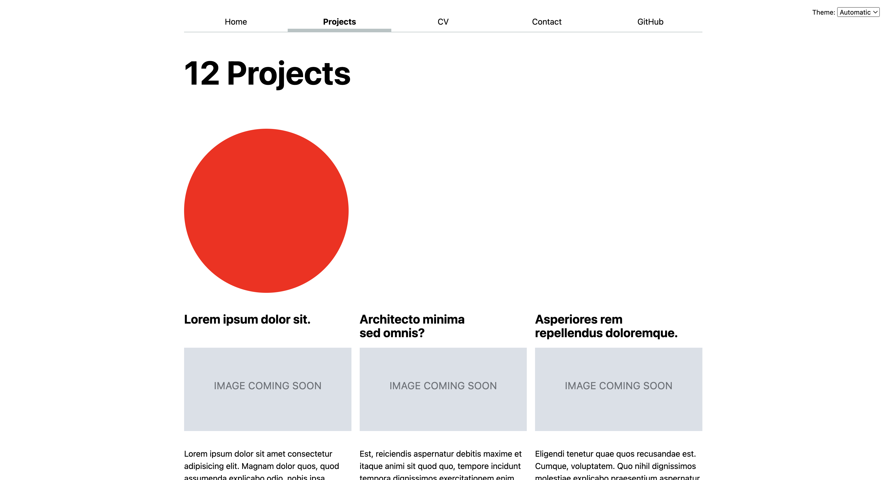
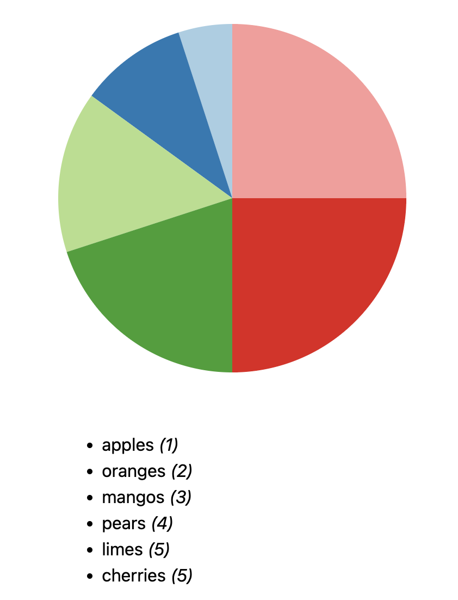
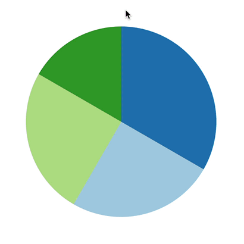
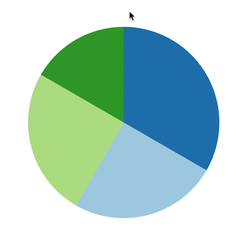

# Lab 6: Visualizing categorical data with D3

{: .no_toc}

{: .summary}

> In this lab, we will learn:
>
> - What is SVG and what does it look like?
> - What does D3 do?
> - How can we use D3 to draw a pie chart?
> - How can we create reactive visualizations of data that is changing?
> - How can we make interactive visualizations that change the data displayed on the page?
> - How can we make interactive visualizations accessible?

<details open markdown="block">
  <summary>
    Table of contents
  </summary>
  {: .text-delta }
- TOC
{:toc}
</details>

---

## Check-off

To get checked off for the lab, please record a 2 minute video with the following components:

1. Present your visualizations.
2. Show you interacting with your visualizations.
3. Share the most interesting thing you learned from this lab.

**Videos longer than 2 minutes will be trimmed to 2 minutes before we grade, so
make sure your video is 2 minutes or less.**

## Slides (or lack thereof)

No slides for this lab!

{: .note }
This lab is a little more involved than some of the previous labs,
because it’s introducing the core technical material around data visualization.
A robust understanding of these concepts will be invaluable
as you work on your final projects, so spending time practicing them for the lab
will be time will spent.

## Step 0: Update project data and add years

If you have not yet done [Step 3 of Lab 5](../../labs/5/#step-3-update-your-project-data), you should do it now.

### Step 0.1: Show year in each project

Since we have the year data, we should show it in the project list.
That way we can also more easily verify whether our code in the rest of the lab works correctly.

Edit the `<Project>` component (in `src/lib/Project.svelte`) to show the year of the project.
You can use any HTML you deem suitable and style it however you want.
I placed it under the project description (you’ll need to wrap both in the ame `<div>` otherwise they will occupy the same grid cell and overlap), and styled it like this:


{: .tip }
In case you like the above, the font-family is `Baskerville` (a system font) and I’m using `font-variant-numeric: oldstyle-nums` to make the numbers look a bit more like they belong in the text.

{: .note }

> From this point onwards, there are only two files that we will be editing in this lab:
>
> 1. `src/lib/Pie.svelte` (created in Step 1.1)
> 2. `src/routes/projects/+page.svelte` (our projects page)

## Step 1: Creating a pie chart with D3

### Step 1.1: Create a `<Pie>` component and use it in your project page

To keep the code manageable, we will be creating our pie chart in a separate component, called `<Pie>`.

Create a new `Pie.svelte` file in `src/lib` and add some text in it, e.g. "Hello from Pie.svelte".
Then, in your projects page, import the `<Pie>` component:

```js
import Pie from '$lib/Pie.svelte';
```

and then use it like `<Pie />`.
Save, and make sure the text you wrote in `Pie.svelte` is displayed in your project page to make sure all plumbing is working.

### Step 1.2: Create a circle with SVG

The first step to create a pie chart with D3 is to create an `<svg>` element in the `<Pie>` component.

{: .fyi }
D3 is a library that translates high level visualization concepts into low level drawing commands.
The technology currently used for these drawing commands is called [SVG](https://developer.mozilla.org/en-US/docs/Web/SVG) and is a language for drawing [vector graphics](https://en.wikipedia.org/wiki/Vector_graphics).
This means that instead of drawing pixels on a screen, SVG draws shapes and lines using descriptions of their geometry (e.g. centerpoints, radius, start and end coordinates, etc.).
It looks very much like HTML, with elements delineated by tags, tags delineated by angle brackets, and attributes within those tags.
However, instead of content-focused elements like `<h1>` and `<p>`, we have drawing-focused elements like `<circle>` and `<path>`.
SVG code can live either in separate files (with an `.svg` extension) or be embedded in HTML via the `<svg>` elements.

We will give it a [`viewBox`](https://developer.mozilla.org/en-US/docs/Web/SVG/Attribute/viewBox) of `-50 -50 100 100` which defines the coordinate system it will use internally.
In this case, it will have a width and height of 100, and the (0, 0) point will be in the center (which is quite convenient for a pie chart!).

We can use these coordinates to e.g. draw a red circle within it with a center at (0, 0) and a radius of 50 via the SVG [`<circle>`](https://developer.mozilla.org/en-US/docs/Web/SVG/Element/circle) element:

```html
<svg viewBox="-50 -50 100 100">
  <circle cx="0" cy="0" r="50" fill="red" />
</svg>
```

Since we have not given the graphic any explicit dimensions, by default it will occupy the entire width of its parent container and will have an aspect ratio of 1:1 (as defined by its coordinate system). It will look a bit like this:


We can add some CSS in the component’s `<style>` element to limit its size a bit and also add some spacing around it:

```css
svg {
  max-width: 20em;
  margin-block: 2em;

  /* Do not clip shapes outside the viewBox */
  overflow: visible;
}
```

This will make it look like this:



### Step 1.3: Using a `<path>` instead of a `<circle>`

A [`<circle>`](https://developer.mozilla.org/en-US/docs/Web/SVG/Element/circle) element is an easy way to draw a circle, but we can’t really go anywhere from there: it can _only_ draw circles.
If we were drawing pie charts directly in SVG, we’d need to switch to another element, that is more complicated, but also more powerful: the [`<path>`](https://developer.mozilla.org/en-US/docs/Web/SVG/Element/path) element.

The [`<path>`](https://developer.mozilla.org/en-US/docs/Web/SVG/Element/path) element can draw any shape, but its syntax is a little unwieldy.
It uses a string of commands to describe the shape, where each command is a single letter followed by a series of numbers that specify command parameters.
All of this is stuffed into a single [`d`](https://developer.mozilla.org/en-US/docs/Web/SVG/Attribute/d) attribute.

Here is our circle as a `<path>` element:

```html
<svg viewBox="-50 -50 100 100">
  <path d="M -50 0 A 50 50 0 0 1 50 0 A 50 50 0 0 1 -50 0" fill="red" />
</svg>
```

This draws the circle as two arcs, each of which is defined by its start and end points, its radius, and a few flags that control its shape.
Before you run away screaming, worry not, because D3 saves us from this chaos by _generating_ the path strings for us.
Let’s use it then!

### Step 1.3: Drawing our circle path with D3

Now let's use D3 to create the same path, as a first step towards our pie chart.

First, we need to add D3 to our project so we can use it in our JS code.
Open the VS Code terminal and run:

```bash
npm install d3
```

Ignore any warnings about peer dependencies.

So now that D3 is installed how do we use it?
In your Pie component, add the following import statement at the top of the `<script>` element:

```javascript
import * as d3 from 'd3';
```

Now let’s use the [`d3.arc()`](https://d3js.org/d3-shape/arc#arc) function from the [D3 Shape](https://d3js.org/d3-shape) module to create the path for our circle.
This works with two parts: first, we create an _arc generator_ which is a function that takes data and returns a path string.
We’ll configure it to produce arcs based on a radius of `50`
by adding `.innerRadius(0).outerRadius(50)`.
If you instead want to create a donut chart, it’s as easy as changing the inner radius to something other than `0`!

```javascript
let arcGenerator = d3.arc().innerRadius(0).outerRadius(50);
```

We then generate an arc by providing a starting angle (`0`) and an ending angle in radians (`2 * Math.PI`) to create a full circle:

```javascript
let arc = arcGenerator({
  startAngle: 0,
  endAngle: 2 * Math.PI,
});
```

{: .fyi }

> Did we need two statements? Not really, we only did so for readability.
> This would have been perfectly valid JS:
>
> ```javascript
> let arc = d3.arc().innerRadius(0).outerRadius(50)({
>   startAngle: 0,
>   endAngle: 2 * Math.PI,
> });
> ```

Now that we have our path, we can add it to our SVG:

```html
<svg viewBox="-50 -50 100 100">
  <path d="{arc}" fill="red" />
</svg>
```

### Step 1.4: Drawing a static pie chart with D3

’Nuff dilly-dallying with circles, let’s cut to the chase and draw a pie chart!
Let’s draw a pie chart with two slices, one for each of the numbers `1` and `2`, i.e. a 33% and 66% slice.

```js
let data = [1, 2];
```

We’ll draw our pie chart as two `<path>` elements, one for each slice.
First, we need to calculate the total, so we can then figure out what proportion of the total each slice represents:

```js
let total = 0;

for (let d of data) {
  total += d;
}
```

Then, we calculate the start and end angles for each slice:

```js
let angle = 0;
let arcData = [];

for (let d of data) {
  let endAngle = angle + (d / total) * 2 * Math.PI;
  arcData.push({ startAngle: angle, endAngle });
  angle = endAngle;
}
```

And now we can finally calculate the actual paths for each of these slices:

```js
let arcs = arcData.map((d) => arcGenerator(d));
```

Now let’s wrap our `<path>` element with an `{#each}` block since we are now generating multiple paths:

```html
{#each arcs as arc}
<path d="{arc}" fill="red" />
{/each}
```

If we reload at this point, all we see is …the same red circle.
A bit anticlimactic, isn’t it?

However, if you inspect the circle, you will see it actually consists of two `<path>` elements.
We just don’t see it, because they’re both the same color!


Let’s assign different colors to our slices, by adding a `colors` array and using it to set the `fill` attribute of our paths:

```js
let colors = ['gold', 'purple'];
```

Then we convert our code to use it:

```html
{#each arcs as arc, i}
<path d="{" arc } fill="{" colors[i] } />
{/each}
```

The result should look like this:


Phew! 😮‍💨 Finally an actual pie chart!

{: .tip }
While it does no harm, make sure to clean up your code by removing the `arc` variable we defined early on in this step, since we’re no longer using it.

Now let’s clean up the code a bit.
D3 actually provides a higher level primitive for what we just did: the [`d3.pie()`](https://d3js.org/d3-shape/pie) function.
Just like `d3.arc()`, `d3.pie()` is a function that returns another function, which we can use to generate the start and end angles for each slice in our pie chart instead of having to do it ourselves.

This …_slice generator_ function takes an array of data values and returns an array of objects, each of whom represents a slice of the pie and contains the start and end angles for it.
We still feed these objects to our `arcGenerator` to create the paths for the slices,
but we don’t have to create them manually.
It looks like this:

```js
let data = [1, 2];
let sliceGenerator = d3.pie();
let arcData = sliceGenerator(data);
let arcs = arcData.map((d) => arcGenerator(d));
```

### Step 1.5: Adding more data

Let’s tweak the `data` array to add some more numbers:

```js
let data = [1, 2, 3, 4, 5, 5];
```

Our pie chart did adapt, but all the new slices are black!
They don’t even look like four new slices, but rather a huge black one. 😭


This is because we’ve only specified colors for the first two slices.
We _could_ specify more colors, but this doesn’t scale.
Thankfully, D3 comes with both ordinal and sequential color scales that can generate colors for us based on our data.

For example to use the [`schemePaired` color scale](https://d3js.org/d3-scale-chromatic/categorical#schemePaired) we use the [`d3.scaleOrdinal()`](https://d3js.org/d3-scale/ordinal#scaleOrdinal) function with that as an argument:

```js
let colors = d3.scaleOrdinal(d3.schemeTableau10);
```

We also need to change `colors[index]` to `colors(index)` in our template, since `colors` is now a function that takes an index and returns a color.

This is the result:


Success! 🎉

## Step 2: Adding a legend

Our pie chart looks good, but there is no way to tell what each slice represents.
Let’s fix that!

### Step 2.1: Adding labels to our data

First, even our data does not know what it is — it does not include any labels, but only random quantities.

D3 allows us to specify more complex data, such as an array of objects:

```js
let data = [
  { value: 1, label: 'apples' },
  { value: 2, label: 'oranges' },
  { value: 3, label: 'mangos' },
  { value: 4, label: 'pears' },
  { value: 5, label: 'limes' },
  { value: 5, label: 'cherries' },
];
```

However, to use this data, we need to change our `sliceGenerator` to tell it how to access the values in our data:

```js
let sliceGenerator = d3.pie().value((d) => d.value);
```

If everything is set up correctly, you should now see the same pie chart as before.

### Step 2.2: Adding a legend

The colors D3 scales return are just regular CSS colors.
We can actually create a legend with plain HTML and CSS.

We can use a `<ul>` element, but a `<dl>` would have been fine too.

We use the same `{#each}` block to create a list item for each slice, and use a CSS variable (e.g. `--color`) to pass the color to CSS for styling.

```html
<ul class="legend">
  {#each data as d, index}
  <li style="--color: { colors(index) }">
    <span class="swatch"></span>
    {d.label} <em>({d.value})</em>
  </li>
  {/each}
</ul>
```

At this point, it doesn’t look like a legend very much:



We need to add some CSS to make it look like an actual legend.
You can experiment with the styles to make it look the way you want, but we’re including some tips below.

#### Making the swatch look like a swatch

You could probably want to make the swatch look like a swatch by:

1. Making it a square by e.g. giving it the same width and height, or one the two plus `aspect-ratio: 1 / 1`
2. Giving it a background color of `var(--color)`
3. You may find [`border-radius`](https://developer.mozilla.org/en-US/docs/Web/CSS/border-radius) useful to add slight rounding to the corners or even make it into a full circle by setting it to `50%`.

{: .tip }
Note that because `<span>` is an inline element by default, to get widths and heights to work, you need to set it to `display: inline-block` or `inline-flex` (or apply `display: flex` or `display: grid` on its parent).

#### Applying layout on the list to make it look like a legend

I applied `display: grid` to the `<ul>` (via suitable CSS rules). To make the grid make best use of available space, I used an `auto-fill` grid template, and set the `min-width` of the list items to a reasonable value.

```css
grid-template-columns: repeat(auto-fill, minmax(9em, 1fr));
```

This lays them all out on one line if there’s space, or multiple columns if not.

I also applied `display: flex` on each `<li>` (via suitable CSS rules) to vertically center align the text and the swatch (`align-items: center`) and give it spacing via `gap`

{: .tip }
Make sure the `gap` you specify for the `<li>`s is smaller than the `gap` you specify for the whole legend’s grid, to honor the [design principle of _Proximity_](https://www.nngroup.com/articles/gestalt-proximity/).

---

You probably also want to specify a border around the legend, as well as spacing inside it (`padding`) and around it (`margin`). The final result will vary depending on your exact CSS, but this was mine:


### Step 2.3: Laying out our pie chart and legend side by side

Right now, our pie chart and legend are occupying _a ton_ of space on our page. It’s more common to place the legend to the right of the pie chart, so let’s do that.

We can do that by wrapping both the pie chart and the legend with a shared container, and using a flex layout on it.

```html
<div class="container">
  <svg viewBox="-50 -50 100 100">
    <!-- ... -->
  </svg>
  <ul class="legend">
    <!-- ... -->
  </ul>
</div>
```

You can experiment with the horizontal alignment (`align-items`) and spacing (`gap`) of the pie chart and legend, but I would recommend applying `flex: 1` to the legend, so that it occupies all available width.

If everything worked well, you should now see the pie chart and legend side by side and it should be _responsive_, i.e. adapt well to changes in the viewport width.

<video src="videos/responsive-legend.mp4" autoplay loop muted></video>

## Step 3: Plotting our actual data

So far, we’ve been using meaningcless hardcoded data for our pie chart.
Let’s change that and plot our actual project data, and namely projects per year.

### Step 3.1: Making `data` a prop

Hardcoding data within the pie component would give us a pie chart component that can only be used for one specific pie chart.
That’s not very useful!
Instead, we want to make `data` a [prop](https://svelte.dev/docs/svelte-components#script) of the component, so we can pass it to the component from the page that uses it.

There are two parts to that change:
First, changing our `data` declaration to an export (and its value to an empty array, which will be its default value):

```js
export let data = [];
```

Then, we can pass the same data we’ve used in step 2.1 **from our projects page this time**, by first assigning them to a variable:

```js
let pieData = [
  { value: 1, label: 'apples' },
  { value: 2, label: 'oranges' },
  { value: 3, label: 'mangos' },
  { value: 4, label: 'pears' },
  { value: 5, label: 'limes' },
  { value: 5, label: 'cherries' },
];
```

and then passing it to the `<Pie>` component:

```html
<Pie data="{pieData}" />
```

If everything worked well, we should now see the same pie chart (and legend) as before.

### Step 3.2: Passing project data via the `data` prop

Now that we’re passing the data from the Projects page, let’s calculate the labels and values we’ll pass to the pie chart from our project data.
We will be displaying a chart of projects per year, so the labels would be the years, and the values the count of projects for that year.
But how to get from [our project data](../4/#step-42-importing-our-project-data-into-our-projects-page) to that array?

D3 does not only provide functions to generate visual output, but includes powerful helpers for manipulating data.
In this case, we’ll use the `d3.rollups()` function to group our projects by year and count the number of projects in each bucket:

```js
let rolledData = d3.rollups(
  projects,
  (v) => v.length,
  (d) => d.year,
);
```

This will give us an array of arrays that looks like this:

```js
[
  ['2024', 3],
  ['2023', 4],
  ['2022', 3],
  ['2021', 2],
];
```

We will then convert this array to the type of array we need by using [`array.map()`](https://developer.mozilla.org/en-US/docs/Web/JavaScript/Reference/Global_Objects/Array/map).
Replace your previous `pieData` declaration with:

```js
let pieData = rolledData.map(([year, count]) => {
  return { value: count, label: year };
});
```

That’s it! The result should look like this:


## Step 4: Adding a search for our projects and only visualizing visible projects

At first glance, this step appears a little unrelated to the rest of this lab.
However, it demonstrates how these visualizations don’t have to be static, but can _reactively update with the data_, a point we will develop further in the next lab.

### Step 4.1: Adding a search field

First, declare a variable that will hold the search query in the `<script>` element of your projects page:

```js
let query = '';
```

Then, add an `<input type="search">` to the HTML, and bind its value to that variable:

```html
<input
  type="search"
  bind:value="{query}"
  aria-label="Search projects"
  placeholder="🔍 Search projects…"
/>
```

{: .tip }
As usual, you can print out the variable in your HTML via `{query}` to make sure the binding works as expected.

### Step 4.2: Basic search functionality

This is the same regardless of whether you have implemented [Step 7 of Lab 4](../../4/#step-7-creating-a-project-list-component-optional) or not,
since we’ll be filtering the projects by changing the data that we are displaying.

However, in Lab 4 we avoided having to change our single project template by doing

```js
let p = info;
```

Since in this step we will be reactively updating the projects displayed,
it's time to actually **delete that alias** and edit our expressions to use the actual prop name (e.g. use `info.title` instead of `p.title`).

To filter the project data, we will use the [`array.filter()`](https://developer.mozilla.org/en-US/docs/Web/JavaScript/Reference/Global_Objects/Array/filter) function,
which returns a new array containing only the elements that pass the test implemented by the provided function.

For example, this is how we’d search in project titles:

```js
let filteredProjects = projects.filter((project) => {
  if (query) {
    return project.title.includes(query);
  }

  return true;
});
```

{: .fyi }
`return project.title.includes(query);` by itself would have actually worked fine,
since if the query is `""`, then every project title contains it anyway.
However, there is no reason to do extra work if we don’t have to.

For this to work, we’d need to use `filteredProjects` instead of `projects` in our template that displays the projects.

If you try this out, you’ll notice that no filtering is actually happening.
This is because we are only executing the filtering once, when our search query is empty

For the filtering to re-run whenever the query changes, we need to make it a [_reactive statement_](https://svelte.dev/tutorial/reactive-statements) by using the [`$:` prefix](https://svelte.dev/tutorial/reactive-statements):

```js
let filteredProjects;
$: filteredProjects = projects.filter((project) => {
  if (query) {
    return project.title.includes(query);
  }

  return true;
});
```

If you try it now, filtering should work!

<video src="videos/search-titles.mp4" autoplay muted loop></video>

<!-- TODO: Mention debounce -->

### Step 4.3: Improving the search

Finding projects by title is a good first step,
but it could make it hard to find a project.
Also, it’s case-sensitive, so e.g. searching for “svelte” won’t find “Svelte”.

Let’s fix both of these!

#### Make the search case-insensitive

To do this, we can simply convert _both_ the query and the title to lowercase before comparing them by using the [`string.toLowerCase()`](https://developer.mozilla.org/en-US/docs/Web/JavaScript/Reference/Global_Objects/String/toLowerCase) function:

```js
$: filteredProjects = projects.filter((project) => {
  if (query) {
    return project.title.toLowerCase().includes(query.toLowerCase());
  }

  return true;
});
```

#### Search across all project metadata, not just titles

For the second, we can use the [`Object.values()`](https://developer.mozilla.org/en-US/docs/Web/JavaScript/Reference/Global_objects/Object/values) function to get an array of all the values of a project, and then join them into a single string, which we can then search in the same way:

```js
$: filteredProjects = projects.filter((project) => {
  let values = Object.values(project).join('\n').toLowerCase();
  return values.includes(query.toLowerCase());
});
```

Try it again. Both issues should be fixed at this point.

<video src="videos/search-titles.mp4" autoplay muted loop></video>

### Step 4.4: Visualizing only visible projects

As it currently stands, our pie chart and legend are not aware of the filtering we are doing.
Wouldn’t it be cool if we could see stats _only_ about the projects we are currently seeing?

There are two components to this:

1. Calculate `pieData` based on `filteredProjects` instead of `projects`
2. Make it update reactively.

The former is a simple matter of replacing the variable name used in your projects page \*\*from `projects` to `filteredProjects`.
The second does involve something we have not yet done:
how do we turn something that consists of several lines into a reactive statement?
So far we’ve only been prepending single commands with `$:`!

The answer is that we can use a block statement (`{}`) to contain multiple commands, and then prepend _that_ with `$:`:

```js
// Make sure the variable definition is *outside* the block
let pieData;

$: {
  // Initialize to an empty object every time this runs
  pieData = {};

  // Calculate rolledData and pieData based on filteredProjects here
}
```

If you try the search out at this point, you will see that the legend is updating, but the pie chart is not.

<video src="videos/legend-reactive.mp4" autoplay muted loop></video>

This is because none of the calculations in the `<Pie>` component are actually reactive.
We need to make them reactive by separating the variable declarations from the value calculations and using the `$:` prefix on the latter.

This only applies to `arcData` and `arcs`, since none of the rest needs to actually change.

Once we do that, our pie chart becomes beautifully reactive as well:

<video src="videos/pie-reactive.mp4" autoplay muted loop></video>

## Step 5: Turning the pie into filtering UI for our projects

**Visualizations are not just output.**
Interactive visualizations allow you to _interact_ with the data as well and explore it more effective ways.

In this step, we will turn our pie chart into a filtering UI for our projects,
so we can click on the wedge or legend entry for a given year and only see projects from that year.

It will work a bit like this:

<video src="videos/year-filter-final.mp4" autoplay loop muted></video>

Ready? Let’s go!

### Step 5.1: Highlighting hovered wedge

While there are some differences, SVG elements are still DOM elements.
This means they can be styled with regular CSS, although the available properties are not all the same.

Let’s start by adding a hover effect to the wedges.
What about fading out all _other_ wedges when a wedge is hovered?
We can target the `<svg>` element when it contains a hovered `<path>`
by using the `:has()` pseudo-class:

```scss
svg:has(path:hover) {
  path:not(:hover) {
    opacity: 50%;
  }
}
```

This gives us something like this:



{: .fyi }
Why not just use `svg:hover` instead of `svg:has(path:hover)`?
Because the `<svg>` can be covered _without_ any of the wedges being hovered, and then _all_ wedges would be faded out.

We can even make it smooth by adding a `transition` property to the `<path>` elements:

```css
path {
  transition: 300ms;
}
```

Which would look like this:

<figure class="multiple stretch">




<figcaption>Before (left) and after (right) adding the transition</figcaption>
</figure>

{: .tbd}

### Step 5.2: Highlighting selected wedge

In this step, we will be able to click on a wedge and have it stay highlighted.
Its color will change to indicate that it’s highlighted, and its legend item will also be highlighted.
Pages using the component should be able to read what the selected wedge is, if any.
Clicking on a selected wedge should deselect it.

<video src="videos/wedge-select.mp4" loop autoplay muted></video>

First, create a `selectedIndex` prop and initialize it to `-1` (a convention to mean "no index"):

```js
export let selectedIndex = -1;
```

Then, add an `on:click` event on your `<path>` to set it to the index of the wedge that was clicked:

```html
{#each arcs as arc, index} <path d={arc} fill={ colors(index) } on:click={e =>
selectedIndex = index} /> {/each}
```

Ignore the accessibility warnings for now, we will address them at the end.

Right now, there is no observable difference when we click on a wedge,
since we’re not doing anything with the `selectedIndex`.
Let’s use it to conditionally apply a `selected` class, that we can then use in our CSS to style selected wedges differently:

```html
{#each arcs as arc, index} <path d={arc} fill={ colors(index) }
class:selected={selectedIndex === index} on:click={e => selectedIndex = index}
/> {/each}
```

You can apply the exact same `class:selected` directive to conditionally apply a `selected` class to the legend items as well.

Then let’s apply CSS to change the color of the selected wedge and legend item:

```scss
.selected {
  --color: oklch(60% 45% 0) !important;

  &:is(path) {
    fill: var(--color);
  }
}
```

Feel free to use any color you want, as long as it’s disctinct from the actual wedge colors.

{: .fyi }
Why the `!important`? Because we are trying to override the `--color` variable set via the `style` attribute, which has higher precedence than any selector.

<!--
It should look like this:

 -->

Lastly, we want to be able to deselect a wedge by clicking on it again.

This is as simple as setting `selectedIndex` to `-1` if it’s already the index of the selected wedge,
i.e. changing the assignment to

```js
selectedIndex = selectedIndex === index ? -1 : index;
```

{: .tip }

> You can improve UX by indicating that a wedge is clickable through the cursor:
>
> ```css
> path {
>   /* ... */
>   cursor: pointer;
> }
> ```

### Step 5.3: Filtering the projects by the selected year

Selecting a wedge doesn’t really do that much right now.
However, the ability to select a wedge becomes truly powerful when handled by the parent page.

In `src/routes/projects/+page.svelte`, add a variable to hold the selected index:

```js
let selectedYearIndex = -1;
```

Then bind it to the `<Pie>` component’s `selectedIndex` prop:

```html
<Pie data="{pieData}" bind:selectedIndex="{selectedYearIndex}" />
```

Make sure that it works by printing out the selected index in an expression (`{selectedYearIndex}`) somewhere on the page.

<video src="videos/selected-year-index.mp4" autoplay loop muted></video>

Now define a reactive variable to hold the selected _year_:

```js
let selectedYear;
$: selectedYear =
  selectedYearIndex > -1 ? pieData[selectedYearIndex].label : null;
```

Similarly, print it out somewhere on the page to make sure it works before proceeding.

Now that we have the selected year, we can filter the projects by it!

Our first thought might be to do this filtering by adding another conditional in our `array.filter()` call from Step 4:

```js
$: filteredProjects = projects.filter((project) => {
  if (query) {
    // ...
  }

  if (selectedYear) {
    return project.year === selectedYear;
  }

  return true;
});
```

However, this will produce an error:


But even if it worked, it would make for some pretty jarring user experience:
because we are using the same `filteredProjects` variable for the pie chart as well,
it would make all other years disappear from the pie chart when a year is selected.
The only way to select another year would be to deselect the current one.

Instead, we should use _another_ variable to hold the result of that filtering, e.g. `filteredByYear`.

Then, use `filteredByYear` in your template where you are displaying the actual projects,
but leave `filteredProjects` as it is for the pie chart.

That’s it! It should work now.

<video src="videos/year-filter-final.mp4" autoplay loop muted class="browser"></video>

### Step 5.4: Fixing accessibility issues (Optional, but strongly recommended)

Now that we got the basic functionality working, let’s address the accessibility warnings.

It's important to understand why these warnings are there.
The `path` elements are not focusable by default, so they cannot be interacted with using the keyboard.
This means that as it currently stands, people who cannot use a mouse or other pointing device cannot select a wedge.
Even users who _can_ use a mouse, often find keyboard interactions more convenient (e.g. imagine filling out a form by clicking on each field with the mouse instead of pressing <kbd>Tab</kbd>!).

So how do we fix this?
The first step is making it possible to interact with these wedges with the keyboard at all.
Right now, you cannot even select a wedge by pressing the <kbd>Tab</kbd> key on your keyboard, because they are not _focusable_.

We can fix this by adding a few attributes to the `<path>` elements:

- Make it focusable, by adding [`tabindex="0"`](https://developer.mozilla.org/en-US/docs/Web/HTML/Global_attributes/tabindex)
- Expose it as a button to assistive technology, by adding [`role="button"`](https://developer.mozilla.org/en-US/docs/Web/Accessibility/ARIA/Roles)
- Adding a label via [`aria-label`](https://developer.mozilla.org/en-US/docs/Web/Accessibility/ARIA/Attributes/aria-label)

We’re not done yet.
All that these do is to make sure users of assistive technology can actually interact with the wedge.
However, because it's not a native button or link, the `click` event will not be triggered when the user focuses on the wedge with the keyboard and presses `Enter` or `Space`.
Instead, we need to enable that, via a separate event listener (`keyup` is a good candidate).

To avoid duplicating code, let’s move the code that selects a wedge into a separate function:

```js
function toggleWedge(index, event) {
  selectedIndex = index;
}
```

Then replace `on:click={e => selectedIndex = index}` with `on:click={e => toggleWedge(index, e)}`.
Now add a keyboard event listener: `on:keyup={e => toggleWedge(index, e)}`.

In the `toggleWedge` function, we can wrap the code that selects the wedge with a conditional that checks that either `event.key` doesn't exist, or if it does, that it is `Enter`:

```js
function toggleWedge(index, event) {
  if (!event.key || event.key === 'Enter') {
    selectedIndex = index;
  }
}
```

If you try the keyboard interaction out you will notice that it works, but even when we are interacting with it via the mouse, we get an unwieldy focus ring around the wedge
which looks awful since it’s actually covered by the other wedges:


We can hide that with `outline: none`:

```css
path {
  transition: 300ms;
  outline: none;
}
```

However, now keyboard users have no way to know which wedge they have currently focused,
which is a terrible user experience.
**Never, ever remove the browser’s default focus styles without providing alternative focus styles**.
Often extending `:hover` styles to cover [`:focus-visible`](https://developer.mozilla.org/en-US/docs/Web/CSS/:focus-visible) as well is a good start.
So let’s extend our previous `:hover` effect to keyboard users as well:

```scss
svg:has(path:hover, path:focus-visible) {
  path:not(:hover, :focus-visible) {
    opacity: 50%;
  }
}
```

If you try out the keyboard interaction now, you will notice that we are getting a visible indication of focus, and that the unwieldy default focus ring is no longer visible.
Yay! 🎉

### Step 5.5: Better selected wedge styling (Optional)

We are currently only indicating which wedge is selected by its _color_,
which is a little confusing (not to mention problematic for colorblind users),
since that could be just another color in the pie chart.

The reason we went with that is that it’s easier than pretty much any alternative,
but if you want to go further, we can do it in a better way.

First, it’s important to understand something about SVG:

{: .important }
Shapes are painted in the order they appear in the source code,
and unlike in HTML, there is no way to change this order with CSS.

This means that decorations like [strokes](https://developer.mozilla.org/en-US/docs/Web/SVG/Attribute/stroke) or [shadows](https://developer.mozilla.org/en-US/docs/Web/CSS/filter) will work nicely for one of the wedges and fail miserably for the others:

<video src="videos/stroke-yikes.mp4" autoplay loop muted></video>

Yikes on bikes!
So what can we do?

A common technique is to _move_ the selected wedge to the very end with JS or make a copy, then style that.
But we’ll try something different: we’ll move the selected slice outwards a bit, and make it a bit bigger,
like taking a pizza slice from a large colorful pizza.
It will look like this:

<video src="videos/pizza-slice-final.mp4" autoplay loop muted></video>

We will need the start and end angles in our CSS, so the first step is to pass them in as CSS variables:

```html
<path d={arc} style="
	--start-angle: { arcData[index]?.startAngle }rad;
	--end-angle: { arcData[index]?.endAngle }rad;"
```

{: .important }
Note the `rad` at the end: CSS angles need a unit too.

Then, in the CSS we can calculate the difference, and the angle to get to the midpoint of the arc:

```scss
path {
  --angle: calc(var(--end-angle) - var(--start-angle));
  --mid-angle: calc(var(--start-angle) + var(--angle) / 2);
}
```

Now comes the fun part:
We will use the `transform` property to rotate to the midpoint of the arc (so that we move along that angle),
move by 6, then rotate back to restore the original orientation:

```scss
path {
  --angle: calc(var(--end-angle) - var(--start-angle));
  --mid-angle: calc(var(--start-angle) + var(--angle) / 2);

  &.selected {
    transform: rotate(var(--mid-angle)) translateY(-6px) rotate(calc(-1 * var(--mid-angle)));
  }
}
```

If you try it, it should work, even if a little rough around the edges:

<video src="videos/pizza-slice-1.mp4" autoplay loop muted></video>

<figure>
<video src="videos/transforms-explained.mp4" autoplay loop muted></video>
<figcaption>
To better understand what this is doing, let’s break it down, by showing the rotate, move, and rotate back one after the other
</figcaption>
</figure>

The reason it’s a little janky when we click on it, is that it’s transitioning all three transforms at once.
If we apply a transform on its non-selected state as well, we can fix that:

```scss
path {
  transform: rotate(var(--mid-angle)) translateY(0) rotate(calc(-1 * var(--mid-angle)));
  /* ... */
}
```

And let’s also make it a little bigger, by adding a `scale(1.1)` transform as well:

```css
&.selected {
  transform: rotate(var(--mid-angle)) translateY(-6px) scale(1.1) rotate(
      calc(-1 * var(--mid-angle))
    );
}
```

This is the final result:

<video src="videos/pizza-slice-final.mp4" autoplay loop muted></video>
