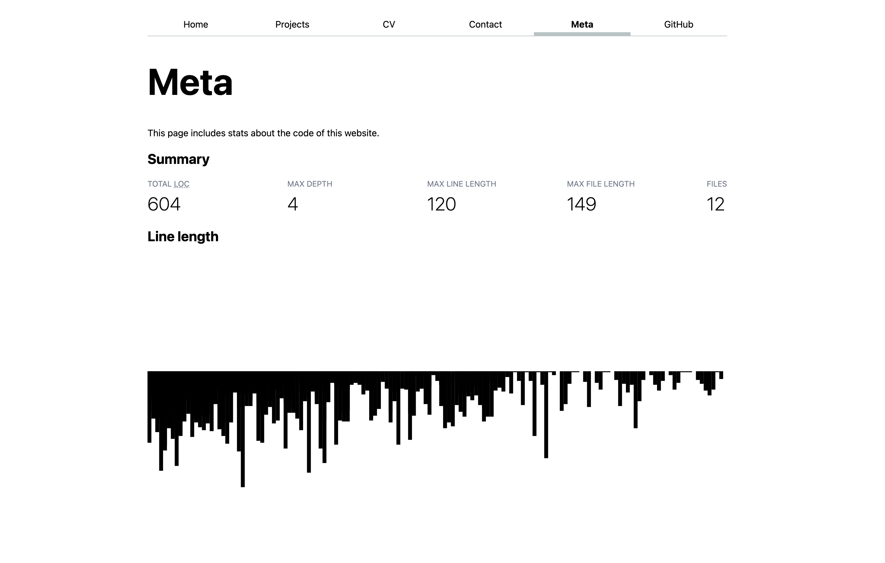
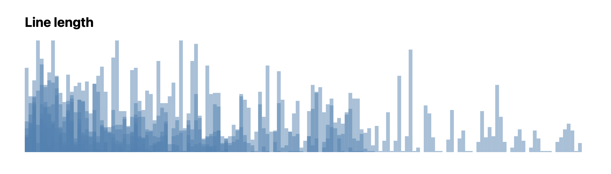
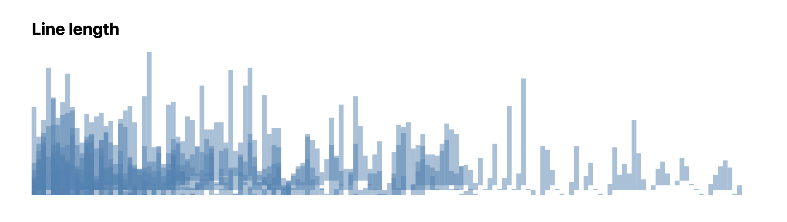
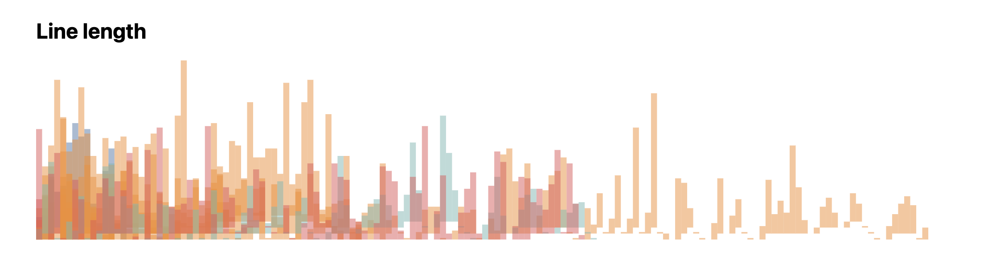
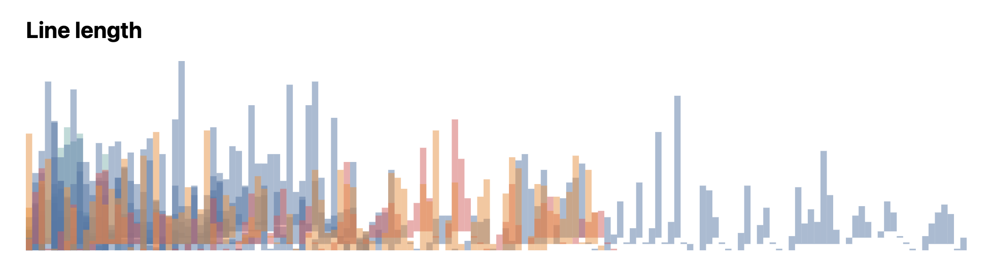

# Old content, ignore

## Step 5: Bar plot of line length and depth by line number

Summary stats are nice, but it's hard to get a good picture of the distribution of the data and any potential correlations.

Let’s try and figure out if there are any correlations between line number, depth, and index by visualizing them as a bar plot.

### Step 4.1: Basic bar chart of line length by line number

First, let’s define a width and height for our coordinate space:

```js
let width = 1000;
let height = 200;
```

and an SVG to hold our chart:

```html
<svg viewBox="0 {-height} {width} {height}">
  <!-- bars will go here -->
</svg>
```

Note that we used a [`viewBox`](https://developer.mozilla.org/en-US/docs/Web/SVG/Attribute/viewBox) with a minimum Y coordinate of `{-height}` so that the bottom of the SVG is Y=0, which will make plotting easier.

Now, as shown in the [web-based visualization lecture](https://vis-society.github.io/lectures/intro-svelte-d3.html),
we create scales to map our data to the coordinate space using the [d3-scale](https://d3js.org/d3-scale/linear) module:

```js
$: xScale = d3
  .scaleBand()
  .domain(data.map((d) => d.line))
  .range([0, width]);

$: yScale = d3
  .scaleLinear()
  .domain([0, d3.max(data, (d) => d.length)])
  .range([0, height]);
```

This will allow us to draw bars inside our `<svg>` in a pretty straightforward way,
without having to do the mapping calculations ourselves:

```html
<svg viewBox="0 -{height} {width} {height}">
  {#each data as d, i}
  <rect
    x="{xScale(d.line)}"
    width="{xScale.bandwidth()}"
    height="{yScale(d.length)}"
    fill="steelblue"
  />
  {/each}
</svg>
```

At this point our chart looks like this:

<!-- TODO update screenshot -->



Let’s add some style in a `<style>` element:

```js
svg {
	/* Don’t clip content outside the <svg> element */
	overflow: visible;
}

rect {
	/* Flip bar vertically */
	transform: scaleY(-1);

	/* Make bars semi-transparent to see overlap */
	fill-opacity: .5;
}
```

<!-- TODO use y instead of viewBox + transform -->

The final result looks a bit like this (the exact shape will vary based on your data):



### Step 4.2: Shifting the bars by indentation level

<!-- TODO
 - line chart of commits per date (additions, deletions, lines)
 - parse lines to figure out actual tech used
 - has comment? is comment? then comments to code ratio
 -->

Even though our bars overlap, the overlap does not actually convey meaningful information,
because the data points do not correspond to the actual position of the code in the line.
To illustrate that, let’s shift the bars up by the depth of the line.

The result looks like this:



### Step 4.3: Different color per file type

First, let’s reactively mutate the data to add a `type` property to each object,
which will contain the file extension of the file the line is from.

```js
$: {
  for (let d of data) {
    d.type = d.file.split('.').pop();
  }
}
```

Then let’s map the Tableau color scale to the file types,
using `d3.scaleOrdinal()`:

```js
$: colors = d3
  .scaleOrdinal()
  .domain(data.map((d) => d.type))
  .range(d3.schemeTableau10);
```

and change the hardcoded `fill="steelblue"` with `fill={colors(d.type)}` in the `<rect>` element.

If we preview at this point, we’ll get something like this:



This is because colors get randomly assigned to file types based on the order they appear in our dataset.
Let’s change this and apply the colors in order starting from the file types with the most lines of code.
First, we need to _count_ the number of lines per file type:

```js
$: typeStats = Object.fromEntries(
  d3.rollup(
    data,
    (v) => v.length,
    (d) => d.type,
  ),
);
```

this is a D3 [`InternMap`](https://d3js.org/d3-array/intern#InternMap),
which is similar to a JS [`Map`](https://developer.mozilla.org/en-US/docs/Web/JavaScript/Reference/Global_Objects/Map).
You can see what data it contains by temporarily adding this line to your HTML:

```html
{JSON.stringify(typeStats, null, "\t")}
```

in my case it printed:

```
{ "html": 15, "svelte": 403, "js": 93, "css": 93 }
```

Now let’s sort this map by value, using the [`d3.sort()`](https://d3js.org/d3-array/sort#sort) method from `d3-array`:

```js
$: typeStats = Object.fromEntries(
  d3.sort(
    d3.rollup(
      data,
      (v) => v.length,
      (d) => d.type,
    ),
    (d1, d2) => d3.descending(d1[1], d2[1]),
  ),
);
```

At this point it may be clearer to use a statement block:

```js
let typeStats = {};
$: {
  let stats = d3.rollup(
    data,
    (v) => v.length,
    (d) => d.type,
  );
  let sortedStats = d3.sort(stats, (d1, d2) => d3.descending(d1[1], d2[1]));
  typeStats = Object.fromEntries(sortedStats);
}
```

The output should have now changed. In my case it was:

```
{ "svelte": 403, "js": 93, "css": 93, "html": 15 }
```

Now instead of mapping our raw data to the color scale, let’s map the keys of this map,
by replacing `data.map(d => d.type)` with `Object.keys(typeStats)` in the `colors` scale definition:

```js
$: colors = d3
  .scaleOrdinal()
  .domain(Object.keys(typeStats))
  .range(d3.schemeTableau10);
```

We should be seeing something like this:



### Step 5: Adding a tooltip

There’s a lot going on in our chart, and it's a little hard to process.
It may be helpful to be able to see the exact data each bar represents by hovering over it and seeing the data that corresponds to the data point hovered.
