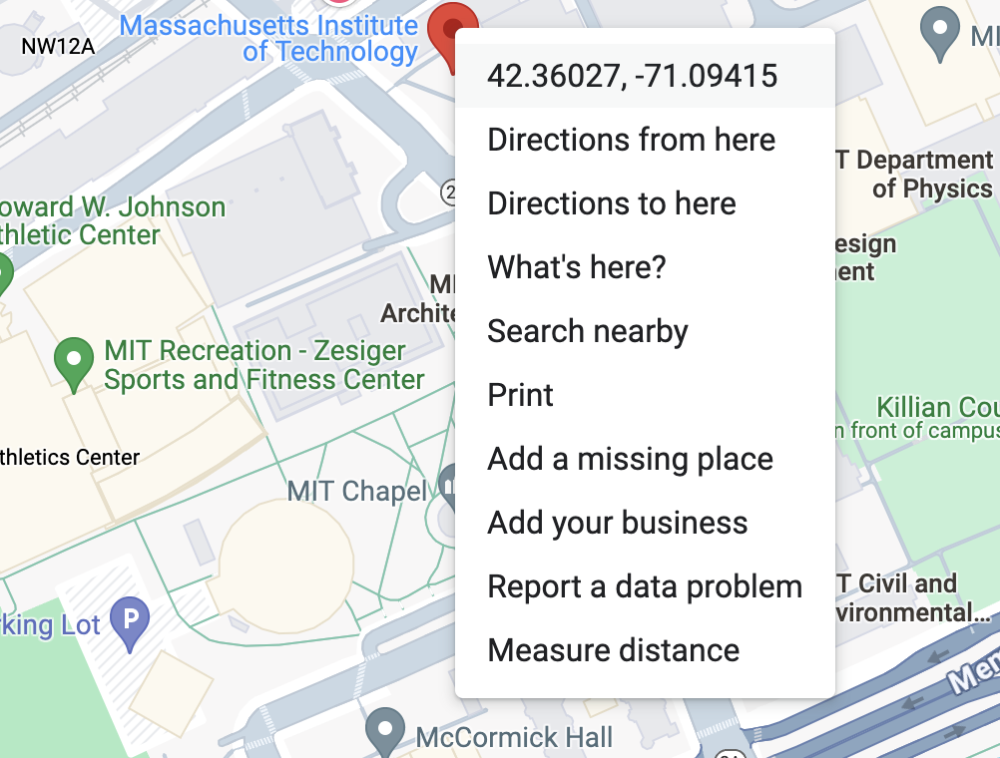
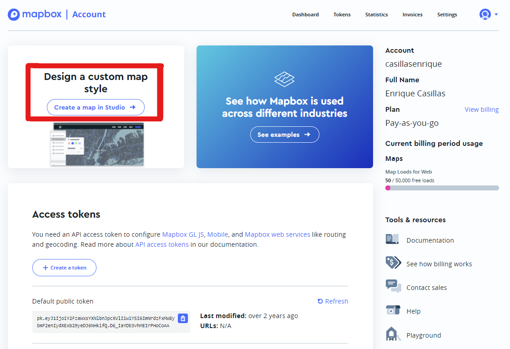
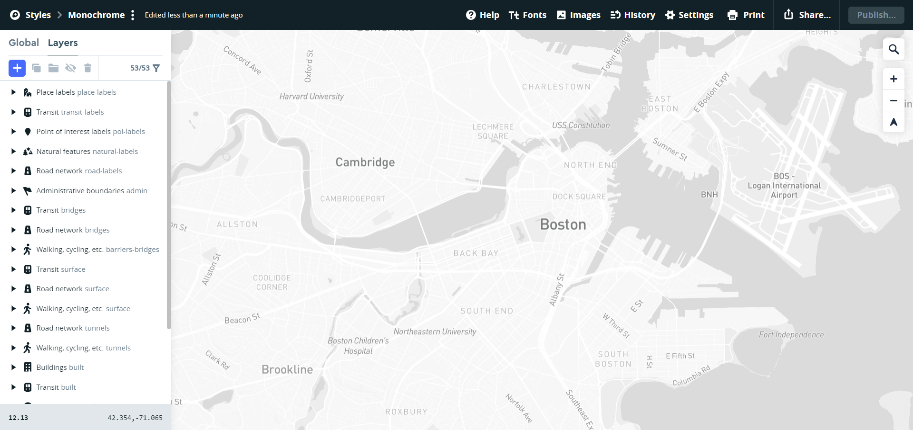
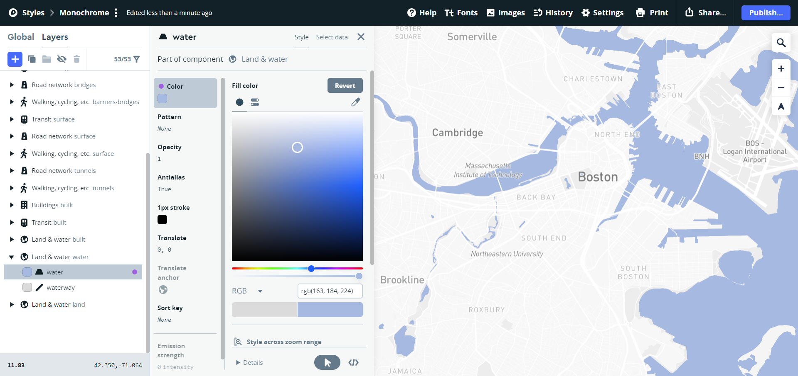
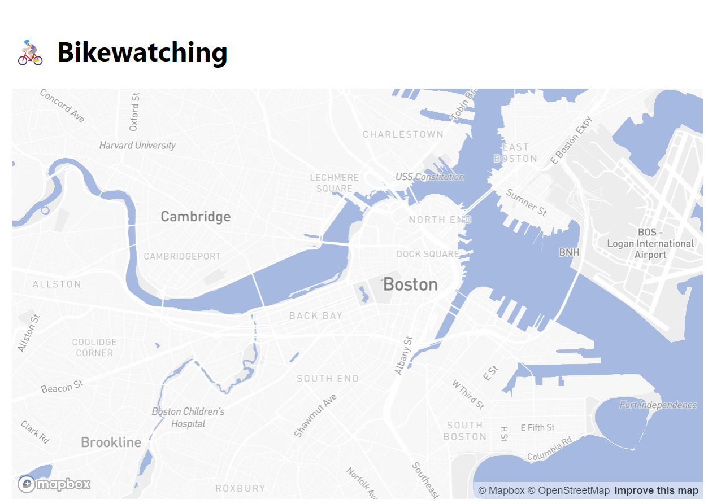
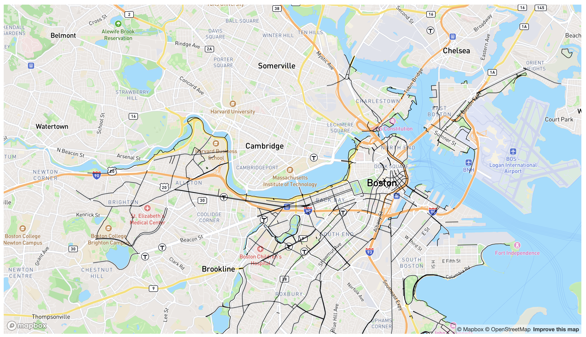
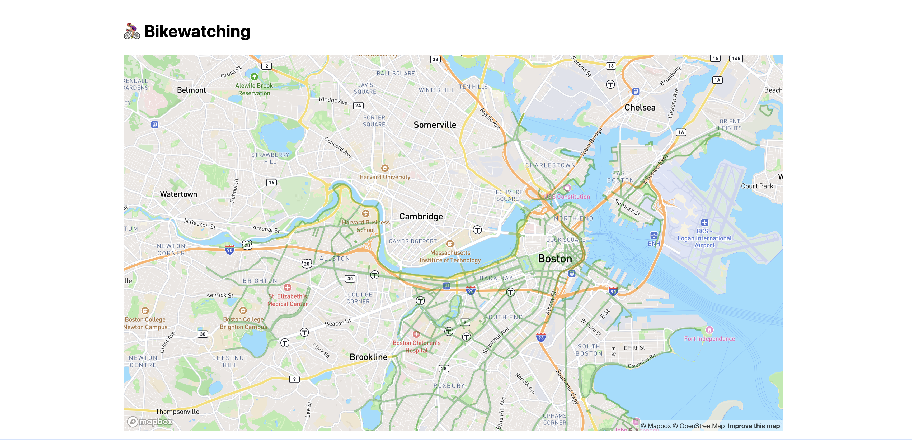
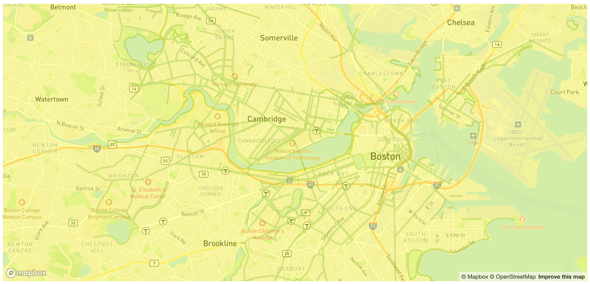
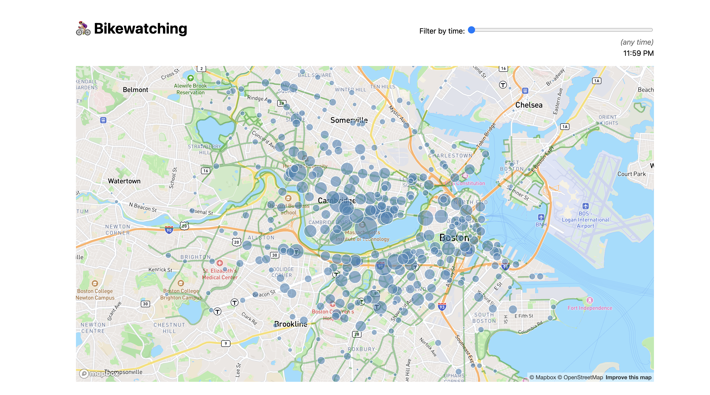
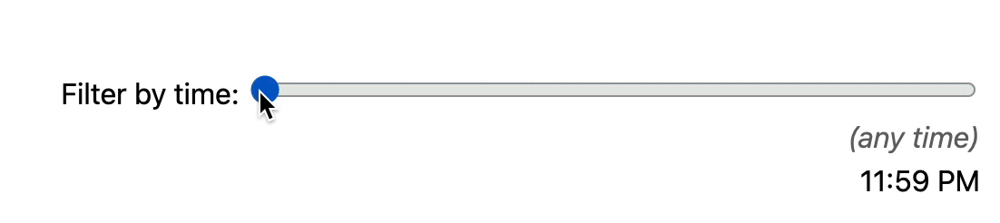

# Lab {{ page.lab }}: Geospatial visualizations

{: .no_toc}

{: .summary}

> In this lab, we will:
>
> - Learn how to embed a Mapbox map into a webpage
> - Learn to add data-driven layers within a Mapbox canvas.
> - Learn to add custom SVG overlays on Mapbox maps and adapt to the map's panning and zooming
> - Practice creating visualizations with large datasets of real-world data, by importing, parsing, filtering and binding to elements on the page.

<details open markdown="block">
  <summary>
    Table of contents
  </summary>
  {: .text-delta }
- TOC
{:toc}
</details>

---

## Submission 

To get checked off for the lab, please record a 2 minute video in mp4 format with the following components:

1. Present your Mapbox visualization.
2. Show yourself interacting with your map visualizations with ALL features and functionalities this lab delineates.
3. Share the most interesting thing you learned from this lab.

**Videos longer than 2 minutes will be trimmed to 2 minutes before we grade, so
make sure your video is 2 minutes or less.**

## What will we make?

In this lab, we will be building an immersive, interactive map visualization of bike traffic in the Boston area during different times of the day, shown in the video below:

<video src="videos/final.mp4" loop muted autoplay class="browser"></video>

- The underlying map shows Boston area roads and labels of neighborhoods. You can pan and zoom around as you would with services like Google Maps.
- The green lines show bike lanes. We will be importing two datasets from the city governments of Boston and Cambridge for this.
- The circles represent individual BlueBike stations. The size of each circle represents the amount of traffic at each station, while the color represents whether most traffic is entering or leaving the station. We will be using two datasets from BlueBikes to analyze bike traffic from about 260,000 individual rides from March 2024.
- There is a slider at the top right that allows the user to filter the data for traffic at specific times of the day, and the circles will change size and color accordingly.

There is a lot of room for styling and customization in this lab, and you are free to choose colors and themes that you prefer. So the screenshots and videos here are for reference only and your version can differ in appearance (but should be functionally the same!).

## Step 0: Start a new Project

### Step 0.1: Create a new repository and push it to GitHub

In this lab, we will be working on a new project and thus a new repository (that we will subsequently list on our projects page).
Follow [part 2 step 1-2 of lab 1](../lab01/) again to set up a new Website with a new repo name this time. I called mine `bikewatching`, but you may want to get more creative with bike-related puns. You don't have to worry about the content of your index.html here, we will update that soon! 😉

### Step 0.2: Publish your new project to GitHub Pages

Also follow [part 2 step 3 from the same lab](../lab01/) to set up GitHub Pages for your new project.

<!-- ### Step 0.3: Start local server

Run `npm run dev --open` to start the local server and open the project in your browser.

### Step 0.4: Edit `routes/+page.svelte`

Replace the content of `routes/+page.svelte` with a heading of your project name and a brief description of what it does.
Commit and push the change, and make sure the website updates accordingly.

### Step 0.5: Add basic styling

Create a CSS file for global styles in `src/lib` called `global.css` and add the following content:

```css
body {
  font: 100%/1.5 system-ui, sans-serif;
  display: flex;
  flex-flow: column;
  max-width: 80em;
  min-height: 100vh;
  box-sizing: border-box;
  margin: auto;
  padding: 1em;
}
```

Then, in your `src/routes/+page.svelte` file, import the CSS file by adding this in a `<style>` element:

```css
@import url('$lib/global.css');
``` -->

### Step 0.3: Edit `index.html`

Open the `index.html` file located in your project root directory. Replace the content inside the `<body>` tag with a heading of your project name and a brief description of what it does.

Example:

```html
<!DOCTYPE html>
<html lang="en">
<head>
  <meta charset="UTF-8">
  <meta name="viewport" content="width=device-width, initial-scale=1.0">
  <title>Bikewatching</title>
</head>
<body>
  <h1>🚴🏼‍♀️ Bikewatching</h1>
</body>
</html>
```

Commit and push the change:

```bash
git add index.html
git commit -m "Add project name and description"
git push
```

Ensure the website updates accordingly on GitHub Pages.

### Step 0.4: Add basic styling

Create a CSS file for global styles called `global.css` and add the following content:

```css
body {
  font: 100%/1.5 system-ui, sans-serif;
  display: flex;
  flex-flow: column;
  max-width: 80em;
  min-height: 100vh;
  box-sizing: border-box;
  margin: auto;
  padding: 1em;
}
```

Make sure the CSS file is linked in your `index.html` file (as shown in **Step 0.4**) via:

```html
<link rel="stylesheet" href="global.css">
```
### Step 0.5: Add a Bike Favicon

To make your project tabs stand out in the browser, you can customize the _[favicon](https://en.wikipedia.org/wiki/Favicon)_.

1. **Add the Favicon File**:

   In your project directory, create a folder called `assets`, and inside it, add a file named `favicon.svg` with the following content:

   ```xml
   <svg xmlns="http://www.w3.org/2000/svg" viewBox="0 0 100 100">
     <text y=".9em" font-size="90">🚴🏼‍♀️</text>
   </svg>
   ```

   Feel free to replace the emoji with any other of your choice.

2. **Edit `index.html` to Link the Favicon**:

   Open your `index.html` file and add (or update) the following line inside the `<head>` section to point to your new favicon:

   ```html
   <link rel="icon" href="assets/favicon.svg" type="image/svg+xml">
   ```

At this point, you should be seeing something like this:


and your browser tab should have the bike icon as well (assuming that's the emoji you selected!)
<!-- ### Step 0.6: Add a bike favicon _(optional)_

To distinguish open tabs from your project, you can customize its _[favicon](https://en.wikipedia.org/wiki/Favicon)_.

In your `static` directory, add a `favicon.svg` file with the following content:

```xml
<svg xmlns="http://www.w3.org/2000/svg" viewBox="0 0 100 100">
	<text y=".9em" font-size="90">🚴🏼‍♀️</text>
</svg>
```

Feel free to use any emoji you want.
Then edit `src/app.html` to change `favicon.png` to `favicon.svg` here:

```html
<link rel="icon" href="%sveltekit.assets%/favicon.png" />
```

You may also want to add a `<title>` with your project title, as a fallback for pages that don't specify one.

It should look like this:


{: .tip }
You can now delete `static/favicon.png` if you want to keep things tidy, since we’re not using it anymore. -->

## Step 1: My first map

### Step 1.0: Create a Mapbox account

Go to [Mapbox](https://www.mapbox.com/) and create an account [using your UCSD email](https://www.mapbox.com/community/education). Once you do this, you will have to enter your address for "billing" but we will be using the free service tier which carries no charge.

<!-- , but you still need to provide credit card information during the signup process (please reach out to the course staff if that may be a problem). Otherwise, the process of signing up should be straightforward. -->

After you sign up, make sure to verify your email.

### Step 1.1: Add Mapbox GL JS to Your Project

We'll use **CDN links** to include Mapbox GL JS directly in our HTML.

1. **Add the following to the `<head>` of your `index.html`:**

   ```html
   <!-- Mapbox GL JS CSS -->
   <link href="https://api.mapbox.com/mapbox-gl-js/v2.15.0/mapbox-gl.css" rel="stylesheet" />
   ```

2. **Include the Mapbox GL JS script before the closing `</body>` tag:**

   ```html
   <!-- Mapbox GL JS JavaScript -->
   <script src="https://api.mapbox.com/mapbox-gl-js/v2.15.0/mapbox-gl.js"></script>
   ```

### Step 1.2: Add an Element to Hold the Map

1. **In your `index.html`, add a `div` to contain the map:**

   ```html
   <div id="map"></div>
   ```

2. **Add basic CSS to ensure the map fills the screen:**

   Create a `map.css` file and link it to your html file with the following content (you can add more style to it if you like ):

   ```css
    html, body {
      margin: 0;
      padding: 5;
      height: 100%;
      width: 100%;
      display: flex;
      justify-content: center; /* Center horizontally */
      align-items: center;     /* Center vertically */
    }
    
    #map {
      width: 100%;    /* Adjust width to your desired size */
      height: 100%;   /* Adjust height to your desired size */
      box-shadow: 0 4px 8px rgba(0, 0, 0, 0.1); /* Optional: subtle shadow for effect */
      border-radius: 8px; /* Optional: rounded corners */
    }
   ```

<!-- ### Step 1.1: Install Mapbox.js

In your project directory, run the following command to install the Mapbox.js library:

```bash
npm install mapbox-gl
```

### Step 1.2: Add an element to hold the map

We will largely follow the steps outlined in [Mapbox’s official docs about Svelte integration](https://docs.mapbox.com/help/tutorials/use-mapbox-gl-js-with-svelte/).

Let’s create an element to receive our map and bind it to a variable (we’ll need to reference that when we tell Mapbox to create a map there):

```html
<div id="map" />
```

We also want to add some CSS to ensure the map will have sufficient height:

```css
#map {
  flex: 1;
}
```

Try giving the map a background color to make sure it’s taking up the space you expect:


### Step 1.3: Import Mapbox and connect it to our account

In order to use Mapbox, we first need to import its JS and CSS.
In your `src/routes/+page.svelte` file, inside your `<script>` tag, add this:

```javascript
import mapboxgl from 'mapbox-gl';
import '../../node_modules/mapbox-gl/dist/mapbox-gl.css';
```


{: .tbd }
There is actually a named export `mapbox-gl/style` but I could not get it to work at all.


Then, we need to connect our account to it, by setting up our access token:

```js
mapboxgl.accessToken = 'your access token here';
```

To find your access token, you go to your account page on Mapbox:


{: .warning }
Make sure your repo is private before you push your access token to GitHub! -->

### Step 1.3: Create the map

**Create and Link `map.js` in Your `index.html`**

Create a file called `map.js` in your repo. In `index.html`, link the `map.js` file after the **Mapbox GL JS** script to ensure the Mapbox library is loaded before your custom code runs, like this:

```js
  <!-- Load Mapbox GL JS -->
  <script src="https://api.mapbox.com/mapbox-gl-js/v2.15.0/mapbox-gl.js"></script>

  <!-- Load your custom map initialization script -->
  <script src="map.js"></script>
```
To create the map, we create a new `mapboxgl.Map` object with [settings](https://docs.mapbox.com/mapbox-gl-js/api/map/) that specify things like:

- which HTML element will hold the map? (`container`) This can be either an element reference, or a string with the element’s ID (which is what we will use)
- What will the _basemap_ look like? (`style`)
- _Map extent_:
  - What latitude and longitude will the map be centered on? (`center: [longitude, latitude]`)
  - How zoomed in will the map start off and what will be the min & max zoom allowed? (`zoom`, `minZoom`, `maxZoom`)

Here is some sample code on how to instantiate a `mapboxgl.Map` object:

   ```js
   // Set your Mapbox access token here
   mapboxgl.accessToken = 'YOUR_ACCESS_TOKEN_HERE';

   // Initialize the map
   const map = new mapboxgl.Map({
     container: 'map', // ID of the div where the map will render
     style: 'mapbox://styles/mapbox/streets-v12', // Map style
     center: [-71.09415, 42.36027], // [longitude, latitude]
     zoom: 12, // Initial zoom level
     minZoom: 5, // Minimum allowed zoom
     maxZoom: 18 // Maximum allowed zoom
   });
   ```
**Find Your Access Token**

  1. Go to your [Mapbox Account Dashboard](https://account.mapbox.com/).
  2. Copy your **default public access token** (it starts with `pk.`).
  3. Replace `'YOUR_ACCESS_TOKEN_HERE'` in `map.js` with your actual token:

```js
mapboxgl.accessToken = 'pk.your_actual_mapbox_access_token_here';
```
In terms of what values to apply to options:

- For the container, we want to specify an id so we don't have to worry about element references.
- For the style, I used `"mapbox://styles/mapbox/streets-v12"` but you are welcome to choose any [other style](https://docs.mapbox.com/api/maps/styles/#classic-mapbox-styles) you like. Keep in mind that the busier the style, the harder it will be to see your data drawn on top of it.
- Map extent:
  - I used `12` for the zoom level (`zoom`)
  - You can use any centerpoint you like, but it should be within the Cambridge & Boston area. See below for how to find the latitude and longitude of any location.

To find the coordinates of a location, you can enter it on Google Maps, and then right click and select the first option:



Another way is via the URL, it's the part after the `@`:


Note that you will need to specify them in the reverse order, as [Mapbox expects longitude first](https://docs.mapbox.com/api/overview/#coordinate-format).

If everything went well, you should have a map of Boston already! 


Try panning and zooming around to see the map in action.

### Step 1.5: Customizing the map _(optional)_

The map style in its current form is quite functional as it shows a lot of useful waypoints and detail.
However, sometimes we'd like to create a more stylized map to create a cohesive design language across our website, or simply to draw readers in with a unique design.

Luckily, Mapbox provides a way to fully customize your map style using [**Mapbox Studio**](https://docs.mapbox.com/studio-manual/guides/).
To access Mapbox Studio, go back to your Mapbox account page and click "Create a map in Studio".



Next, create a new style.


From here, you are free to create a style however you'd like! As a starting point, many high quality map visualizations end up using a monochrome style, which you can find by clicking on "Classic template", then "Monochrome". Once you've selected a variant from the list of styles, click on the "Customize" buttom to add further customization, which will open up the actual studio, shown below.



Mapbox styles are made up of [layers](https://docs.mapbox.com/studio-manual/reference/styles/#layers) and [components](https://docs.mapbox.com/studio-manual/reference/styles/#components) (e.g. natural features, streets, points of interest, transit nodes, etc.). These items have properties which can be edited, such as the color or font, and can even be removed for a cleaner look.
For example, if you wanted to make the color of the bodies of water a more natural blue color in this monochrome example, you could click on the "Land & water _water_" layer in the left panel and simply adjust the color in the color picker.



Once you are done playing around with the style, you can [**publish it**](https://docs.mapbox.com/studio-manual/guides/publish-your-style/) so that it can be referenced in your code where you define the map, as you did in [Step 1.4](#step-14-create-the-map). To do so, click "Publish" in the top right corner of the studio interface.

Then, click on the three dots next to your style name to find the style URL (it will look something like this: `mapbox://styles/casillasenrique/clukyyerk007v01pb6r107k1o`).


Copy it and paste this URL in your `style` property when defining the `mapboxgl.Map` object. You should now see that your map uses your custom style!



Now, each time you edit your map style in Mapbox Studio and re-publish it, the updated style will automatically be applied in your website (note that sometimes the style takes a couple of minutes to update after publishing).

## Step 2: Adding bike lanes

### Step 2.0: Getting familiar with the data

The City of Boston provides an [open dataset with bike lanes in the city](https://bostonopendata-boston.opendata.arcgis.com/datasets/boston::existing-bike-network-2022.geojson?outSR=%7B%22latestWkid%22%3A3857%2C%22wkid%22%3A102100%7D).
The dataset is in [GeoJSON](https://en.wikipedia.org/wiki/GeoJSON) format, which is just JSON that follows a specific structure, designed to represent geographical data.

Download the dataset, open it in VS Code, and examine its structure. This is your for you to look through the dataset yourself, but we can import the data through the link (demonstrated in step 2.1).

{: .tip }
Try pressing <kbd>Cmd</kbd> + <kbd>Shift</kbd> + <kbd>P</kbd> to open the command palette, and then select “Format document” to make the JSON more readable.

### **Step 2.1: Modify `map.js` to Wait for the Map to Load Before Adding Data**

1. **Import the data**

Mapbox provides an `addSource` function to connect the map with an external data [source](https://docs.mapbox.com/mapbox-gl-js/api/sources/).
However, to use any of that, we first need to wait for the `"load"` event to fire on `map` to make sure the map is fully loaded before fetching and displaying the data:

```js
map.on('load', () => { 
  //code 
});
```

2. **Adding the Data Source with `addSource`:**  
   ```javascript
   map.addSource('boston_route', {
     type: 'geojson',
     data: 'https://bostonopendata-boston.opendata.arcgis.com/datasets/boston::existing-bike-network-2022.geojson?...'
   });
   ```
   - **`boston_route`** is a unique ID for this data source.
   - The **data** is a link to Boston's open data in **GeoJSON** format, describing existing bike lanes.

{: .fyi }
What is `boston_route`?
It’s just a name we made up to refer to this data source.
You can name it anything you want, but it should be unique to this source.

This won’t produce much of a visible result.
To actually _see_ something, we need to actually _use_ the data to draw something.

3. **Visualizing Data with `addLayer`:**  
   ```javascript
   map.addLayer({
     id: 'bike-lanes',
     type: 'line',
     source: 'boston_route',
     paint: {
       'line-color': 'green',
       'line-width': 3,
       'line-opacity': 0.4
     }
   });
   ```
   - **`id: 'bike-lanes'`** is a unique identifier for the layer.
   - **`type: 'line'`** tells Mapbox we're drawing lines (perfect for bike lanes).
   - **`paint`** controls the visual styling:
     - `'line-color'`: The color of the lines (`green` in this case).
     - `'line-width'`: The thickness of the lines (set to `3`).
     - `'line-opacity'`: How transparent the lines are (`0.4` means 40% opacity).

### **Step 2.3: Styling and Customization**

1. **Experiment with Layer Styles:**

   You can tweak the appearance by adjusting the `paint` properties. Here's an example with different styles:

   ```javascript
   paint: {
     'line-color': '#32D400',  // A bright green using hex code
     'line-width': 5,          // Thicker lines
     'line-opacity': 0.6       // Slightly less transparent
   }
   ```

  {: .caveat }
  Mapbox does not yet understand newer color formats like `oklch()`.
  You can see the [docs](https://docs.mapbox.com/style-spec/reference/types/#color) on what it accepts, but at the time of writing it's basically named colors (e.g. `green`), hex codes (e.g. `#32D400`), `hsl()` and `rgb()`.
  You can convert any valid CSS color to the closest `rgb()` or `hsl()` equivalent using [this tool](https://colorjs.io/apps/convert).
  If it shows two versions, you want the one marked "gamut mapped".

2. **Try Different Layer Types:**

   You can experiment with other **layer types** like `'fill'`, `'circle'`, or `'symbol'` depending on your data and goals. For bike routes, `'line'` works best.


### **Expected Result**

If everything is set up correctly:

1. Your map will center on **Boston**, and you'll see the **existing bike network** visualized as **green translucent lines**.
2. You can **zoom in** to see more detail or **pan** around the city to explore the bike lanes.
3. Inspecting the map in **DevTools** will show the dynamically added layers and sources in the DOM.

<!-- ### Step 2.1: Import the data

Mapbox provides an `addSource` function to connect the map with an external data [source](https://docs.mapbox.com/mapbox-gl-js/api/sources/).
However, to use any of that, we first need to wait for the `"load"` event to fire on `map`.
To avoid nesting all our code in an event listener, we can instead convert our `onMount` function to an `async` function, and then add this after the map creation:

```js
await new Promise((resolve) => map.on('load', resolve));
```

After that we can add the source:

```js
map.addSource('boston_route', {
  type: 'geojson',
  data: 'https://bostonopendata-boston.opendata.arcgis.com/datasets/boston::existing-bike-network-2022.geojson?outSR=%7B%22latestWkid%22%3A3857%2C%22wkid%22%3A102100%7D',
});
```

{: .fyi }
What is `boston_route`?
It’s just a name we made up to refer to this data source.
You can name it anything you want, but it should be unique to this source.

This won’t produce much of a visible result.
To actually _see_ something, we need to actually _use_ the data to draw something.

### Step 2.2: Drawing bike lanes on the map

One way to do that is to use the [`map.addLayer()`](https://docs.mapbox.com/mapbox-gl-js/api/map/#map#addlayer) method to add a [_layer_](https://docs.mapbox.com/style-spec/reference/layers/) to our map that visualizes the data source.

The this will look like this:

```js
map.addLayer({
  id, // A name for our layer (up to you)
  type, // one of the supported layer types, e.g. line, circle, etc.
  source: 'boston_route', // The id we specified in `addSource()`
  paint: {
    // paint params, e.g. colors, thickness, etc.
  },
});
```

You should experiment with the different types of layers and paint properties to see what you can come up with, but chances are you’ll settle on `"line"`,
to draw a network of bike routes as lines.

Without any painting properties (i.e. an empty `paint` object),
your map will look like this:
.

### Step 2.3: Styling the bike lanes

You should look at the [reference](https://docs.mapbox.com/style-spec/reference/layers/#layer-sub-properties) to see what you can do with the `paint` property, but chances are you will need at least the following:

- `line-color` to set the color of the lines (see caveat below)
- `line-width` to make the lines thicker (default is `1`)
- `line-opacity` to make the lines translucent (0 is fully transparent, 1 is fully opaque). This is recommended so that the lines blend in to the rest of the map smoothly instead of obscuring it.

{: .caveat }
Mapbox does not yet understand newer color formats like `oklch()`.
You can see the [docs](https://docs.mapbox.com/style-spec/reference/types/#color) on what it accepts, but at the time of writing it's basically named colors (e.g. `green`), hex codes (e.g. `#32D400`), `hsl()` and `rgb()`.
You can convert any valid CSS color to the closest `rgb()` or `hsl()` equivalent using [this tool](https://colorjs.io/apps/convert).
If it shows two versions, you want the one marked "gamut mapped".

{: .caveat }
Since these are properties in a JS object, and they contain hyphens, we need to wrap them in quotes, e.g. `"line-color": "green"`, not `line-color: "green"`.

The exact styling is up to you. I went with a translucent `green` (40% opacity), and a line width of `3`, which looked like this:

 -->

### Step 2.4: Adding Cambridge bike lanes

Notice that our map right now only shows bike lanes from Boston.
What about the numerous Cambridge ones?!

Fortunately, the City of Cambridge also provides [bike lane data as a GeoJSON file](https://raw.githubusercontent.com/cambridgegis/cambridgegis_data/main/Recreation/Bike_Facilities/RECREATION_BikeFacilities.geojson).

Follow a similar process as steps 2.0 - 2.3 to visualize Cambridge bike lanes as well.
It should look like this:


{: .further }
At this point, you have likely ended up specifying your line styles twice:
one in the Boston layer, and one in the Cambridge layer.
This means that if we want to tweak them, we need to do it as many times as our layers.
A good idea at this point (but entirely optional) is to specify the styling as a separate object that you reference in both places.

## Step 3: Adding bike stations

As you probably know, [Bluebikes](https://bluebikes.com/) is a bicycle sharing program in the Boston area.
They make many [datasets](https://bluebikes.com/system-data) publicly available, including real-time and historical data.
The first Bluebikes dataset we will use in this lab is station information, which is a JSON file with names, IDs and coordinates (among other info) for each station.

## We have made a copy of this data in <a href="data/bluebikes-stations.json" download markdown="1">`https://dsc106.com/labs/lab07/data/bluebikes-stations.json`</a>. 
This is a JSON file with the following properties:

- `Number`: a code like "L32001"
- `NAME`: the station’s name, like "Railroad Lot and Minuteman Bikeway"
- `Lat`: the station’s latitude, e.g. 42.41606457
- `Long`: the station’s longitude, e.g. -71.15336637
- `Seasonal Status`: whether the station is seasonal or not with statuses like "Year Round", "Winter storage" etc.
- `Municipality`: e.g. "Cambridge", "Arligton", etc.
- `Total Docks`: the number of docks at the station as a number, e.g. 11

We will be using the latitude and longitude data to add markers to our map for each station.

While we _could_ use Mapbox’s `addSource()` and [`addLayer()`](https://docs.mapbox.com/mapbox-gl-js/api/map/#map#addlayer) functions to plot the stations as another layer on the map canvas (like we just did with bike lanes), we will try a different approach here so we can learn how to combine the two visualization methods we have already learned: Mapbox and D3.
We will be adding an SVG layer on top of our map to hold the station markers, and use D3 to fetch and parse the data, and to draw the markers.

### Step 3.1: Fetching and parsing the CSV

Install `d3` as we have done before:

```bash
npm install d3
```

**In your `index.html`:**

```html
<!-- Load D3.js from CDN -->
<script src="https://d3js.org/d3.v7.min.js"></script>
```

**Where to Place the Script Tag?**  
  - Place this **before** your custom script (`map.js`) in `index.html` to ensure **D3** is available when your JavaScript runs.


### **Load JSON Data After the Map is Ready**

We need to ensure the map is fully loaded before fetching and displaying the station data. Again, we'll use the **`map.on('load', ...)`** event listener to achieve this.

```javascript
map.on('load', () => {
  // Load the nested JSON file
  const jsonurl = INPUT_BLUEBIKES_CSV_URL
  d3.json(jsonurl).then(jsonData => {
    console.log('Loaded JSON Data:', jsonData);  // Log to verify structure
  }).catch(error => {
    console.error('Error loading JSON:', error);  // Handle errors if JSON loading fails
  });
});
```

1. **`map.on('load', ...)`** ensures the JSON data is only fetched **after the map** is ready.
2. **`d3.json(link)`** uses **D3.js** to load the JSON file from your project directory.
3. **`then(jsonData => { ... })`** processes the loaded data.
4. **`catch(error => { ... })`** handles any errors that occur if the file isn't loaded properly (e.g., incorrect file path or CORS issues).


### **Access the Nested Stations Array**

Once the JSON file is loaded, we access the **nested stations array**. Based on your JSON structure, the station data is stored under `data.stations`.

```javascript
const stations = jsonData.data.stations;
console.log('Stations Array:', stations);
```

1. **`jsonData.data.stations`** navigates through the JSON object to retrieve the **stations array**.
2. **`console.log('Stations Array:', stations);`** helps you verify that the data is correctly accessed.

**Check the Browser Console:**
  - Open **Developer Tools** in your browser (F12 or right-click → **Inspect** → **Console**).
  - You should see:
    - **Loaded JSON Data:** Displays the entire JSON structure.
    - **Stations Array:** Displays the array of station objects.


### Step 3.2: Overlaying SVG on the map

We will start by appending an `<svg>` element on our map container in our `index.html` file:

```html
<div id="map">
  <svg></svg>
</div>
```

If you preview your app right now, you won’t see anything different.
However, if you right click on the map, you should be able to see the `<svg>` element we just inserted in the dev tools:


However, it doesn’t have the right size: it’s just a small rectangle in the top left corner.
Worse yet, it’s actually rendered _under_ the map, which becomes obvious if we give it a background color:

```css
#map svg {
  background: yellow;
  opacity: 50%;
}
```

Let’s fix all of that, by applying the following declarations:

- `position: absolute` and `z-index: 1` so we can position it on top of the map (`z-index` does not work without positioning)
- `width: 100%` and `height: 100%` to make it fill the map container
- `pointer-events: none` so that we can still pan and move the map

Make sure you’re now seeing something like this:



And then you can remove the `background` and `opacity` declarations — they were only there as debugging aids, we don’t need them for the actual visualization.

### Step 3.3: Adding station markers

This step is similar to making the scatterplot in the previous lab:
we just need to append a bunch of circles to the SVG element, each representing a station.

The only tricky part here is positioning them so that they line up with the map.
Fortunately, Mapbox has a great built-in function [`map.project()`](https://docs.mapbox.com/android/maps/api/10.0.0-beta.12/-mapbox%20-maps%20-android/com.mapbox.maps/-mapbox-map/project.html), which takes longitude and latitude values and returns the relative map coordinates in pixels.

{: .fyi }
Why not just use D3 scales for this?
`map.project()` takes into account many things: panning, zooming, even rotation.
It’s certainly _possible_ to calculate this manually, but it’s nontrivial.


### **1. Initialize an Empty `stations` Array**

Before fetching data, we'll select the svg element inside the map container and initialize an empty array to prevent errors.

```javascript
const svg = d3.select('#map').select('svg');
let stations = [];
```

### **2. Define a Helper Function to Convert Coordinates**

We’ll create a helper function, `getCoords()`, that takes in a station object and converts its **longitude (`lon`)** and **latitude (`lat`)** into **pixel coordinates** using `map.project()`.

```javascript
function getCoords(station) {
  const point = new mapboxgl.LngLat(+station.lon, +station.lat);  // Convert lon/lat to Mapbox LngLat
  const { x, y } = map.project(point);  // Project to pixel coordinates
  return { cx: x, cy: y };  // Return as object for use in SVG attributes
}
```

- **`map.project()`** handles all complexities like **panning**, **zooming**, and **rotating**, ensuring accurate positioning.

### **3. Load the JSON File and Append Circles**

After the map is fully loaded, we'll append **SVG circles** for each station directly after loading the json data as we implemented in step 3.1.

```javascript
// Append circles to the SVG for each station
const circles = svg.selectAll('circle')
  .data(stations)
  .enter()
  .append('circle')
  .attr('r', 5)               // Radius of the circle
  .attr('fill', 'steelblue')  // Circle fill color
  .attr('stroke', 'white')    // Circle border color
  .attr('stroke-width', 1)    // Circle border thickness
  .attr('opacity', 0.8);      // Circle opacity
```

- The **`enter()`** selection binds the data and appends a **`<circle>`** for each station.
- You can adjust the **radius (`r`)**, **fill color**, and **opacity** as needed.

### **4. Update Circle Positions When the Map Moves**

We need to ensure the station markers stay aligned when the map **pans**, **zooms**, or **resizes**. We'll define an **`updatePositions()`** function to reposition the circles whenever the map changes.

```javascript
    // Function to update circle positions when the map moves/zooms
    function updatePositions() {
      circles
        .attr('cx', d => getCoords(d).cx)  // Set the x-position using projected coordinates
        .attr('cy', d => getCoords(d).cy); // Set the y-position using projected coordinates
    }

    // Initial position update when map loads
    updatePositions();
```

- **`cx`** and **`cy`** attributes determine the position of the circles on the SVG.
- The **`getCoords()`** function ensures positions are recalculated based on the map's current viewport.


### **5. Add Event Listeners to Adjust Markers Dynamically**

We'll listen to Mapbox events like **`move`**, **`zoom`**, and **`moveend`** to call the **`updatePositions()`** function whenever the map changes.

```javascript
  // Reposition markers on map interactions
  map.on('move', updatePositions);     // Update during map movement
  map.on('zoom', updatePositions);     // Update during zooming
  map.on('resize', updatePositions);   // Update on window resize
  map.on('moveend', updatePositions);  // Final adjustment after movement ends
```

If everything went well, you should see something like this:


## Step 4: Visualizing bike traffic

Marking the station position is nice, but doesn’t tell a very interesting story.
What patterns could we uncover if we set the size of the circles according to the amount of traffic at each station?

A copy of the Bluebikes traffic data from March 2024 is at <a href="data/bluebikes-traffic-2024-03.csv" download markdown="1">`https://dsc106.com/labs/lab07/data/bluebikes-traffic-2024-03.csv`</a>.
This is quite a large file (21 MB) containing more than 260,000 entries with the following fields:

- `ride_id`: A unique id of the ride
- `bike_type`: `electric` or `classic`
- `started_at`: the date and time the trip started in ISO 8601 format (e.g. `"2019-12-13 13:28:04.2860"`)
- `ended_at`: the date and time the trip ended in ISO 8601 format (e.g. `"2019-12-13 13:33:57.4370"`)
- `start_station_id`: the ID of the station where the trip started (e.g. `A32000`)
- `end_station_id`: the ID of the station where the trip ended (e.g. `A32000`)
- `is_member`: whether the rider is a member or not (`1` or `0`)

This is a cut down / simplified version of the dataset that Bluebikes provides to reduce filesize.

### Step 4.1: Importing and parsing the traffic data

Similar to the previous step for the json url, we will use `d3.csv()` to fetch the traffic data.
You can fetch it directly from the URL, without hosting it yourself.
Let’s call the variable that will hold the traffic data `trips`.

### Step 4.2: Calculating traffic at each station

Now that we have read the data into a JS object, we can use it to calculate station traffic volumes (arrivals, departures, and total traffic per station).

As we have in the previous labs, we will use [`d3.rollup()`](https://d3js.org/d3-array/group#rollup) (or `d3.rollups()`) to calculate arrivals and departures.

First, we calculate them separately, like this:

```js
departures = d3.rollup(
  trips,
  (v) => v.length,
  (d) => d.start_station_id,
);
```

{: .note }
We are calculating `departures` and `arrivals` inside `map.on('load', () => {` since we only need to calculate them once.

Now, we want to add `arrivals`, `departures`, `totalTraffic` properties to each station, which we can do like this after both `stations` and `trips` have loaded:

```js
stations = stations.map((station) => {
  let id = station.short_name;
  station.arrivals = arrivals.get(id) ?? 0;
  // TODO departures
  // TODO totalTraffic
  return station;
});
```

{: .tip }
You can log `stations` in the console after to make sure the properties have been added correctly.

### Step 4.3: Size markers according to traffic

Now, we can use this data structure to size the markers on the map according to the traffic at each station.
Currently, all our circle radii are hardcoded.
We should decide what the minimum and maximum radius should be (I went with `0` and `25`),
and then create a D3 scale to map our data domain `[0, d3.max(stations, d => d.totalTraffic)]` to this range of circle radii.

However, there is a catch: if we just use a linear scale to calculate the circle’s radius,
we will end up misrepresenting the data: for example, stations that have double the traffic would appear 4 times larger since the area of a circle is proportional to the square of its radius (A = πr²).
We want to use the circle _area_ to visualize the variable, not the circle _radius_.

To fix this, we will use a different type of scale: a [square root scale](https://d3js.org/d3-scale/pow#scaleSqrt).
A square root scale is a type of power scale that uses the square root of the input domain value to calculate the output range value.

Thankfully, the API is very similar to the linear scale we used before,
the only thing that changes is that we use a different function name:

```js
const radiusScale = d3
  .scaleSqrt()
  .domain([0, d3.max(stations, (d) => d.totalTraffic)])
  .range([0, 25]);
```

Then, we can use this scale to calculate the radius of each circle in the SVG by passing the station traffic as a parameter to `radiusScale()`.

We can then set the r (radius) attribute of an SVG <circle> using `d => radiusScale(d.totalTraffic)` which is an arrow function that takes the data object d (representing a single station) and passes its totalTraffic value into the radiusScale function.

If we look at our map right now, it looks like this:


Because our dots are opaque and overlapping, it’s hard to see the actual traffic patterns.
Add a CSS rule for `circle` inside your `svg` rule, and experiment with different `fill-opacity` values and strokes to improve this.
I used a `steelblue` fill, a `fill-opacity` of 60%, and a `stroke` of `white`, and this was the result:


### Step 4.4: Adding a tooltip with exact traffic numbers

In addition to providing additional info, it helps us debug as well to be able to see the number of trips that each circle represents.
_Please note here that tooltips take a a few minutes to render so be patient this one!_
The quick and dirty way and use the default browser tooltips.
To create those, all it takes is adding a `<title>` element inside each `<circle>` element with the number of trips:

```html
<circle>
  <!-- (omitting attributes for brevity) -->
  <title>
    {station.totalTraffic} trips ({station.departures} departures, {
    station.arrivals} arrivals)
  </title>
</circle>
```

Another way to do this is implementing tooltips with D3 (the recommended way). When creating circles using **D3**, we'll append a **`<title>`** element inside each circle to display the total trips, arrivals, and departures.


```javascript
const circles = svg.selectAll('circle')

  .each(function(d) {
    // Add <title> for browser tooltips
    d3.select(this)
      .append('title')
      .text(`${d.totalTraffic} trips (${d.departures} departures, ${d.arrivals} arrivals)`);
  });
```

- **`.each(function(d) { ... })`**: Iterates over each circle and appends a **`<title>`** element.
- **`.text(`${d.totalTraffic} trips ...`)`**: Sets the tooltip text to show total trips, departures, and arrivals.

We have applied `pointer-events: none` to the whole `<svg>`, so to be able to see our tooltips we need to override that on circles, by adding `pointer-events: auto` to our CSS rule for `circle`.


{: .further }
If you want to go even further, you could explore adding a nicer tooltip, with more advanced information.

{: .caveat }
Note that _both_ SVG and HTML have a `<title>` element, but they are false friends, as they do different things!

## Step 5: Interactive data filtering

Even with the styling improvements, it’s hard to make sense of all this data as currently displayed all at once.
Let’s add some interactive filtering with a slider for arrival/departure time.

### Step 5.1: Adding the HTML and CSS for the slider

The first step is to add the HTML for our time filter, which includes the following elements:

- A slider (`<input type=range>`) with a min of -1 (no filtering)
  and a max of 1440 (the number of minutes in the day).
- A `<time>` element to display the selected time.
- An `<em>(any time)</em>` element that will be shown when the slider is at -1.
- A `<label>` _around_ the slider and `<time>` element with some explanatory text (e.g. "Filter by time:").

Where you put it on the page is up to you.
I added it under the `<h1>` and wrapped both with a `<header>`, to which I applied a `display: flex`, `gap: 1em`, and `align-items: baseline` to align them horizontally,
then gave the label a `margin-left: auto` to push it all the way to the right.

Make sure to place the `<time>` and `<em>` on their own line (e.g. via `display: block`) otherwise the contents of the `<time>` updating will move the slider and it will look very jarring.

You would also want to style the `<em>` differently, e.g. with a lighter color and/or italic, to make it clear that it’s a different state.

Here is a sample rendering of what you should have at this point:



### Step 5.2: Reactivity

Now that we've added our static HTML and CSS, let’s connect it with our code
by having the slider update a variable that we can use to filter the data
and outputting the currently selected time in the `<time>` element.

First, let’s create a variable to hold the slider value, called `timeFilter`,
that we initialize to `-1` so that no filtering is done by default.

```js
let timeFilter = -1;
```

We’ll use JavaScript to listen for **slider input events** and update `timeFilter` in real time.

#### **Select the slider and display elements:**
```javascript
const timeSlider = document.getElementById('time-slider');
const selectedTime = document.getElementById('selected-time');
const anyTimeLabel = document.getElementById('any-time');
```

Since the slider value represents **minutes since midnight**, we need to convert it to a **formatted time (HH:MM AM/PM)**.

#### **Helper function to format time:**
```javascript
function formatTime(minutes) {
  const date = new Date(0, 0, 0, 0, minutes);  // Set hours & minutes
  return date.toLocaleString('en-US', { timeStyle: 'short' }); // Format as HH:MM AM/PM
}
```

We'll write a function that:
- Updates **`timeFilter`** based on the slider's value.
- Shows the **formatted time** in the `<time>` element.
- Displays **"(any time)"** when no filter is applied (`timeFilter === -1`).

#### **Function to update the UI when the slider moves:**
```javascript
function updateTimeDisplay() {
  timeFilter = Number(timeSlider.value);  // Get slider value

  if (timeFilter === -1) {
    selectedTime.textContent = '';  // Clear time display
    anyTimeLabel.style.display = 'block';  // Show "(any time)"
  } else {
    selectedTime.textContent = formatTime(timeFilter);  // Display formatted time
    anyTimeLabel.style.display = 'none';  // Hide "(any time)"
  }

  // Trigger filtering logic which will be implemented in the next step
}
```

Now, we need to **bind the slider’s `input` event** to our function so that it updates the time in real-time.

```javascript
timeSlider.addEventListener('input', updateTimeDisplay);
```


Since the slider starts at `-1` (no filtering), we should **set the initial display state**.

```javascript
updateTimeDisplay();
```

It looks like this now:



### Step 5.3: Filtering the data

Our slider now _looks_ like a filter, but doesn’t actually _do_ anything.
To make it work there are a few more things we need to do:

1. Writing out the logic to filter the data, by creating `filteredXXX` versions of each of our root variables:
   1. A `filteredTrips` data structure that contains the trips that correspond to the filter.
   2. `filteredArrivals` and `filteredDepartures` data structures that contain the `arrivals` and `departures` data after filtering.
   3. A `filteredStations` data structure with stations that contain data that corresponds to the filter (i.e. filtered arrivals, departures, and total traffic).
2. Updating our HTML template to use these new data structures instead of the original ones.

This will look something like:

```js
let filteredTrips = [];
let filteredArrivals = new Map();
let filteredDepartures = new Map();
let filteredStations = [];
```

The trip data includes dates and times as strings, which are not directly comparable to the number of minutes since midnight that we have from the slider.
To compare the two, we need to convert the date and time strings to a number of minutes since midnight.

We will do this in two steps.
First, we will replace the start and end date strings of each trip with [`Date`](https://developer.mozilla.org/en-US/docs/Web/JavaScript/Reference/Global_Objects/Date) objects.

We only need to do this once, so we can do this in `map.on('load', () => {}`, right after `trips` has been fetched (which we've already implemented).
Since `trips` is such a large dataset, we want to avoid setting it twice, so we will instead use the [`then()`](https://developer.mozilla.org/en-US/docs/Web/JavaScript/Reference/Global_Objects/Promise/then) method of the `Promise` returned by `d3.csv()` to do this:

```js
//within the map.on('load') which has been previously done
d3.csv(TRIP_DATA_URL).then(trips => {
  //previous code

  //add THIS code
	for (let trip of trips) {

		trip.started_at = new Date(trip.start_time);
    // do the same for end
  }
});
```

Next, to convert each time and date string, we just do `new Date(dateTimeString)` (assuming `dateTimeString` is the date & time string we are trying to convert).

Now, we can define a function that takes a `Date` object and returns the number of minutes since midnight:

```js
function minutesSinceMidnight(date) {
  return date.getHours() * 60 + date.getMinutes();
}
```

Then, we can use this function to filter the data to trips that started or ended within 1 hour before or after the selected time:

```js
function filterTripsbyTime() {
  filteredTrips = timeFilter === -1
      ? trips
      : trips.filter((trip) => {
          const startedMinutes = minutesSinceMidnight(trip.started_at);
          const endedMinutes = minutesSinceMidnight(trip.ended_at);
          return (
            Math.abs(startedMinutes - timeFilter) <= 60 ||
            Math.abs(endedMinutes - timeFilter) <= 60
          );
        });

      // we need to update the station data here explained in the next couple paragraphs
}
```

Now, we need to create new data structures that correspond to `arrivals`, `departures`, and `stations` as we created in step 4.2 but _only_ for the filtered trips.
We can call them `filteredArrivals`, `filteredDepartures`, and `filteredStations`. This means we can move what we did in step 4.2

For `filteredArrivals` and `filteredDepartures`, all we need to do is copy the statements that set the original variables (`arrivals` and `departures`), convert them to reactive statements, and replace `trips` with `filteredTrips`.

For `filteredStations`, we don’t actually need to do any filtering of the `stations` array (since it’s unlikely that there are stations with zero arrivals and departures for a given time), but we do need an array that contains updated data for `station.arrivals`, `station.departures` and `station.totalTraffic` that correspond to the filtered trips.

{: .caution }

> This is where we need to be careful: if we simply do `$: filteredStations = stations.map(station => {...})` and set properties on `station`, we will have modified our original station objects since [in JS, objects are passed around by reference](https://dev.to/bbarbour/passed-by-reference-vs-value-in-javascript-2fna)!
> To avoid this, before we set any property on these objects, we need to _clone_ them.
> We can do that by doing this before we modify `station`:
>
> ```js
> station = { ...station };
> ```

Last, we want to have bigger circles, since there's fewer data.
We can do that by changing the scale when a filter is applied in our previous radiusScale variable,
by making the scale conditional, i.e. instead of using a static `[0, 25]` as the range,
we use `[0, 25]` when `timeFilter` is `-1` and e.g. `[3, 50]` otherwise in `.range()`
You will find the [conditional operator](https://developer.mozilla.org/en-US/docs/Web/JavaScript/Reference/Operators/Conditional_operator) useful for this.

The result right now should look like this:

<video src="videos/filtering.mp4" class="browser" loop autoplay muted></video>

### Step 5.4: Performance optimizations _(optional ONLY if you don't have this problem)_

Notice that moving the slider now does not feel as smooth as it did before we implemented the filtering.
This is because every time we move the slider, we filter the trips, which is a relatively expensive operation given that we have over a quarter of a million of them!
Worse, every time we do this filtering, _nothing else can happen_ until the filtering ends, including things like the browser updating the slider position!
This is commonly referred to as _"blocking the main thread"_.

There are many ways to improve this.
[_Throttling_ and _debouncing_](https://css-tricks.com/debouncing-throttling-explained-examples/) are two common techniques to limit the rate at which a certain (expensive) piece of code is called in response to user action.

These are "brute force" in the sense that they work regardless of what the expensive operation or the user action is, but they can adversely affect the user experience, since they make the UI update less frequently.
However, depending on the case, there are often ways to optimize the operation itself (e.g. by caching repetitive work), without any negative impact on the user experience.

In this case, we can make the filtering a lot less expensive by presorting the trips into 1440 "buckets", one for each minute of the day.
Then, instead of going over 260 K trips every time the slider moves, we only need to go over the trips in the 120 buckets corresponding to the selected time.

We start by defining two top-level variables to hold the departure and arrival "buckets",
which will be arrays with 1440 elements initially filled with empty arrays:

```js
let departuresByMinute = Array.from({ length: 1440 }, () => []);
let arrivalsByMinute = Array.from({ length: 1440 }, () => []);
```

Then, in `map.on('load', () => {}`, in the same callback where we converted `trip.started_at` and `trip.ended_at` to `Date` objects, we add:

```js
let startedMinutes = minutesSinceMidnight(trip.started_at);
departuresByMinute[startedMinutes].push(trip);

// TODO: Same for arrivals
```

{: .note }
Why not use `d3.group()` or `d3.groups()`?
These return different data structures and as you will see below,
using an array of arrays simplifies our code a lot as we can use [`array.slice()`](https://developer.mozilla.org/en-US/docs/Web/JavaScript/Reference/Global_Objects/Array/slice) to get a whole time range.

Now let’s use our awesome new data structures to make our code faster!

First, we can get rid of `filteredTrips`, as we will be calculating `filteredDepartures` and `filteredArrivals` directly from `departuresByMinute` and `arrivalsByMinute` respectively.

Let’s discuss calculating `filteredDepartures` and you can apply the same logic to `filteredArrivals`.
For a first approximation, we can replace `filteredTrips`, with `departuresByMinute.slice(timeFilter - 60, timeFilter + 60).flat()`.

There are two methods in this you may not have seen before:

- [`array.slice(start, end)`](https://developer.mozilla.org/en-US/docs/Web/JavaScript/Reference/Global_Objects/Array/slice) returns a new array with the elements from `start` (inclusive) to `end` (exclusive).
- [`array.flat()`](https://developer.mozilla.org/en-US/docs/Web/JavaScript/Reference/Global_Objects/Array/flat) "flattens" an array of arrays, so that the result is a single array with all the elements of the subarrays.

Let’s now enjoy the fruits of our labor by moving the slider _really fast_ — it should now be smooth as butter! (or at least, much smoother than before)

But …there is one bug. Can you spot it?
Our code works great for times between 1 AM and 11 PM.
However for times where the 2 hour window spans midnight, it doesn’t work so well:
`minMinute` will be negative, or `maxMinute` will be greater than 1440.
While `array.slice()` actually does accept negative numbers and numbers greater than the array length, it doesn’t do what we want in this case.

In these cases, we basically want _two_ separate `array.slice()` operations:
one for the times before midnight and one for those after,
that we then combine.

Let’s create a helper function to do just that:

```js
function filterByMinute(tripsByMinute, minute) {
  // Normalize both to the [0, 1439] range
  // % is the remainder operator: https://developer.mozilla.org/en-US/docs/Web/JavaScript/Reference/Operators/Remainder
  let minMinute = (minute - 60 + 1440) % 1440;
  let maxMinute = (minute + 60) % 1440;

  if (minMinute > maxMinute) {
    let beforeMidnight = tripsByMinute.slice(minMinute);
    let afterMidnight = tripsByMinute.slice(0, maxMinute);
    return beforeMidnight.concat(afterMidnight).flat();
  } else {
    return tripsByMinute.slice(minMinute, maxMinute).flat();
  }
}
```

Then, in the calculation for `filteredDepartures`, we use `filterByMinute(departuresByMinute, timeFilter)` instead of our previous `filteredDepartures.slice().flat()` operation.
Don't forget to do the same for `filteredArrivals`!

If everything goes well, it should now look like this:

<video src="videos/optimized.mp4" class="browser" loop autoplay muted></video>

Here they are side by side:

<figure markdown="1">
<video src="videos/filtering.mp4" loop autoplay muted></video>
<video src="videos/optimized.mp4" loop autoplay muted></video>
<figcaption>
Left: original, Right: optimized
</figcaption>
</figure>

## Step 6: Visualizing traffic _flow_

Currently, we are visualizing traffic volume at different times of the day, but traffic direction also changes!
In the morning, stations in downtown and near MIT campus tend to have a lot of arrivals, while in the evening they tend to see a lot of departures.

In this step, we will use circle color to visualize traffic flow at different times of the day.

### Step 6.1: Make circle color depend on traffic flow

While it may seem that using a continuous color scale gives us more information,
humans are very poor at associating continuous color scales with quantitative data
(as we will see in the upcoming Color lecture),
so using only three colors will actually make the traffic flow trends more salient.

To do this, we will use a [_quantize scale_](https://d3js.org/d3-scale/quantize), which is like a linear scale but with a discrete output range.
We will use this scale to map a continuous number from 0 to 1 to a discrete number in the array `[0, 0.5, 1]`.
It looks like this:

```js
let stationFlow = d3.scaleQuantize().domain([0, 1]).range([0, 0.5, 1]);
```

Notice that this is not a reactive statement, since it does not depend on any variables.

Then, on our circles, we calculate the ratio of departures to total traffic,
map it to our discrete scale, and assign the result to a CSS variable. Based on which option you decided to implement for your tooltips 
(either html or d3), you can implement this style in the following two ways:

```html
<!-- Other attributes ommitted for brevity -->
<circle
  style="--departure-ratio: { stationFlow(station.departures / station.totalTraffic) }"
></circle>
```
or

```js
const circles = svg.selectAll('circle')
  // previous stuff
    .style("--departure-ratio", d => stationFlow(d.departures / d.totalTraffic)) 
```

Then, in our CSS rule for `circle` we can use this variable to set the fill color:

```css
--color-departures: steelblue;
--color-arrivals: darkorange;
--color: color-mix(
  in oklch,
  var(--color-departures) calc(100% * var(--departure-ratio)),
  var(--color-arrivals)
);
fill: var(--color);
```

If everything went well, our current map looks like this:

<video src="videos/traffic-flow.mp4" loop muted autoplay></video>

### Step 6.2: Adding a legend

Our visualization looks pretty cool, but it’s very hard to understand what the three colors mean.
We can fix this by adding a legend to the map.

Let’s first add some HTML for the legend _after_ our map container:

```html
<div class="legend">
  <div style="--departure-ratio: 1">More departures</div>
  <div style="--departure-ratio: 0.5">Balanced</div>
  <div style="--departure-ratio: 0">More arrivals</div>
</div>
```

There are many ways to style this as a legend, but the following apply to most of them:

- Move the `--color-departures`, `--color-arrivals`, and `--color` variables to a new rule so that it applies to both `#map circle` and `.legend > div`.
- Apply flexbox to the legend container to align the items horizontally.
- Apply `margin-block` to the legend container to give it some space from the map.

Here are some example styles and a few pointers on how to implement them, but you’re welcome to experiment and come up with your own design:

#### Design 1: Blocks


One advantage of this is that it generalizes more nicely to more than 3 colors,
and it’s fairly simple.

- Here each child `<div>` has `flex: 1` to make them take up equal space.
- The gap is only `1px`; just enough to prevent the colors from touching.
- Note that `text-align` is different for each swatch.
- Specify significantly more horizontal padding than vertical, otherwise they will not look even
- If you have used different colors, make sure to pick the text color accordingly to ensure sufficient contrast.

#### Design 2: Separate swatches & labels


This is a little more advanced but looks much more like an actual legend.
One downside of it is that it’s harder to generalize to more than 3 colors,
as it looks like a legend for a categorical variable.

- Uses a [`::before`](https://developer.mozilla.org/en-US/docs/Web/CSS/::before) pseudo-element with `content: ""` to create the swatches.
- Uses an additional element for the "Legend:" label
- Each child `<div>` _also_ uses flexbox
- Make sure the gap on child `<div>` is _significantly_ smaller than the gap on the parent `.legend` to create the effect of the swatches being connected to the labels ([design principle of _proximity_](https://www.nngroup.com/articles/gestalt-proximity/)).

Here is the final result:

<video src="videos/final.mp4" loop muted autoplay class="browser"></video>

## Step 7: Add your new project to your list of projects!

Now that you have made this cool app to visualize bike traffic in the Boston area, time to claim credit for your work!
Go back to your portfolio website, and add a new entry for this project, with a nice screenshot.

You should also add a `url` field to each project, and add a link to it in the template (for projects that have a `url` field).
