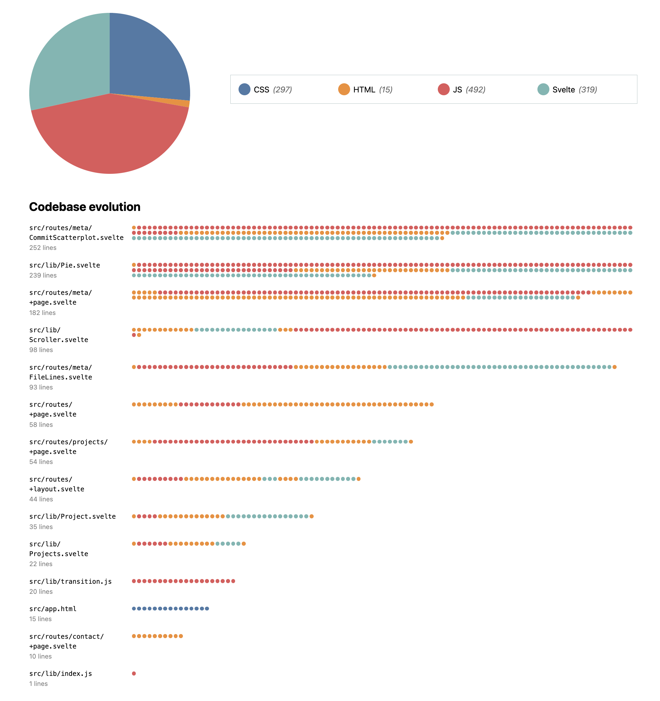

# Lab {{ page.lab }}: Animation

{: .no_toc}

{: .summary}

> In this lab, we will learn:
>
> - What different methods do we have to transition and animate elements and when to use each?
> - What considerations should we take into account for using animations effectively?

<details open markdown="block">
  <summary>
    Table of contents
  </summary>
  {: .text-delta }
- TOC
{:toc}
</details>

---

## Submission

To get checked off for the lab, please record a 2 minute video with the following components:

1. Present your interactive narrative visualization
2. Show you interacting with your visualization.
3. Share the most interesting thing you learned from this lab.

**Videos longer than 2 minutes will be trimmed to 2 minutes before we grade, so
make sure your video is 2 minutes or less.**

## [Slides](https://docs.google.com/presentation/d/1u3yjhpcHGN9J84xQpmqao7Q-5rxZE6Xy2jgOf6rzruo/edit?usp=sharing)

<!-- - [Relevant technologies (summary slide)](./slides/#technologies) -->



## What will we make?

In this lab, we will go back to the Meta page of our portfolio,
and convert it to an interactive narrative visualization that shows the progress of our codebase over time (you may **ignore the pie chart part** in the demo since we did not explicitly implement it for our meta tab).

<video src="videos/final.mp4" loading=lazy muted autoplay loop class="browser"></video>

## Step 0: Clean Up

To make your code structure a little nicer, we will first complete the following refactoring steps.

{: .files }
`src/meta/main.js`

Currently, our `selectedCommits` variable is meant to reactively update and depends on `brushSelection`:

```js
selectedCommits = brushSelection ? commits.filter(isCommitSelected) : [];
```

We also have an `isCommitSelected()` function, which checks of a commit is within the `brushSelection` and looks like this:

```js
function isCommitSelected(commit) {
  if (!brushSelection) {
    if (manualSelection) {
      return manualSelection.has(commit);
    }

    return false;
  }

  let min = { x: brushSelection[0][0], y: brushSelection[0][1] };
  let max = { x: brushSelection[1][0], y: brushSelection[1][1] };
  let x = xScale(commit.date);
  let y = yScale(commit.hourFrac);

  return x >= min.x && x <= max.x && y >= min.y && y <= max.y;
}
```

However, `brushSelection` is actually only updated in one place: the `brushed()` function.
We don’t really need to keep it around once we’ve converted it to selected commits.
Let’s update the `brushed()` function to update `selectedCommits` directly:

```js
function brushed(evt) {
  let brushSelection = evt.selection;
  selectedCommits = !brushSelection
    ? []
    : commits.filter((commit) => {
        let min = { x: brushSelection[0][0], y: brushSelection[0][1] };
        let max = { x: brushSelection[1][0], y: brushSelection[1][1] };
        let x = xScale(commit.date);
        let y = yScale(commit.hourFrac);

        return x >= min.x && x <= max.x && y >= min.y && y <= max.y;
      });
}
```

Then `isCommitSelected()` can be much simpler:

```js
function isCommitSelected(commit) {
  return selectedCommits.includes(commit);
}
```

And `selectedCommits` becomes a variable that you may declare at the top level of your code:

```js
let selectedCommits = [];
```

Also, we can now make the colors of individual commits on mouse events consistent with brush selections. We can add this line of code to event handling of `mouseenter` and `mouseleave` (you should have a section that handles these two events in your **scatter plot** code):

```js
d3.select(event.currentTarget).classed('selected', ...); // give it a corresponding boolean value
```

## Step 1: Evolution visualization

{: .files }
`src/meta/main.js` and `src/meta/index.html`

In this step, we will create an interactive timeline visualization that shows the evolution of our repo by allowing us to move a slider to change the date range of the commits we are looking at.

### Step 1.1: Creating the filtering UI

In this step we will create a slider, bind its value to a variable, and display the date and time it corresponds to.
It’s very familiar to what we did in [the previous lab](../lab07/).

First, let’s create a new variable, `commitProgress`, that will represent the maximum time we want to show
as a percentage of the total time:

```js
let commitProgress = 100;
```

To map this percentage to a date, we will need a new [time scale](https://d3js.org/d3-scale/time). Once we have our scale, we can easily get from the 0-100 number to a date:

```js
let timeScale = d3.scaleTime([d3.min(commits, d => d.datetime), d3.max(commits, d => d.datetime)], [0, 100]);
let commitMaxTime = timeScale.invert(commitProgress);
```

We are now ready to add our filtering UI in `index.html`. This is largely a repeat of what we did in [Lab 7](../lab07/):

- A slider (`<input type=range>`) with a min of 0 and max of 100 and bind the slider value to `commitProgress`.
- A `<time>` element to display the commit time using `commitMaxTime.toLocaleString()`.
- A `<label>` _around_ the slider and `<time>` element with some explanatory text (e.g. "Show commits until:").

Where you put it on the page is up to you. I placed it on top of my scatter plot (the `<div>` element with id `chart`). I wrapped the `<label>` inside of `<div>`, to which I applied a `flex: 1` and `align-items: baseline` to align them horizontally. Then I gave `<time>` a `margin-left: auto` to push it all the way to the right. **Note you should apply these style rules as specifically as possible (use ID selectors)!**

{: .tip }
Feel free to use any settings you like.
In the screencasts below, I used `dateStyle: "long"` and `timeStyle: "short"`. You may pass these options into `toLocaleString()` method as an object.

If everything went well, your slider should now be working!


{: .note }
> To make the time string present, you should have the following lines:
>
> ```js
> const selectedTime = d3.select('#selectedTime');
> selectedTime.textContent = timeScale.invert(commitProgress).toLocaleString();
> ```
>
> Figure out where's the most appropriate position to place these.

### Step 1.2: Filtering by `commitMaxTime`

Let’s now ceate a new `filteredCommits` variable that will reactively [filter](https://developer.mozilla.org/en-US/docs/Web/JavaScript/Reference/Global_Objects/Array/filter) `commits` by comparing `commit.datetime` with `commitMaxTime` and only keep those that are **less than** `commitMaxTime`.

We can now replace `commits` with `filteredCommits` in several places (these varies depending on the exact implementation you did for Lab 6 so please be mindful):

- The `xScale` domain for commit time
- The `rScale` domain for each scatter's radius
- The `brushed()` function that updates the `selectedCommits` variable
- Your summary stats

Just to demonstrate, let's take the `createScatterplot()` method that you may have created:

```js
function createScatterplot() {
    // you may have wrote the following lines
    const width = 1000;
    const height = 600;
    const svg = d3.select('#chart').append('svg')...
    xScale = d3.scaleTime()...
    yScale = d3.scaleLinear()...
}
```

You should update it to the following:

```js
function updateScatterplot(filteredCommits) {
  // same as before

  d3.select('svg').remove(); // first clear the svg
  const svg = d3.select('#chart').append('svg')...

  xScale = d3.scaleTime().domain(d3.extent(filteredCommits, (d) => d.datetime))...

  /// same as before

  svg.selectAll('g').remove(); // clear the scatters in order to re-draw the filtered ones
  const dots = svg.append('g').attr('class', 'dots');

  // same as before

  const [minLines, maxLines] = d3.extent(filteredCommits, (d) => d.totalLines);
  const rScale = d3.scaleSqrt().domain([minLines, maxLines])...;

  // same as before

  dots.selectAll('circle').remove(); 
  dots.selectAll('circle').data(filteredCommits).join('circle')...

  // same as before
}
```

Then, you can replace your previous `createScatterplot()` function with `updateScatterplot(commits)` to retain the scattor plot of commits on page load up. Next you can update the scatter plot by calling `updateScatterplot(filteredCommits)` once you finish filtering `commits` by `commitMaxTime`.

You may consider adding this function call to the `updateTimeDisplay()` method:

```js
function updateTimeDisplay() {
  commitProgress = Number(timeSlider.value);
  // what ever you have previously
  ...
  filterCommitsByTime(); // filters by time and assign to some top-level variable.
  updateScatterplot(filteredCommits);
}
```

### Step 1.3: Entry transitions with CSS

Notice that even though we are now getting a nice transition when an existing commit changes radius,
there is no transition when a new commit appears.

<video src="videos/filtering-no-intro.mp4" loading=lazy muted autoplay loop class="browser"></video>

<!-- We *could* fix that with Svelte transitions, but let’s try a different way,
since this is something that we can do _better_ with CSS transitions alone. -->

This is because CSS transitions fire for state changes where both the start and end changes are described by CSS.
A new element being added does not have a start state, so it doesn’t transition. We can use CSS transitions to help resolve this, by explicitly telling the browser what the start state should be.
That’s what the [`@starting-style`](https://developer.mozilla.org/en-US/docs/Web/CSS/@starting-style) rule is for!

Inside the `circle` CSS rule, add a [`@starting-style`](https://developer.mozilla.org/en-US/docs/Web/CSS/@starting-style) rule:

```css
@starting-style {
  r: 0;
}
```

If you preview again, you should notice that that’s all it took, new circles are now being animated as well!

<video src="videos/filtering-intro.mp4" loading=lazy muted autoplay loop class="browser"></video>

{: .further}

> You might notice that the largest circles and the smallest circles are _both_ transitioning with the same _duration_, which means dramatically different _speeds_.
> We may decide that this is desirable: it means all circles are appearing at once.
> However, if you want to instead keep speed constant, you can set an `--r` CSS variable on each `circle` element with its radius, and then set the transition duration to e.g. `calc(var(--r) / 100ms)`.
> You can do that only for `r` transitions like so:
>
> ```css
> transition: all 200ms, r calc(var(--r) * 100ms);
> ```

## Step 2: The race for the biggest file!

In this step we will create a unit visualization that shows the relative size of each file in the codebase in lines of code, as well as the type and age of each line.

### Step 2.1: Adding unit visualization for files

{: .files }
`src/meta/main.js` and `src/style.css`

We want to display the file details for the commits we filtered. We want this section to go after the scatter plot, but for now let's add it right after our filtering slider as that makes development faster.

First, let's obtain the file names and lines associated with each file.

```js
let lines = filteredCommits.flatMap((d) => d.lines);
let files = [];
files = d3
  .groups(lines, (d) => d.file)
  .map(([name, lines]) => {
    return { name, lines };
  });
```

Now that we have our files, let's output them (filenames and number of lines). We will use a `<dl>` element (but feel free to make different choices, there are many structures that would be appropriate here) to give it a simple structure.

```html
<dl class="files">
  <!-- we want the following structure for each file-->
  <div>
    <dt>
      <code>{file.name}</code>
    </dt>
    <dd>{file.lines.length} lines</dd>
  </div>
  <div>
    ...
  </div>
</dl>
```

It should be clear by now what we need from D3 to achieve this:

```js
d3.select('.files').selectAll('div').remove(); // don't forget to clear everything first so we can re-render
let filesContainer = d3.select('.files').selectAll('div').data(files).enter().append('div');

filesContainer.append('dt').append('code').text(d => ...); // TODO
filesContainer.append('dd').text(d => ...); // TODO
```

We should style the `<dl>` as a grid so that the filenames and line counts are aligned.
The only thing that is a bit different now is that we have a `<div>` around each `<dt>` and `<dd>`.
To prevent that from interfering with the grid we should use [Subgrid](https://developer.mozilla.org/en-US/docs/Web/CSS/CSS_grid_layout/Subgrid):

```css
.files > div {
  grid-column: 1 / -1;
  display: grid;
  grid-template-columns: subgrid;
}
```

Then we can just apply `grid-column: 1` to the `<dt>`s and `grid-column: 2` to the `<dd>` as usual.

At this point, our "visualization" is rather spartan,
but if you move the slider, you should already see the number of lines changing!

<video src="videos/file-lines-basic.mp4" loading=lazy muted autoplay loop class="outline"></video>

{: .note }
You may see different summary stat changes depending on which you implemented from [Lab 6](../lab06). And if you are having trouble aligning things, revisit [Lab 2 Step 4.3](../lab02/#step-43-horizontal-alignment-with-subgrid), where we first used sub-grids to align your contact form.

### Step 2.2: Making it look like an actual unit visualization

For a unit visualization, we want to draw an element per data point (in this case, per line committed), so let's do that.
All we need to do is replace the contents of the `<dd>` element with more `<div>`, each corresponding to one line:

```html
<!-- we want to achieve this -->
<dd>
  <div class="line"></div>
</dd>
```

To do so, simply add to where we were appending `<dd>` using D3 selections previous:

```js
// TODO, append divs and set each's class attribute
filesContainer.append('dd')
              .selectAll('div')
              .data(d => d.lines)
              ...
```

{: .tip }
Seeing the total number of lines per file is still useful, so you may want to add it in the `<dt>`.
I used a `<small>` element, gave it `display: block` so that it's on its own line, and styled it smaller and less opaque. You can set both `<code>` and `<small>` tags' contents using `.html()` method. You can revisit it in [Lab 5 Step 2.2](../lab05/#step-22-adding-a-legend)

And then add some CSS to make it look like a unit visualization:

```css
.line {
  display: flex;
  width: 0.5em;
  aspect-ratio: 1;
  background: steelblue;
  border-radius: 50%;
}
```

Last, we want to make sure these dots wrap and are tightly packed, so we need to add some CSS for the `<dd>` elements to allow this:

```css
dd {
  grid-column: 2;
  display: flex;
  flex-wrap: wrap;
  align-items: start;
  align-content: start;
  gap: 0.15em;
  padding-top: 0.6em;
  margin-left: 0;
}
```

At this point, we should have an actual unit visualization!

It should look something like this:

<video src="videos/file-lines-unit.mp4" loading=lazy muted autoplay loop class="outline"></video>

### Step 2.3: Sorting files by number of lines

Our visualization is not really much of a race right now, since the order of files seems random.
We need to sort the files by the number of lines they contain in descending order.
We can do that in the same reactive block where we calculate `files`:

```js
files = d3.sort(files, (d) => -d.lines.length);
```

### Step 2.4: Varying the color of the dots by technology

{: .caveat}
Let's first remove the CSS rule on `.line`'s background in order for us to render different lines of code with distinctive colors.

Our visualization shows us the size of the files, but not all files are created equal.
We can use color to differentiate the lines withn each file by technology.

Let’s create an ordinal scale that maps technology ids to colors:

```js
let fileTypeColors = d3.scaleOrdinal(d3.schemeTableau10);
```

Then, we can use this scale to color the dots:

```js
filesContainer.append('dd')
              .selectAll('div')
              .data(d => d.lines)
              ... // same as before
              .style('background', ...); // TODO, apply the color scale based on line type
```

<!--
If you preview at this point, you will notice that the colors seem somewhat random.
This is because the lines within each file are not actually in the order they appear.
To do that, we need to sort them by their `line` property.
Back in the reactive block where we calculate `files`:

```js
files = files.map(file => {
	file.lines = d3.sort(file.lines, d => d.line);
	return file;
});
```
-->

Much better now!

<video src="videos/file-lines-colored.mp4" loading=lazy muted autoplay loop class="outline"></video>

<!-- ### Step 2.5: Dot transitions

Notice that it's a little hard to compare which lines of each file have been added as we move the slider.
If we make new elements appear with a transition, it will be much easier to see what is happening.
We can use one of the [Svelte predefined transitions](https://svelte.dev/docs/svelte-transition) for this.
I picked `scale` as that makes dots appear to grow from a single point.

If you don’t need to customize the duration etc, all it takes is adding `in:scale` to the `<div>` element!

<video src="videos/file-lines-dottransitions.mp4" loading=lazy muted autoplay loop class="outline"></video> -->

<!-- ### Step 2.6: Consistent colors across visualizations

Notice that we have two visualizations that use colors to represent technologies,
but they use different colors for the same technologies!

To fix this, we need to allow our components (`Pie.svelte` and `FileLines.svelte`) to accept a color scale as a prop, by prepending their `colors` declarations with `export`:

```js
export let colors = d3.scaleOrdinal(d3.schemeTableau10);
```

Then we create the color scale on the parent page and pass it to each of them.
For example, `<FileLines />` would become `<FileLines colors={colors} />`.

That by itself is not enough.
To get consistent colors each component needs to be looking up the color for a technology in the same way.
Currently, `<Pie>` uses technology labels, while `<FileLines>` uses the raw ids from the data.
We can make sure the data we pass to `<Pie>` include an `id` property with the raw id and then use that to look up the color.
To make the component more flexible, we could even use both:

```jsx
<!-- Rest of attributes omitted
<!-- <path fill={ colors(d.id ?? d.label) }>
```

Our visualization is now _way_ more informative!

<!--  -->

<!-- ### Step 2.7: Animated race

We can now use the [`animate:fn` directive](https://svelte.dev/docs/element-directives#animate-fn) to animate the files when they move to a new position.
Svelte provides a built-in animation called `flip`, which sounds perfect for this use case.

We import it at the top of our component:

```js
import { flip } from 'svelte/animate';
```

And then we apply it to the `<div>` that contains each file.
If we are happy with its defaults, it can be as simple as this:

```html
<div animate:flip></div>
```

However, if we preview the animation we get the result is …less than great:

<video src="videos/flip-wrong.mp4" loading=lazy muted autoplay loop class="outline"></video>

We can add a long duration (3000) and a delay (1000) (`animate:flip={{delay: 1000, duration: 3000}}) to more clearly see what is happening:

<video src="videos/flip-wrong-slow.mp4" loading=lazy muted autoplay loop class="outline"></video>

From some further investigation, it appears that Svelte is prematurely caching the geometry of the elements (before and after), which is causing the animation to be incorrect.

But we can use a workaround!
The part after the `animate:` is just referring to a function.
There is nothing special about `flip`, it’s just a function we import.
In fact, if we alt + click on it in the import statement, VS Code will take us to the Svelte module that defines it.
Instead of using it wholesale, we can import with a different name:

```js
import { flip as originalFlip } from 'svelte/animate';
```

We can use a reactive statement to _force_ `flip` to update whenever we need it to,
e.g. whenever `files` changes:

```js
function getFlip() {
  return originalFlip;
}
$: flip = getFlip(files);
```

This tricks Svelte into thinking `flip` depends on `files`, so it will re-run whenever `files` changes.

If you try it now (with a reasonable duration and no delay), you will see that the animation is now correct!

<video src="videos/flip-correct.mp4" loading=lazy muted autoplay loop class="outline"></video>

For the final result, you’d likely want to either specify a duration as a function (which depends on the distance travelled) or remove the parameters (since that is the default).

{: .tip }

> Don’t like the appearance of the items when they overlap? You can apply a semi-transparent white background and a glow with the same color to the `<div>` via something like:
>
> ```css
> & > div {
>   background: hsl(0 0% 100% / 90%);
>   box-shadow: 0 0 0.2em 0.2em hsl(0 0% 100% / 90%);
> }
> ``` -->

<!-- ### Step 3.2: Eliminate flashing by using a keyed `each` block

Our technologies are now sorted, but this made the transition involve a lot of flashing.
Why is that?
The pie wedges are always in the same order, so nothing should be changing color!

This is because Svelte doesn't know which data items correspond to which previous data items,
so it does not necessarily reuse the same `<path>` element for the same data item in the new data.
To tell Svelte which data items correspond to which previous data items, we can use [a _keyed `each` block_](https://svelte.dev/docs/logic-blocks#each), with a value that uniquely identifies the data item.
A good candidate for that would be the label:

```html
{#each pieData as d, index (d.label)}
```

Just this small addition fixes the issue completely!

<video src="videos/keyed.mp4" loop muted autoplay></video> -->

<!-- ### Step 3.4: Transitioning between pies with different technologies

If you try transitioning between pies with _different_ technologies however, you will notice that it all breaks down:

<video src="videos/d3-transition-inout.mp4" loading=lazy muted autoplay loop></video>

How can we fix this?

Right now, we simply exit the function if we can't find both old and new data items for a wedge.
What if we generated dummy objects with the right `startAngle` and `endAngle` that we want these wedges to transition from or to?
We basically want an object where `obj.startAngle` and `obj.endAngle` are both equal to whatever wedge is drawn immediately before the place our wedge is appearing or disappearing from.
The exact logic is a little tricky, so we’ll just provide the code:

```js
function getEmptyArc(label, data = pieData) {
  // Union of old and new labels in the order they appear
  let labels = d3.sort(new Set([...oldData, ...pieData].map((d) => d.label)));
  let labelIndex = labels.indexOf(label);
  let sibling;
  for (let i = labelIndex - 1; i >= 0; i--) {
    sibling = data.find((d) => d.label === labels[i]);
    if (sibling) {
      break;
    }
  }

  let angle = sibling?.endAngle ?? 0;
  return { startAngle: angle, endAngle: angle };
}
```

Now, back in our tweening function, we can use `getEmptyArc()` as a fallback if we can't find the old or new data:

```js
let from = d_old ? {...d_old} : getEmptyArc(label, oldData);
let to = // ...
```

{: .fyi }
The `test ? iftrue : iffalse` syntax is the [conditional operator](https://developer.mozilla.org/en-US/docs/Web/JavaScript/Reference/Operators/Conditional_operator) which helps us get one value or another based on a test, much more compactly than an `if() {...}` block.

We should now get a perfect transition regardless of the technologies present in the old and new pies, right?
Except …we don’t.
If we preview, we see that all our effort did not make an iota of difference.
Why is that?

The reason is that when we transition between pies with different technologies,
the wedges are added to the DOM or removed from the DOM after our code has run.

Thankfully, Svelte provides a feature dedicated to transitioning element addition or removal from the DOM:
[Svelte transitions](https://svelte.dev/docs/element-directives#transition-fn)!
You can either use the same code for both states, via the `transition:fn` directive,
or separate functions for entering and leaving, via the `in:fn` and `out:fn` directives.
Svelte provides a bunch of [predefined functions for common effects](https://svelte.dev/docs/svelte-transition) that you can just import, but in this case we’ll define our own function.

The general structure is quite similar to what we did for `d3-transition`,
just with a different syntax:

```js
function arc(wedge) {
  // Calculations that will only be done once per element go here
  // TODO use transitionArc() to get the data you need
  return {
    duration: transitionDuration,
    css: (t, u) => {
      // t is a number between 0 and 1 that represents the transition progress; u is 1 - t
      // TODO return CSS to be applied for the current t as a string, e.g. `fill: red`
    },
  };
}
```

and then use it, by adding `transition:arc` to our wedge `<path>` (we can also pass parameters, but we won’t do that this time).

There is a lot of the code we wrote in `styleTween` that we can reuse in `animateArc`.
Let’s abstract it out into a new function, `transitionArc()` that accepts
a wedge element and optionally its label (as a performance optimization):

```js
function transitionArc(wedge, label) {
  label ??= Object.entries(wedges).find(([label, w]) => w === wedge)[0];
}
```

We can now move all our code from `styleTween` that calculates `d`, `d_old`, `from`, `to`, `interpolator` etc into `transitionArc`, which will just return an object like:

```js
return { d, d_old, from, to, interpolator };
```

After `d` and `d_old` are calculated, we also want to exit early if they are not different:

```js
if (sameArc(d_old, d)) {
  return null;
}
```

You should implement the `sameArc()` function.
It should return `true` if either both arcs are falsy (e.g. one is `undefined`, the other `null`),
or if both arcs have the same `startAngle` and `endAngle`.

Last, it’s useful to also add a `type` property to the object returned so we know what type of transition we are dealing with:

```js
let type = d ? (d_old ? 'update' : 'in') : 'out';
```

We can now replace the code in `styleTween()` to use our new `transitionArc()` function:

```js
let wedge = this;
let label = Object.keys(wedges)[index];
let transition = transitionArc(wedge, label);
return transition?.interpolator;
```

We can now use the same logic in our Svelte transition!
Can you fill the `arc()` function so that it calls `transitionArc()` to compute the overall transition details and then use the returned `interpolator` to produce a CSS declaration for each frame?
Remember that the `interpolator` that `transitionArc()` is returning gives us a CSS `"path(...)"` value, so
all we need to do to turn this into what Svelte expects is to prepend `"d: "` to it.

{: .caveat }
In "out" transitions, i.e. where an existing element disappears,
**Svelte inverts the progression**.
Therefore, to get the right CSS string, you need to do do something like `transition.type === "out" ? u : t` instead of just `t` as the argument to the interpolator (i.e. `transition.interpolator(transition.type === "out" ? u : t)`).

{: .caveat }
The `css` function needs to return **a CSS _string_**, not an object!
If you get an error like "Cannot read properties of `undefined` (reading 'split')" it’s likely because you are returning the wrong type.

If everything goes well, this is what you should see:

<video src="videos/svelte-transition-cubic.mp4" loading=lazy muted autoplay loop></video> -->

<!-- ### Step 3.5: Harmonizing easing across the D3 and Svelte transitions

We’re getting there, but there are some weird gaps.
This is because we are trying to _synchronize_ Svelte transitions with D3 transitions that have different parameters.
While we did take care of applying the same duration across both, they use different easings!
Svelte uses linear easing by default, whereas D3 uses [`easeCubic`](https://d3js.org/d3-ease#easeCubic) by default.

We can fix this in one of two ways:

- By making the D3 transition linear as well, by adding `.ease(d3.easeLinear)` to the chain of function calls that make up the transition.
- By making the Svelte transition cubic as well, by adding `easing: d3.easeCubic` to the object returned by `arc()`.

Try them both and see what you prefer!

{: .tip }
An easing function is just a function that takes a number between 0 and 1 and returns a number between 0 and 1.
Therefore, you can use Svelte easing functions in D3 and vice versa.

<figure class="multiple">
<video src="videos/svelte-transition-linear.mp4" loading=lazy muted autoplay loop></video>
<video src="videos/svelte-transition-cubic.mp4" loading=lazy muted autoplay loop></video>

<figcaption>
Left: Linear.
Right: Cubic.
</figcaption>
</figure> -->

## Step 3: Scrollytelling Part 1 (commits over time)

{: .files }
`src/meta/main.js`, `src/style.css`, and `src/meta/index.html`.

So far, we have been progressing through these visualizations by moving a slider.
However, these visualizations both tell a story,
the story of how our repo evolved.
Wouldn’t it be cool if we could _actually_ tell that story in our own words, and have the viewer progress through the visualizations as they progress through the narrative?

Let’s do that!

### Step 3.0: Making our page a bit wider, if there is space

Because our scrolly will involve a story next to a visualization, we want to be able to use up more space, at least in large viewports.

We can do this only for the Meta page, by adding a CSS rule where the selector is `:global(body)`.

Then, within the rule, we want to set the `max-width` to `120ch` (instead of `100ch`), but only as long as that doesn’t exceed 80% of the viewport width.
We can do that like this:

```css
max-width: min(120ch, 80vw);
```

### Step 3.1: Implementing a Scrolly

Let's implement our own Scrolly. We will first start by adding a new `<div>`-level addition to our HTML file and introducing a few more top-level variables that will help us define the layout of our scrolling window.

First, let's restructure how we want to display the scatterplot along with our scrollytelling window in `src/meta/index.html`. Put the following in place of where you originally had `<div id='chart'></div>`:

```html
<div id="scrollytelling">
    <div id="scroll-container">
        <div id="spacer"></div>
        <div id="items-container"></div>
    </div>
    <!-- our old scatterplot div -->
    <div id="chart"></div>
</div>
```

Let's add some styling to it too (you are free to improvise any of the following style rules):

```css
#scrollytelling {
  grid-column: 1 / -1;
  display: grid;
  grid-template-columns: subgrid;
}

/* feel free to play with this to make your scrolly more seemless with your plot */
#scroll-container {
  grid-column: 1;
  position: relative;
  width: 95%;
  height: 350px;
  overflow-y: scroll;
  border: 1px solid #ccc;
  margin-bottom: 50px;
}

#chart {
  grid-column: 2;
}

#spacer {
  position: absolute;
  top: 0;
  left: 0;
  width: 100%;
  background: none; /* transparent */
  pointer-events: none;
}

#items-container {
  position: absolute;
  top: 0;
  left: 0;
  width: 100%;
}

.item {
  height: 30px;
  padding: 10px;
  box-sizing: border-box;
  border-bottom: 2px solid #eee;
}
```

Then let's introduce the global variables:

```js
let NUM_ITEMS = 100; // Ideally, let this value be the length of your commit history
let ITEM_HEIGHT = 30; // Feel free to change
let VISIBLE_COUNT = 10; // Feel free to change as well
let totalHeight = (NUM_ITEMS - 1) * ITEM_HEIGHT;
const scrollContainer = d3.select('#scroll-container');
const spacer = d3.select('#spacer');
spacer.style('height', `${totalHeight}px`);
const itemsContainer = d3.select('#items-container');
scrollContainer.on('scroll', () => {
  const scrollTop = scrollContainer.property('scrollTop');
  let startIndex = Math.floor(scrollTop / ITEM_HEIGHT);
  startIndex = Math.max(0, Math.min(startIndex, commits.length - VISIBLE_COUNT));
  renderItems(startIndex);
});
```

Now as you may already see, it's time to implement the `renderItems()` method to adaptively show us commits info as we scroll through it. It's logic is actually fairly straightforward. Upon function call, first erase all previous scrolling results like we always do, then take a new slice of commits and bind it to the commit item container. Here is how it works:

```js
function renderItems(startIndex) {
    // Clear things off
    itemsContainer.selectAll('div').remove();
    const endIndex = Math.min(startIndex + VISIBLE_COUNT, commits.length);
    let newCommitSlice = commits.slice(startIndex, endIndex);
    // TODO: how should we update the scatterplot (hint: it's just one function call)
    ...
    // Re-bind the commit data to the container and represent each using a div
    itemsContainer.selectAll('div')
                  .data(newCommitSlice)
                  .enter()
                  .append('div')
                  ... // TODO: what should we include here? (read the next step)
                  .style('position', 'absolute')
                  .style('top', (_, idx) => `${idx * ITEM_HEIGHT}px`)
}
```

### Step 4.2: Creating a dummy narrative

**As you may have guessed, the whole point of implementing a scrolly is to represent something meaningful for the narrative.**
Don’t spend long on it; you can even generate it with ChatGPT as long as you check that the result is coherent, relevant, and tells a story that complements to the visualization next to it without simply repeating information in a less digestible format.

For now, let’s just create some dummy text that we can use to test our scrollytelling
so that writing the narrative is not a blocker:

```html
// This is one example narrative you can create with each commit
<p>
  On {commit.datetime.toLocaleString("en", {dateStyle: "full", timeStyle:
  "short"})}, I made
  <a href="{commit.url}" target="_blank">
    { index > 0 ? 'another glorious commit' : 'my first commit, and it was glorious' }
  </a>. I edited {commit.totalLines} lines across { d3.rollups(commit.lines, D =>
  D.length, d => d.file).length } files. Then I looked over all I had made, and
  I saw that it was very good.
</p>
```

Now given this structure, hink about how you can set it as an attribute or further append as a child to the elements in `itemsContainer` using D3.

{: .caveat}
If your narrative overflows, it's because we pre-set a really small item height `height: 30px;`. Play around with bigger values until it gives enough space for each of your narratives. And make sure to update the height in both the CSS rule and the `ITEM_HEIGHT` variable.

### Step 4.3: Creating a scroller for our commits over time

Integrate the story you just generated into commit items slicing and rendering.

Also, notice how we were able to create a variable `newCommitSlice` that stores the commits rendered visible from the current scrolling event. We can convenient have our scatter plot to also update based on the same set of commits so they can be consistent!

Once you do that, you should see the following:

<video src="videos/complete.mp4" loading=lazy muted autoplay loop class="tbd"></video>

{: .note}
Note that the summary stats stay unchanged in this case since they still capture the overall information about all your commits. You can make them also update with your scrollytelling. Just re-calculate the stats using `newCommitSlice`. But for simplicity just tie summary stats update to one of the scrollytellings (yes, we will make another one, keep reading [Step 4](#step-4-scrollytelling-part-2-file-sizes)).

Now that everything works, you should remove the slider as it is irrelevant/redundant with the scrolly, and it's largely repeating information that the scrollbar already provides. However, you do want to save some useful functionalities we implemented before about file sizes. Let's do the following:

```js
function displayCommitFiles() {
  const lines = filteredCommits.flatMap((d) => d.lines);
  let fileTypeColors = d3.scaleOrdinal(d3.schemeTableau10);
  let files = d3.groups(lines, (d) => d.file).map(([name, lines]) => {
    return { name, lines };
  });
  files = d3.sort(files, (d) => -d.lines.length);
  d3.select('.files').selectAll('div').remove();
  let filesContainer = d3.select('.files').selectAll('div').data(files).enter().append('div');
  filesContainer.append('dt').html(d => `<code>${d.name}</code><small>${d.lines.length} lines</small>`);
  filesContainer.append('dd')
                .selectAll('div')
                .data(d => d.lines)
                .enter()
                .append('div')
                .attr('class', 'line')
                .style('background', d => fileTypeColors(d.type));
}
```

Now you may still be able to update the commit files in display by calling `displayCommitFiles()`. And you now safely remove code that handles event handling on the slider, as well as the HTML code themselves.

Also notice that the demo above has the scrolly and the scatter plot displayed side by side, think about how you can achieve the same using `grid` and `subgrid` displays.

{: .further }
One thing you could do is show a date next to the actual browser scrollbar thumb,
so that users have a sense of where they are in the timeline.

<!-- {: .tip }
It helps to apply `position: sticky; top: 1em` to the filtering slider so that
it's still visible as you scroll.
You should also apply a background color to it otherwise it will be hard to read. -->

## Step 4: Scrollytelling Part 2 (file sizes)

### Step 4.1: Adding another scrolly

Create another scrolly for the file sizes visualization (e.g. how many lines you edited, think back to [Step 2](#step-2-the-race-for-the-biggest-file). You may directly edit your `src/meta/index.html` for set-up), after the commit visualization.
You can copy and paste the same narrative as a temporary placeholder, but as with the one about commits, you should replace it with something meaningful before you finish the lab.

You will want to use a different variable for it since the filtering condition is likely different. Aside from that, the rest is very similar to Step 4. `displayCommitFiles()` should help make things easy for you.

To make it more visually interesting, you may try to place the scrolly on the right while the unit visualization on th left.

<!-- ### Step 5.2: Limit number of updates

Our scrolly currently looks smooth if we scroll relatively slowly, but breaks down if we scroll fast:

<video src="videos/scrolly-broken.mp4" loading=lazy muted autoplay loop class="browser"></video>

This is where [throttling and debouncing](https://css-tricks.com/debouncing-throttling-explained-examples/) come in.
They are both methods of achieving the same goal: limiting the number of times a function is called.

- **Throttling** enforces a minimum interval between subsequent calls to the same action.
- **Debouncing** defers an action until a certain period of time has passed since the last user action.

The [`<Scrolly>`](https://www.npmjs.com/package/svelte-scrolly) component we are using supports both, via `throttle` and `debounce` props.
Experiment with different values for these props (you don't need to use both) to see what works best for your scrolly.

---

The final result looks similar to this:

<video src="videos/final.mp4" loading=lazy muted autoplay loop class="browser"></video> -->

## Resources

### Transitions & Animations

Tech:

- [Cheatsheet on animation-related technologies](./slides/#technologies)
- [An interactive guide to CSS transitions](https://www.joshwcomeau.com/animation/css-transitions/)

### Scrollytelling

Cool examples:

- [This is a teenager](https://pudding.cool/2024/03/teenagers/)
- [A visual introduction to Machine Learning Part 1](http://www.r2d3.us/visual-intro-to-machine-learning-part-1/)
- [A visual introduction to Machine Learning Part 2](http://www.r2d3.us/visual-intro-to-machine-learning-part-2/)
- [Ben & Jerry’s](https://benjerry.heshlindsdataviz.com/)


