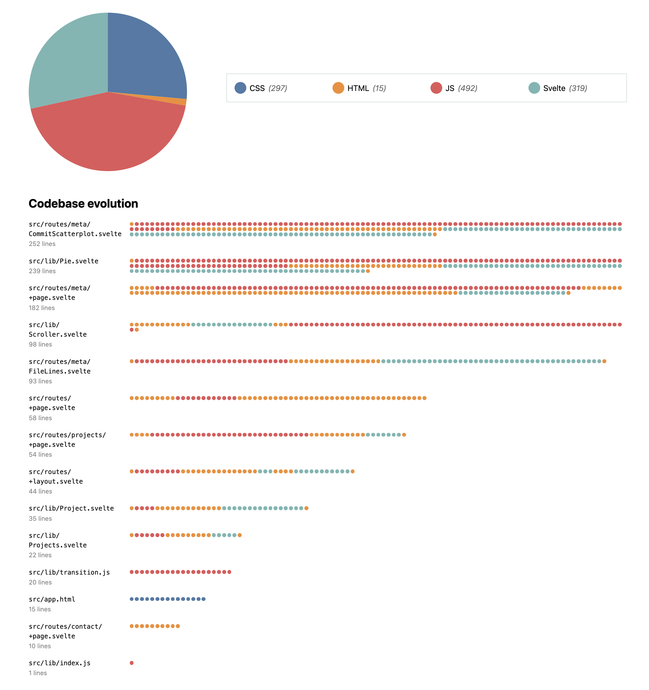

# Lab {{ page.lab }}: Animation

{: .no_toc}

{: .summary}

> In this lab, we will learn:
>
> - What different methods do we have to transition and animate elements and when to use each?
> - What considerations should we take into account for using animations effectively?

<details open markdown="block">
  <summary>
    Table of contents
  </summary>
  {: .text-delta }
- TOC
{:toc}
</details>

---

## Check-off

To get checked off for the lab, please record a 2 minute video with the following components:

1. Present your interactive narrative visualization
2. Show you interacting with your visualization.
3. Share the most interesting thing you learned from this lab.

**Videos longer than 2 minutes will be trimmed to 2 minutes before we grade, so
make sure your video is 2 minutes or less.**

## [Slides](./slides/)

- [Relevant technologies (summary slide)](./slides/#technologies)



## What will we make?

In this lab, we will go back to the Meta page of our portfolio,
and convert it to an interactive narrative visualization that shows the progress of our codebase over time.

<video src="videos/final.mp4" loading=lazy muted autoplay loop class="browser"></video>

## Step 0: Preparation

To make this lab a little easier, we will follow a few prepratory steps in this section.

### Step 0.1: Making commits clickable

{: .files }
`src/meta/+page.svelte`

Currently, the only way to select commits is by brushing the pie chart.
While this is great for selecting multiple commits and seeing stats about the whole group,
it is not very user-friendly for selecting individual commits.

Furthermore, you will need to alternate between selections a lot to debug your work in Step 1,
so it pays off to make this easier.

Before we can add the right event handling to make click selections possible,
we need to make a few changes to our code.
Our `selectedCommits` variable is currently reactive, and depends on `brushSelection`:

```js
$: selectedCommits = brushSelection ? commits.filter(isCommitSelected) : [];
```

We also have an `isCommitSelected()` function, which checks of a commit is within the `brushSelection` and looks like this:

```js
function isCommitSelected(commit) {
  if (!brushSelection) {
    if (manualSelection) {
      return manualSelection.has(commit);
    }

    return false;
  }

  let min = { x: brushSelection[0][0], y: brushSelection[0][1] };
  let max = { x: brushSelection[1][0], y: brushSelection[1][1] };
  let x = xScale(commit.date);
  let y = yScale(commit.hourFrac);

  return x >= min.x && x <= max.x && y >= min.y && y <= max.y;
}
```

However, `brushSelection` is actually only updated in one place: the `brushed()` function.
We don’t really need to keep it around once we’ve converted it to selected commits.
Let’s update the `brushed()` function to update `selectedCommits` directly:

```js
function brushed(evt) {
  let brushSelection = evt.selection;
  selectedCommits = !brushSelection
    ? []
    : commits.filter((commit) => {
        let min = { x: brushSelection[0][0], y: brushSelection[0][1] };
        let max = { x: brushSelection[1][0], y: brushSelection[1][1] };
        let x = xScale(commit.date);
        let y = yScale(commit.hourFrac);

        return x >= min.x && x <= max.x && y >= min.y && y <= max.y;
      });
}
```

Then `isCommitSelected()` can be much simpler:

```js
function isCommitSelected(commit) {
  return selectedCommits.includes(commit);
}
```

And `selectedCommits` no longer needs to be reactive, it can become a plain variable:

```js
let selectedCommits = [];
```

We can also remove the reference to `brushSelection` in the `hasSelection` function, as `selectedCommits` is updated in `brushed`.

{: .tip}
You can now remove the top-level `brushSelection` variable, as it's not used anywhere.

Now, let’s add some event listeners to allow for clicking on commits.
If you have not done the optional [Step 3.5 of Lab 7](https://vis-society.github.io/labs/7/#step-35-bulletproof-positioning-optional), do the part about creating a `dotInteraction()` function now.

Then, we just add two more listeners that call `dotInteraction()` on the dots: `on:click` and `on:keyup`,
and pass the same parameters as the other listeners (`evt` and `index`).

Then, in the `dotInteraction()` function, add a new `else if` branch case that checks if either `evt.type` is `"click"` OR `evt.type` is `keyup` AND `evt.key` is `"Enter"`.
All this branch should do is overwrite `selectedCommits` with an array containing only the commit at `index` (`commits[index]`).

If you try it out now, clicking should work!

<video src="videos/clickable.mp4" loading=lazy muted autoplay loop></video>

### Step 0.2: Iterating over data, not arcs

{: .files }
`lib/Pie.svelte`

Play a little bit with selecting different colors in the pie chart.
What do you notice?
**The same technologies are drawn with different colors across selections!**
You can see this in the video above as well.

This is because the technologies can appear in any order in the data we are passing,
and we are using the index of the data to get the color (`color(index)`).
However, ordinal scales are much more useful when we pass in the actual data value (in this case, the technology name) instead of an index, as they give us a consistent color.

However, if we look at our current code in `lib/Pie.svelte`, we are currently iterating over `arcs` to draw the pie wedges:

```html
{#each arcs as arc, index}
<!-- Other attributes omitted for brevity -->
<path d="{arc}" fill="{" colors(index) }> {/each}</path>
```

This makes it awkward to get any data associated with the pie wedge, such as the label.
We _could_ use `data[index]`, but it’s better to just iterate over the data itself:

```html
{#each data as d, index}
<path d="{arcs[index]}" fill="{" colors(index) }> {/each}</path>
```

We can now pass `d.label` to the color scale instead of just the index:

```html
{#each data as d, index}
<path d="{arcs[index]}" fill="{" colors(d.label) }> {/each}</path>
```

Try it again: now the colors should be consistent across selections!

### Step 0.3: Moving all info to the same data structure

{: .files }
`lib/Pie.svelte`

It _is_ a little awkward that we need to read several different variables to get all the information we need about a pie chart wedge.
However, as a design principle, we don't want to be adding internal data like `startAngle` on a data structure we were passed as input, it’s not good form.
Let’s create a copy of the data and add everything we need to it.
We will use a reactive block instead of a reactive statement, since we want to run multiple lines of code.
First, to copy the data:

```js
let pieData;
$: {
  pieData = data.map((d) => ({ ...d }));
}
```

{: .fyi }
The `{...d}` syntax is a shorthand for creating a new object with all the properties of `d`.

You can now replace all other mentions of `data` in the component with `pieData` (except for the `data` prop itself).

Then, move the `arcData` and `arcs` definitions into local variables within the reactive block,
and combine them with `pieData` like this:

```js
pieData = pieData.map((d, i) => ({ ...d, ...arcData[i], arc: arcs[i] }));
```

This will give us objects with `startAngle`, `endAngle`, and `arc` properties,
in addition to `value` and `label`.
Replace all references to `arcData` and `arcs` to just read from `pieData` (e.g. `arcs[index]` would become `d.arc`).

## Step 1: Evolution visualization

{: .files }
`src/meta/+page.svelte`

In this step, we will create an interactive timeline visualization that shows the evolution of our repo by allowing us to move a slider to change the date range of the commits we are looking at.

### Step 1.1: Creating the filtering UI

In this step we will create a slider, bind its value to a variable, and display the date and time it corresponds to.
It’s very familiar to what we did in [the previous lab](../8/), except we don’t need to worry about a "no filter" state.

First, let’s create a new variable, `commitProgress`, that will represent the maximum time we want to show
as a percentage of the total time:

```js
let commitProgress = 100;
```

To map this percentage to a date, we will need a new [time scale](https://d3js.org/d3-scale/time),
just like we did in [Lab 7](../7/#step-21-drawing-the-dots) that will map `commit.datetime` values to the `[0, 100]` range.

Once we have our scale, we can easily get from the 0-100 number to a date:

```js
$: commitMaxTime = timeScale.invert(commitProgress);
```

We are now ready to add our filtering UI.

1. Create a new `<label>` element with a slider input and a `<time>` element that will display the date and time corresponding to the slider value.
2. Add some CSS to make the slider maximum width (`flex: 1` in Flexbox, `1fr` column width in Grid) and to place the time element underneath the slider (otherwise differences in output value length will move the slider, which is very jarring).
3. Bind the slider value to `commitProgress`
4. Output the selected time in the `<time>` element using `commitMaxTime.toLocaleString()` similarly to how we did in [Lab 7](../7/) and [Lab 8](../8/). This time we need to display _both_ the date and the time.

{: .tip }
Feel free to use any settings you like.
In the screencasts below, I use `dateStyle: "long"` and `timeStyle: "short"`.

If everything went well, your slider should now be working!


### Step 1.2: Filtering by `commitMaxTime`

Let’s now ceate a new `filteredCommits` variable that will reactively [filter](https://developer.mozilla.org/en-US/docs/Web/JavaScript/Reference/Global_Objects/Array/filter) `commits` by comparing `commit.datetime` with `commitMaxTime`.

Similarly, create a `filteredLines` variable that filters `data` in the same way.

We can now replace `commits` with `filteredCommits` and `data` with `filteredLines` in several places:

- The `xScale` domain
- The `brushed()` function that updates the `selectedCommits` variable
- The `{#each}` block that draws the circles
- The `hoveredCommit` variable
- Your summary stats

Try moving the slider and see what happens!

<video src="videos/filtering-unstable.mp4" loading=lazy muted autoplay loop class="outline"></video>

### Step 1.3: Making the circles stable

CSS transitions are already applied to our circles since Lab 7.
However, notice that when we move the slider, the circles are jumping around a lot.

<!-- This is because Svelte is generating new circles, even for the commits that are already there. -->

This is because Svelte doesn't know which data items correspond to which previous data items,
so it does not necessarily reuse the right `<circle>` element for the same commit.
To tell Svelte which data items correspond to which previous data items, we can use [a _keyed `each` block_](https://svelte.dev/docs/logic-blocks#each), with a value that uniquely identifies the data item.
A good candidate for that in this case would be the commit id:

```html
{#each commits as commit, index (commit.id) }
```

Just this small addition fixes the issue completely!

<!-- Just like Step 1.2, the solution is to use a keyed `{#each}` block.
The key can be `commit.id`, since that is a primitive value that uniquely identifies each commit. -->

<!-- The result should already look *a lot* better: -->

<video src="videos/filtering-stable.mp4" loading=lazy muted autoplay loop class="browser"></video>

### Step 1.4: Entry transitions with CSS

Notice that even though we are now getting a nice transition when an existing commit changes radius,
there is no transition when a new commit appears.

<video src="videos/filtering-no-intro.mp4" loading=lazy muted autoplay loop class="browser"></video>

<!-- We *could* fix that with Svelte transitions, but let’s try a different way,
since this is something that we can do _better_ with CSS transitions alone. -->

This is because CSS transitions fire for state changes where both the start and end changes are described by CSS.
A new element being added does not have a start state, so it doesn’t transition.
We _could_ use [Svelte transitions](https://svelte.dev/docs/element-directives#transition-fn) for this, but we don’t need to.
We can actually use CSS transitions,
we just need to explicitly tell the browser what the start state should be.
That’s what the [`@starting-style`](https://developer.mozilla.org/en-US/docs/Web/CSS/@starting-style) rule is for!

Inside the `circle` CSS rule, add a [`@starting-style`](https://developer.mozilla.org/en-US/docs/Web/CSS/@starting-style) rule (and ignore Svelte’s "Unknown at rule" warning):

```css
@starting-style {
  r: 0;
}
```

If you preview again, you should notice that that’s all it took, new circles are now being animated as well!

<video src="videos/filtering-intro.mp4" loading=lazy muted autoplay loop class="browser"></video>

{: .further}

> You might notice that the largest circles and the smallest circles are _both_ transitioning with the same _duration_, which means dramatically different _speeds_.
> We may decide that this is desirable: it means all circles are appearing at once.
> However, if you want to instead keep speed constant, you can set an `--r` CSS variable on each `circle` element with its radius, and then set the transition duration to e.g. `calc(var(--r) / 100ms)`.
> You can do that only for `r` transitions like so:
>
> ```css
> transition: all 200ms, r calc(var(--r) * 100ms);
> ```

### Step 1.5: Moving the scatterplot into a separate component _(optional, but recommended)_

{: .files }
`src/routes/meta/+page.svelte`,
`src/routes/meta/Scatterplot.svelte`

`src/routes/meta/+page.svelte` has begun to grow quite a lot, and it’s only about to get bigger.
It will really help make your code more manageable to start moving reusable functionality to components.
One good candidate is the commit scatterplot.

Create a new file, `src/routes/meta/Scatterplot.svelte`, and move the scatterplot code there.
This includes:

- The `<svg>` element
- The commit tooltip
- Any CSS styling elements in those
- The JS dealing with dimensions, margins, scales, axes, brushing, user interaction with dots, commit selection, etc.

It should have two props:

- `commits` (an array of commits)
- `selectedCommits` (mostly used as output, but could be used as input as well)

We name the variable `commits` in order to make the scatterplot a bit more generalizable.
As such, make sure to change any mentions of `filteredCommits` in your new file back to `commits`.
VS Code allows you to do that safely in one go, by placing the text caret on the variable name, then pressing F2 (or right clicking and selecting "Rename Symbol")

The final result should allow us to replace our entire `<svg>` and commit tooltip in `src/routes/meta/+page.svelte` with just:

```jsx
<CommitScatterplot
  commits={filteredCommits}
  bind:selectedCommits={selectedCommits}
/>
```

{: .caveat }
Don’t forget to also move the necessary imports!
I find it helpful to just copy all of them, then remove the ones VS Code highlights as unused.

## Step 2: The race for the biggest file!

In this step we will create a unit visualization that shows the relative size of each file in the codebase in lines of code, as well as the type and age of each line.

### Step 2.1: Creating a component for the unit visualization

{: .files }
`src/routes/meta/FileLines.svelte`,
`src/routes/meta/+page.svelte`

To avoid bloating `src/routes/meta/+page.svelte` even more, let’s create a new component,
`src/routes/meta/FileLines.svelte`, that will contain the unit visualization.

The component should take a `lines` prop, and will group lines of code into files internally.
This means that from the outside, we’d just use it like this:

```jsx
<FileLines lines={filteredLines} />
```

Eventually we want this to go after the scatterplot & pie chart,
but for now let’s add it right after our filtering UI as that makes development faster.

Then, within the component we will group the lines by file and convert the groups to an array of `{name, lines}` objects like this:

```js
let files = [];
$: {
  files = d3
    .groups(lines, (d) => d.file)
    .map(([name, lines]) => {
      return { name, lines };
    });
}
```

Now that we have our files, let’s output them.
While we _can_ use D3 and generate an SVG for this,
unit visualizations are one of the few cases where it can actually be easier to just use HTML and CSS,
as we need to do a lot less work to manage the position of each element.

We will use a `<dl>` element (but feel free to make different choices, there are many structures that would be appropriate here)
Let’s start simple, by just outputting filenames and number of lines:

```html
<dl class="files">
  {#each files as file (file.name) }
  <div>
    <dt>
      <code>{file.name}</code>
    </dt>
    <dd>{file.lines.length} lines</dd>
  </div>
  {/each}
</dl>
```

Note that we used a _keyed `each` block_ from the get go here.
It’s generally a good practice to do this by default,
especially when iterating over data that we expect to change,
as it avoids a lot of the issues we saw earlier.

We should style the `<dl>` as a grid so that the filenames and line counts are aligned.
The only thing that is a bit different now is that we have a `<div>` around each `<dt>` and `<dd>`.
To prevent that from interfering with the grid we should use [Subgrid](https://developer.mozilla.org/en-US/docs/Web/CSS/CSS_grid_layout/Subgrid):

```css
& > div {
  grid-column: 1 / -1;
  display: grid;
  grid-template-columns: subgrid;
}
```

Then we can just apply `grid-column: 1` to the `<dt>`s and `grid-column: 2` to the `<dd>` as usual.

At this point, our "visualization" is rather spartan,
but if you move the slider, you should already see the number of lines changing!

<video src="videos/file-lines-basic.mp4" loading=lazy muted autoplay loop class="outline"></video>

### Step 2.2: Making it look like an actual unit visualization

For a unit visualization, we want to draw an element per data point (in this case, per line), so let’s do that.
All we need to do is replace the contents of the `<dd>` element with another `{#each}` block that outputs a `<div>` for each line:

```html
{#each file.lines as line (line.line) }
<div class="line"></div>
{/each}
```

{: .tip }
Seeing the total number of lines per file is still useful, so you may want to add it in the `<dt>`.
I used a `<small>` element, gave it `display: block` so that it's on its own line, and styled it smaller and less opaque.

And then add some CSS to make it look like a unit visualization:

```css
.line {
  display: flex;
  width: 0.5em;
  aspect-ratio: 1;
  background: steelblue;
  border-radius: 50%;
}
```

Last, we want to make sure these dots wrap and are tightly packed, so we need to add some CSS for the `<dd>` elements to allow this:

```css
dd {
  grid-column: 2;
  display: flex;
  flex-wrap: wrap;
  align-items: start;
  align-content: start;
  gap: 0.15em;
  padding-top: 0.6em;
  margin-left: 0;
}
```

At this point, we should have an actual unit visualization!

It should look something like this:

<video src="videos/file-lines-unit.mp4" loading=lazy muted autoplay loop class="outline"></video>

### Step 2.3: Sorting files by number of lines

Our visualization is not really much of a race right now, since the order of files seems random.
We need to sort the files by the number of lines they contain in descending order.
We can do that in the same reactive block where we calculate `files`:

```js
files = d3.sort(files, (d) => -d.lines.length);
```

### Step 2.4: Varying the color of the dots by technology

Our visualization shows us the size of the files, but not all files are created equal.
We can use color to differentiate the lines withn each file by technology.

Let’s create an ordinal scale that maps technology ids to colors:

```js
let colors = d3.scaleOrdinal(d3.schemeTableau10);
```

Then, we can use this scale to color the dots:

```html
<div class="line" style="--color: { colors(line.type) }"></div>
```

<!--
If you preview at this point, you will notice that the colors seem somewhat random.
This is because the lines within each file are not actually in the order they appear.
To do that, we need to sort them by their `line` property.
Back in the reactive block where we calculate `files`:

```js
files = files.map(file => {
	file.lines = d3.sort(file.lines, d => d.line);
	return file;
});
```
-->

Much better now!

<video src="videos/file-lines-colored.mp4" loading=lazy muted autoplay loop class="outline"></video>

### Step 2.5: Dot transitions

Notice that it's a little hard to compare which lines of each file have been added as we move the slider.
If we make new elements appear with a transition, it will be much easier to see what is happening.
We can use one of the [Svelte predefined transitions](https://svelte.dev/docs/svelte-transition) for this.
I picked `scale` as that makes dots appear to grow from a single point.

If you don’t need to customize the duration etc, all it takes is adding `in:scale` to the `<div>` element!

<video src="videos/file-lines-dottransitions.mp4" loading=lazy muted autoplay loop class="outline"></video>

### Step 2.6: Consistent colors across visualizations

Notice that we have two visualizations that use colors to represent technologies,
but they use different colors for the same technologies!

To fix this, we need to allow our components (`Pie.svelte` and `FileLines.svelte`) to accept a color scale as a prop, by prepending their `colors` declarations with `export`:

```js
export let colors = d3.scaleOrdinal(d3.schemeTableau10);
```

Then we create the color scale on the parent page and pass it to each of them.
For example, `<FileLines />` would become `<FileLines colors={colors} />`.

That by itself is not enough.
To get consistent colors each component needs to be looking up the color for a technology in the same way.
Currently, `<Pie>` uses technology labels, while `<FileLines>` uses the raw ids from the data.
We can make sure the data we pass to `<Pie>` include an `id` property with the raw id and then use that to look up the color.
To make the component more flexible, we could even use both:

```jsx
<!-- Rest of attributes omitted -->
<path fill={ colors(d.id ?? d.label) }>
```

Our visualization is now _way_ more informative!



### Step 2.7: Animated race

We can now use the [`animate:fn` directive](https://svelte.dev/docs/element-directives#animate-fn) to animate the files when they move to a new position.
Svelte provides a built-in animation called `flip`, which sounds perfect for this use case.

We import it at the top of our component:

```js
import { flip } from 'svelte/animate';
```

And then we apply it to the `<div>` that contains each file.
If we are happy with its defaults, it can be as simple as this:

```html
<div animate:flip></div>
```

However, if we preview the animation we get the result is …less than great:

<video src="videos/flip-wrong.mp4" loading=lazy muted autoplay loop class="outline"></video>

We can add a long duration (3000) and a delay (1000) (`animate:flip={{delay: 1000, duration: 3000}}) to more clearly see what is happening:

<video src="videos/flip-wrong-slow.mp4" loading=lazy muted autoplay loop class="outline"></video>

From some further investigation, it appears that Svelte is prematurely caching the geometry of the elements (before and after), which is causing the animation to be incorrect.

But we can use a workaround!
The part after the `animate:` is just referring to a function.
There is nothing special about `flip`, it’s just a function we import.
In fact, if we alt + click on it in the import statement, VS Code will take us to the Svelte module that defines it.
Instead of using it wholesale, we can import with a different name:

```js
import { flip as originalFlip } from 'svelte/animate';
```

We can use a reactive statement to _force_ `flip` to update whenever we need it to,
e.g. whenever `files` changes:

```js
function getFlip() {
  return originalFlip;
}
$: flip = getFlip(files);
```

This tricks Svelte into thinking `flip` depends on `files`, so it will re-run whenever `files` changes.

If you try it now (with a reasonable duration and no delay), you will see that the animation is now correct!

<video src="videos/flip-correct.mp4" loading=lazy muted autoplay loop class="outline"></video>

For the final result, you’d likely want to either specify a duration as a function (which depends on the distance travelled) or remove the parameters (since that is the default).

{: .tip }

> Don’t like the appearance of the items when they overlap? You can apply a semi-transparent white background and a glow with the same color to the `<div>` via something like:
>
> ```css
> & > div {
>   background: hsl(0 0% 100% / 90%);
>   box-shadow: 0 0 0.2em 0.2em hsl(0 0% 100% / 90%);
> }
> ```

## Step 3: Pie chart transition

{: .files }
`lib/Pie.svelte`

In lab 6, we created a pie chart that shows the distribution of edited lines per technology,
and responds to filtering.
We even [added a `transition: 300ms`](https://vis-society.github.io/labs/6/#step-51-highlighting-hovered-wedge) to our pie chart wedges,
which interpolates any property the browser can interpolate.
This is useful when we select a wedge, but produces rather strange results when the pie data changes
as you have no doubt noticed by now.

Let’s fix it!

{: .tip }
It will help debugging to apply `fill-opacity` to the pie wedges, so you can see when they overlap.
Ideally, we don't want to have gaps or overlapping wedges during the transition.
In the screenshots/screencasts below, I have applied `fill-opacity: 75%;` to the `<path>` elements.
You may also want to use a more distinctive color palette at this point, like `schemeCategory10` or `schemeTableau10`.
The screenshots in this lab will use `schemeTableau10`.

### Step 3.1: Use consistent ordering

The first step is to make sure that the pie chart uses a consistent ordering of technologies, which also makes it easier to compare results across different sets of commits.
By default, `d3.pie()` sorts the wedges by descending value, which in dynamic pie charts, is almost always undesirable.
Instead, let’s sort by the data labels.
This way, as long as the data labels remain consistent, the order of the pie wedges will also remain consistent.

You may notice that there is a [`pie.sort()`](https://d3js.org/d3-shape/pie#pie_sort) function.
Can’t we just use that to sort by labels?
No! If we do that, the arcs would be out of sync with our data!
Instead, we will _disable_ sorting in the pie by adding `.sort(null)` after the call to `d3.pie()`:

```js
let sliceGenerator = d3
  .pie()
  .value((d) => d.value)
  .sort(null);
```

and then we will sort `pieData` itself:

```js
$: {
  pieData = d3.sort(data, (d) => d.label);
  // ... calculate arcData and arcs as before ...
  pieData = pieData.map((d, i) => ({ ...d, ...arcData[i], arc: arcs[i] }));
}
```

{: .caveat }
It is important to sort the data _before_ we calculate `arcData` and `arcs`, otherwise they will be out of sync!

If you try it now, the order should already be correct, though the transition is still suboptimal:

<video src="videos/sorted.mp4" loading=lazy muted autoplay loop></video>

### Step 3.2: Eliminate flashing by using a keyed `each` block

Our technologies are now sorted, but this made the transition involve a lot of flashing.
Why is that?
The pie wedges are always in the same order, so nothing should be changing color!

This is because Svelte doesn't know which data items correspond to which previous data items,
so it does not necessarily reuse the same `<path>` element for the same data item in the new data.
To tell Svelte which data items correspond to which previous data items, we can use [a _keyed `each` block_](https://svelte.dev/docs/logic-blocks#each), with a value that uniquely identifies the data item.
A good candidate for that would be the label:

```html
{#each pieData as d, index (d.label)}
```

Just this small addition fixes the issue completely!

<video src="videos/keyed.mp4" loop muted autoplay></video>

### Step 3.3: Fixing the shape transition using `d3.transition()`

We may have fixed the issues discussed above but the transition is, how should we put it, …suboptimal.
Our shape transitions are still rather weird, especially when transitioning between pies that have different technologies.
Change the transition duration to something longer (e.g. `3s`) so you can more clearly see what is happening:

<video src="videos/arc-wrong.mp4" loop muted autoplay></video>

This is because paths are interpolated naïvely,
by just matching up path segments and interpolating their parameters as numbers.
Especially when it comes to arcs, that is almost _never_ what we want!

<figure>
<iframe loading="lazy" style="width: 100%; height: 1000px; max-height: 80vh; border: 0;" src="https://svelte.dev/repl/4258ae76ca5641138402d267686e1e7e?version=4.2.12"></iframe>
<figcaption>Play with this demo to better understand how the browser’s naïve interpolation works (or rather, doesn’t work) for arcs. <a href="https://svelte.dev/repl/4258ae76ca5641138402d267686e1e7e?version=4.2.12" target="_blank">Open in new window ↗️</a>
</figcaption>
</figure>

{: .fyi }
This is actually a bug in how native CSS interpolation works,
and there is an [open issue](https://github.com/w3c/csswg-drafts/issues/10195) to fix it
(opened by yours truly while authoring this very lab).

Unfortunately, there is no way to fix this with CSS transitions,
and fixing it with CSS animations would require so many keyframes that it would be impractical.
Instead, we will use the [`d3-transition`](https://d3js.org/d3-transition) module,
which trades simplicity for control, by allowing us to compute the intermediate states ourselves, with JS.

The first step is to _disable_ CSS transitions for `d`, so that they don’t interfere with our JS transitions.
We can do this by restricting which properties the browser can auto-transition:

```css
transition: 300ms;
transition-property: transform, opacity, fill;
```

When using [`d3-transition`](https://d3js.org/d3-transition),
together with a reactive framework like Svelte, there are several questions to answer:

- **How** do we get a reference to the DOM nodes for each element we are transitioning?
- **When** do we call `d3.transition()` on them?
- **How** do we read the previous state so we can transition between the old and new states?

Let’s take them one by one.

#### How to get a reference to the DOM elements we are transitioning?

Because [`d3-transition`](https://d3js.org/d3-transition) works with DOM elements,
we will need to obtain a reference to the DOM element for each path.
As we know from previous labs, this is done with `bind:this`.
The only thing that is different here is that we are binding elements inside an `{#each}` block,
so instead of a single variable, we will need to use a data structure to store the references (array or object).
The main consideration here is that we need to be able to go from `pieData` to the element reference and vice versa easily.
Since both are uniquely identified by the data label,
let’s use an object with the data label as the key and the element reference as the value:

```js
let wedges = {};
```

Then, on the `<path>` element, add `bind:this={ wedges[d.label] }`.

{: .tip }
You can check that this is populated correctly by using a `$: console.log(wedges)` reactive statement.

#### When to call `d3.transition()`?

Now that we have the element references, how and when do we call `d3.transition()` on them?
Because [`d3-transition`](https://d3js.org/d3-transition) is based on function calls,
we need to pick the right time to call it ourselves.

Let’s create a new function, `transitionArcs()` that will take care of the transition for us:

```js
function transitionArcs() {
  // TODO Transition all arcs
}
```

Then, in the reactive block that sets `pieData`,
add a call to `transitionArcs()` at the very end,
so that it runs whenever the data changes.

#### How to read the previous state?

Finally, how do we read the previous state so we can transition between the old and new states?
We will create a new variable to keep track of the _old_ data, and we will update it every time the data changes.

First, we create a new root level variable:

```js
let oldData = [];
```

Then, in the same reactive block that we are setting `pieData`, we set `oldData = pieData` right _before_ we update `pieData` (so that it stores the previous value).

---

Great! We now have all the pieces we need to transition the arcs.

The main idea is that instead of interpolating the arcs directly,
we will interpolate the _angles_ and generate new arcs from them.
This is a variant of _dataspace interpolation_ where data is interpolated rather than attribute or CSS property values.

It is recommended to prefer CSS properties for transitions when possible,
so will use the [`d` CSS property](https://developer.mozilla.org/en-US/docs/Web/SVG/Attribute/d#using_d_as_a_css_property) to output the arc as a string.
It may look a little weird because its name is only one letter long, but it works the same way as any other CSS property (except it only works on `<path>` elements).
Unlike the attribute, its value is not just a series of path commands, but a `path()` function that a string argument with the path syntax,
e.g. the CSS declaration `d: path("M 0 0 L 100 0 L 100 100 L 0 100 Z")` is the same as the attribute `d="M 0 0 L 100 0 L 100 100 L 0 100 Z"`.

You should also create a new top-level variable, `transitionDuration`, to control the duration of the transition.
JS-based transition & animation APIs typically expect durations in milliseconds.
Set it to something large for now like e.g. `3000` (3 seconds), to make it easier to debug the transitions.
You can also `export` it as a prop, so that users of the component can optionally override it.

{: .tip }
Adding an `<input type=number bind:value={transitionDuration}>` to your HTML can be very useful for debugging.
It allows you to override the transition at runtime (e.g. to make certain problematic transitions very slow so you can inspect what is happening without slowing everything down.

The general structure of our function will be:

```js
function transitionArcs() {
  let wedgeElements = Object.values(wedges);

  d3.selectAll(wedgeElements)
    .transition('arc')
    .duration(transitionDuration)
    .styleTween('d', function (_, index) {
      let wedge = this;
      // Calculations that will only be done once per element go here
      return (t) => {
        // t is a number between 0 and 1 that represents the transition progress
        // TODO Interpolate the angles and return the path string that corresponds to t
      };
    });
}
```

To calculate the arc, we need the angles.
To calculate the angles, we need the data (old and new).
To find the data, we need the wedge label.
All we have is the index, but that’s all we need:

```js
let label = Object.keys(wedges)[index];
```

Now that we have the label, we can we can find the corresponding data items in `oldData` and `pieData`:

```js
let d = pieData.find(d => d.label === label);
let d_old = // ...
```

Note that we may not have both.
For now, let’s just not proceed in that case:

```js
if (!d || !d_old) {
  return;
}
```

We now have all four angles (start and end, old and new), and we can interpolate them.
Rather than interpolating them separately, D3 actually allows us to interpolate the whole object:

```js
// Always clone objects first, see note in https://d3js.org/d3-interpolate/value#interpolateObject
let from = { ...d_old };
let to = { ...d };
let angleInterpolator = d3.interpolate(from, to);
```

`d3.interpolate()` will return a function that takes a number between 0 and 1 and returns an object with the same properties as `from` and `to`, but with all properties interpolated (we only care about `startAngle` and `endAngle` but we can just ignore the rest).
We can feed that object into a function that generates the path string:

```js
let interpolator = (t) => `path("${arcGenerator(angleInterpolator(t))}")`;
```

Finally, we can now replace the `return t => {...}` line with the interpolator:

```js
return interpolator;
```

If we try it out, you’ll see that it works, at least when transitioning between pies with the same technologies:

<video src="videos/d3-transition.mp4" loading=lazy muted autoplay loop></video>

### Step 3.4: Transitioning between pies with different technologies

If you try transitioning between pies with _different_ technologies however, you will notice that it all breaks down:

<video src="videos/d3-transition-inout.mp4" loading=lazy muted autoplay loop></video>

How can we fix this?

Right now, we simply exit the function if we can't find both old and new data items for a wedge.
What if we generated dummy objects with the right `startAngle` and `endAngle` that we want these wedges to transition from or to?
We basically want an object where `obj.startAngle` and `obj.endAngle` are both equal to whatever wedge is drawn immediately before the place our wedge is appearing or disappearing from.
The exact logic is a little tricky, so we’ll just provide the code:

```js
function getEmptyArc(label, data = pieData) {
  // Union of old and new labels in the order they appear
  let labels = d3.sort(new Set([...oldData, ...pieData].map((d) => d.label)));
  let labelIndex = labels.indexOf(label);
  let sibling;
  for (let i = labelIndex - 1; i >= 0; i--) {
    sibling = data.find((d) => d.label === labels[i]);
    if (sibling) {
      break;
    }
  }

  let angle = sibling?.endAngle ?? 0;
  return { startAngle: angle, endAngle: angle };
}
```

Now, back in our tweening function, we can use `getEmptyArc()` as a fallback if we can't find the old or new data:

```js
let from = d_old ? {...d_old} : getEmptyArc(label, oldData);
let to = // ...
```

{: .fyi }
The `test ? iftrue : iffalse` syntax is the [conditional operator](https://developer.mozilla.org/en-US/docs/Web/JavaScript/Reference/Operators/Conditional_operator) which helps us get one value or another based on a test, much more compactly than an `if() {...}` block.

We should now get a perfect transition regardless of the technologies present in the old and new pies, right?
Except …we don’t.
If we preview, we see that all our effort did not make an iota of difference.
Why is that?

The reason is that when we transition between pies with different technologies,
the wedges are added to the DOM or removed from the DOM after our code has run.

Thankfully, Svelte provides a feature dedicated to transitioning element addition or removal from the DOM:
[Svelte transitions](https://svelte.dev/docs/element-directives#transition-fn)!
You can either use the same code for both states, via the `transition:fn` directive,
or separate functions for entering and leaving, via the `in:fn` and `out:fn` directives.
Svelte provides a bunch of [predefined functions for common effects](https://svelte.dev/docs/svelte-transition) that you can just import, but in this case we’ll define our own function.

The general structure is quite similar to what we did for `d3-transition`,
just with a different syntax:

```js
function arc(wedge) {
  // Calculations that will only be done once per element go here
  // TODO use transitionArc() to get the data you need
  return {
    duration: transitionDuration,
    css: (t, u) => {
      // t is a number between 0 and 1 that represents the transition progress; u is 1 - t
      // TODO return CSS to be applied for the current t as a string, e.g. `fill: red`
    },
  };
}
```

and then use it, by adding `transition:arc` to our wedge `<path>` (we can also pass parameters, but we won’t do that this time).

There is a lot of the code we wrote in `styleTween` that we can reuse in `animateArc`.
Let’s abstract it out into a new function, `transitionArc()` that accepts
a wedge element and optionally its label (as a performance optimization):

```js
function transitionArc(wedge, label) {
  label ??= Object.entries(wedges).find(([label, w]) => w === wedge)[0];
}
```

We can now move all our code from `styleTween` that calculates `d`, `d_old`, `from`, `to`, `interpolator` etc into `transitionArc`, which will just return an object like:

```js
return { d, d_old, from, to, interpolator };
```

After `d` and `d_old` are calculated, we also want to exit early if they are not different:

```js
if (sameArc(d_old, d)) {
  return null;
}
```

You should implement the `sameArc()` function.
It should return `true` if either both arcs are falsy (e.g. one is `undefined`, the other `null`),
or if both arcs have the same `startAngle` and `endAngle`.

Last, it’s useful to also add a `type` property to the object returned so we know what type of transition we are dealing with:

```js
let type = d ? (d_old ? 'update' : 'in') : 'out';
```

We can now replace the code in `styleTween()` to use our new `transitionArc()` function:

```js
let wedge = this;
let label = Object.keys(wedges)[index];
let transition = transitionArc(wedge, label);
return transition?.interpolator;
```

We can now use the same logic in our Svelte transition!
Can you fill the `arc()` function so that it calls `transitionArc()` to compute the overall transition details and then use the returned `interpolator` to produce a CSS declaration for each frame?
Remember that the `interpolator` that `transitionArc()` is returning gives us a CSS `"path(...)"` value, so
all we need to do to turn this into what Svelte expects is to prepend `"d: "` to it.

{: .caveat }
In "out" transitions, i.e. where an existing element disappears,
**Svelte inverts the progression**.
Therefore, to get the right CSS string, you need to do do something like `transition.type === "out" ? u : t` instead of just `t` as the argument to the interpolator (i.e. `transition.interpolator(transition.type === "out" ? u : t)`).

{: .caveat }
The `css` function needs to return **a CSS _string_**, not an object!
If you get an error like "Cannot read properties of `undefined` (reading 'split')" it’s likely because you are returning the wrong type.

If everything goes well, this is what you should see:

<video src="videos/svelte-transition-cubic.mp4" loading=lazy muted autoplay loop></video>

### Step 3.5: Harmonizing easing across the D3 and Svelte transitions

We’re getting there, but there are some weird gaps.
This is because we are trying to _synchronize_ Svelte transitions with D3 transitions that have different parameters.
While we did take care of applying the same duration across both, they use different easings!
Svelte uses linear easing by default, whereas D3 uses [`easeCubic`](https://d3js.org/d3-ease#easeCubic) by default.

We can fix this in one of two ways:

- By making the D3 transition linear as well, by adding `.ease(d3.easeLinear)` to the chain of function calls that make up the transition.
- By making the Svelte transition cubic as well, by adding `easing: d3.easeCubic` to the object returned by `arc()`.

Try them both and see what you prefer!

{: .tip }
An easing function is just a function that takes a number between 0 and 1 and returns a number between 0 and 1.
Therefore, you can use Svelte easing functions in D3 and vice versa.

<figure class="multiple">
<video src="videos/svelte-transition-linear.mp4" loading=lazy muted autoplay loop></video>
<video src="videos/svelte-transition-cubic.mp4" loading=lazy muted autoplay loop></video>

<figcaption>
Left: Linear.
Right: Cubic.
</figcaption>
</figure>

## Step 4: Scrollytelling Part 1 (commits over time)

So far, we have been progressing through these visualizations by moving a slider.
However, these visualizations both tell a story,
the story of how our repo evolved.
Wouldn’t it be cool if we could _actually_ tell that story in our own words, and have the viewer progress through the visualizations as they progress through the narrative?

Let’s do that!

### Step 4.0: Making our page a bit wider, if there is space

Because our scrolly will involve a story next to a visualization, we want to be able to use up more space, at least in large viewports.

We can do this only for the Meta page, by adding a CSS rule where the selector is `:global(body)`.
`:global()` Tells Svelte not to rewrite that part of the selector, and that we will handle any scoping conflicts ourselves.

Then, within the rule, we want to set the `max-width` to `120ch` (instead of `100ch`), but only as long as that doesn’t exceed 80% of the viewport width.
We can do that like this:

```css
max-width: min(120ch, 80vw);
```

### Step 4.1: Using a scrolly

I prepared a [`<Scrolly>`](https://www.npmjs.com/package/svelte-scrolly) component for you to use in this step, you will find the documentation here: [svelte-scrolly](https://www.npmjs.com/package/svelte-scrolly).
If you find any bugs, please [file bug reports](https://github.com/LeaVerou/svelte-scrolly/issues/new) directly at [its bug tracker](https://github.com/LeaVerou/svelte-scrolly/issues?q=is%3Aissue+is%3Aopen+sort%3Aupdated-desc).

{: .note }
There is an official Svelte package for this purpose: [`@sveltejs/svelte-scroller`](https://www.npmjs.com/package/@sveltejs/svelte-scroller) but it seems to only cater to scrollytelling cases where the narrative is overlaid on top of the visualization, which is not what we want here.

To use [`<Scrolly>`](https://www.npmjs.com/package/svelte-scrolly), you first need to install it (via `npm install svelte-scrolly`), then import it at the top of your component:

```js
import Scrolly from 'svelte-scrolly';
```

Then you can use it like this:

```html
<Scrolly bind:progress="{" myProgressVariable }>
  <!-- Story here -->
  <svelte:fragment slot="viz">
    <!-- Visualizations here -->
  </svelte:fragment>
</Scrolly>
```

{: .fyi }
[`<svelte:fragment>`](https://svelte.dev/docs/special-elements#svelte-fragment) is a special element that we can use when no suitable element exists,
to avoid bloating our DOM with pointless wrapper elements.
If there is an actual element that makes sense to use, you should use that instead!

### Step 4.2: Creating a dummy narrative

**Before you finish the lab, you should have something meaningful for the narrative.**
Don’t spend long on it; you can even generate it with ChatGPT as long as you check that the result is coherent, relevant, and tells a story that complements to the visualization next to it without simply repeating information in a less digestible format.

For now, let’s just create some dummy text that we can use to test our scrollytelling
so that writing the narrative is not a blocker:

```html
{#each commits as commit, index }
<p>
  On {commit.datetime.toLocaleString("en", {dateStyle: "full", timeStyle:
  "short"})}, I made
  <a href="{commit.url}" target="_blank"
    >{ index > 0 ? 'another glorious commit' : 'my first commit, and it was
    glorious' }</a
  >. I edited {commit.totalLines} lines across { d3.rollups(commit.lines, D =>
  D.length, d => d.file).length } files. Then I looked over all I had made, and
  I saw that it was very good.
</p>
{/each}
```

### Step 4.3: Creating a scroller for our commits over time

Move the story you just generated into the [`<Scrolly>`](https://www.npmjs.com/package/svelte-scrolly) component,
and the scatterplot and pie chart into the `<svelte:fragment slot="viz">`.

Then, bind the existing `commitProgress` variable to the `progress` variable of the [`<Scrolly>`](https://www.npmjs.com/package/svelte-scrolly) component (`<Scrolly bind:progress={commitProgress}>`).

If you try it now, you should already see that the scroller is advancing the slider as you scroll!

<video src="videos/scrolly-commits.mp4" loading=lazy muted autoplay loop class="tbd"></video>

Now that everything works, you should remove the slider
as it conflicts with the scrolly,
and it's largely repeating information that the scrollbar already provides.

{: .further }
One thing you could do is show a date next to the actual browser scrollbar thumb,
so that users have a sense of where they are in the timeline.

<!-- {: .tip }
It helps to apply `position: sticky; top: 1em` to the filtering slider so that
it's still visible as you scroll.
You should also apply a background color to it otherwise it will be hard to read. -->

## Step 5: Scrollytelling Part 2 (file sizes)

### Step 5.1: Adding another scrolly

Create another [`<Scrolly>`](https://www.npmjs.com/package/svelte-scrolly) instance for the file sizes visualization,
after the commit visualization.
You can copy and paste the same narrative as a temporary placeholder,
but as with the one about commits, you should replace it with something meaningful before you finish the lab.

The progress of this component is independent, so you will want to use a different variable for it (and similarly the corresponding `maxTime` variable and filtered data).
Aside from that, the rest is very similar to Step 4.

To make it more visually interesting, we can place that story on the right,
and the unit visualization on the left. To do that, you add `--scrolly-layout="viz-first"` to the component,
which passes that CSS variable to it:

```html
<Scrolly bind:progress="{raceProgress}" --scrolly-layout="viz-first"></Scrolly>
```

You can also specify `--scrolly-viz-width="1.5fr"` to change the proportion of viz to story to 3:2 give it more space.

### Step 5.2: Limit number of updates

Our scrolly currently looks smooth if we scroll relatively slowly, but breaks down if we scroll fast:

<video src="videos/scrolly-broken.mp4" loading=lazy muted autoplay loop class="browser"></video>

This is where [throttling and debouncing](https://css-tricks.com/debouncing-throttling-explained-examples/) come in.
They are both methods of achieving the same goal: limiting the number of times a function is called.

- **Throttling** enforces a minimum interval between subsequent calls to the same action.
- **Debouncing** defers an action until a certain period of time has passed since the last user action.

The [`<Scrolly>`](https://www.npmjs.com/package/svelte-scrolly) component we are using supports both, via `throttle` and `debounce` props.
Experiment with different values for these props (you don't need to use both) to see what works best for your scrolly.

---

The final result looks similar to this:

<video src="videos/final.mp4" loading=lazy muted autoplay loop class="browser"></video>

## Resources

### Transitions & Animations

Tech:

- [Cheatsheet on animation-related technologies](./slides/#technologies)
- [An interactive guide to CSS transitions](https://www.joshwcomeau.com/animation/css-transitions/)

### Scrollytelling

Cool examples:

- [This is a teenager](https://pudding.cool/2024/03/teenagers/)
- [A visual introduction to Machine Learning Part 1](http://www.r2d3.us/visual-intro-to-machine-learning-part-1/)
- [A visual introduction to Machine Learning Part 2](http://www.r2d3.us/visual-intro-to-machine-learning-part-2/)
- [Ben & Jerry’s](https://benjerry.heshlindsdataviz.com/)


