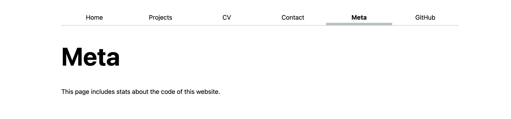
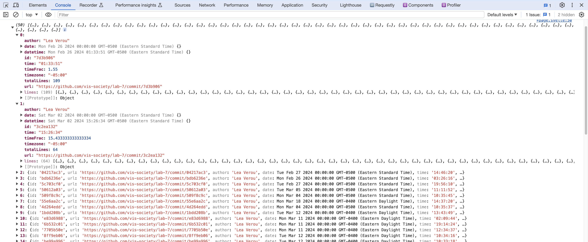
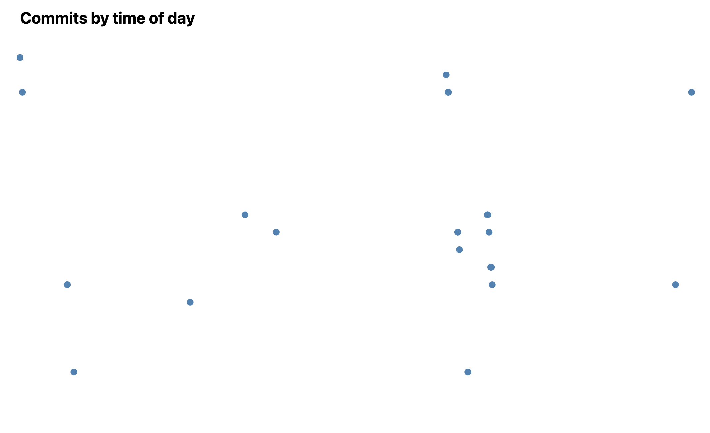
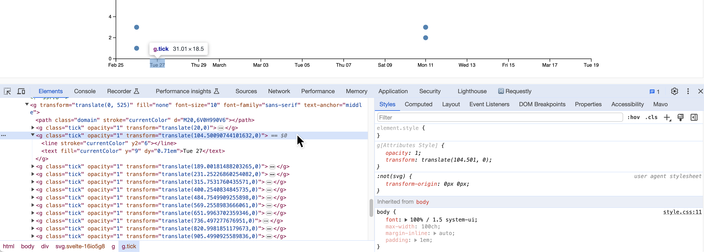
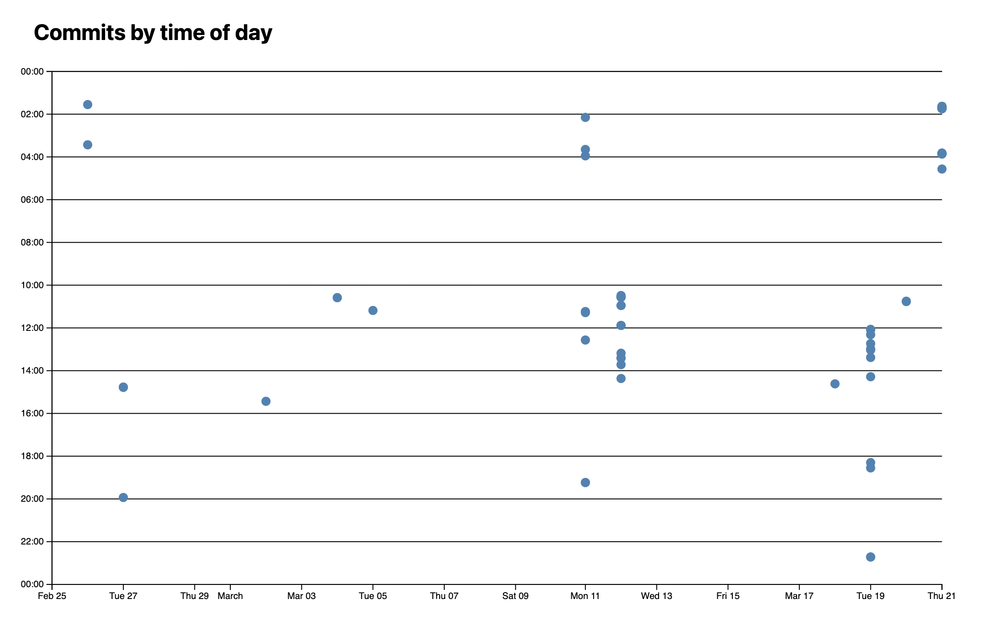
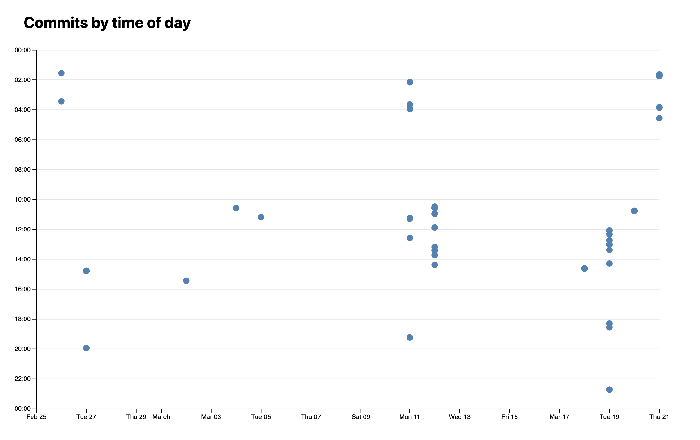
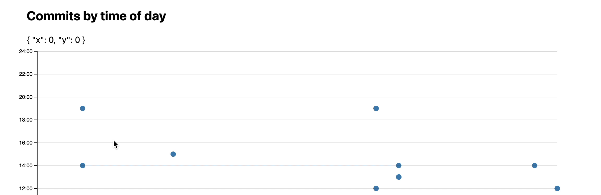
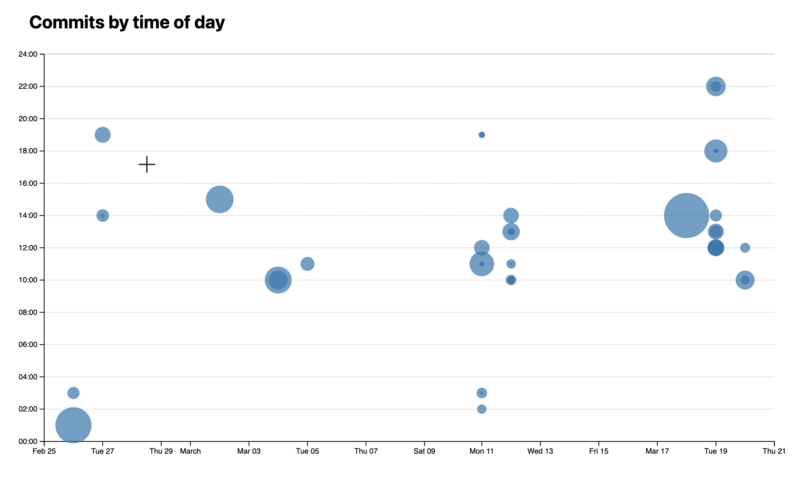

# Lab 7: Visualizing quantitative data with D3

{: .no_toc}

{: .summary}

> In this lab, we will learn:
>
> - How do we draw visualizations for quantitative data, such as bar charts and scatter plots, using D3
> - How to show tooltips on hover as a way to provide more information about the data
> - How to compute summary statistics about our data in a structured a way

<details open markdown="block">
  <summary>
    Table of contents
  </summary>
  {: .text-delta }
- TOC
{:toc}
</details>

---

## Check-off

To get checked off for the lab, please record a 2 minute video with the following components:

1. Present your quantitative D3 visualizations
2. Show you interacting with your D3 visualizations.
3. Share the most interesting thing you learned from this lab.

**Videos longer than 2 minutes will be trimmed to 2 minutes before we grade, so
make sure your video is 2 minutes or less.**

## Slides (or lack thereof)

Just like the previous lab, there are no slides for this lab!
Since the topic was covered in last Monday’s lecture,
it can be helpful for you to review the [material from it](../../lectures/intro-svelte-d3.html).

{: .note }
This lab is a little more involved than most of the previous labs,
because it’s introducing the core technical material around data visualization.
A robust understanding of these concepts will be invaluable
as you work on your final projects, so spending time practicing them for the lab
will be time will spent.

## Step 0: Setting up

This step takes you through several prepratory steps before we can work on the main part of the lab.

### Step 0.1: Adding a new page with meta-analysis of the code in our project

In this lab, we will be computing and visualizing different stats about our codebase.
We will display these in a new page on our website.
Create a `routes/meta/+page.svelte` file and add some content in it (e.g. a heading, a description).

Add it to your navigation menu.



### Step 0.2: Adding code analysis script

In this step you will install [our code analysis script](https://www.npmjs.com/package/elocuent) which will analyze the code of our app and display some statistics about it.

{: .fyi }
If you’re interested in the details of how this script works, you can [examine its code in its repo](https://github.com/LeaVerou/elocuent/tree/main/src).
It’s just some JS code that runs in Node.js :) (and it’s not that long either!)

First, open the terminal and run this, to install [the package](https://www.npmjs.com/package/elocuent) that will do the analysis:

```bash
npm install elocuent -D
```

Now in your terminal, run this command:

```bash
npx elocuent -d static,src -o static/loc.csv
```

Or this, if you’ve used spaces for indentation (replace `2` with the number of spaces):

```bash
npx elocuent -d static,src -o static/loc.csv --spaces 2
```

Make sure your indentation is consistent across your code!

{: .tip }
Two very popular tools to ensure a consistent code style are [ESLint](https://eslint.org/) (JS only)
and [Prettier](https://prettier.io/) (JS, CSS, HTML)
They have different philosophies: ESLint is a _linting tool_: you define what rules you want to follow, and it warns you when you don’t follow them (often it can fix them too, but you need to explicitly ask it to).
Prettier is a _code formatter_: when you hit Save it auto-formats your code based on its predefined rules.
Linters give you more control, whereas code formatters are more hands-off but also less flexible.

If everything went well, you should now have a file called `loc.csv` in the `static` directory.
Its content should look like this (showing first 30 lines):

<details markdown="1">
<summary>First 30 lines of <code>loc.csv</code></summary>

```csv
file,line,type,commit,author,date,time,timezone,datetime,depth,length
src/app.html,1,html,7d3b906,Lea Verou,2024-02-26,01:33:51,-05:00,2024-02-26T01:33:51-05:00,0,15
src/app.html,2,html,7d3b906,Lea Verou,2024-02-26,01:33:51,-05:00,2024-02-26T01:33:51-05:00,0,16
src/app.html,3,html,7d3b906,Lea Verou,2024-02-26,01:33:51,-05:00,2024-02-26T01:33:51-05:00,1,5
src/app.html,4,html,7d3b906,Lea Verou,2024-02-26,01:33:51,-05:00,2024-02-26T01:33:51-05:00,2,22
src/app.html,5,html,7d3b906,Lea Verou,2024-02-26,01:33:51,-05:00,2024-02-26T01:33:51-05:00,2,26
src/app.html,6,html,7d3b906,Lea Verou,2024-02-26,01:33:51,-05:00,2024-02-26T01:33:51-05:00,2,55
src/app.html,7,html,7d3b906,Lea Verou,2024-02-26,01:33:51,-05:00,2024-02-26T01:33:51-05:00,2,68
src/app.html,8,html,3c2ea132,Lea Verou,2024-03-02,15:26:34,-05:00,2024-03-02T15:26:34-05:00,2,59
src/app.html,9,html,04217ac3,Lea Verou,2024-02-27,14:46:20,-05:00,2024-02-27T14:46:20-05:00,2,64
src/app.html,10,html,7d3b906,Lea Verou,2024-02-26,01:33:51,-05:00,2024-02-26T01:33:51-05:00,2,14
src/app.html,11,html,7d3b906,Lea Verou,2024-02-26,01:33:51,-05:00,2024-02-26T01:33:51-05:00,1,6
src/app.html,12,html,7d3b906,Lea Verou,2024-02-26,01:33:51,-05:00,2024-02-26T01:33:51-05:00,1,41
src/app.html,13,html,7d3b906,Lea Verou,2024-02-26,01:33:51,-05:00,2024-02-26T01:33:51-05:00,2,51
src/app.html,14,html,7d3b906,Lea Verou,2024-02-26,01:33:51,-05:00,2024-02-26T01:33:51-05:00,1,6
src/app.html,15,html,7d3b906,Lea Verou,2024-02-26,01:33:51,-05:00,2024-02-26T01:33:51-05:00,0,7
src/routes/+page.svelte,1,svelte,7d3b906,Lea Verou,2024-02-26,01:33:51,-05:00,2024-02-26T01:33:51-05:00,0,21
src/routes/+page.svelte,2,svelte,7d3b906,Lea Verou,2024-02-26,01:33:51,-05:00,2024-02-26T01:33:51-05:00,0,43
src/routes/+page.svelte,3,svelte,7d3b906,Lea Verou,2024-02-26,01:33:51,-05:00,2024-02-26T01:33:51-05:00,0,40
src/routes/+page.svelte,4,svelte,7d3b906,Lea Verou,2024-02-26,01:33:51,-05:00,2024-02-26T01:33:51-05:00,1,102
src/routes/+page.svelte,5,svelte,7d3b906,Lea Verou,2024-02-26,01:33:51,-05:00,2024-02-26T01:33:51-05:00,1,76
src/routes/+page.svelte,6,svelte,7d3b906,Lea Verou,2024-02-26,01:33:51,-05:00,2024-02-26T01:33:51-05:00,1,39
src/routes/+page.svelte,7,svelte,bdb6236e,Lea Verou,2024-02-26,03:26:16,-05:00,2024-02-26T03:26:16-05:00,0,4
src/routes/+page.svelte,8,svelte,bdb6236e,Lea Verou,2024-02-26,03:26:16,-05:00,2024-02-26T03:26:16-05:00,0,0
src/routes/+page.svelte,9,svelte,bdb6236e,Lea Verou,2024-02-26,03:26:16,-05:00,2024-02-26T03:26:16-05:00,0,8
src/routes/+page.svelte,10,js,04217ac3,Lea Verou,2024-02-27,14:46:20,-05:00,2024-02-27T14:46:20-05:00,0,42
src/routes/+page.svelte,11,js,5c703cf0,Lea Verou,2024-02-27,19:56:10,-05:00,2024-02-27T19:56:10-05:00,0,44
src/routes/+page.svelte,12,js,50612a03,Lea Verou,2024-03-05,11:11:52,-05:00,2024-03-05T11:11:52-05:00,0,68
src/routes/+page.svelte,13,js,50612a03,Lea Verou,2024-03-05,11:11:52,-05:00,2024-03-05T11:11:52-05:00,0,19
src/routes/+page.svelte,14,js,50612a03,Lea Verou,2024-03-05,11:11:52,-05:00,2024-03-05T11:11:52-05:00,1,8
```

</details>

You can find a description of the metadata stored [here](https://www.npmjs.com/package/elocuent).

{: .fyi }
Why are we using CSV instead of e.g. JSON?
CSV is more efficient for data that has many rows, since we don’t need to repeat the names of the properties for every row.

Do periodically re-run the script as you work through the lab to see the data update!

### Step 0.3: Setting it up so that the CSV file is generated on every build

We want the CSV file to be generated every time we build our app, so that it’s always up-to-date.
We can do that by adding a `prebuild` script to our `package.json` that runs `npx elocuent`.
Right above this line in `package.json`:

```json
"build": "vite build",
```

add:

```json
"prebuild": "npx elocuent -d static,src -o static/loc.csv",
```

We also need make sure that our build environment (which we specify in `deploy.yml`) has access to all of our Git history.
To do this, open `.github/workflows/deploy.yml` and modify the `Checkout` step so that it looks like this:

```yaml
- name: Checkout
  uses: actions/checkout@v4
  with:
    fetch-depth: '0'
```

{: .fyi}
`fetch-depth: '0'` tells GitHub actions to [fetch _all_ history for all branches and tags](https://github.com/actions/checkout?tab=readme-ov-file#fetch-all-history-for-all-tags-and-branches).
By default, the action will only fetch the latest commit, so your deployed scatterplot will only have one dot!

Now, every time we run `npm run build`, `elocuent` will be run first.

### Step 0.4: Exclude CSV from committed files.

Since we are now generating the script on the server as well, there is no reason to include it in our commits.
Add `static/loc.csv` to your `.gitignore` file.

If you have already committed it, you will need to first delete the file,
commit & push the deletion and the addition to `.gitignore`,
and only after that re-run the script to re-generate it.

## Step 1: Displaying summary stats

### Step 1.1: Reading the CSV file in D3

In our `routes/meta/+page.svelte` file, we will now read the CSV file.
Thankfully, we don’t have to reinvent the wheel and parse CSV files ourselves, D3 has a built-in function for that.

Add a `<script>` element to the Meta page, and import D3, like you did in the previous lab:

```javascript
import * as d3 from 'd3';
```

We will be using the `d3.csv()` function from the [`d3-fetch`](https://d3js.org/d3-fetch) module, which provides helper functions for fetching data.

Now let’s read the CSV file:

```javascript
import { onMount } from 'svelte';

let data = [];

onMount(async () => {
  data = await d3.csv('loc.csv');
});
```

and let’s print out the total lines of code in our repo in the HTML to make sure it worked:

```html
<p>Total lines of code: {data.length}</p>
```

If everything went well, you’ll be seeing something like this:


To see the structure of these objects, add a `console.log(data)` right after the statement that sets the variable,
then check your console.

You should be seeing something like this(I’ve expanded the first row):


Note that everything is a string, including the numbers and dates.
That can be quite a footgun when handling data \*(as an anecdote, I spent about an hour debugging an issue caused by using `+` to add two numbers together, which instead concatenated them as strings **while developing this very lab!\***).
To fix it, we add a [row conversion function](<https://d3js.org/d3-dsv#dsv_parse):

```javascript
data = await d3.csv('loc.csv', (row) => ({
  ...row,
  line: Number(row.line), // or just +row.line
  depth: Number(row.depth),
  length: Number(row.length),
  date: new Date(row.date + 'T00:00' + row.timezone),
  datetime: new Date(row.datetime),
}));
```

It should now look like this:


Don’t forget to delete this line now that we’re done — we don’t want to clutter our page with debug info!

### Step 1.2: Computing commit data

Notice that while this data includes information about each commit[^eachcommit] (that still has an effect on the codebase),
it's not in a format we can easily access, but mixed in with the data about each line (this is called _denormalized_ data).

[^eachcommit]: Actually, it will only include commits that still have an effect on the codebase, since it’s based on lines of code that are currently present in the codebase. Therefore if all a commit did was change lines that have since been edited by other commits, that commit will not show up here. If we wanted to include _all_ commits, we'd need to process the output of [`git log`](https://git-scm.com/docs/git-log) instead, but that is outside the scope of this lab.

Let’s extract this data about commits in a separate object for easy access.
We will compute this inside `onMount` after reading the CSV file.

First, define a `commits` variable outside `onMount`:

```js
let commits = [];
```

Then, inside `onMount`, we will use the [`d3.groups()`](https://d3js.org/d3-array/group#groups) method to group the data by the `commit` property.

```javascript
commits = d3.groups(data, (d) => d.commit);
```

This will give us an array where each element is an array with two values:

- The first value is the unique commit identifier
- The second value is an array of objects for lines that have been modified by that commit.

{: .tip }
Print it out with `{JSON.stringify(commits, null, "\t")}` to see what it looks like!

To transform this into an array of objects about each commit,
with a `lines` property that contains the number of lines that were modified by that commit:

```js
commits = d3
  .groups(data, (d) => d.commit)
  .map(([commit, lines]) => {
    let first = lines[0];
    let { author, date, time, timezone, datetime } = first;
    let ret = {
      id: commit,
      url: 'https://github.com/vis-society/lab-7/commit/' + commit,
      author,
      date,
      time,
      timezone,
      datetime,
      hourFrac: datetime.getHours() + datetime.getMinutes() / 60,
      totalLines: lines.length,
    };

    // Like ret.lines = lines
    // but non-enumerable so it doesn’t show up in JSON.stringify
    Object.defineProperty(ret, 'lines', {
      value: lines,
      configurable: true,
      writable: true,
      enumerable: false,
    });

    return ret;
  });
```

Check it out by adding `console.log(commits)` **after** setting it.
In my case it looks like this:



### Step 1.3: Displaying the stats

Let’s get our feet wet with this data by displaying a few more stats.
Use a `<dl>` list that reuses the same formatting as in [the stats on your homepage](../5/#step-23-displaying-the-data-in-a-more-useful-way).

{: .note }
Avoid copy-pasting the CSS. You can either create a class and define the styling for `dl.stats` and its children in your `style.css` file,
or create a `<Stats>` Svelte component that wraps it (I went with the former for simplicity, but the "proper" way is the latter).

Delete the paragraph we added in the previous step and display that as the first stat:

```html
<dl class="stats">
  <dt>Total <abbr title="Lines of code">LOC</abbr></dt>
  <dd>{data.length}</dd>
</dl>
```

You can display the total number of commits as the second statistic.

What other aggregate stats can you calculate about the whole codebase?
Here are a few ideas (pick 3-4 from the list below, or come up with your own):

- Number of files in the codebase
- Maximum file length (in lines)
- Longest file
- Average file length (in lines)
- Average line length (in characters)
- Longest line length
- Longest line
- Maximum depth
- Deepest line
- Average depth
- Average file depth
- Time of day (morning, afternoon, evening, night) that most work is done
- Day of the week that most work is done

<figure markdown="1">


<figcaption>
Example of a summary stats section
</figcaption>
</figure>

You will find the [`d3-array`](https://d3js.org/d3-array) module very helpful for these kinds of computations,
and especially:

- [Summarizing data](https://d3js.org/d3-array/summarize)
- [Grouping data](https://d3js.org/d3-array/group)

Following is some advice on how to calculate these stats depending on their category.

#### Aggregates over the whole dataset

These compute an aggregate (e.g. sum, mean, min, max) over a property across the whole dataset.

Examples:

- Average line length
- Longest line
- Maximum depth
- Average depth

These involve using one of the [data summarization methods](https://d3js.org/d3-array/summarize) over the whole dataset,
mapping to the property you want to summarize, and then applying the method.
For example, to calculate the maximum depth, you’d use `d3.max(data, d => d.depth)`.
To calculate the average depth, you’d use `d3.mean(data, d => d.depth)`.

#### Number of distinct values

These compute the number of distinct values of a property across the whole dataset.

Examples:

- Number of files
- Number of authors
- Number of days worked on site

To calculate these, you’d use [`d3.group()`](https://d3js.org/d3-array/group#group) / [`d3.groups()`](https://d3js.org/d3-array/group#groups) to group the data by the property you want to count the distinct values of,
and then use `result.size` / `result.length` respectively to get the number of groups.

For example, the number of files would be `d3.group(data, d => d.file).size`,
(or `d3.groups(data, d => d.file).length`).

#### Grouped aggregates

These are very interesting stats, but also the most involved of the bunch.
These compute an aggregate within a group, and then a _different_ aggregate across all groups.

Examples:

- Average file length (in lines)
- Average file depth (average of max depth per file)

First, we use `d3.rollup()` / `d3.rollups()` to compute the aggregate within each group.
If it seems familiar, it’s because [we used it in the previous lab to calculate projects per year](../6/#step-32-passing-project-data-via-the-data-prop).
For example, to calculate the average file length, we’d use `d3.rollups()` to callculate lengths for all files via

```js
$: fileLengths = d3.rollups(
  data,
  (v) => d3.max(v, (v) => v.line),
  (d) => d.file,
);
```

Then, to find the average of those, we’d use `d3.mean()` on the result:

```js
$: averageFileLength = d3.mean(fileLengths, (d) => d[1]);
```

#### Min/max value

These involve finding not the min/max of a property itself,
but another property of the row with the min/max value.
This can apply both to the whole dataset and to groups.

Examples:

- Longest file
- Longest line
- Deepest line
- Time of day (morning, afternoon, evening, night) that most work is done
- Day of the week that most work is done

For example, let’s try to calculate the time of day that the most work is done.
We’d use [`date.toLocaleString()`](https://developer.mozilla.org/en-US/docs/Web/JavaScript/Reference/Global_Objects/Intl/DateTimeFormat/DateTimeFormat) to get the time of day and use that as the grouping value:

```js
$: workByPeriod = d3.rollups(
  data,
  (v) => v.length,
  (d) => d.datetime.toLocaleString('en', { dayPeriod: 'short' }),
);
```

Then, to find the period with the most work, we’d use [`d3.greatest()`](https://d3js.org/d3-array/summarize#greatest) instead of `d3.max()` to get the entire element, then access the name of the period with `.[0]`:

```js
$: maxPeriod = d3.greatest(workByPeriod, (d) => d[1])?.[0];
```

## Step 2: Visualizing time and day of commits in a scatterplot

Now let’s visualize our edits in a scatterplot
with the time of day as the Y axis and the date as the X axis.

### Step 2.1: Drawing the dots

First, let’s define a width and height for our coordinate space in our `<script>` block:

```js
let width = 1000,
  height = 600;
```

Then, in the HTML we add an `<svg>` element to hold our chart, and a suitable heading (e.g. "Commits by time of day"):

```html
<svg viewBox="0 0 {width} {height}">
  <!-- scatterplot will go here -->
</svg>
```

And a `<style>` element to hold styles:

```html
<style>
  svg {
    overflow: visible;
  }
</style>
```

Now, as shown in the [Web-based visualization lecture](https://vis-society.github.io/lectures/intro-svelte-d3.html),
we create scales to map our data to the coordinate space using the [d3-scale](https://d3js.org/d3-scale/linear) module.

We will need two scales: a Y scale for the times of day, and an X scale for the dates.

The Y scale (`yScale` variable) is a standard [linear scale](https://d3js.org/d3-scale/linear#scaleLinear) that maps the hour of day (`0` to `24`) to the Y axis (0 to `height`).

<!--
```js
$: xScale = d3.scaleTime()
              .domain(d3.extent(commits.map(d => d.date)))
              .range([0, width])
              .nice();

$: yScale = d3.scaleLinear()
              .domain([0, 24])
              .range([height, 0]);
```
-->

But for the X scale (`xScale` variable), there’s a few things to unpack:

- Instead of a linear scale, which is meant for any type of quantitative data, We use a [_time scale_](https://d3js.org/d3-scale/time) which handles dates and times automagically.
  It works with JS [`Date`](https://developer.mozilla.org/en-US/docs/Web/JavaScript/Reference/Global_Objects/Date) objects, which we already have in the `datetime` property of each commit.
- We can use [`d3.extent()`](https://d3js.org/d3-array#extent) to find the minimum and maximum date in our data in one fell swoop instead of computing it separately via `d3.min()` and `d3.max()`.
- We can use [`scale.nice()`](https://d3js.org/d3-scale#continuous_nice) to extend the domain to the nearest “nice” values (e.g. multiples of 5, 10, 15, etc. for numbers, or round dates to the nearest day, month, year, etc. for dates).

Once we have both scales,
we can draw the scatter plot by drawing circles with the appropriate coordinates inside our `<svg>` element:

```html
<g class="dots">
  {#each commits as commit, index }
  <circle
    cx="{"
    xScale(commit.datetime)
    }
    cy="{"
    yScale(commit.hourFrac)
    }
    r="5"
    fill="steelblue"
  />
  {/each}
</g>
```

{: .note }
The group (`<g>`) element is not necessary, but it helps keep the SVG structure
a bit more organized once we start adding other visual elements.

If we preview at this point, we’ll get something like this:



That was a bit anti-climactic!
We did all this work and all we got was a bunch of dots?

Indeed, without axes, a scatterplot does not even look like a chart.
Let’s add them!

### Step 2.2: Adding axes

As shown in lecture, the first step to add axes is to create space for them.
We define margins in our JS:

```js
let margin = { top: 10, right: 10, bottom: 30, left: 20 };
```

Then we adjust our scales to account for these margins by changing:

- The range of the X scale from `[0, width]` to `[margin.left, width - margin.right]`
- The range of the Y scale from `[height, 0]` to `[height - margin.bottom, margin.top]`

For readability and convenience,
you can also define a `usableArea` variable to hold these bounds,
since we’ll later need them for other things too:

```js
let usableArea = {
  top: margin.top,
  right: width - margin.right,
  bottom: height - margin.bottom,
  left: margin.left,
};
usableArea.width = usableArea.right - usableArea.left;
usableArea.height = usableArea.bottom - usableArea.top;
```

Now the ranges become much more readable:

- `[usableArea.left, usableArea.right]` for the X scale
- `[usableArea.bottom, usableArea.top]` for the Y scale

Then we create `xAxis` and `yAxis` variables in our JS to hold our axes:

```js
let xAxis, yAxis;
```

and `<g>` elements that we bind to them:

```jsx
<g transform="translate(0, {usableArea.bottom})" bind:this={xAxis} />
<g transform="translate({usableArea.left}, 0)" bind:this={yAxis} />
```

{: .caveat }
Make sure these elements come _before_ your dots, since SVG paints elements in the order they appear in the document,
and you want your dots to be painted over anything else.

Then we use `d3.select()` to select these elements and apply the axes to them via [`d3-axis`](https://d3js.org/d3-axis) functions:

```js
let xAxis, yAxis;

$: {
  d3.select(xAxis).call(d3.axisBottom(xScale));
  d3.select(yAxis).call(d3.axisLeft(yScale));
}
```

If we view our scatterplot now, we’ll see something like this:


Much better, right?

But how does it work?
Right click one of the points in the axes and select "Inspect Element".
You will notice that the ticks are actually `<g>` elements with `<text>` elements inside them.



Only thing that remains is to actually format the Y axis to look like actual times.
We can do that using the [`axis.tickFormat()`](https://d3js.org/d3-axis#axis_tickFormat) method:

```js
d3.select(yAxis).call(
  d3
    .axisLeft(yScale)
    .tickFormat((d) => String(d % 24).padStart(2, '0') + ':00'),
);
```

{: .fyi }

> What is this function actually doing? Let’s break it down:
>
> - `d % 24` uses the remainder operator ([`%`](https://developer.mozilla.org/en-US/docs/Web/JavaScript/Reference/Operators/Remainder)) to get `0` instead of `24` for midnight (we could have done `d === 24? 0 : d` instead)
> - `String(d % 24)` converts the number to a string
> - [`string.padStart()`](https://developer.mozilla.org/en-US/docs/Web/JavaScript/Reference/Global_Objects/String/padStart) formats it as a two digit number
>   Finally, we append `":00"` to it to make it look like a time.

{: .note }
D3 provides a host of date/time formatting helpers in the [`d3-time-format`](https://d3js.org/d3-time-format) module,
however for this case, simple string manipulation is actually easier.

The result looks like this:


### Step 2.3: Adding horizontal grid lines

Axes already improved our plot tenfold (it now looks like an actual scatterplot for one!)
but it’s still hard to see what X and Y values each dot corresponds to.

Let’s add grid lines to make it easier to read the plot at a glance.

{: .caveat }
When adding grid lines, there are a few tradeoffs to consider.
You want to make them prominent enough to assist in reading the chart,
but not so prominent that they add clutter and distract from the data itself.
Err on the side of fewer, fainter grid lines rather than dense and darker ones.

We will only create horizontal grid lines for simplicity, but you can easily add vertical ones too
if you want (but be extra mindful of visual clutter).

Conceptually, there is no D3 primitive specifically for grid lines.
Grid lines are basically just axes with no labels and _freakishly_ long ticks. 😁

So we add grid lines in a very similar way to how we added axes,
but we use the `tickSize` method to make the lines extend across the whole chart.

Just like with the axes, we create a JS variable to hold the axis (I called it `yAxisGridlines`),
and use a reactive statement that starts off identical to the one for our `yScale`.
However, instead of a proper `tickFormat()` that actually formats axis labels, we use `tickFormat("")` to _remove_ the labels.
Thenm we use the [`axis.tickSize()`](https://d3js.org/d3-axis#axis_tickSize) method
with a tick size of `-usableArea.width` to make the lines extend across the whole chart
(the `-` is to flip them).

<!--
```js
let yAxisGridlines;

$: {
	d3.select(yAxisGridlines).call(d3.axisLeft(yScale));
}
```
-->

We also need to create a `<g>` element to hold the grid lines.
Let’s give it a class of `gridlines` so we can style it later:

```html
<g
  class="gridlines"
  transform="translate({usableArea.left}, 0)"
  bind:this="{yAxisGridlines}"
/>
```

{: .caveat }
Make sure that your `<g>` element for the grid lines comes _before_ the `<g>` element for the Y axis,
as you want the grid lines to be painted _under_ the axis, not _over_ it.

So far, we’ve only recreated our Y axis but without the formatting.
How do we turn that into grid lines?
First, we will use [`axis.tickFormat()`](https://d3js.org/d3-axis#axis_tickFormat) again, but this time to _remove_ the text:

```js
$: {
  d3.select(yAxisGridlines).call(d3.axisLeft(yScale).tickFormat(''));
}
```

Then, we use the [`axis.tickSize()`](https://d3js.org/d3-axis#axis_tickSize) method to make the lines extend across the whole chart:

```js
$: {
  d3.select(yAxisGridlines).call(
    d3.axisLeft(yScale).tickFormat('').tickSize(-usableArea.width),
  );
}
```

<!-- We can also add `.tickValues(d3.ticks(0, 24, 25))` to have gridlines every hour, rather than every two hours. -->

If we look now, we already have grid lines, but they look a bit too prominent.

Let’s add some CSS to fix this:

```css
.gridlines {
  stroke-opacity: 0.2;
}
```

Much better now!

<figure markdown="1">




<figcaption>
The grid lines before and after `stroke-opacity`.
</figcaption>
</figure>

{: .caveat }
Do not use `.gridlines line`, `.gridlines .tick line` or any other descendant selector to style the lines:
Svelte [thinks it’s unused CSS and removes it](https://github.com/sveltejs/svelte/issues/10844)!

{: .further }
Coloring each line based on the time of day, with bluer colors for night times and orangish ones for daytime? 😁

## Step 3: Adding a tooltip

Even with the gridlines, it’s still hard to see what each dot corresponds to.
Let’s add a tooltip that shows information about the commit when you hover over a dot.

### Step 3.1: Static element

First, we’ll render the data in an HTML element, and once we’re sure eveyrthing works well, we’ll make it look like a tooltip.

Similarly to [Step 5.2](../6/#step-52-highlighting-selected-wedge) of the previous lab, when we were selecting a pie wedge, we will now use with a `hoveredIndex` variable to hold the index of the hovered commit,
and a `hoveredCommit` variable that is reactively updated every time a commit is hovered
and holds the data we want to display in the tooltip:

```js
let hoveredIndex = -1;
$: hoveredCommit = commits[hoveredIndex] ?? hoveredCommit ?? {};
```

Then, in our SVG, we add `mouseenter` and `mouseleave` event listeners on each circle:

```html
<!-- Other attributes/directives not shown for brevity -->
<circle on:mouseenter={evt => hoveredIndex = index} on:mouseleave={evt =>
hoveredIndex = -1} />
```

{: .note }
Ignore the accessibility warnings for now, we will get to them once we get the base functionality working.

Now add an element to display data about the hovered commit:

```html
<dl id="commit-tooltip" class="info tooltip">
  <dt>Commit</dt>
  <dd>
    <a href="{ hoveredCommit.url }" target="_blank">{ hoveredCommit.id }</a>
  </dd>

  <dt>Date</dt>
  <dd>{ hoveredCommit.datetime?.toLocaleString("en", {dateStyle: "full"}) }</dd>

  <!-- Add: Time, author, lines edited -->
</dl>
```

In the CSS, we add two rules:

- `dl.info` with grid layout so that the `<dt>`s are on the 1st column and the `<dd>`s on the 2nd, remove their default margins, and apply some styling to make the labels less prominent than the values.
- `.tooltip` with `position: fixed` to it and `top: 1em;` and `left: 1em;` to place it at the top left of the viewport so we can see it regardless of scroll status.

{: .note }
Why not just add everything on a single CSS rule? Because this way we can reuse the `.info` class for other `<dl>`s that are not tooltips and the `.tooltip` class for other tooltips that are not `<dl>`s.

{: .fyi }
What’s the difference between `fixed` and `absolute` [positioning](https://developer.mozilla.org/en-US/docs/Learn/CSS/CSS_layout/Positioning)?
`position: fixed` positions the element relative to the [_viewport_](https://developer.mozilla.org/en-US/docs/Glossary/Viewport), while `position: absolute` positions it relative to the nearest positioned ancestor (or the root element if there is none).
The position offsets are specified via [`top`](https://developer.mozilla.org/en-US/docs/Web/CSS/top), [`right`](https://developer.mozilla.org/en-US/docs/Web/CSS/right), [`bottom`](https://developer.mozilla.org/en-US/docs/Web/CSS/bottom), and [`left`](https://developer.mozilla.org/en-US/docs/Web/CSS/left) properties (or their shorthand, [`inset`](https://developer.mozilla.org/en-US/docs/Web/CSS/inset))
In practice, it means that `position: fixed` elements stay in the same place even when you scroll, while `position: absolute` elements scroll with the rest of the page.

We should also apply some hover styles on the dots, e.g to smoothly make them bigger when hovered we can do something like this:

```scss
circle {
  transition: 200ms;

  &:hover {
    transform: scale(1.5);
  }
}
```

If you preview now, you will see some weirdness (slowed down by 10x):


This is because in SVG by default the origin of transforms is the top left corner of the coordinate system.
To fix that and set the origin to the center of the dot itself, we need two properties:

```css
transform-origin: center;
transform-box: fill-box;
```

The hover effect now looks far more reasonable:


Overall, at the end of this step, we should have something like this:

<video src="videos/hover-info.mp4" muted loop autoplay class="browser" data-url="http://localhost:5173/meta"></video>

### Step 3.2: Making it look like a tooltip

Seeing this info is already useful, but it’s not really a tooltip yet.
There are three components to making our `<dl>` an actual tooltip:

1. Styling it like a tooltip (e.g. giving it a shadow that makes it look raised from the page)
2. Making it only appear when we are hovering over a dot (Step 3.3)
3. Positioning it near the mouse cursor (Step 3.4)

I will do them in that order, but these are largely independent tasks that can be done in either order.
If anything, doing 3 before 1 and 2 might help motivate them better.

In terms of styling,
you should definitely give it a [`background-color`](https://developer.mozilla.org/en-US/docs/Web/CSS/background-color)
as otherwise the text will be hard to read.
You can either go for a solid color (e.g. `white`) or a semi-transparent color (e.g. `oklch(100% 0% 0 / 80%)`) that will show some of the chart behind it.

A few other useful CSS properties are:

- [`box-shadow`](https://developer.mozilla.org/en-US/docs/Web/CSS/box-shadow) for shadows.
  **Avoid overly prominent shadows**: you are trying to make it look elevated, not to decorate it.
  The shadow should not be distracting, but just enough to make it look like it’s floating above the page.
  Generally, the larger the blur radius and the more transparent the color, the more raised the element will look.
  Experiment with different values to see what looks best for your design.
- [`border-radius`](https://developer.mozilla.org/en-US/docs/Web/CSS/border-radius) for rounded corners
- [`backdrop-filter`](https://developer.mozilla.org/en-US/docs/Web/CSS/backdrop-filter) to blur what’s underneath (frosted glass effect).
  This is only relevant if you have a semi-transparent background color.

You would also probably want to add some spacing between its content and the edges of the tooltip, i.e. `padding`.

<figure markdown="1">


<figcaption>
Example before and after.
</figcaption>
</figure>

### Step 3.3: Making only appear when we are hovering over a dot

Currently, our tooltip appears even when it has no content, which is quite jarring.
It also appears when we are not hovering over any dot, and just shows the previous content.
That’s not too bad when it's fixed at the top left of the viewport, but can you picture how annoying this would be if it was an actual tooltip that just won’t take a hint and go away?

We _could_ wrap the whole tooltip with an `{#if hoveredIndex > -1 }...{/if}` block and it would work.
However, that’s not very flexible.
It makes it hard to use transition effects when the tooltip disappears (because it’s gone immediately),
make it disappear with a delay to allow users to interact with it,
or not disappear at all if users are actively interacting with it (hovering it or focusing elements within it).

Instead, we will use the HTML [`hidden`](https://developer.mozilla.org/en-US/docs/Web/HTML/Global_attributes/hidden) attribute:

```jsx
<dl class="info" hidden={hoveredIndex === -1}>
```

and add some CSS to hide the element by fading it out:

```scss
dl.info {
  /* ... other styles ... */
  transition-duration: 500ms;
  transition-property: opacity, visibility;

  &[hidden]:not(:hover, :focus-within) {
    opacity: 0;
    visibility: hidden;
  }
}
```

It should now behave like this:

<video src="videos/tooltip-showhide.mp4" loop autoplay muted></video>

### Step 3.4: Positioning the tooltip near the mouse cursor

Now, the final piece of the puzzle to make this element into an actual tooltip!

Our tooltip is currently positioned at the top left corner of the viewport (actually `1em` from the top and `1em` from the left) in a hardcoded way, via the `top` and `left` properties.
To position it near the mouse cursor instead, we need to set these properties _dynamically_ based on the mouse position.

Thankfully, the event object on mouse events has several properties that give us the mouse position relative to different things.
To get the mouse position relative to the viewport, we can use the `x` and `y` properties of the event object.

We will declare a new variable in our JS and use it to store the last recorded mouse position:

```js
let cursor = { x: 0, y: 0 };
```

Then, we will update it in our `mouseenter` event listener:

```jsx
<!-- Other attributes/directives not shown for brevity/clarity -->
<circle
	on:mouseenter={evt => {
		hoveredIndex = index;
		cursor = {x: evt.x, y: evt.y};
	}}
/>
```

Print it out in your HTML via `{JSON.stringify(cursor, null, "\t")}` and move the mouse around to make sure it works!



As with all these debug statements, don’t forget to remove it once you verify it works.

Now let’s use these to set `top` and `left` on the tooltip:

```jsx
<dl class="info" hidden={hoveredIndex === -1} style="top: {cursor.y}px; left: {cursor.x}px">
```

This is the result:
<video src="videos/tooltip-cursor.mp4" loop autoplay muted></video>

{: .note }
While we directly set `top` and `left` for simplicity,
we usually want to avoid setting CSS properties directly.
It’s more flexible to set custom properties that we then use in our CSS.
For example, assume you wanted to subtly move the shadow as the mouse pointer moves to create more sense of depth ([parallax](https://en.wikipedia.org/wiki/Parallax)).
If we had custom properties with the mouse coordinates, we could just use them in other properties too,
whereas here we’d have to set the `box-shadow` with inline styles too.

### Step 3.5: Bulletproof positioning (optional)

Our naïve approach to positioning the tooltip near the mouse cursor by setting the `top` and `left` CSS properties
works well if the tooltip is small and the mouse is near the center of the viewport.
However, if the tooltip is near the edges of the viewport, it falls apart.

Try it yourself: dock the dev tools at the bottom of the window and make them tall enough that you can scroll the page.
Now hover over a dot near the bottom of the page. Can you see the tooltip?


Solving this on our own is actually an incredibly complicated problem in the general case.
Thankfully, there are many wonderful packages that solve it for us.
We will use [Floating UI](https://floating-ui.com/) here.

First, we install it via npm:

```bash
npm install @floating-ui/dom
```

Then, we import the three functions we will need from it:

```js
import { computePosition, autoPlacement, offset } from '@floating-ui/dom';
```

Just like D3, Floating UI is not Svelte-specific and works with DOM elements.
Therefore, just like we did for the axes in Step 4.2, we will use `bind:this` to bind a variable to the tooltip element:

```js
let commitTooltip;
```

```html
<!-- Other attributes omitted for brevity -->
<dl class="info" bind:this="{commitTooltip}"></dl>
```

Then, we will use [`computePosition()`](https://floating-ui.com/docs/computePosition) to compute the position of the tooltip based on the mouse position and the size of the tooltip.
This function returns a Promise that resolves to an object with properties like `x` and `y` that we can use in our CSS instead of `cursor`.
Therefore, let’s create a new variable to hold the position of the tooltip
that we will update in our `mouseenter` event listener.:

```js
let tooltipPosition = { x: 0, y: 0 };
```

Since the code of this event listener is growing way beyond a single line expression,
it’s time to move it to a function.
This is also a good chance to address those accessibility warnings we ignored earlier.

Create a new `dotInteraction()` function in your JS that takes the index of the dot and the event object as arguments:

```js
function dotInteraction(index, evt) {
  // code will go here
}
```

We’ll try something different this time:
instead of creating separate functions for each event,
we will invoke the same function for all events, and read `evt.type` to determine what to do.
Instead of only handling mouse events, we will also handle `focus` and `blur` events, to make our tooltip accessible to keyboard users.

```js
if (evt.type === 'mouseenter' || evt.type === 'focus') {
  // dot hovered
} else if (evt.type === 'mouseleave' || evt.type === 'blur') {
  // dot unhovered
}
```

Move your existing event listener code (modifying `hoveredIndex`) within the `dotInteraction()` function,
and then update your event listeners to call that instead:

```html
<!-- Other attributes/directives not shown for brevity -->
<circle on:mouseenter={evt => dotInteraction(index, evt)} on:mouseleave={evt =>
dotInteraction(index, evt)} />
```

To fix the accessibility issues, we should also add:

- `tabindex="0"` to the dots to make them focusable
- `aria-describedby="commit-tooltip"` to the dots to link them to the tooltip for assistive technology
- `role="tooltip"` to the tooltip to indicate its purpose to assistive technology
- `aria-haspopup="true"` to the dots to indicate that they have a tooltip
- `on:focus` and `on:blur` event listeners (that also call `dotInteraction()`)

Back to the `dotInvoked()` function,
we can use [`evt.target`](https://developer.mozilla.org/en-US/docs/Web/API/Event/target) to get the dot that was hovered over:

```js
let hoveredDot = evt.target;
```

Now, in the block that handles the `mouseenter`/`focus` events, let’s use [`computePosition()`](https://floating-ui.com/docs/computePosition)
to compute the position of the tooltip based on the position of the dot.

Another advantage of moving our code to a separate function is that
we can mark this function as [`async`](https://developer.mozilla.org/en-US/docs/Web/JavaScript/Reference/Statements/async_function), which will allow us to use `await` inside it.
This is helpful because [`computePosition()`](https://floating-ui.com/docs/computePosition) returns a `Promise` that resolves to the position of the tooltip.

This is what it looks like:

```js
tooltipPosition = await computePosition(hoveredDot, commitTooltip, {
  strategy: 'fixed', // because we use position: fixed
  middleware: [
    offset(5), // spacing from tooltip to dot
    autoPlacement(), // see https://floating-ui.com/docs/autoplacement
  ],
});
```

Your function should now look like:

```js
async function dotInteraction(index, evt) {
  // your code
}
```

{: .note }
We won’t go into much detail on the API of Floating UI, so it’s ok to just copy the code above.
However, if you want to learn more, their [docs](https://floating-ui.com/docs/getting-started) are excellent.

Lastly, replace `cursor` with `tooltipPosition` in the `style` attribute of the tooltip to actually use this new object.

If you preview now, you should see that the tooltip is always visible and positioned near the hovered dot,
regardless of where it is relative to the viewport.

<video src="videos/tooltip-final.mp4" loop autoplay muted class="browser" data-url="http://localhost:5173/meta"></video>

At this point you can also remove the `cursor` variable and the code setting it,
since we don’t need it anymore, unless there are other things you want to do
where knowing the mouse position is useful.

## Step 4: Communicating lines edited via the size of the dots (optional)

Note that the tiniest of edits are currently represented by the same size of dot as the largest of edits.
It is common to use the size of the dots to communicate a third variable,
in this case the number of lines each commit edited.

### Step 4.1: Calculating our scale

We will need to define a new scale to map the number of lines edited to the radius of the dots.
This means we need to first…

1. Decide on the minimum and maximum radii we want to allow.
   Edit the circle `r` attribute and play around with different radii to decide.
   I settled on `2` and `30`.
2. Calculate the range of values for number of lines edited by a single commit.
   As with [Step 4.1](#step-41-drawing-the-dots), we can use [`d3.extent()`](https://d3js.org/d3-array#extent) to find the minimum and maximum value in one go.

Then define a new linear scale (I called it `rScale`) using [`d3.scaleLinear()`](https://d3js.org/d3-scale/linear)
mapping the domain of the number of lines edited to the range of radii we decided on.

Then, in our HTML, instead of a hardcoded `5`, set the circle radius to `rScale(commit.totalLines)`.

If everything went well, you should now see that the dots are now different sizes
depending on the number of lines of each!

As one last tweak, apply `fill-opacity` to the dots to make them more transparent,
since the larger they are, the more likely to overlap.
You can only apply it when the dots are _not_ hovered, as an extra cue.


### Step 4.2: Area, not radius

Hover over a few circles and pay attention to the number of lines they correspond to.
What do you notice?
The size of the dots is not very good at communicating the number of lines edited.
This is because the area of a circle is proportional to the square of its radius (A = πr²),
so **a commit with double the edits appears four times as large**!

To fix this, we will use a different type of scale: a [square root scale](https://d3js.org/d3-scale/pow#scaleSqrt).
A square root scale is a type of power scale that uses the square root of the input domain value to calculate the output range value.
Thankfully, the API is very similar to the linear scale we used before,
so all we need to do to fix the issue is to just change the function name.

<figure markdown="1">


<figcaption>
Before and after
</figcaption>
</figure>

### Step 4.3: Paint smaller dots over larger ones

You may notice that when dots are overlapping,
it’s sometimes harder to hover over the smaller ones, if they happen to be painted underneath the larger one.

One way to fix this is to sort commits in descending order of `totalLines`,
which will ensure the smaller dots are painted last.
To do that, we can use the [`d3.sort()`](https://d3js.org/d3-array/sort#sort) method.
This would go in your `onMount()` callback:

```js
commits = d3.sort(commits, (d) => -d.totalLines);
```

Why the minus?
Because `d3.sort()` sorts in ascending order by default, and we want descending order,
and that’s shorter than writing a custom comparator function.

## Step 5: Brushing

In the [previous lab](../6/), we selected single pie segments by clicking.
As discussed in the [A Tour through the Interaction Zoo](../../lectures/interaction-zoo.html) lecture,
brushing can be an effective interaction technique for selecting _multiple_ data points in a visualization.

Once points are selected, we can further explore the dataset by displaying more data.

### Step 5.1: Setting up the brush

Exactly because brushing is so fundamental to interactive charts,
D3 provides a module called [`d3-brush`](https://d3js.org/d3-brush) to facilitate just that.

To use it, we need a reference to our `<svg>` element, so we use `bind:this` as we’ve done several in this lab.
Let’s call the variable `svg`.

We then create the brush via:

```js
$: d3.select(svg).call(d3.brush());
```

Try it!
You should already be able to drag a rectangle around the chart, even though it doesn’t _do_ anything yet.



Exciting!

### Step 5.2: Getting our tooltips back

Did you notice that now that we can brush, our tooltips disappeared? 😱
What happened?!

If you inspect the chart, you will find the culprit:


So what is happening here?
To make the brush work, **D3 adds a rectangle overlay over the entire chart that catches all mouse events**.
Because of this, our circles never get hovered, and thus our tooltips never show.

Since SVG elements are painted in source order,
to fix this we need the overlay to come before the dots in the DOM tree.
D3 provides a [`selection.raise()`](https://d3js.org/d3-selection/modifying#selection_raise) method that moves one or more elements to the end of their parent, maintaining their relative order.

Therefore, to move the overlay to be before the dots, we will "raise" the dots and everything that comes _after_ the overlay.

First, let’s convert the single-line reactive statement to a reactive block:

```js
$: {
  d3.select(svg).call(d3.brush());
}
```

Then, inside the reactive block, after the brush is created, we raise the dots and everything after the overlay:

```js
d3.select(svg).selectAll('.dots, .overlay ~ *').raise();
```

{: .fyi }
That’s a funny looking selector, isn’t it?
The `~` is the CSS [_subsequent sibling combinator_](https://developer.mozilla.org/en-US/docs/Web/CSS/Subsequent-sibling_combinator)
and it selects elements that come _after_ the selector that precedes it (and share the same parent).

Try it: you should now see that the tooltips are back, and the brush still works!

### Step 5.3: Styling the selection rectangle (optional)

The overlay is not the only element added by `d3.brush()`.
For example, there is a `<rect class="selection>` element that is used to depict the brush selection.
This means you can use CSS to style it!

Just make sure to use the [Svelte-specific `:global()` pseudo-class](https://svelte.dev/docs/svelte-components#style) around `.selection` otherwise Svelte will drop the whole rule, as it thinks it’s unused CSS.

Here’s what I did, but feel free to experiment with your own styles:

```css
@keyframes marching-ants {
  to {
    stroke-dashoffset: -8; /* 5 + 3 */
  }
}

svg :global(.selection) {
  fill-opacity: 10%;
  stroke: black;
  stroke-opacity: 70%;
  stroke-dasharray: 5 3;
  animation: marching-ants 2s linear infinite;
}
```

<video src="videos/marching-ants.mp4" loop autoplay muted></video>

### Step 5.4: Making the brush actually select dots

So far we can draw a selection, but it neither does anything, nor does it look like it does anything.

The first step is to actually figure out what the user has selected,
both in terms of visual shapes (dots) so we can style them as selected,
as well as in terms of data (commits) so we can do something with it.

[`d3.brush()`](https://d3js.org/d3-brush#brush) returns a brush object, which actually fires [events](https://d3js.org/d3-brush#brush-events) when the brush is moved.
We can use [`.on()`](https://d3js.org/d3-dispatch#dispatch_on) to listen to these events and do something when they happen.

Let’s start by simply logging them to the console.
Let’s define a function called `brushed()` that takes an event object as an argument and logs it to the console:

```js
function brushed(evt) {
  console.log(evt);
}
```

Then, we use `.on()` to call this function when the brush is moved:

```js
d3.select(svg).call(d3.brush().on('start brush end', brushed));
```

This line can replace your existing `d3.select(svg).call(d3.brush())` code.

Open your browser console (if it’s not already open) and try brushing again.
You should see a flurry of events logged to the console, a bit like this:

<video src="videos/brush-events.mp4" loop muted autoplay class="browser" data-url="http://localhost:5173/meta"></video>

Try exploring these objects by clicking on the ▸ next to them.

You may notice that the `selection` property of the event object is an array of two points.
These points represent the top-left and bottom-right corners of the brush rectangle.
This array is the key to understanding what the user has selected.

Let’s create a new reactive variable that stores this selection array.
I called it `brushSelection`.
Then, inside the `brushed()` function, we set `brushSelection` to `evt.selection`.

If we can implement a function that tells us if a commit is selected:

```js
function isCommitSelected(commit) {
  if (!brushSelection) {
    return false;
  }
  // TODO return true if commit is within brushSelection
  // and false if not
}
```

We can then use this function to apply a `selected` class to the dots that are selected
via a [`class:selected` directive](https://svelte.dev/docs/element-directives#class-name).

The core idea for the logic is to use our existing `xScale` and `yScale` scales to map the commit data to X and Y coordinates,
and then check if these coordinates are within the brush selection bounds.

{: .tip }
Another way to do it is to use the D3 [`scale.invert()`](https://d3js.org/d3-scale/linear#linear_invert)
to map the selection bounds to data,
and then compare data values,
which can be faster if you have a lot of data, since you only need to convert the bounds once.

Can you figure out how to do it?

<details markdown="1">
<summary>Show solution</summary>

There are many ways to implement this logic, but here’s one:

```js
let min = { x: brushSelection[0][0], y: brushSelection[0][1] };
let max = { x: brushSelection[1][0], y: brushSelection[1][1] };
let x = xScale(commit.date);
let y = yScale(commit.hourFrac);
return x >= min.x && x <= max.x && y >= min.y && y <= max.y;
```

</details>

The last piece of the puzzle is to add some stylng in your CSS to make the selected dots stand out.
I gave them a different fill color, but the sky is the limit!

<video src="videos/selection.mp4" loop autoplay muted></video>

### Step 5.4: Showing count of selected commits

So far, we have only been visually highlighting the selected commits, but not actually doing anything with it.
Brushing is useful because it helps us interactively explore the dataset by isolating selecting different subsets.

As a first step, let’s display the number of selected commits.

```js
$: selectedCommits = brushSelection ? commits.filter(isCommitSelected) : [];
$: hasSelection = brushSelection && selectedCommits.length > 0;
```

Now let’s display the number of selected commits in the HTML, under the chart:

```html
<p>{hasSelection ? selectedCommits.length : "No"} commits selected</p>
```

If it works, it should look a bit like this:

<video src="videos/selected-commit-count.mp4" muted loop autoplay></video>

### Step 5.5: Showing breakdown of languages across all lines edited in selected commits

Brushing is particularly useful when dealing with connected data,
such as our commits and lines of code.

Let’s display stats about the proportion of languages in the lines edited in the selected commits.

We will need to define a new reactive variable (I called it `selectedLines`) that holds the lines edited in the selected commits (or all commits if no/empty selection):

```js
$: selectedLines = (hasSelection ? selectedCommits : commits).flatMap(
  (d) => d.lines,
);
```

Then, we can use it to calculate the number of edited lines per language using [`d3.rollup()`](https://d3js.org/d3-array/group#rollup)
(or [`d3.rollups()`](https://d3js.org/d3-array/group#rollups)),
which [we discussed earlier](#grouped-aggregates).
Assign the result to a new reactive variable called `languageBreakdown`.

Then, we can display the result in the HTML by iterating over `languageBreakdown`
via an `{#each}` block and displaying the language and the proportion of lines edited in it.

```
{#each languageBreakdown as [language, lines] }
	<!-- Display stats here -->
{/each}
```

Some pointers:

- Use `lines / selectedLines.length` to calculate the proportion of lines edited in each language.
- [`d3-format`](https://d3js.org/d3-format) can be quite helpful for formatting numbers nicely.
  I used a `".1~%"` [format specifier](https://d3js.org/d3-format#locale_format) to display the proportion as a percentage with one decimal place.

<!-- ```html
<dl class="stats subtle">
	{#each languageBreakdown as [language, lines] }
		<dt>{ language }</dt>
		<dd>{lines} lines ({ d3.format(".1~%")(lines / selectedLines.length) })</dd>
	{/each}
</dl>
``` -->

If everything went well, you should see something like this:

<video src="videos/lang-breakdown.mp4" autoplay loop muted></video>

### Step 5.6: Drawing a pie chart of the language breakdown

The language breakdown is useful, but it’s not very visual.
Reading numbers doesn’t make it easy to gauge the relative proportions of the different languages.

A pie chart is much better at this, but at this point we are probably way too tired to draw another chart.
Thankfully, we already have a pie chart from the previous lab that we can reuse!

All we need to do is to import it in our JS:

```js
import Pie from '$lib/Pie.svelte';
```

and then we can use it in our HTML to display the language breakdown as a pie chart.
All we need to do is transform our data into an array of `{label, value}` objects,
which we can do using the expression `Array.from(languageBreakdown).map(([language, lines]) => ({label: language, value: lines}))`
and pass this array to its `data` prop:

```jsx
<Pie data={/* array of {label, value} objects */} />
```

{: .further }
While we’re at it, we could also write JS to convert `language` to a more readable label.

The final result looks like this:

<video src="videos/final.mp4" loop autoplay muted class="browser" data-url="http://localhost:5173/meta"></video>

{: .further }
If you want to go further, you can think about how to make the scatterplot we made in this lab similarly reusable as a separate `<Scatterplot>` component.

---
