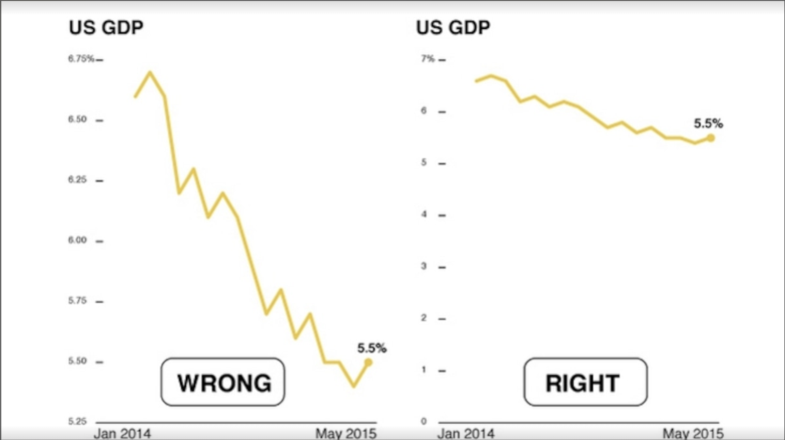
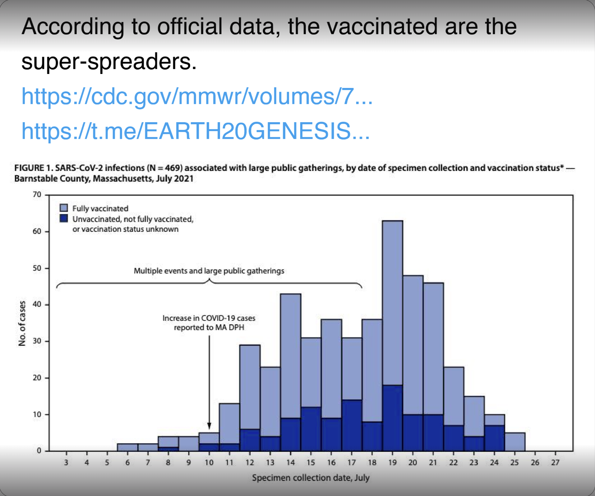

# Project 2: Deceptive Visualization

Data visualizations are becoming a key medium for the public to understand news and information. It's crucial to recognize how the design of a visualization can affect what people understand and remember from the data. In this task, you need to pick a dataset you find interesting and create two static visualizations using the same dataset. The first should be a **truthful** representation of the data. The second should be a **deceptive** visualization, designed to deceive the viewer. However, you should avoid clear distortions or leaving out information for this deceptive visualization.

## Assignment

Your objective is to create two static (single image) visualizations of a selected dataset. The first visualization should be designed to clearly and sincerely convey insights from the data. In contrast, the second should be crafted to intentionally mislead the viewer, causing them to make incorrect inferences. Additionally, you are required to write a brief explanation, limited to four paragraphs, outlining your design strategy for both visualizations.

In this task, an earnest visualization is defined as one that:

- Is easily understandable and can be interpreted by the general public.
- Uses visual encodings that are suitable and effective for the desired purpose.
- Clearly and openly describes any transformations made to the data.
- Transparently communicates the source of the data and any possible biases involved.

Conversely, a deceptive visualization typically displays these characteristics:

- The graphical depiction is deliberately unsuitable or deceptive.
- Headings are crafted to influence the viewer's understanding in a biased manner.
- There is intentional manipulation or selective filtering of data to deceive.
- It's not transparent about possible bias present in the data.

For the earnest visualization, your goal is to be as clear and transparent as possible to help viewers answer your intended question. For the deceptive visualization, your goal is to trick the viewer (including the course staff!) into believing that the visualization is legitimate and earnest. **It should not be immediately obvious which visualization is trying to be deceptive.** Subtle ineffective choices in the design should require close and careful reading to be identified.

For the deceptive visualization, misleading strategies are fine but outright lying is not. For example, sketchy, unreliable or untrustworthy input datasets are discouraged, but misleading omission, filtering, or transformation of trustworthy data records is fine. **Deliberate lies in the title, axes, labels, or annotations is discouraged**, but technically true/relevant but otherwise misleading text in the visualization is fine.

Try to go for more subtle deceptions in order to confuse your viewers. As a brief example of subtle vs obvious deception, consider the images below:

<figure markdown="1">

<figcaption>
An obvious deception: The "wrong"/deceptive image makes use of a truncated axis to exaggerate the result of the data in comparison to the "right"/earnest image.
</figcaption>

</figure>

<figure markdown="1">

<figcaption>
A subtle deception: The tweet author suggests that since there are more vaccinated cases, the vaccinated are ‘super-spreaders.’ This interpretation, however, fails to account for the high proportion of vaccinated in the general population—likely as high as 95% at the time of data collection. 
</figcaption>

</figure>

For both visualization designs, start by choosing a question you would like to answer. Design your visualization to answer that question either correctly (for the earnest visualization) or incorrectly (for the deceptive visualization). You may choose to address a different question with each visualization. Be sure to document the question as part of the visualization design (e.g., title, subtitle, or caption) and in your assignment write-up.

Your write-up should contain the following information:

- The specific question(s) each visualization aims to answer.
- A description of your design rationale and important considerations for each visualization.
- A clear mention of which of the two visualizations is deceptive and which one is earnest.

## Data Sources

For this assignment, we’ve provided four datasets / dataset collections for you to use. **You must use the same dataset for both visualizations**, but you may transform the data differently, use additional data variables, or choose to address a different question for each design.

{: .note }

You **must** pick a dataset from the list below. No other datasets will be deemed acceptable.

All datasets contain time series data relevant to health, but from different cohort (and species), different time scales, and different modalities. Time series analyses in themselves are not critical to exploring the data, but allow for forecasting and windowing of classifier data alongside unsupervised and statistical approaches.

### BIG IDEAs Lab Glycemic Variability and Wearable Device Data v1.0.0

Prof. Jessilynn Dunn at Duke released glucose measurements and wrist-worn multimodal wearable sensor data from high-normoglycemic participants. 2 weeks each to identify spikes and/or hypoglycemic events.

Address: [BIG IDEAs Lab Glycemic Variability and Wearable Device Data][link1]

Generated by the Empatica 4 wearable device paired with a DexCom 6 continuous glucose monitor, 16 people aged 35-65 are represented by 8-10 days each of continuous, multimodal wearable data. This is paired with meal logs and medical histories about metabolic and cardiac conditions. Data is downloadable as .csv files.

[link1]: https://physionet.org/content/big-ideas-glycemic-wearable/1.1.2/

### Physionet

Physionet, an online repository of physiological data sets from many sources, has an Open Datasets section. These contain abstracts and descriptions per project.

Address: [PhysioNet Databases][link2]

The largest of the data sources on this list, provided for those seeking more open exploration. This Database is comprised of dozens of data sets. Open Access data sets can be reached by the “Open databases” link at the top left of the landing page.

[link2]: https://physionet.org/about/database/

### Mouse data

Mouse data covering 2 weeks of minute level activity and core body temperature in males and females. Light is on a 12-on : 12-off controlled square wave so that daily rhythms are aligned. Every 4 days females display “estrus” which is associated with ovulation, and a longer/hotter active period.

Address: [Mouse Data.xlsx][link3] (Note: Use UCSD email ID to access the link.)

Columns are unique IDs (so, e.g., F1 is the same in all tabs). Rows are minutes, in order, across 14 days (there are 1440 minutes in a day). Lights turn on and off every 12 h (mice are nocturnal, so most active when it is dark). Lights Off is t=0, then every 720 it switches. Estrus (the day of ovulation) for all females starts day 2, repeating every 4 days. Activity and body temperature for each individual in each minute are recorded. Data is available as a .xlsx file.

[link3]: https://docs.google.com/spreadsheets/d/1RXL_oUa1IYxnqfCW-9duz3M83wPlki4y/edit?gid=1872476945#gid=1872476945

### Korean Surgery Dataset (Demographics, Clinical, and Waveform of physiology from surgeries): “VitalDB”

Address: [VitalDB][link4]

Korean hospital data (inter-operative, meaning during the operation) from 6,388 individual surgeries. High frequency biosensor data captures biosigns throughout the procedures, and these are paired with outcomes and related medical records. Data are downloadable zipped .csv files.

[link4]: https://vitaldb.net/dataset/

## Grading

The assignment score is out of a maximum of 10 points. We will determine scores by judging the soundness of your visualization designs, the duplicity of your deceptive visualization, and the quality of the write-up. Here are examples of aspects that may lead to point deductions:

- Obvious identification of the earnest and deceptive visualizations.
- Ineffective visual encodings for your stated goal.
- Missing indication of the main analysis question.
- Missing or incomplete design rationale in write-up.

We will reward entries that go above and beyond the assignment requirements to produce effective (and deceptive) graphics. Examples may include outstanding visual design, effective annotations and other narrative devices, exceptional creativity, or deceptive designs that require the write-up in order to properly identify the misleading design components.

### Rubric

The assignment is out of 10 points possible – 4 points for each visualization, and 2 points for the writeup. Submissions that squarely meet the project requirements (Satisfactory column) will get 8/10 points. Note that there are a total of 3 possible bonus points available on this assignment.

| Component                                               | Excellent                                                                                                                                                                                                                                                 | Satisfactory                                                                                                                                                                                                          | Poor                                                                                                                                                                                                               |
| ------------------------------------------------------- | --------------------------------------------------------------------------------------------------------------------------------------------------------------------------------------------------------------------------------------------------------- | --------------------------------------------------------------------------------------------------------------------------------------------------------------------------------------------------------------------- | ------------------------------------------------------------------------------------------------------------------------------------------------------------------------------------------------------------------ |
| Marks, Encodings, and Visual Design (per visualization) | Visual design persuasively argues the visualization’s stance, and facilitates effortless reading even when used deceptively. Any deceptive visual design choices are very subtle—even seasoned readers can only identify them on close study. (+2 points) | Visual design is largely persuasive, but some issues hinder comprehension. Any deceptive visual design cannot be detected at first glance, but are identifiable on a second look. (+1.5 points)                       | Visual design is distracting or makes the visualization unnecessarily or unintentionally difficult to read. Any deceptive design can be immediately identified. (+1 point)                                         |
| Titles, Labels, and Annotations (per visualization)     | Titles, labels, and annotations persuasively describe, contextualize or frame the depicted data. Any slants that may be considered deceptive are imperceptible to the reader. (+2 points)                                                                 | Necessary titles and labels are present, but annotations could be better used to persuasively narrate the visualization’s stance. Any deceptively slanted content is more easily detectable by readers. (+1.5 points) | Several titles or labels are missing, or do not provide human-understandable information. Annotations are rarely used. Strong, charged, or colorful language makes it easy to detect deceptive content. (+1 point) |
| Data Transformations (per visualization)                | More advanced transformations (e.g., groupings, binnings, calculated fields, etc.) extend or manipulate the dataset in interesting and/or unexpected ways. (+1 bonus point)                                                                               | The raw dataset was mostly used directly, with perhaps some simple transforms (e.g., sorting, filtering) to facilitate communicating the visualization’s message. (0 points)                                          |                                                                                                                                                                                                                    |
| Writeup                                                 |                                                                                                                                                                                                                                                           | Well-crafted write-up provides reasoned justification for all design choices with a thoughtful reflection on their ethical implications. (+2 points)                                                                  | Most design decisions are described, but rationale or ethical reflections could be explained at a greater level of detail. (+1 point)                                                                              |
| Creativity and Originality                              | The submission exceeds the assignment requirements, with original insights or particularly engaging visualizations. (+1 bonus point)                                                                                                                      | The submission meets the assignment requirements. (+0 points)                                                                                                                                                         |                                                                                                                                                                                                                    |

## Submission Details

This is an individual assignment. **You may not work in groups**. There is a checkpoint submission due on **Tue 1/28, by 11:59pm**. Your
completed assignment is due on **Tue 02/04, by 11:59pm**.

### Checkpoint Submission

You must submit your assignment using Gradescope. Please upload a single PDF with the following:

1. 2 deceptive visualizations
2. In a **separate** page, 2 earnest visualizations
3. In a **separate** page, a writeup about which deceptive visualization you are leaning towards, and the deception techniques used.

### Final Submission

You must submit your assignment using Gradescope. Please upload a PDF containing the following:

1. A single image of your earnest visualization
2. In a **separate** page, a single image of your deceptive visualization
3. In a **separate** page, a writeup conforming to the aforementioned rules.

{: .note }

Below are the submission guidelines, please read carefully.

1. Name the file `project2.pdf`. There should be **NO IDENTIFIERS** in the file name (PID, Student name, etc). This is essential for peer grading. Failure to comply will lead to point deductions.
2. Do **not** label the images as "earnest" or "deceptive". **Remember, the visualization itself should not give away which design is earnest and which is deceptive**. Failure to comply may result in point deductions as it hinders the peer review process!
3. Ensure that the writeup is in a separate page, as the write-up contains information about which image is deceptive. Failure to have the write-up in a separate page may result in point deductions.
4. Ensure the earnest visualization and the deceptive visualization are also in **seperate** pages.
5. Do not forget to clearly mention which visualization in deceptive **in the write-up**.
6. Be sure your image is sized for a reasonable viewing experience! Viewers should not have to zoom in order to effectively view your submission.

Do not worry about resubmissions, feel free to resubmit as needed prior to the deadline (if you are using late days to do a resubmission, please notify the course staff).
